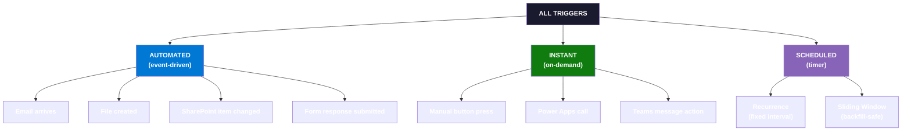
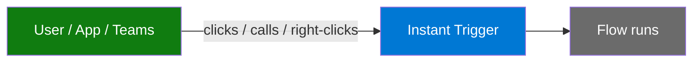
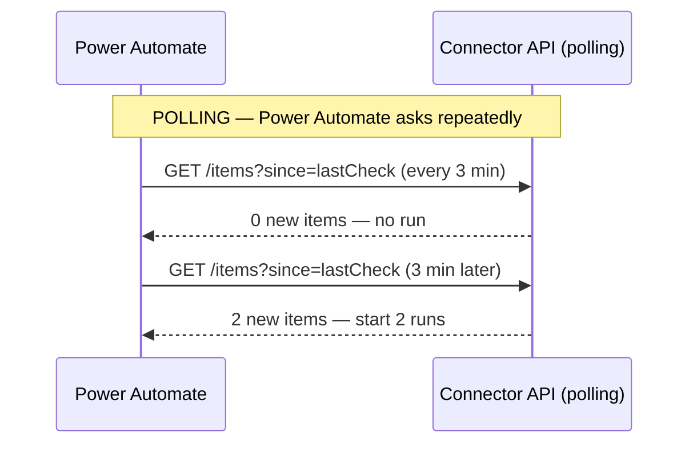
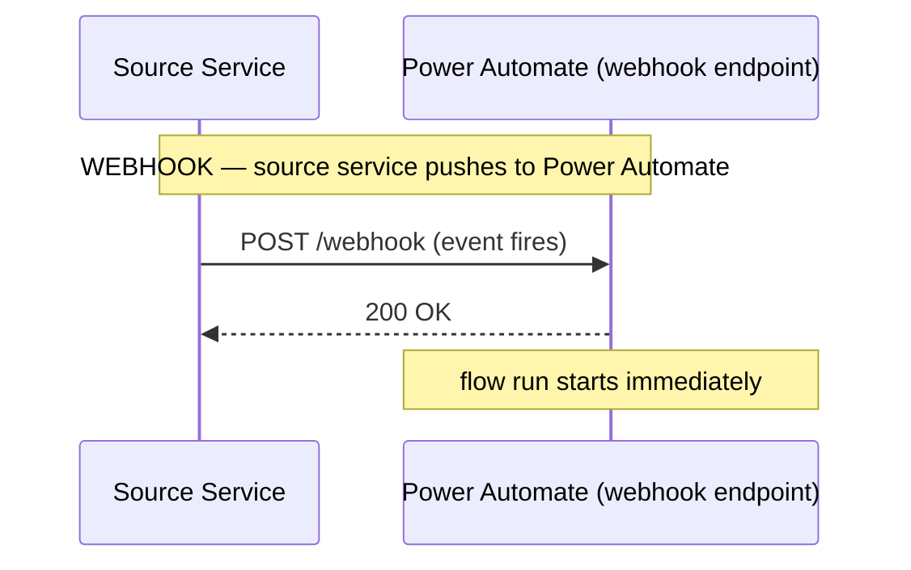
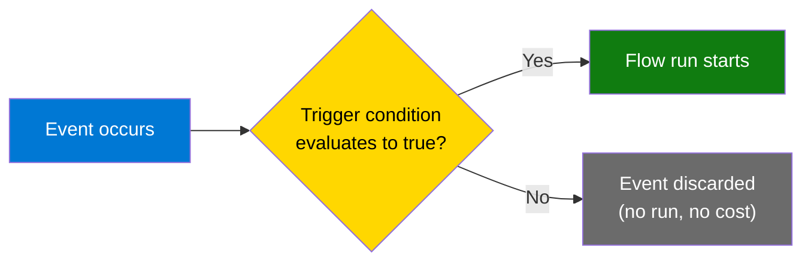
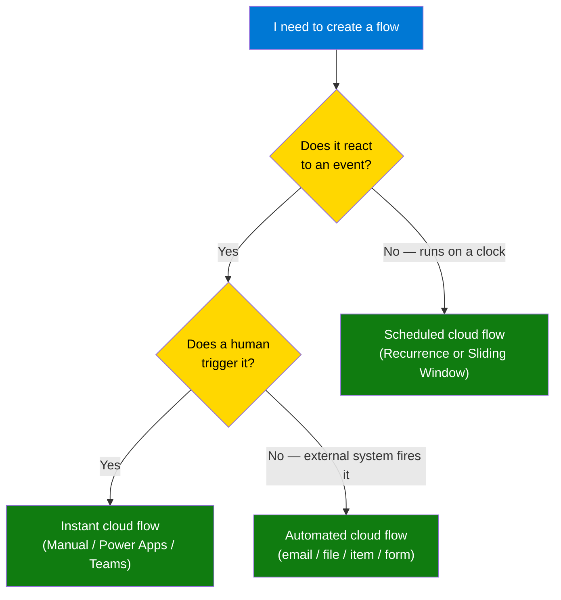

<!-- _class: lead -->

# Trigger Types in Power Automate
## Module 02 — Triggers and Connectors Deep Dive

Every flow starts with a trigger. Choose wrong and you waste runs. Choose right and events drive your automation instantly.

<!-- Speaker notes: Welcome to the trigger types deep dive. The core message for this deck is that the trigger is not just a starting gun — it determines latency, cost, available data, and which license tier you need. Learners coming from Module 01 already placed a trigger on the canvas; now we explain what is actually happening under the hood. -->

---

## What Does a Trigger Actually Do?

A trigger is the **entry gate** of every flow

- Detects or receives an event
- Loads the initial payload as dynamic content
- Hands control to the first action card

```
External world          Power Automate
──────────────          ──────────────
  event occurs   ──►   trigger fires
                        │
                        ▼
                    action 1
                        │
                        ▼
                    action 2 …
```

One trigger per flow. No exceptions.

<!-- Speaker notes: Reinforce that the trigger is not optional — every flow must have exactly one. Flows cannot have zero triggers or multiple triggers. Also clarify that "no exceptions" means even the very first Hello World flow had a trigger (manual or recurrence). Reinforce the mental model: trigger receives the initial data package, and that data flows downward through every action. -->

---

## The Three Trigger Families



<!-- Speaker notes: Walk through this taxonomy slowly. Ask learners to think about the last repetitive task they did manually — which family would automate it? The taxonomy tree is the conceptual anchor for this entire module. Automated = reactive, Instant = imperative, Scheduled = periodic. -->

---

## Automated Triggers: Event-Driven Reactions

The flow **waits silently** until an event fires it

| Trigger | Connector | Fires when |
|---------|-----------|-----------|
| When a new email arrives (V3) | Office 365 Outlook | New email lands in Inbox (or filtered folder) |
| When a file is created | SharePoint | Any new file is added to a library |
| When an item is modified | SharePoint | Any column on a list item changes |
| When a new response is submitted | Microsoft Forms | Form respondent submits |
| When a blob is created | Azure Blob Storage | File uploaded to a container |

No schedule. No human click. The **event triggers the flow.**

<!-- Speaker notes: The key insight is that automated triggers are reactive — they do not poll unless forced to by the connector mechanism (covered in the polling vs webhook slide). Contrast this with "I check my email every 15 minutes" vs "I get a push notification the instant an email arrives." That push notification model is what automated triggers implement. Mention that filtering exists on most triggers so you don't process every single event — that comes up in the trigger conditions slide. -->

---

## Instant Triggers: On-Demand Execution

A **person or system** decides when the flow runs



| Trigger | Who fires it |
|---------|-------------|
| Manually trigger a flow | Any user via browser or mobile app |
| PowerApps (V2) | A canvas app calling `FlowName.Run()` |
| When a Teams message action is triggered | User right-clicking a Teams message |

Instant triggers **can accept inputs** — data typed or passed at run time.

<!-- Speaker notes: Instant triggers are often overlooked by beginners who jump straight to automated or scheduled flows. But they are extremely powerful for human-in-the-loop processes: approvals, ad-hoc exports, one-off tasks. The Power Apps integration is where Power Automate and Power Apps become a unified platform — the app handles the UI, the flow handles the backend logic. The Teams message action trigger is a sleeper feature that lets you build moderation, translation, or escalation workflows that feel native to Teams. -->

---

## Scheduled Triggers: Clock-Driven Automation

Flows that run **regardless of events**

### Recurrence
- Fires at a fixed interval: every hour, every weekday at 07:30, every 1st of the month
- **No dynamic content** — no event payload; fetch data in the first action
- Does not backfill missed runs

### Sliding Window
- Same interval configuration as Recurrence
- **Backfills every missed interval** when the service recovers from downtime
- Guarantees "no gap" processing — critical for financial data pipelines

> Choose **Recurrence** for advisory tasks (reports, reminders).
> Choose **Sliding Window** when every interval must be processed.

<!-- Speaker notes: The most common mistake with Recurrence is forgetting to set the time zone. By default the trigger fires at UTC midnight, which is wrong for most business schedules. Always set the time zone explicitly. The Sliding Window backfill behaviour is a paid-plan feature — mention to learners that if they see gap processing behaviour differing from what they expect, they should check which trigger they used. A real-world example: a daily stock price import using Recurrence misses Saturday because the service was down; the Monday run starts fresh and Saturday data is lost forever. With Sliding Window, Monday starts, then Saturday's run fires automatically. -->

---

## Polling vs Webhook: How Events Actually Reach Power Automate





<!-- Speaker notes: This is one of the most important conceptual slides in the module. Beginners often wonder "why did my SharePoint flow take 3 minutes to fire?" The answer is polling interval. But "why did my Outlook flow fire instantly?" Because Outlook uses webhooks. You did not choose this — the connector developer chose it. The key practical takeaway: if latency matters, verify the trigger mechanism in the connector reference documentation before committing to an architecture. -->

---

## Polling vs Webhook: Practical Comparison

| | Polling | Webhook |
|---|---------|---------|
| **Latency** | Up to the polling interval (minutes) | Near-instant (seconds) |
| **Missed events** | Caught on next poll | Service responsible for delivery |
| **API call volume** | High — calls even when nothing changed | Low — only on real events |
| **Connector support** | Works with any REST API | Requires source to support callbacks |
| **Examples** | SharePoint item triggers, SQL Server | Outlook email, Forms, HTTP webhook |

**Rule of thumb:** If seconds matter, look for a webhook trigger. If minutes are acceptable, polling is fine.

<!-- Speaker notes: Bring this back to the real world: an approval flow triggered by a SharePoint item change that takes 3 minutes to start is perfectly acceptable for business approvals. But a security alert flow that emails an admin about a suspicious login cannot wait 3 minutes — it needs a webhook-based trigger (or an Azure Event Grid integration). The polling interval can sometimes be reduced by upgrading to a higher Power Automate plan tier — worth mentioning if learners ask why their org's flows fire faster. -->

---

## Trigger Conditions: Filter Before Firing

Without conditions: every event starts a run, even when the flow body would skip it.

With conditions: Power Automate evaluates the expression **before** the run starts and before any run credits are consumed.



<!-- Speaker notes: Trigger conditions are one of the biggest cost-saving techniques in Power Automate. Every flow run consumes run credits from your organization's quota. A SharePoint list with 100 edits per day that only needs to process 5 of them wastes 95 run credits without conditions. Setting the condition at the trigger level (not using a Condition action inside the flow body) is the key difference — the flow body never starts, so no run is charged. This is worth repeating: condition in trigger settings = no run credit used. Condition action inside flow body = run already started, credit already used. -->

---

## Writing Trigger Condition Expressions

Conditions use the **Power Automate expression language** (same as `@{...}` tokens)

```
Access trigger data:          triggerBody()?['FieldName']
Access trigger outputs:       triggerOutputs()?['headers']?['subject']
Access trigger form inputs:   triggerBody()?['text']
```

| Goal | Expression |
|------|-----------|
| Only high-importance emails | `@equals(triggerBody()?['Importance'], 'High')` |
| Subject starts with URGENT | `@startsWith(triggerBody()?['subject'], 'URGENT')` |
| Ignore system account edits | `@not(equals(triggerBody()?['Author']?['DisplayName'], 'System Account'))` |
| Quantity column exceeds 100 | `@greater(int(triggerBody()?['Quantity']), 100)` |

Multiple conditions = **AND logic** (all must be true)

<!-- Speaker notes: The syntax can trip up beginners — `triggerBody()` vs `triggerOutputs()` trips up even intermediate users. A practical tip: build the flow without conditions first, do a test run, then open the run history and look at the "Trigger" section. It shows the raw JSON that the trigger received. That JSON structure is exactly what `triggerBody()` returns — use those property names in your condition expressions. Also clarify the multiple-condition AND behaviour: there is no built-in OR across conditions. For OR logic, you need two separate flows or a Condition action inside the flow body. -->

---

## Trigger Navigation: Finding the Right Trigger



> Portal shortcut: **+ Create** → choose the flow type → search by **event noun**, not connector name

<!-- Speaker notes: This decision tree is the practical take-home from the taxonomy discussion. Put it on the screen and walk through three examples with the class: 1) "Send a weekly status report every Monday morning" → No event, runs on clock → Scheduled. 2) "Notify me when a customer submits a support form" → Event (form submission), system fires it → Automated. 3) "Let a manager kick off an employee onboarding checklist by clicking a button in Teams" → Human triggers it → Instant. Having this decision tree printed or bookmarked saves learners from opening the wrong flow creation dialog and backtracking. -->

---

## Lab Checkpoint: Trigger Selection Practice

For each scenario, identify the trigger **family**, **connector**, and **trigger name**:

1. Send a Slack-style message in Teams every Monday at 9 AM with the week's tasks
2. Notify a manager in email when a SharePoint approval list item status changes to "Rejected"
3. Let a user on the Power Automate mobile app kick off a document archiving routine
4. Process every new file dropped in an Azure Blob Storage container
5. Start a background job when a Power Apps form is submitted

*Answers in the companion guide, section "Common Trigger Mistakes"*

<!-- Speaker notes: Give learners 3 minutes to write down their answers before revealing. For question 1: Scheduled → Recurrence, no connector needed. Question 2: Automated → SharePoint → "When an item is modified" with trigger condition checking the Status column. Question 3: Instant → Manually trigger a flow. Question 4: Automated → Azure Blob Storage → "When a blob is created or modified." Question 5: Instant → PowerApps (V2). The value of this exercise is that learners must think about both the family and the specific connector — not just "automated" but which automated trigger. -->

---

## Summary

| Family | When to use | Latency | Dynamic content |
|--------|------------|---------|----------------|
| **Automated** | React to system events | Seconds (webhook) to minutes (polling) | Event payload from the source system |
| **Instant** | Human or app initiates | Immediate | User-provided inputs |
| **Scheduled** | Periodic tasks, data pipelines | At the scheduled time | None (fetch data in actions) |

**Polling** = Power Automate pulls (latency, volume cost)
**Webhook** = Source pushes (instant, efficient)
**Trigger conditions** = Filter *before* the run starts = no wasted credits

**Next:** Guide 02 — Connectors Deep Dive → what happens *after* the trigger fires

<!-- Speaker notes: Close by reinforcing the three decisions every flow builder makes at the trigger layer: family (automated/instant/scheduled), mechanism (polling vs webhook — determined by connector), and filtering (trigger conditions to reduce unnecessary runs). All three interact with cost, latency, and reliability. The next guide picks up where this one leaves off — once the trigger fires, the connector catalog determines what the flow can actually do. -->

---

<!-- _class: lead -->

## Further Reading

- [Triggers introduction — Microsoft Learn](https://learn.microsoft.com/en-us/power-automate/triggers-introduction)
- [Trigger conditions reference](https://learn.microsoft.com/en-us/power-automate/triggers-introduction#add-a-trigger-condition)
- [Polling vs webhook connectors](https://learn.microsoft.com/en-us/connectors/custom-connectors/connection-parameters#triggers)

**Companion guide:** `01_trigger_types_guide.md`

<!-- Speaker notes: Direct learners to the companion guide for the full written reference, including the table of common trigger mistakes and the complete UI walkthrough for each trigger type. The Microsoft Learn links are the canonical source of truth for trigger behaviour — encourage learners to bookmark the triggers introduction page as a reference they will return to frequently. -->
