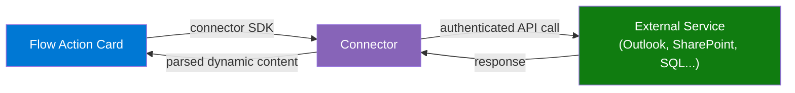
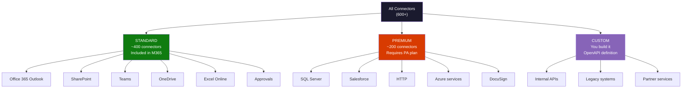
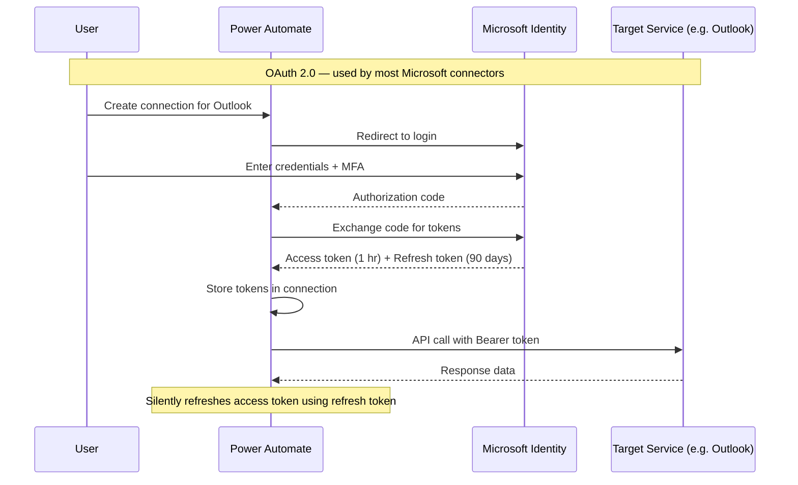
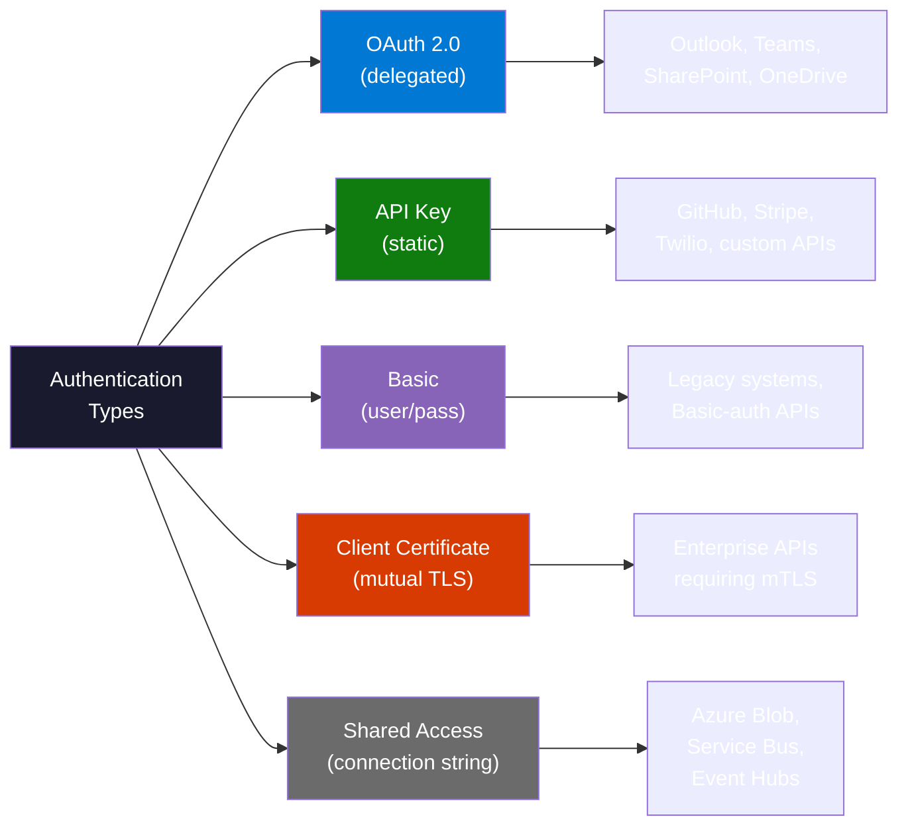
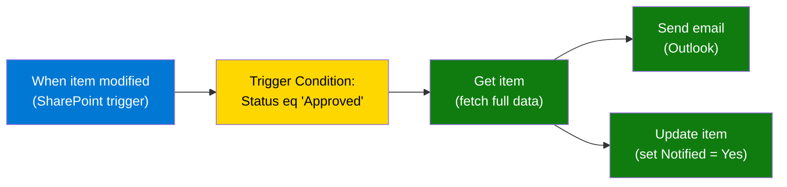
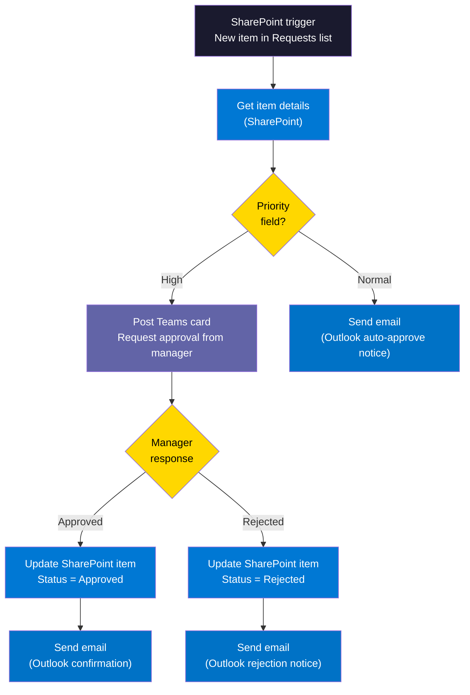
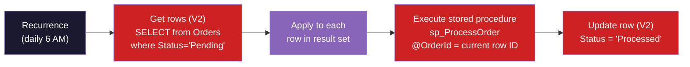
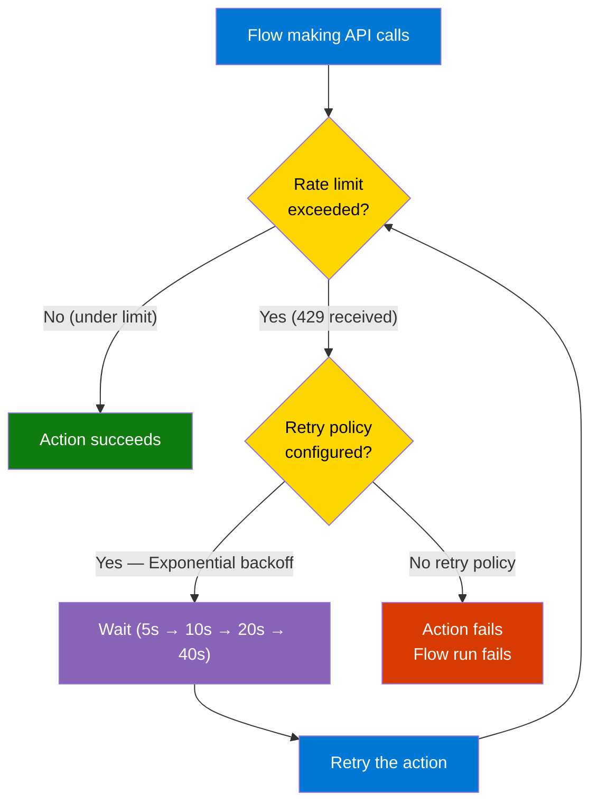

<!-- _class: lead -->

# Connectors Deep Dive
## Module 02 — Triggers and Connectors

The trigger fires. Now what? Connectors are Power Automate's hands — they reach into every system your organisation uses and make things happen.

<!-- Speaker notes: Set the stage for this deck as the practical complement to the trigger types deck. Learners now know how flows start. This deck covers what flows can actually do — which is entirely determined by connectors. The key tension to introduce up front: there are 600+ connectors, so how do you know which ones matter? Answer: 80% of enterprise flows use fewer than 10 connectors. This deck covers the 7 that appear in almost every real-world Power Automate deployment. -->

---

## What Is a Connector?

A connector is a **pre-built API wrapper** that handles:
- Authentication with the target service
- Request formatting (JSON, XML, REST, SOAP)
- Response parsing
- Error normalisation



You configure **what** to do. The connector handles **how** to talk to the service.

<!-- Speaker notes: The abstraction point is critical. A connector hides hundreds of lines of authentication, serialisation, and error-handling code behind a simple action card with a few input fields. Without connectors, every flow would need to make raw HTTP calls with OAuth token management, JSON serialisation, and pagination logic — connectors automate all of that. The trade-off: connectors abstract away flexibility. When you need something the connector does not expose, you fall back to the HTTP connector or build a custom connector. -->

---

## Connector Categories and Licensing



<!-- Speaker notes: The licensing diagram is the first thing to check when planning a flow architecture. A flow that uses even one premium connector requires a Power Automate per-user or per-flow plan for every user who runs it. This is the single most common source of "my flow stopped working" tickets in enterprise environments — someone's license changed. The visual split of ~400 standard vs ~200 premium is approximate but directionally accurate as of the course date. Custom connectors have no hard count limit — an organisation can create as many as needed. -->

---

## Connector Licensing: Decision Guide

| Scenario | License needed |
|----------|---------------|
| Automated flow using only Outlook + SharePoint | Microsoft 365 (standard) |
| Flow that queries Azure SQL Database | Power Automate per-user plan |
| Flow using HTTP connector to call an internal API | Power Automate per-user plan |
| Attended desktop flow (RPA) | Power Automate Premium |
| Flow with only standard connectors run by 50 users | 50 × M365 licenses (no PA add-on) |
| Flow per-flow plan — high volume, many users share one license | Power Automate per-flow plan |

> Check connector tier **before** building. The Premium badge in the connector search is the fastest indicator.

<!-- Speaker notes: The per-flow plan is worth explaining. Instead of licensing every user who triggers a flow, you buy one per-flow license (approximately $100/month) and that flow can run for any number of users. This is cost-effective when a flow is used by hundreds of users but runs infrequently. Per-user plan is better when users each need many flows. Real-world tip: always prototype flows using a developer environment (Power Apps/Power Automate developer plan is free) before deploying to production, so you can test premium connectors without committing production licenses. -->

---

## Authentication Flows: How Connectors Prove Identity



<!-- Speaker notes: Walk through each arrow. The key learner takeaway is that Power Automate handles the token lifecycle — the user authenticates once when creating the connection, and Power Automate silently refreshes the short-lived access token using the long-lived refresh token for up to 90 days (longer if the user continues to be active). The connection breaks only if: (1) the user's password changes and MFA re-prompts, (2) the admin revokes the refresh token, or (3) the user's account is deleted. This is why service accounts are important for production flows — a human user's account lifecycle is unpredictable. -->

---

## Authentication Types at a Glance



<!-- Speaker notes: The authentication type is not a choice you make — it is determined by the API you are connecting to. Microsoft services all use OAuth 2.0 because they are built on the Microsoft Identity Platform. Third-party SaaS APIs vary widely. When building custom connectors, you define the auth type in the connector wizard to match whatever the target API requires. The practical skill here is: given a new API you need to integrate, read its auth documentation and map it to one of these types before starting the connector configuration. -->

---

## The Seven Essential Connectors

<div class="columns">

**Microsoft ecosystem**
1. Office 365 Outlook — email and calendar
2. Microsoft Teams — messaging and cards
3. SharePoint — lists and document libraries
4. OneDrive for Business — personal file storage
5. Excel Online (Business) — spreadsheet data

**Beyond Microsoft**
6. HTTP — any REST API (Premium)
7. SQL Server — relational databases (Premium)

</div>

These 7 connectors appear in **~80% of enterprise Power Automate flows**.

<!-- Speaker notes: The 80% figure is an empirical observation from enterprise deployments, not an official Microsoft statistic — use it directionally. The point is that learners do not need to memorise 600 connectors. Master these seven and you can build the vast majority of real-world automation. The remaining slides go one level deeper into each, focusing on the actions and gotchas that trip up beginners. -->

---

## Office 365 Outlook: Key Patterns

**Standard connector — OAuth 2.0**

| Pattern | Trigger + Actions |
|---------|-----------------|
| Process flagged emails | When email flagged → Get email → Create SharePoint item |
| Auto-reply to keywords | When new email arrives (filter: Subject) → Reply to email |
| Calendar invite from form | (Forms trigger) → Create event |
| Archive attachments | When new email arrives → Get attachment → Create file (OneDrive) |

**Critical gotcha:** Flows run as the **connection owner's identity**. Emails sent appear to come from that person. For shared inboxes, add "Send As" permission in Exchange admin and set the `From` field in the action.

> V3 of "When a new email arrives" supports webhook delivery. Always use V3 over V2.

<!-- Speaker notes: The most common Outlook flow mistake is building production flows that run under a personal account. When that person leaves, the connection breaks and all flows using it stop. The service account solution: create a dedicated M365 mailbox (e.g., pa-automation@contoso.com), license it with M365, and create all production connections under that identity. IT can manage the account lifecycle independently of individual employees. Also worth noting: the Outlook connector works for Exchange Online (M365) only, not on-premises Exchange — for that, use the Exchange connector with an on-premises data gateway. -->

---

## Microsoft Teams: Adaptive Cards Deep Dive

Teams flows go beyond posting messages — **Adaptive Cards** enable interactive UI inside Teams

```json
{
  "type": "AdaptiveCard",
  "body": [
    { "type": "TextBlock", "text": "Approve this request?" },
    { "type": "Input.ChoiceSet", "id": "decision",
      "choices": [
        { "title": "Approve", "value": "approve" },
        { "title": "Reject", "value": "reject" }
      ]
    }
  ],
  "actions": [{ "type": "Action.Submit", "title": "Submit" }]
}
```

The **Post an Adaptive Card and wait for a response** action:
1. Posts the card to a Teams channel or chat
2. **Blocks the flow** until a user clicks Submit
3. Returns the user's choices as dynamic content

<!-- Speaker notes: Adaptive Cards are the Teams equivalent of email-based approvals, but they feel native to Teams users. The flow literally pauses at the "Post Adaptive Card and wait" step — the flow run remains in "running" state until a user responds. This is a form of long-running orchestration. Important limitation: if no one responds within the action's timeout (configurable, up to 30 days), the flow times out and fails unless you handle the timeout case with a Parallel Branch. Show learners the Adaptive Card Designer at adaptivecards.io where they can visually design cards before pasting the JSON into the action. -->

---

## SharePoint: The Most-Used Connector

**Standard — polling triggers (3-min lag), rich action set**



**Key patterns:**
- Filter at the trigger condition layer — do not retrieve all items and filter in a Condition action
- Use OData filters in **Get items**: `Status eq 'Pending' and Modified gt '2024-01-01'`
- Enable **Pagination** (action Settings) when a list has more than 100 items

<!-- Speaker notes: SharePoint is the most used connector because SharePoint lists are the default "database" for Power Platform solutions that do not use Dataverse. The diagram shows the ideal pattern: trigger condition filters first (no run wasted), then get the specific item, then branch to parallel actions. The OData filter point is worth demonstrating live: without filtering, a 10,000-item list requires Apply to each with 10,000 iterations; with OData filtering, you might get 5 items and process only those. The performance difference is dramatic. -->

---

## Data Flow Between Multiple Connectors



<!-- Speaker notes: This diagram shows a realistic multi-connector flow that learners could build after this module. It touches four connectors: SharePoint (trigger + update), Teams (card), Outlook (email). The data flows left to right — each connector action adds its output to the pool of available dynamic content for all downstream actions. The branching on Priority shows conditional logic (Module 03 topic) previewed here. Walk through what dynamic content is available at each stage: after the SharePoint trigger, we have all list column values. After Get item, same. After Teams card wait, we have the manager's response. Downstream actions can use all of these. -->

---

## HTTP Connector: Reaching Any API

**Premium — direct REST/SOAP calls, any service**

```
Method:  POST
URI:     https://api.example.com/v2/orders
Headers:
  Content-Type: application/json
  Authorization: Bearer @{variables('ApiToken')}
Body:
{
  "customerId": "@{triggerBody()?['CustomerID']}",
  "amount":     @{triggerBody()?['Amount']},
  "currency":   "GBP"
}
```

**After the HTTP call:** Add **Parse JSON** to turn the response string into typed dynamic content tokens.

> Secret management: never paste API keys into action fields. Use Environment Variables or Azure Key Vault connector.

<!-- Speaker notes: The HTTP connector is the escape hatch from the connector catalog. Any REST API that does not have a dedicated connector can be called with HTTP. Walk through the field configuration carefully — the URI supports dynamic content (you can build URLs dynamically), headers support dynamic content (inject token variables), and the body is a JSON string that can embed dynamic content tokens anywhere. The key skill to practice: reading an API's documentation and translating it into HTTP connector fields. Most enterprise APIs have Swagger/OpenAPI docs — if the API has this, learners can consider building a custom connector instead of using raw HTTP. The Parse JSON step after HTTP is almost always required — without it, the response is an opaque string, not addressable fields. -->

---

## SQL Server: Relational Database Integration

**Premium — on-premises or Azure SQL**



**On-premises SQL:** Requires **On-premises data gateway** installed on a machine on the same network as the SQL Server.

> Prefer stored procedures over raw SQL queries — they are parameterised (no injection risk) and version-controlled in the database.

<!-- Speaker notes: The SQL Server connector bridges Power Automate to the relational data world. The diagram shows a daily batch pattern: schedule → query for pending rows → loop → process each → update status. This is a complete ETL micro-pipeline. The on-premises gateway is a common friction point: it is a Windows service that must be installed by IT, configured with a gateway resource in the Azure portal, and kept running. If the gateway service goes down, all on-premises connector flows fail. Recommend learners document the gateway machine and set up monitoring for the gateway service health. The stored procedure preference is a security and maintainability point — raw SQL typed into a cloud flow action is a nightmare to audit and impossible to parameterise safely against injection. -->

---

## Rate Limits: What Happens at Scale



Configure retry policy: action **…** menu → **Settings** → **Retry Policy** → Exponential interval, Count: 4

<!-- Speaker notes: Throttling is the number one production reliability issue with Power Automate flows that process large data volumes. The diagram shows the decision tree that Power Automate's retry logic follows. Without a configured retry policy, the default is Fixed interval, 2 retries — often not enough for bursty workloads. Exponential backoff is the industry standard because it reduces load on the throttled service progressively. Practical advice: for flows that call SharePoint Get items in a loop, set Apply to each concurrency to 1 (sequential) to avoid hitting the 600 req/60s limit. For flows calling external APIs, read the API's rate limit documentation and calculate whether the flow's expected call volume stays under the limit. -->

---

## Custom Connectors: Build Your Own

When no connector covers your API:

```mermaid
graph LR
    API["Your REST API\n(OpenAPI spec)"]:::api --> W["Custom Connector\nWizard"]:::wizard
    W --> D1["1. General\nName, host URL, icon"]:::step
    D1 --> D2["2. Security\nAuth type"]:::step
    D2 --> D3["3. Definition\nActions + Triggers"]:::step
    D3 --> D4["4. Test\nLive API validation"]:::step
    D4 --> C["Connector available\nin all environment flows"]:::result

    classDef api fill:#1a1a2e,color:#fff
    classDef wizard fill:#8764b8,color:#fff
    classDef step fill:#0078d4,color:#fff
    classDef result fill:#107c10,color:#fff
```



**Fastest path:** Import an OpenAPI (Swagger) file — connector actions generate automatically from the spec.

> Custom connectors are **environment-scoped** — deploy to target environment, not default environment.

<!-- Speaker notes: Custom connectors are a Power Platform professional skill that separates basic flow builders from platform architects. The OpenAPI import path is dramatically faster than manual definition — if your team's API has a Swagger spec (and any well-maintained modern API should), the connector can be created in under 30 minutes. The environment scoping point is operationally important: if you build the custom connector in your personal developer environment, it is not visible in the production environment. Use solution-based deployment (Power Platform solutions) to move custom connectors between environments in a controlled, version-tracked way. This connects to the ALM (Application Lifecycle Management) concepts that appear in later modules. -->

---

## Lab Checkpoint: Connector Decision Practice

For each requirement, name the **connector** and **action** you would use:

1. Read a list of pending customer orders from an Azure SQL database
2. Post a formatted summary message in a Teams channel every morning
3. Save every new email attachment to a OneDrive folder
4. Call a payment gateway's REST API to process a refund
5. Trigger whenever a new row is added to a SharePoint list and send an approval email

*Work through these before the notebook — it builds the pattern-matching instinct you need.*

<!-- Speaker notes: These five scenarios map directly to the seven connectors covered in this deck. Answers: 1) SQL Server → Get rows (V2). 2) Teams → Post a message in a chat or channel (triggered by Recurrence). 3) Outlook trigger → Get attachment → OneDrive Create file. 4) HTTP → POST to payment gateway endpoint (Premium). 5) SharePoint "When item is created" trigger → Outlook "Send an email (V2)". Walk through each answer and discuss the licensing implications — scenario 4 requires a premium plan because HTTP is premium. Scenario 5 is entirely standard connectors. -->

---

## Summary

| Tier | Connectors | License |
|------|-----------|---------|
| Standard | Outlook, Teams, SharePoint, OneDrive, Excel | M365 |
| Premium | SQL Server, HTTP, Salesforce, Azure services | Power Automate plan |
| Custom | Anything with a REST API + OpenAPI spec | Same as built-in tier used |

**Auth types:** OAuth 2.0 (Microsoft services) · API Key · Basic · Certificate · Shared Access

**Rate limiting:** Configure **Exponential retry** on every connector action in production flows

**Next:** Notebook 01 — List connectors programmatically via the Power Platform API

<!-- Speaker notes: Close with the three decisions every connector selection requires: 1) Is it standard or premium — do we have the right license? 2) What authentication does it use — how do we create the connection? 3) What are the rate limits — how do we make the flow resilient? These three questions, asked before every flow build, prevent the most common production failures. The notebook next in the module sequence puts the connector catalog in learners' hands programmatically — they will query the Power Platform API to discover and inspect connectors in their own environment. -->

---

<!-- _class: lead -->

## Further Reading

- [Connector reference — all 600+ connectors](https://learn.microsoft.com/en-us/connectors/connector-reference/)
- [Premium connectors list](https://learn.microsoft.com/en-us/connectors/connector-reference/connector-reference-premium-connectors)
- [Custom connector docs](https://learn.microsoft.com/en-us/connectors/custom-connectors/)
- [Power Platform request limits](https://learn.microsoft.com/en-us/power-platform/admin/api-request-limits-allocations)
- [Adaptive Card Designer](https://adaptivecards.io/designer/)

**Companion guide:** `02_connectors_deep_dive_guide.md`

<!-- Speaker notes: The Adaptive Card Designer link is practically useful — learners can design cards visually, preview them in Teams, and copy the JSON directly into the "Post an Adaptive Card" action. The connector reference at learn.microsoft.com is the authoritative source for every connector's triggers, actions, limits, and authentication requirements. Encourage learners to bookmark it and use it as a reference throughout the course, not just in this module. -->
