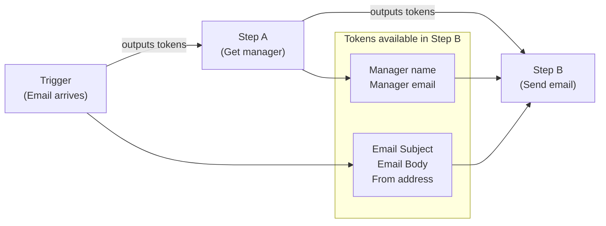
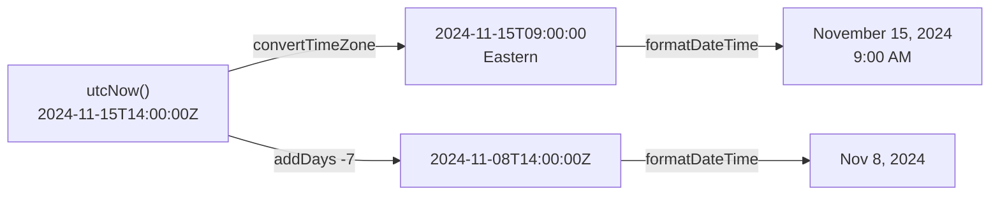
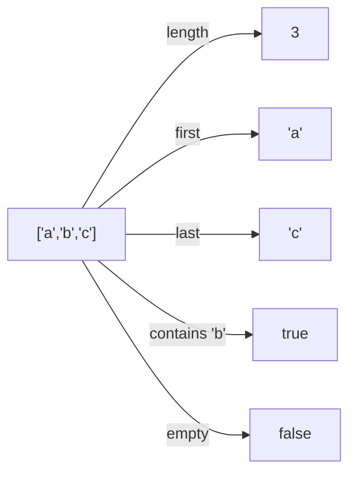
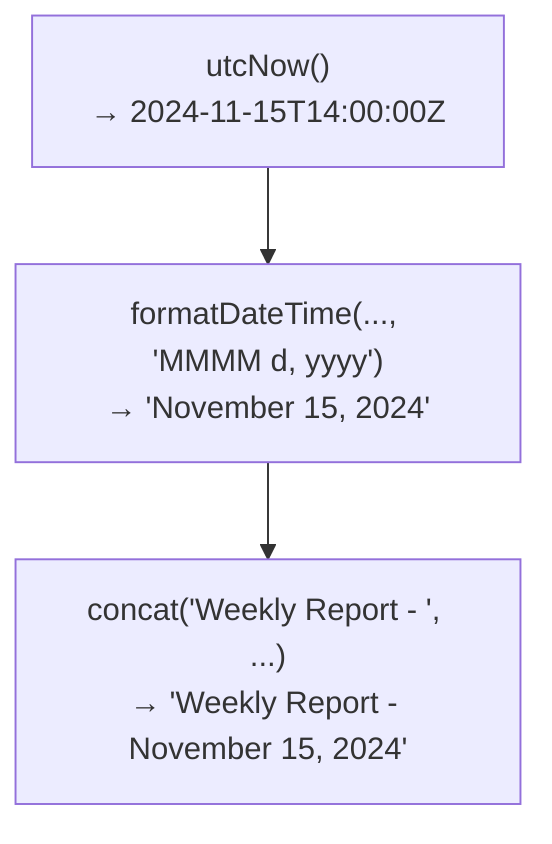
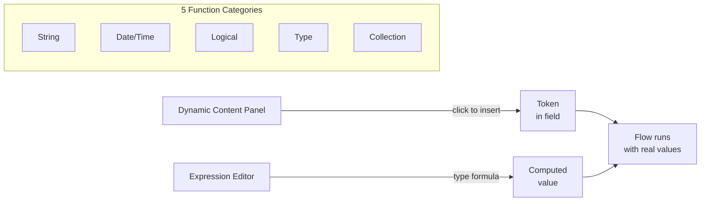

<!-- _class: lead -->

# Dynamic Content and Expressions

**Module 03 — Data Operations and Expressions**

> Every useful flow transforms data. Dynamic content and expressions are the tools that make transformation possible.

<!--
Speaker notes: Key talking points for this slide
- Welcome to the most technically dense module in the course
- Up to this point flows have moved data around; now we will change data on the way through
- Two distinct mechanisms: dynamic content (point-and-click token insertion) and expressions (formula language)
- By the end of this deck every learner will be able to write a working expression from scratch
-->

---

# How Data Moves Between Steps



- Every action **produces** outputs as named tokens
- Every downstream action can **consume** those tokens
- Power Automate resolves token values at **runtime**

<!--
Speaker notes: Key talking points for this slide
- The fundamental data flow model: outputs cascade downward through the flow
- "Upstream" means earlier in execution order -- only upstream tokens appear in the panel
- Tokens are resolved at runtime, not at design time -- this is what "dynamic" means
- Key question to ask learners: "What tokens would be available in the third step of a five-step flow?"
-->

---

<!-- _class: lead -->

# The Dynamic Content Panel

<!--
Speaker notes: Key talking points for this slide
- The panel is the primary interface for consuming tokens -- learners will use this dozens of times per flow
- Two tabs: Dynamic content (click to insert) and Expression (type to compute)
- We start with the click-to-insert tab before moving to formulas
-->

---

# Opening the Dynamic Content Panel

```
┌─────────────────────────────────────────────────────────┐
│  Send an email (V2)                                      │
│  ─────────────────────────────────────────────────────  │
│  To:      alice@contoso.com                             │
│                                                          │
│  Subject: [click here]              ⚡ Add dynamic content│
│                                                          │
│  Body:    [click here]              ⚡ Add dynamic content│
└─────────────────────────────────────────────────────────┘
```

> **On screen:** Click inside any text field in an action card. A lightning-bolt icon appears. Click it — or click the **Add dynamic content** link — to open the panel.

<!--
Speaker notes: Key talking points for this slide
- The lightning bolt is the universal signal that a field accepts dynamic values
- Not all fields show it -- some fields only accept static values (like connector type selectors)
- The panel slides out from the right and stays open until you click away
- Live demo moment: open Power Automate and demonstrate clicking into a subject field
-->

---

# Dynamic Content Tab Structure

```
Dynamic content panel
├── 🔍 Search dynamic content...
│
├── Trigger: When a new email arrives
│   ├── Subject        ← click to insert
│   ├── From
│   ├── Body
│   ├── Received Time
│   └── Attachments
│
├── Get manager (V2)
│   ├── Display Name
│   ├── Mail
│   └── Job Title
│
└── [more steps...]
```

- Tokens organised by the step that produced them
- **Search** filters across all steps instantly
- Only upstream steps appear — no circular references

<!--
Speaker notes: Key talking points for this slide
- The hierarchy is always: step name as heading, then its output tokens listed below
- Search is the fastest way to find a token in a long flow -- demo this
- The "upstream only" rule prevents infinite loops and data dependency errors
- Clicking a token inserts it as a blue pill in the field -- the pill is the token, not the raw value
-->

---

# Expression Tab: The Formula Language

```
┌──────────────────────────────────────────────────────┐
│  Dynamic content  │  Expression                      │
│──────────────────────────────────────────────────────│
│                                                       │
│  fx  concat('Hello, ', triggerBody()?['firstName'])  │
│                                                       │
│  [OK]  [Cancel]                                       │
└──────────────────────────────────────────────────────┘
```

Expression syntax rules:
- String literals use **single quotes**: `'hello'` not `"hello"`
- Functions: `functionName(arg1, arg2, ...)`
- Dynamic references: `triggerBody()?['Field']`
- Null-safe access: always use `?` before `['field']`

<!--
Speaker notes: Key talking points for this slide
- The single-quote rule is the #1 cause of expression errors for beginners -- emphasise this
- The ?[] syntax is null-safe: if the field doesn't exist it returns null instead of crashing
- Using [] without ? will throw a runtime error if the field is missing
- After clicking OK, the expression becomes a blue pill just like a dynamic content token
-->

---

<!-- _class: lead -->

# Expression Function Categories

<!--
Speaker notes: Key talking points for this slide
- There are over 100 functions in Power Automate's expression language
- We group them into five categories -- this mental map helps learners find the right tool
- We will cover the 20 most used functions across these five categories
- The full reference is in the Microsoft documentation linked at the end of the guide
-->

---

# Expression Function Tree

```mermaid
graph TD
    root["Expression Functions"] --> str["String"]
    root --> dt["Date / Time"]
    root --> logic["Logical"]
    root --> type["Type Conversion"]
    root --> coll["Collection"]

    str --> s1["concat()"]
    str --> s2["substring()"]
    str --> s3["replace()"]
    str --> s4["split()"]
    str --> s5["toLower() / toUpper()"]
    str --> s6["trim()"]

    dt --> d1["utcNow()"]
    dt --> d2["formatDateTime()"]
    dt --> d3["addDays()"]
    dt --> d4["convertTimeZone()"]

    logic --> l1["if()"]
    logic --> l2["equals()"]
    logic --> l3["and() / or()"]
    logic --> l4["coalesce()"]

    type --> t1["int() / float()"]
    type --> t2["string()"]
    type --> t3["json() / xml()"]

    coll --> c1["length()"]
    coll --> c2["first() / last()"]
    coll --> c3["contains()"]
    coll --> c4["empty()"]
```



<!--
Speaker notes: Key talking points for this slide
- This tree is the mental model to keep throughout the module
- String functions: text manipulation
- Date/Time: computing and formatting dates
- Logical: decisions and conditionals
- Type conversion: fixing mismatched types from external systems
- Collection: working with arrays
- Ask learners to identify which category would handle "check if an email contains the word URGENT"
-->

---

# String Functions

<div class="columns">
<div>

**`concat()`** — join strings
```
concat('Invoice-', string(variables('Number')))
→ "Invoice-1042"
```

**`substring(text, start, length)`** — extract
```
substring('INV-2024-001', 4, 4)
→ "2024"
```

**`replace(text, find, replacement)`**
```
replace('order_status', '_', ' ')
→ "order status"
```

</div>
<div>

**`split(text, delimiter)`** — to array
```
split('a,b,c', ',')
→ ["a", "b", "c"]
```

**`toLower()` / `toUpper()`**
```
toLower('HELLO')  →  "hello"
toUpper('hello')  →  "HELLO"
```

**`trim()`** — remove whitespace
```
trim('  hello  ')  →  "hello"
```

</div>
</div>

<!--
Speaker notes: Key talking points for this slide
- concat() is the most frequently used function in the entire language -- normalise string concatenation
- substring() index is zero-based -- "INV-2024" means index 4 is '2', length 4 gives "2024"
- split() is the gateway to looping: split a comma-separated field, then Apply to each over the result
- toLower() is essential for case-insensitive comparisons: always normalise before equals()
- trim() catches the invisible whitespace bugs that appear when users type into web forms
-->

---

# Date and Time Functions



| Function | Example | Result |
|----------|---------|--------|
| `utcNow()` | `utcNow('yyyy-MM-dd')` | `2024-11-15` |
| `formatDateTime()` | `formatDateTime(utcNow(), 'MMMM d')` | `November 15` |
| `addDays()` | `addDays(utcNow(), 30)` | 30 days from now |
| `convertTimeZone()` | `convertTimeZone(utcNow(), 'UTC', 'Eastern Standard Time')` | Local time |

<!--
Speaker notes: Key talking points for this slide
- utcNow() is always the starting point -- Power Automate runs on UTC
- formatDateTime() format codes follow .NET conventions: yyyy (year), MM (month), dd (day), HH (24h hour)
- addDays() with a negative number goes backward -- addDays(utcNow(), -7) is "one week ago"
- convertTimeZone() uses Windows time zone names -- common ones: "Eastern Standard Time", "Pacific Standard Time", "GMT Standard Time"
- Real scenario: a flow sends a report at 6 AM Eastern -- use convertTimeZone to compute that in UTC for the schedule trigger
-->

---

# Logical Functions

```
if( condition, valueIfTrue, valueIfFalse )
```

**Real example: route by invoice amount**

```
if(
  greater(int(triggerBody()?['Amount']), 10000),
  'VP approval required',
  'Auto-approved'
)
```

**Combining conditions with `and()` / `or()`**

```
and(
  equals(variables('Status'), 'Open'),
  greater(variables('DaysOpen'), 14)
)
```

**`coalesce()` for safe defaults**

```
coalesce(triggerBody()?['ManagerEmail'], 'default@contoso.com')
```

<!--
Speaker notes: Key talking points for this slide
- if() is the inline ternary -- it does NOT create a branch in the flow, it just picks a value
- For actual branching (run different actions), use the Condition control shape -- if() is for value selection only
- coalesce() is underused and very powerful: returns the first non-null argument, great for optional fields
- and() and or() take exactly two arguments each -- for three conditions, nest: and(cond1, and(cond2, cond3))
- Common mistake: using if() when you need a Condition control shape -- clarify the distinction
-->

---

# Type Conversion Functions

**Why type conversion matters:**

External systems send numbers as strings. Arithmetic on strings fails.

```
int(triggerBody()?['Quantity'])   →  converts "5" to 5
float(triggerBody()?['Price'])    →  converts "9.99" to 9.99
string(variables('Total'))        →  converts 49.95 to "49.95"
bool(triggerBody()?['IsUrgent'])  →  converts "true" to true
```

**Parsing JSON from an HTTP response:**

```
json(body('Send_HTTP_request'))
```

After this, access fields with: `json(body('Send_HTTP_request'))?['invoiceId']`

<!--
Speaker notes: Key talking points for this slide
- This is the category that fixes the mysterious "type mismatch" runtime errors
- SharePoint number columns often come through as strings -- int() fixes this before math
- json() is critical when calling HTTP endpoints that return raw JSON strings
- xml() follows the same pattern but for XML responses -- used with xpath() for field extraction
- Ask learners: "A SharePoint list column called 'Quantity' returns '12'. What happens if you try to multiply it by a price?"
-->

---

# Collection Functions

Working with arrays of items:



| Function | Example | Result |
|----------|---------|--------|
| `length(array)` | `length(variables('Items'))` | Item count |
| `first(array)` | `first(variables('Approvers'))` | First approver |
| `last(array)` | `last(variables('Approvers'))` | Last approver |
| `contains(arr, val)` | `contains(variables('Statuses'), 'Open')` | `true` / `false` |
| `empty(arr)` | `empty(triggerBody()?['Attachments'])` | `true` / `false` |

<!--
Speaker notes: Key talking points for this slide
- Collection functions become essential when flows process lists of items
- length() is often used before Apply to each to check if there are any items before iterating
- contains() works on both arrays (is this value in the array?) and strings (is this substring in the string?)
- empty() combined with not() gives you "is there at least one item": not(empty(variables('Items')))
- Common pattern: split() to create an array, then Apply to each to process each item
-->

---

<!-- _class: lead -->

# Nesting Expressions

<!--
Speaker notes: Key talking points for this slide
- Nesting is where expressions become truly powerful
- Inner functions evaluate first, outer functions consume their results
- Three worked examples showing real patterns learners will encounter
- Key insight: you can compose any transformation by combining simple functions
-->

---

# Expression Nesting: How It Works

Expressions evaluate **inside-out**. The innermost call runs first.

**Example: Clean and normalise a name from a form**

```
trim(toLower(triggerBody()?['FullName']))
```

Evaluation order:
```
Step 1:  triggerBody()?['FullName']      →  "  Priya Sharma  "
Step 2:  toLower("  Priya Sharma  ")     →  "  priya sharma  "
Step 3:  trim("  priya sharma  ")        →  "priya sharma"
```

**Think of it as a pipeline:**


<!--
Speaker notes: Key talking points for this slide
- The inside-out evaluation rule is identical to function composition in mathematics and programming
- Reading tip: start from the innermost parentheses and work outward to understand what an expression does
- Writing tip: start with the innermost transformation you need, then wrap it with the next
- Common mistake: applying toLower() after trim() doesn't matter, but applying them in the wrong logical order can break things
- Live exercise: "What does trim(toLower('  HELLO  ')) produce?" -- trace through with the class
-->

---

# Expression Breakdown: Report Subject Line

**Goal:** Build an email subject: `"Weekly Report - November 15, 2024"`

```
concat(
  'Weekly Report - ',
  formatDateTime(utcNow(), 'MMMM d, yyyy')
)
```

Breakdown:



<!--
Speaker notes: Key talking points for this slide
- This is a real pattern used in hundreds of Power Automate flows: dynamic date in email subjects
- formatDateTime format string: MMMM = full month name, d = day without leading zero, yyyy = four-digit year
- concat() can take more than two arguments: concat('a', 'b', 'c', 'd') -- all are joined in order
- Ask learners to modify this to produce "Weekly Report - 15/11/2024" -- they need to change the format string to 'dd/MM/yyyy'
-->

---

# Expression Breakdown: Conditional Greeting

**Goal:** `"Good morning"` before noon, `"Good afternoon"` after

```
if(
  less(int(formatDateTime(utcNow(), 'H')), 12),
  'Good morning',
  'Good afternoon'
)
```

Evaluation chain:

| Step | Expression | Result |
|------|-----------|--------|
| 1 | `utcNow()` | `2024-11-15T09:32:00Z` |
| 2 | `formatDateTime(..., 'H')` | `"9"` |
| 3 | `int("9")` | `9` |
| 4 | `less(9, 12)` | `true` |
| 5 | `if(true, ...)` | `"Good morning"` |

<!--
Speaker notes: Key talking points for this slide
- Format code 'H' gives 24-hour hour as a string without leading zero: "9" not "09"
- We need int() because formatDateTime() always returns a string, and less() needs numbers
- This is a textbook example of why type conversion matters: less("9", 12) would fail
- Challenge question: how would you modify this to produce three greetings: morning, afternoon, and evening?
- Answer requires nesting two if() calls: if(< 12, 'morning', if(< 17, 'afternoon', 'evening'))
-->

---

# Adding an Expression: Step-by-Step

> **On screen:** 1. Click into the **Subject** field of **Send an email**

> **On screen:** 2. Click **Expression** tab in the panel

> **On screen:** 3. Type in the `fx` box:
> ```
> concat('Weekly Report - ', formatDateTime(utcNow(), 'MMMM d, yyyy'))
> ```

> **On screen:** 4. Click **OK** — a blue pill appears in the field

> **On screen:** 5. Save and run — check run history to see the resolved value

**What to do when it fails:**

> **On screen:** Click the red X step → read the error message → click the pencil icon on the card → click the blue pill to reopen the expression editor

<!--
Speaker notes: Key talking points for this slide
- This is the procedural walkthrough -- learners should follow along on their own Power Automate instance
- Step 4 is important: the blue pill is NOT the formula text, it is a resolved token. Clicking the pill reopens the editor.
- The run history is the debugger for expressions: always look there first when a flow fails
- Error messages from the expression engine are readable: they usually name the function that failed and why
- Common live demo mistake: saving before clicking OK on the expression -- the expression is lost
-->

---

# Common Expression Mistakes

| Mistake | Error | Fix |
|---------|-------|-----|
| `"hello"` (double quotes) | `InvalidTemplate` | Use single quotes: `'hello'` |
| `triggerBody()['Subject']` | Null reference | Use `?`: `triggerBody()?['Subject']` |
| Wrong action name in `outputs()` | `ActionNotFound` | Copy exact name, spaces → underscores |
| String + number without converting | Type mismatch | `int(triggerBody()?['Qty'])` |
| Mismatched parentheses | `InvalidTemplate` | Count `(` and `)` — they must match |

<!--
Speaker notes: Key talking points for this slide
- These five mistakes account for over 80% of expression errors seen in practice
- Double quotes vs single quotes: the most frequent beginner mistake -- drill this into memory
- The ?[] null-safe operator: "always use the question mark unless you are certain the field always exists"
- Action name discrepancy: Power Automate auto-renames spaces to underscores in the internal name; the display name and internal name differ
- Parenthesis matching: encourage learners to count from right to left as they type closing parens
-->

---

# Summary



**Key takeaways:**
- Dynamic content: click to insert upstream output tokens
- Expressions: formulas that compute values at runtime
- Single quotes for string literals — always
- Use `?` before `['field']` for null-safe access
- Nest functions inside-out: innermost evaluates first

<!--
Speaker notes: Key talking points for this slide
- Recap the two mechanisms: dynamic content panel (point-and-click) and expression editor (formula)
- The five function categories form the mental map -- knowing which category to reach for is half the battle
- Single quotes and null-safe access are the two rules that prevent the most errors
- Next guide: Data Operations -- Compose actions and Variables for storing intermediate results
- Next module (04): Conditions and loops, where logical expressions drive branching behaviour
-->
