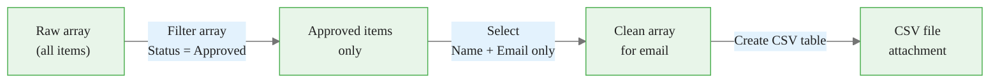
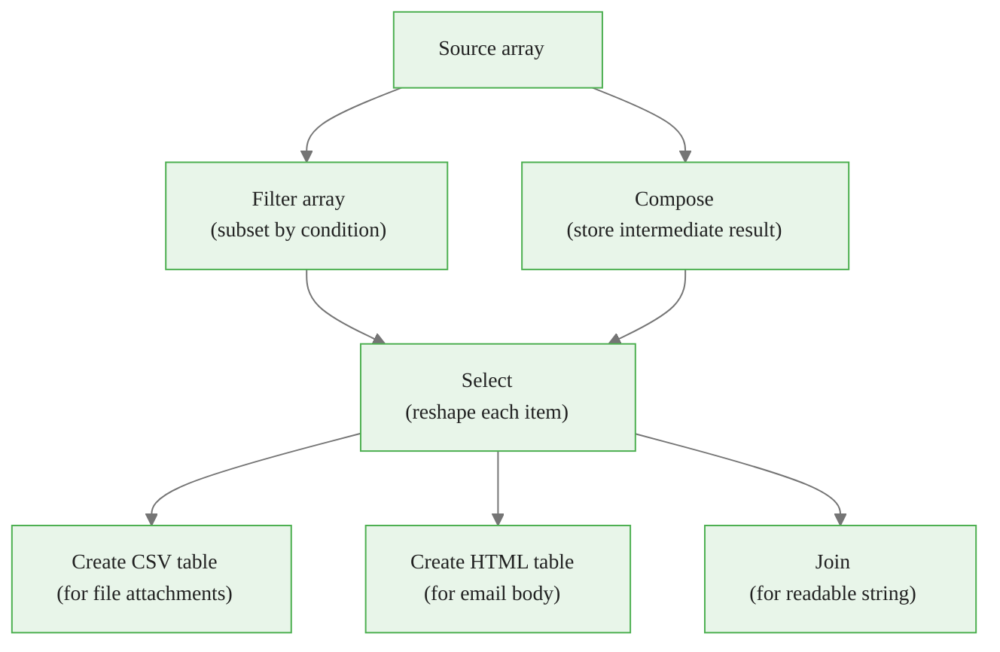

# Data Operations

> **Reading time:** ~22 min | **Module:** 3 — Data Operations & Expressions | **Prerequisites:** Module 2

## In Brief

Data operations are a category of built-in Power Automate actions that reshape, filter, and format structured data without calling any external service. Combined with variable actions, they let you accumulate values across loop iterations, transform arrays, and produce table outputs — all inside a single flow.

<div class="callout-key">

<strong>Key Concept:</strong> Data operations are a category of built-in Power Automate actions that reshape, filter, and format structured data without calling any external service. Combined with variable actions, they let you accumulate values across loop iterations, transform arrays, and produce table outputs — all inside a single flow.

</div>


## Learning Objectives

By the end of this guide you will be able to:

<div class="callout-insight">

<strong>Insight:</strong> By the end of this guide you will be able to:

1.

</div>


1. Store intermediate computed values using the **Compose** action
2. Declare, set, and update variables of all supported types
3. Use **Select** to project arrays into new shapes
4. Use **Filter array** to subset arrays by condition
5. Use **Create CSV table** and **Create HTML table** for report output
6. Use **Join** to collapse an array into a delimited string
7. Parse incoming JSON strings with **Parse JSON** and define schemas

---

## The Compose Action

**Compose** is the simplest data action: it accepts a single input — any value or expression — and exposes it as an output named **Outputs**. It has no other effect.

<div class="callout-key">

<strong>Key Point:</strong> **Compose** is the simplest data action: it accepts a single input — any value or expression — and exposes it as an output named **Outputs**.

</div>


### Why Compose Exists

Power Automate evaluates expressions inline in every field, but a complex expression written six different times in six different fields is hard to maintain. Compose solves this by computing the value once and letting downstream steps reference the single output.

<div class="code-window">
<div class="code-header">
<div class="dots"><span class="dot-red"></span><span class="dot-yellow"></span><span class="dot-green"></span></div>
<span class="filename">example.py</span>
</div>

The following implementation builds on the approach above:

```text
Without Compose:
  Email subject:  concat('Report - ', formatDateTime(utcNow(), 'MMMM d, yyyy'))
  Email body:     "Date: " + concat('Report - ', formatDateTime(utcNow(), 'MMMM d, yyyy'))
  File name:      concat(formatDateTime(utcNow(), 'yyyyMMdd'), '_report.csv')

With Compose:
  Compose (TodayFormatted): formatDateTime(utcNow(), 'MMMM d, yyyy')
  Compose (TodayCompact):   formatDateTime(utcNow(), 'yyyyMMdd')

  Email subject:  concat('Report - ', outputs('TodayFormatted'))
  Email body:     "Date: " + outputs('TodayFormatted')
  File name:      concat(outputs('TodayCompact'), '_report.csv')
```

</div>

### Adding a Compose Action

> **On screen:** Click **+ New step**. In the search box type `Compose`. Under **Data Operation**, click **Compose**. A card titled **Compose** appears with a single **Inputs** field.

> **On screen:** Click inside the **Inputs** field. You can type a static value, insert dynamic content tokens, or switch to the **Expression** tab to enter a formula. Enter your value or expression, then click outside the field.

> **On screen:** Rename the action to something descriptive: click the three-dot menu (`...`) on the card header, choose **Rename**, and type a name such as `Compose - Today Formatted`.

### Referencing Compose Outputs

After a Compose action runs, its output is available under the **Compose** step's name in the dynamic content panel, labelled **Outputs**.

> **On screen:** In any downstream field, open the dynamic content panel. Find the section headed with your Compose action name. Click **Outputs** to insert the token.

---

## Variable Actions

Variables hold a value that persists across the entire flow and can be updated at any point — including inside loops. This is the critical distinction from Compose: Compose produces a one-time output; a variable retains its value until you change it.

<div class="callout-info">

<strong>Info:</strong> Variables hold a value that persists across the entire flow and can be updated at any point — including inside loops.

</div>


### Supported Variable Types

| Type | Use For | Example Value |
|------|---------|---------------|
| `String` | Text | `"Pending"` |
| `Integer` | Whole numbers | `42` |
| `Float` | Decimal numbers | `3.14` |
| `Boolean` | True/false flags | `true` |
| `Array` | Lists of items | `["Alice", "Bob"]` |
| `Object` | Key-value maps | `{"name": "Alice"}` |

### Initialize Variable

You must initialise every variable before using it. Initialization can only occur **outside** of loops — attempting to initialise inside Apply to each or Do until causes an error.

> **On screen:** Click **+ New step**. Search for `Initialize variable`. Click the action **Initialize variable** under the **Variables** connector.

> **On screen:** Fill in the card:
> - **Name:** A short, descriptive identifier with no spaces (for example, `TotalAmount`)
> - **Type:** Select from the dropdown: `String`, `Integer`, `Float`, `Boolean`, `Array`, `Object`
> - **Value:** Optional initial value (leave blank to initialise to zero, empty string, false, or empty array depending on type)

A good convention: prefix variable names by type — `strStatus`, `intCount`, `arrApprovers` — so the name communicates the type at a glance.

### Set Variable

Replaces the variable's current value with a new value.

> **On screen:** Click **+ New step**. Search for `Set variable`. Select the **Set variable** action. Choose the variable name from the **Name** dropdown, then enter the new value in the **Value** field.

Example: after classifying an email, set `strStatus` to `"Approved"`:

<div class="code-window">
<div class="code-header">
<div class="dots"><span class="dot-red"></span><span class="dot-yellow"></span><span class="dot-green"></span></div>
<span class="filename">example.py</span>
</div>

The following implementation builds on the approach above:

```text
Set variable
  Name:  strStatus
  Value: 'Approved'
```

</div>

### Increment Variable

Adds a number to an integer or float variable. This is the standard loop counter pattern.

> **On screen:** Search for `Increment variable`. Select the action. Choose the variable and enter the increment amount (for example, `1`).

<div class="code-window">
<div class="code-header">
<div class="dots"><span class="dot-red"></span><span class="dot-yellow"></span><span class="dot-green"></span></div>
<span class="filename">example.py</span>
</div>

The following implementation builds on the approach above:

```text
Initialize variable
  Name:  intCount
  Type:  Integer
  Value: 0

[Apply to each loop]
  Increment variable
    Name:   intCount
    Value:  1
```

</div>

After the loop, `intCount` contains the total number of items processed.

### Append to String Variable

Concatenates text onto the end of a string variable. Useful for building a multi-line log or summary message across loop iterations.

> **On screen:** Search for `Append to string variable`. Choose the variable and enter the text to append.

Example: collect email subjects into a summary string:

<div class="code-window">
<div class="code-header">
<div class="dots"><span class="dot-red"></span><span class="dot-yellow"></span><span class="dot-green"></span></div>
<span class="filename">example.py</span>
</div>


```text
Initialize variable
  Name:  strSummary
  Type:  String
  Value: ''

[Apply to each email]
  Append to string variable
    Name:   strSummary
    Value:  concat('- ', items('Apply_to_each')?['Subject'], '\n')
```

</div>

After the loop, `strSummary` contains a bullet-pointed list of subjects.

### Append to Array Variable

Adds one item to the end of an array variable.

> **On screen:** Search for `Append to array variable`. Choose the array variable and enter the item to append.

Example: collect filtered items into an array for later processing:

```text
Initialize variable
  Name:  arrHighPriority
  Type:  Array
  Value: []

[Apply to each item]
  [Condition: Priority equals 'High']
    Append to array variable
      Name:  arrHighPriority
      Value: items('Apply_to_each')
```

---

## Data Operations: Select

**Select** transforms an array by projecting each element into a new shape. It is the Power Automate equivalent of the `map()` function in programming languages.

<div class="callout-warning">

<strong>Warning:</strong> **Select** transforms an array by projecting each element into a new shape.

</div>


### When to Use Select

Use Select when you have an array of complex objects and you want a simplified array containing only certain fields — for example, extracting just names and emails from an array of full employee records.

### Adding a Select Action

> **On screen:** Click **+ New step**. Search for `Select`. Click **Select** under the **Data Operation** connector.

> **On screen:** The Select card has two fields:
> - **From:** The array to transform. Insert the dynamic content token of your source array.
> - **Map:** The shape of each output item. Toggle to **Text mode** (switch icon in the top-right corner of the Map field) to see key-value pair rows.

> **On screen:** In Map, click **+ Add item**. In the **Key** column enter the output property name (for example, `Name`). In the **Value** column insert the dynamic content token for the input field from the current item (for example, `Display Name` from the array item).

Example: project an array of SharePoint user records to only name and email:

```text
Select
  From:  [array of SharePoint user objects]
  Map:
    Key: Name     Value: [Display Name]
    Key: Email    Value: [EMail]
```

Output array: `[{"Name": "Alice", "Email": "alice@contoso.com"}, ...]`

### Referencing Select Output

> **On screen:** In downstream steps, the Select action exposes **Output** in the dynamic content panel. This output is always an array.

---

## Data Operations: Filter Array

**Filter array** subsets an array to only the elements matching a condition. It is the Power Automate equivalent of `filter()`.

<div class="callout-insight">

<strong>Insight:</strong> **Filter array** subsets an array to only the elements matching a condition.

</div>


### Adding a Filter Array Action

> **On screen:** Click **+ New step**. Search for `Filter array`. Click **Filter array** under the **Data Operation** connector.

> **On screen:** The Filter array card has two fields:
> - **From:** The source array.
> - **Condition (Filter Query):** The boolean condition each item must satisfy to be included.

> **On screen:** Click **Edit in advanced mode** to enter the condition as an expression. This gives the most control.

Example: keep only items where Status equals `"Approved"`:

```text
Filter array
  From:  [outputs('Get_items')?['body']?['value']]
  Condition (advanced):  @equals(item()?['Status'], 'Approved')
```

Example: keep items where Amount exceeds 5000:

```text
Condition (advanced):  @greater(item()?['Amount'], 5000)
```

Inside Filter array expressions, `item()` refers to the current array element being evaluated — equivalent to `items('Apply_to_each')` inside a loop.

### Chaining Select and Filter

A common pattern: filter first, then select to shape the result.



---

## Data Operations: Create CSV Table

**Create CSV table** converts an array of objects into a CSV-formatted string. This is the fastest path from a data array to a spreadsheet-ready attachment.

<div class="callout-key">

<strong>Key Point:</strong> **Create CSV table** converts an array of objects into a CSV-formatted string.

</div>


### Adding a Create CSV Table Action

> **On screen:** Click **+ New step**. Search for `Create CSV table`. Click **Create CSV table** under the **Data Operation** connector.

> **On screen:** The card has two fields:
> - **From:** The array to convert.
> - **Columns:** Choose **Automatic** to use the keys of the first array object as headers, or **Custom** to specify which columns appear and in what order.

> **On screen:** For **Custom** columns: click **+ Add column**. Enter the **Header** name and the **Value** expression for each column. This lets you rename columns and control column order independently of the source object structure.

The output is a single string in CSV format that you can attach to an email using the **Attachments** field of **Send an email (V2)**.

### Attaching the CSV Output to an Email

> **On screen:** In the **Send an email (V2)** card, expand **Advanced options**. In the **Attachments Name** field type a filename ending in `.csv` (for example, `report.csv`). In the **Attachments Content** field, open the dynamic content panel and select **Output** from the **Create CSV table** step.

---

## Data Operations: Create HTML Table

**Create HTML table** converts an array of objects into an HTML `<table>` element. Use it to embed a formatted table directly in an email body.

> **On screen:** Search for `Create HTML table`. The configuration is identical to Create CSV table — a **From** array and optional **Custom** column definitions.

> **On screen:** In the email **Body** field, place your cursor where the table should appear. Open the dynamic content panel and select **Output** from the **Create HTML table** step. Most email clients render the HTML table with visible rows and columns.

---

## Data Operations: Join

**Join** collapses an array of values into a single string, placing a separator between each item.

```text
Join
  From:  ["Alice", "Bob", "Priya"]
  Join with:  ', '

Output: "Alice, Bob, Priya"
```

> **On screen:** Search for `Join`. The card has a **From** field for the array and a **Join with** field for the separator string.

Common separators: `, ` (comma-space), ` | ` (pipe), `\n` (newline for plain-text lists), ` and ` (readable English).

Use Join after Select to produce a readable summary of an array field for an email body, without needing a loop.

---

## Parse JSON

**Parse JSON** takes a JSON string — typically from an HTTP response or a column value — and converts it into a structured object whose fields appear as tokens in the dynamic content panel.

### Why Parse JSON Is Necessary

When Power Automate receives a JSON string from an HTTP call or a text column, it treats the entire string as a single opaque value. You cannot access individual fields inside it without first parsing it.

```text
Without Parse JSON:
  body('HTTP_call')  →  '{"invoiceId":"INV-001","amount":1500}'
  Trying to access amount: impossible without parsing

After Parse JSON:
  body('Parse_JSON')?['invoiceId']  →  'INV-001'
  body('Parse_JSON')?['amount']     →  1500
```

### Defining the Schema

Parse JSON requires a JSON schema that describes the structure of the incoming JSON. The schema tells Power Automate what field names and types to expect so it can create tokens.

> **On screen:** Click **+ New step**. Search for `Parse JSON`. Click **Parse JSON** under the **Data Operation** connector.

> **On screen:** In the **Content** field, insert the JSON string to parse — typically the output of an HTTP action or a field from a trigger.

> **On screen:** In the **Schema** field, you have two options:

**Option 1 — Generate from Sample (recommended):**

> **On screen:** Click **Generate from sample**. In the dialog that appears, paste an example JSON payload that represents a typical response. Click **Done**. Power Automate generates the schema automatically.

Example sample:

```json
{
  "invoiceId": "INV-001",
  "amount": 1500,
  "vendor": "Acme Corp",
  "approved": false
}
```

Generated schema:

```json
{
  "type": "object",
  "properties": {
    "invoiceId": { "type": "string" },
    "amount":    { "type": "integer" },
    "vendor":    { "type": "string" },
    "approved":  { "type": "boolean" }
  }
}
```

**Option 2 — Write schema manually:**

> **On screen:** Type or paste a JSON schema directly into the Schema field. Use `"type": "string"`, `"type": "integer"`, `"type": "array"`, or `"type": "object"` as needed. Nest `"properties"` for object types and `"items"` for array types.

### Using Parse JSON Outputs

After the Parse JSON step runs, all fields defined in the schema appear as tokens in the dynamic content panel under the Parse JSON step name.

> **On screen:** In any downstream field, open the dynamic content panel. Under the **Parse JSON** heading you will see tokens for each field: **invoiceId**, **amount**, **vendor**, **approved**. Click to insert.

### Handling Arrays in JSON

If the parsed JSON contains an array, the array token appears in the panel. Use Apply to each to iterate over it, and inside the loop `items('Apply_to_each')` refers to each element. Nest Parse JSON inside the loop if each array element also contains a JSON string.

---

## Working with Arrays: Patterns Summary



| Goal | Action to use |
|------|--------------|
| Keep only matching items | Filter array |
| Extract / rename fields | Select |
| Count items in array | `length(array)` expression |
| First item of array | `first(array)` expression |
| Array to CSV string | Create CSV table |
| Array to HTML table | Create HTML table |
| Array to delimited string | Join |
| Parse JSON string to object | Parse JSON |
| Accumulate items in a loop | Append to array variable |

---

## Step-by-Step: Build a Filtered CSV Report

This walkthrough produces a CSV file listing only approved purchase requests from a SharePoint list.

### Step 1 — Get all items from SharePoint

> **On screen:** Add a **Get items** action (SharePoint connector). Configure it with your site URL and list name.

### Step 2 — Filter to approved items only

> **On screen:** Add **Filter array**. In **From**, insert **value** from the Get items output. Click **Edit in advanced mode**. Enter: `@equals(item()?['ApprovalStatus'], 'Approved')`

### Step 3 — Select only the needed columns

> **On screen:** Add **Select**. In **From**, insert **Body** from the Filter array output. In **Map**, add:
> - Key: `RequestID` — Value: `[ID]` from current item
> - Key: `Requester` — Value: `[Title]` from current item
> - Key: `Amount` — Value: `[Amount]` from current item
> - Key: `ApprovedDate` — Value: `[Modified]` from current item

### Step 4 — Create the CSV

> **On screen:** Add **Create CSV table**. In **From**, insert **Output** from the Select step. Set **Columns** to **Automatic**.

### Step 5 — Email the CSV as an attachment

> **On screen:** Add **Send an email (V2)**. Fill in To, Subject, Body. Expand **Advanced options**:
> - **Attachments Name:** `approved_requests.csv`
> - **Attachments Content:** **Output** from the Create CSV table step

---

## Common Data Operation Mistakes

| Mistake | What Happens | Fix |
|---------|-------------|-----|
| Initialising a variable inside Apply to each | Runtime error on the second iteration | Move Initialize variable above the loop |
| Using a variable before initialising it | "Variable does not exist" error | Always add Initialize variable as an early step |
| Forgetting to parse JSON before accessing fields | Field tokens do not appear in dynamic content panel | Add Parse JSON with the correct schema |
| Select Map in visual mode — misaligned key/value | Wrong data in output | Switch to Text mode for precise control |
| Filter array without `@` prefix in advanced mode | Expression syntax error | Advanced mode expressions require the `@` prefix |

---

## Connections


<div class="callout-info">

<strong>Info:</strong> This section maps how this guide connects to the broader course. Use these links to navigate related material.

</div>

- **Builds on:** Guide 01 — Dynamic Content and Expressions (expressions used in Filter array, Select)
- **Leads to:** Module 04 — Branching, Loops and Error Handling (variables used inside Apply to each)
- **Related to:** Module 05 — SharePoint and Excel (Get items feeds directly into Filter array → Select → CSV)

---


## Practice Questions

**Question 1 — Conceptual:** Based on the concepts in this guide, explain in your own words why the core technique matters and when you would choose it over alternatives.

**Question 2 — Application:** Sketch out how you would apply the main concept from this guide to a real-world dataset or problem you have encountered. What would you need to watch out for?


## Further Reading

- [Data operations reference](https://learn.microsoft.com/en-us/power-automate/data-operations)
- [Use variables in Power Automate](https://learn.microsoft.com/en-us/power-automate/environment-variables)
- [Parse JSON action reference](https://learn.microsoft.com/en-us/power-automate/data-operations#use-the-parse-json-action)


---

## Cross-References

<a class="link-card" href="./02_data_operations_slides.md">
  <div class="link-card-title">Companion Slides</div>
  <div class="link-card-description">Interactive slide deck covering the key concepts with visual examples.</div>
</a>

<a class="link-card" href="../notebooks/01_expression_reference.ipynb">
  <div class="link-card-title">Hands-on Notebook</div>
  <div class="link-card-description">15-minute micro-notebook with guided exercises and real data.</div>
</a>
