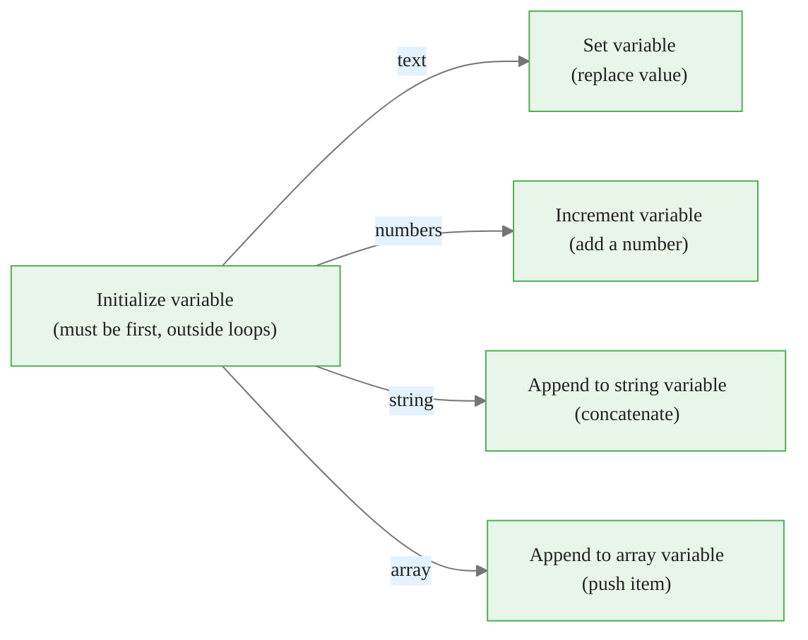
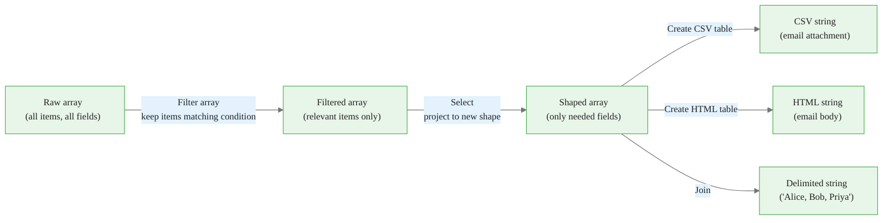
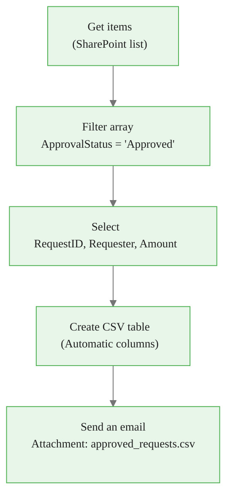
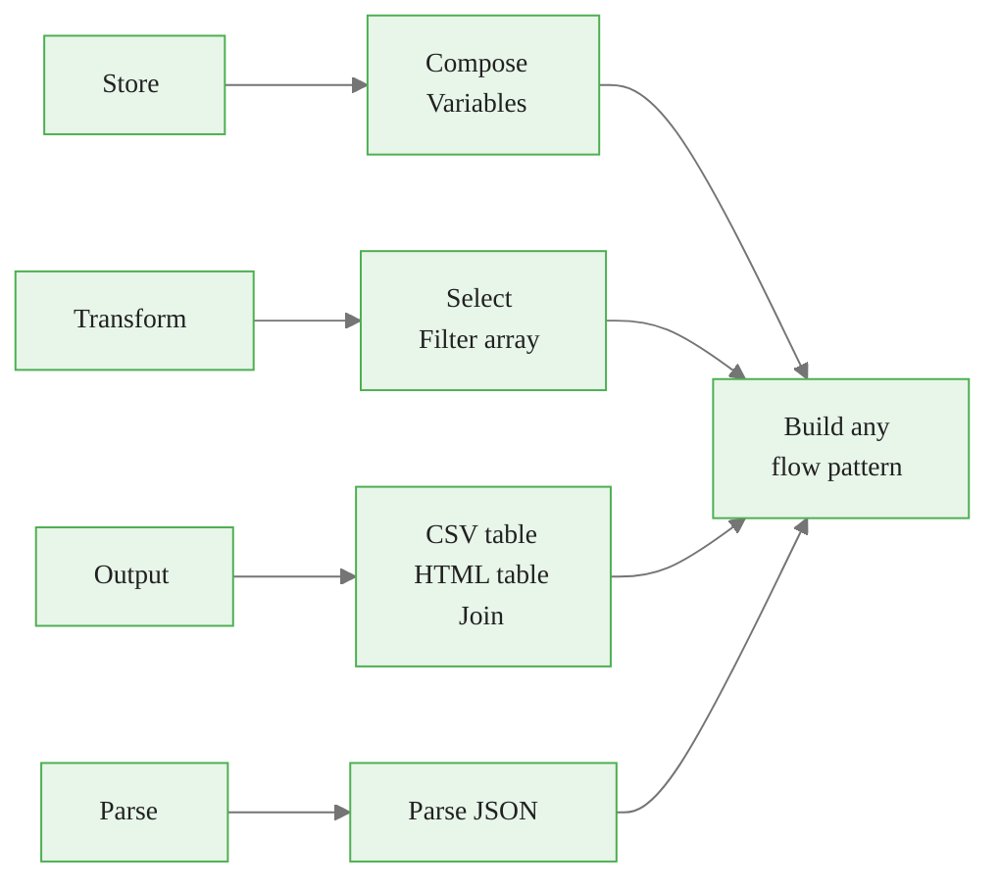

<!-- _class: lead -->

# Data Operations

**Module 03 — Data Operations and Expressions**

> Compose stores. Variables accumulate. Select reshapes. Filter subsets. Together they turn raw flow data into polished outputs.

<!--
Speaker notes: Key talking points for this slide
- Guide 01 covered how to read and compute values; this guide covers how to store and transform collections
- The four verbs in the subtitle capture the mental model for this guide: store, accumulate, reshape, subset
- Every enterprise flow pattern -- approvals, reports, notifications -- uses at least two of these actions
- By the end: learners can produce a filtered, formatted CSV report from a SharePoint list in under 15 steps
-->

<!-- Speaker notes: Cover the key points on this slide about Data Operations. Pause for questions if the audience seems uncertain. -->

---

# Compose vs Variables: The Key Distinction

<div class="columns">
<div>

## Compose

- Single-use output
- Computed once at that step
- Does not change
- Best for: intermediate calculations, reusable expressions

```
Compose - TodayFormatted
  Inputs: formatDateTime(utcNow(), 'MMMM d, yyyy')

Output: "November 15, 2024"
  (fixed from the moment it runs)
```

</div>
<div>

## Variables

- Mutable across the flow
- Can be updated inside loops
- Persists until flow ends
- Best for: counters, running totals, collected lists

```
Initialize variable
  Name: intCount
  Type: Integer
  Value: 0

[loop: increment intCount by 1
 on every iteration]

Final value: 47
```

</div>
</div>

<!--
Speaker notes: Key talking points for this slide
- This is the conceptual fork learners must understand before using either
- Compose cannot be changed after it runs -- it is immutable
- Variables can be changed as many times as needed -- they are mutable
- The practical rule: if you need the value to change (especially in a loop), use a variable
- If you just want to avoid repeating a complex expression, use Compose
-->


<div class="callout-insight">
<strong>Insight:</strong> This is a key takeaway from this section that connects to the broader course themes.
</div>

<!-- Speaker notes: Cover the key points on this slide about Compose vs Variables: The Key Distinction. Pause for questions if the audience seems uncertain. -->

---

# The Compose Action

**Problem:** A complex expression written six times in six fields is a maintenance burden.

**Solution:** Write it once in Compose, reference the output everywhere.

```mermaid
%%{init: {"theme": "base", "themeVariables": {"primaryColor": "#e8f5e9", "primaryBorderColor": "#4caf50", "primaryTextColor": "#212121", "secondaryColor": "#e3f2fd", "tertiaryColor": "#fff8e1", "lineColor": "#757575", "fontFamily": "Inter, sans-serif", "fontSize": "14px"}}}%%
graph TD
    comp["Compose - TodayFormatted\nformatDateTime(utcNow(), 'MMMM d, yyyy')\n→ 'November 15, 2024'"]

    comp -->|outputs('TodayFormatted')| email["Email Subject:\n'Report - November 15, 2024'"]
    comp -->|outputs('TodayFormatted')| file["File Name:\n'20241115_report.csv'"]
    comp -->|outputs('TodayFormatted')| log["Log Entry:\n'Run on: November 15, 2024'"]
```

> **On screen:** New step → search **Compose** → Data Operation connector → fill **Inputs** → rename action via `...` menu

<!--
Speaker notes: Key talking points for this slide
- The rename step is important: action names propagate to the dynamic content panel. "Compose" is useless; "Compose - TodayFormatted" is self-documenting
- outputs('Action_Name') is the expression syntax; the dynamic content panel generates this automatically when you click the Outputs token
- Compose is free: it counts toward the flow's action limit but executes instantly and uses no connector quota
- Common pattern: a "setup" section at the top of the flow with 3-5 Compose actions computing values used throughout
-->


<div class="callout-key">
<strong>Key Point:</strong> Remember this concept — it appears repeatedly in later modules.
</div>

<!-- Speaker notes: Cover the key points on this slide about The Compose Action. Pause for questions if the audience seems uncertain. -->

---

# Variable Actions Overview



| Action | When to use |
|--------|-------------|
| Initialize variable | Always first — declare name, type, initial value |
| Set variable | Replace value at any point in the flow |
| Increment variable | Counter pattern inside loops |
| Append to string variable | Build a multi-line text summary in a loop |
| Append to array variable | Collect items conditionally during a loop |

<!--
Speaker notes: Key talking points for this slide
- The initialization rule is strict: Power Automate will not let you initialize inside a loop
- If the initialization fails, move it above the Apply to each / Do until scope
- Set variable replaces the entire value -- use it for status flags like strStatus = 'Approved'
- Increment variable is shorthand for Set variable where the new value equals the old value + N
- Append to array is how you build a filtered list without using the Filter array action
-->


<div class="callout-warning">
<strong>Warning:</strong> This is a common source of confusion. Pay close attention to the distinction here.
</div>

<!-- Speaker notes: Cover the key points on this slide about Variable Actions Overview. Pause for questions if the audience seems uncertain. -->

---

# Variable Lifecycle: Loop Counter Pattern

```
Initialize variable          intCount = 0
  Name: intCount
  Type: Integer
  Value: 0

Apply to each (emails)
  ├── [process email]
  └── Increment variable     intCount = 1, 2, 3...
        Name:  intCount
        Value: 1

Condition
  intCount greater than 0
    true: Send summary email
    false: Send "nothing to process" notification
```

After the loop, `intCount` reliably holds the total items processed.

<!--
Speaker notes: Key talking points for this slide
- This is the most common variable pattern in real-world flows
- The counter lives outside the loop but is modified inside -- this is the key mental model
- After the loop, the variable holds the final count -- safe to use in conditions and email bodies
- Variation: use intCount > 0 to decide whether to send a summary at all
- Ask learners: "What type would you use if you want a running total of invoice amounts?" → Float
-->


<div class="callout-info">
<strong>Info:</strong> This detail is useful context but not required to memorize.
</div>

<!-- Speaker notes: Cover the key points on this slide about Variable Lifecycle: Loop Counter Pattern. Pause for questions if the audience seems uncertain. -->

---

# Append to Array: Conditional Collector

```
Initialize variable
  Name:  arrHighPriority
  Type:  Array
  Value: []

Apply to each (items)
  │
  └── Condition: Priority = 'High'
        │
        true ──► Append to array variable
                   Name:  arrHighPriority
                   Value: items('Apply_to_each')

[After loop]
Condition: not(empty(variables('arrHighPriority')))
  true → Join arrHighPriority and send alert email
```

<!--
Speaker notes: Key talking points for this slide
- This pattern replaces Filter array when the filter condition is complex or varies per item
- The empty() check at the end prevents sending an empty alert -- always guard array usage
- items('Apply_to_each') is the current item in the loop -- appending it adds the whole object
- To append only one field: Append to array variable → Value: items('Apply_to_each')?['Email']
- The resulting array can feed directly into Select, Join, Create CSV table, or Apply to each
-->

<!-- Speaker notes: Cover the key points on this slide about Append to Array: Conditional Collector. Pause for questions if the audience seems uncertain. -->

---

<!-- _class: lead -->

# Data Transformation Pipeline

<!--
Speaker notes: Key talking points for this slide
- Now we shift from storing values to transforming collections
- The four data operation actions form a natural pipeline: Filter → Select → Output
- This pipeline covers the majority of reporting and notification use cases in Power Automate
-->

<!-- Speaker notes: Cover the key points on this slide about Data Transformation Pipeline. Pause for questions if the audience seems uncertain. -->

---

# The Data Transformation Pipeline



Each action is optional — use only what the flow needs. The common minimum: **Filter array → Create CSV table**.

<!--
Speaker notes: Key talking points for this slide
- The pipeline is modular: each stage is optional and can be combined freely
- Filter array without Select: output has all fields but fewer rows
- Select without Filter array: output has all rows but fewer/renamed columns
- Both together: clean subset of relevant data in the right shape
- Real scenario: SharePoint list of 5000 purchase requests → filter to this week's → select 4 columns → CSV attachment
-->

<!-- Speaker notes: Cover the key points on this slide about The Data Transformation Pipeline. Pause for questions if the audience seems uncertain. -->

---

# Select: Reshape Every Item

**Select** maps each element of an array to a new structure.

<div class="columns">
<div>

**Input array:**
```json
[
  {
    "DisplayName": "Alice Chen",
    "EMail": "alice@contoso.com",
    "JobTitle": "Analyst",
    "Department": "Finance",
    "HireDate": "2021-03-15"
  },
  ...
]
```

</div>
<div>

**Select Map:**
```
Key: Name    Value: [DisplayName]
Key: Email   Value: [EMail]
```

**Output array:**
```json
[
  {
    "Name": "Alice Chen",
    "Email": "alice@contoso.com"
  },
  ...
]
```

</div>
</div>

> **On screen:** New step → **Select** (Data Operation) → **From**: source array → **Map**: toggle to Text mode → Add key-value pairs

<!--
Speaker notes: Key talking points for this slide
- Select is a pure transformation: same number of rows, different shape
- The Text mode toggle is important: visual mode can misalign key-value pairs; text mode is explicit
- Keys become the column headers in CSV/HTML table output -- name them for the audience, not the system
- Value expressions can contain expressions: e.g. formatDateTime(item()?['HireDate'], 'MMMM d, yyyy') to reformat a date
- The output is always an array even if only one item passes -- downstream steps always receive an array
-->

<!-- Speaker notes: Cover the key points on this slide about Select: Reshape Every Item. Pause for questions if the audience seems uncertain. -->

---

# Filter Array: Subset by Condition

**Filter array** keeps only items where the condition is true.

```
Filter array
  From:  [Get items output - value]
  Condition (advanced mode):  @equals(item()?['Status'], 'Approved')
```

**Multi-condition filter:**

```
@and(
  equals(item()?['Status'], 'Approved'),
  greater(item()?['Amount'], 5000)
)
```

Inside Filter array expressions:
- Use `item()` to reference the current element (not `items('Apply_to_each')`)
- Prefix the expression with `@` in advanced mode
- All expression functions from Guide 01 are available

<!--
Speaker notes: Key talking points for this slide
- item() vs items(): item() is only available inside Filter array and Select; items('loop_name') is inside Apply to each loops
- The @and() prefix: in advanced mode the @ prefix means "evaluate this as an expression"
- Filter array is declarative and more efficient than a loop with a condition + append-to-array
- The output is always an array -- even if only one item matches -- so downstream steps should handle arrays
- Empty result: if no items match, the output is [] (empty array). Always check with empty() before consuming.
-->

<!-- Speaker notes: Cover the key points on this slide about Filter Array: Subset by Condition. Pause for questions if the audience seems uncertain. -->

---

# Create CSV Table and HTML Table

<div class="columns">
<div>

## Create CSV Table

Output: plain text string in CSV format

```
Name,Email,Amount
Alice,alice@co.com,1200
Bob,bob@co.com,850
```

Use for:
- Email file attachments (`.csv`)
- SharePoint file creation
- OneDrive storage

</div>
<div>

## Create HTML Table

Output: `<table>...</table>` HTML

```html
<table>
  <thead><tr><th>Name</th>...</tr></thead>
  <tbody>
    <tr><td>Alice</td>...</tr>
  </tbody>
</table>
```

Use for:
- Inline email body tables
- HTML reports in Teams messages

</div>
</div>

Both accept a **From** array and optional **Custom** column configuration.

<!--
Speaker notes: Key talking points for this slide
- Create CSV table output is a string -- to attach it to an email, use the Attachments field in Send an email V2
- Create HTML table output can be pasted directly into the email Body field -- most email clients render it
- Custom columns let you rename headers and control order independently of the source object
- Automatic mode uses the first object's keys as headers -- fragile if object shapes vary
- Best practice: always use Select first (to control shape), then Automatic mode in CSV/HTML table
-->

<!-- Speaker notes: Cover the key points on this slide about Create CSV Table and HTML Table. Pause for questions if the audience seems uncertain. -->

---

# Join: Collapse Array to String

**Join** collapses an array of strings into one delimited string.

```
Join
  From:   ["Alice", "Bob", "Priya"]
  Join with:  ', '

Output: "Alice, Bob, Priya"
```

**Common separators:**

| Separator | Result | Use Case |
|-----------|--------|----------|
| `', '` | `Alice, Bob, Priya` | Readable list in email |
| `' \| '` | `Alice \| Bob \| Priya` | Column separator |
| `'\n'` | One per line | Plain-text body |
| `' and '` | `Alice, Bob and Priya` | English prose |

> **Note:** For the last-item "and" pattern, Join plus a Replace expression handles it.

<!--
Speaker notes: Key talking points for this slide
- Join is the most concise way to produce a readable list from an array -- no loop needed
- Common pattern: Select to extract just the Name field → Join with ', ' → embed in email body
- Join only works on arrays of strings or numbers. If array contains objects, use Select first to extract the target field.
- The newline separator (\n) works in plain-text email bodies but not HTML -- use <br> or <li> tags for HTML
- Ask learners: "How would you produce 'Alice, Bob, and Priya' (Oxford comma + 'and')?" -- this requires Replace on the last separator
-->

<!-- Speaker notes: Cover the key points on this slide about Join: Collapse Array to String. Pause for questions if the audience seems uncertain. -->

---

# Parse JSON: Unlocking Structured Responses

```mermaid
%%{init: {"theme": "base", "themeVariables": {"primaryColor": "#e8f5e9", "primaryBorderColor": "#4caf50", "primaryTextColor": "#212121", "secondaryColor": "#e3f2fd", "tertiaryColor": "#fff8e1", "lineColor": "#757575", "fontFamily": "Inter, sans-serif", "fontSize": "14px"}}}%%
graph LR
    http["HTTP response\nbody (string)\n'{\"id\":1,\"status\":\"OK\"}'"] -->|without Parse JSON| opaque["Opaque string\nNo field tokens available"]
    http -->|Parse JSON| tokens["Field tokens in panel:\n• id\n• status\n• amount"]
    tokens --> downstream["Downstream steps\ncan use individual fields"]
```

**The schema is the key** — it tells Power Automate what fields to expose as tokens.

<!--
Speaker notes: Key talking points for this slide
- Without Parse JSON, the entire HTTP body is a single string token -- you cannot drill into it
- The schema maps field names to types: string, integer, boolean, array, object
- Parse JSON does not change the data -- it just makes it navigable
- Important: the schema only needs to cover the fields you want to USE, not every field in the response
- Missing schema fields: they are ignored silently -- the flow does not fail if the schema is incomplete
-->

<!-- Speaker notes: Cover the key points on this slide about Parse JSON: Unlocking Structured Responses. Pause for questions if the audience seems uncertain. -->

---

# Parse JSON: Generate Schema from Sample

> **On screen:** Add **Parse JSON** action → click **Generate from sample** → paste a real example response → click **Done** → Power Automate generates the schema

**Example sample JSON:**

```json
{
  "invoiceId": "INV-001",
  "amount": 1500,
  "vendor": "Acme Corp",
  "lineItems": [
    { "sku": "WIDGET-01", "qty": 10, "price": 150 }
  ]
}
```

**Generated schema (excerpt):**

```json
{
  "type": "object",
  "properties": {
    "invoiceId": { "type": "string" },
    "amount":    { "type": "integer" },
    "lineItems": {
      "type": "array",
      "items": { "type": "object",
        "properties": { "sku": {...}, "qty": {...} }
      }
    }
  }
}
```

<!--
Speaker notes: Key talking points for this slide
- Generate from sample is the correct first approach for 95% of cases
- Always use a representative sample that includes all field types, including arrays and nested objects
- If the real response has more fields than the sample, those extra fields are ignored -- not an error
- If the real response is missing a field that is in the schema, the token will be null -- use coalesce() for defaults
- For arrays in the JSON: after Parse JSON, use Apply to each on the array token to iterate over line items
-->

<!-- Speaker notes: Cover the key points on this slide about Parse JSON: Generate Schema from Sample. Pause for questions if the audience seems uncertain. -->

---

# Full Pipeline: Filtered CSV Report



Step count: 4 data operations + 1 email = **5 actions**

Result: automated weekly CSV report of approved purchase requests — no code, no Power BI.

<!--
Speaker notes: Key talking points for this slide
- This five-step pipeline is the target "build" for this module -- learners should be able to reproduce it
- Each step is single-purpose: get, filter, shape, format, send
- The pipeline is modular: swap SharePoint for Dataverse, CSV for HTML table, email for Teams message
- Performance: Filter array runs in-memory in Power Automate; no extra API calls to SharePoint
- Timing: a flow executing this pipeline typically completes in under 5 seconds
-->

<!-- Speaker notes: Cover the key points on this slide about Full Pipeline: Filtered CSV Report. Pause for questions if the audience seems uncertain. -->

---

# Variable vs Data Operation: Which to Use?

| Scenario | Use This |
|----------|----------|
| Compute a value once and reuse it | **Compose** |
| Track a counter across loop iterations | **Variable (Integer)** |
| Build a text summary line by line | **Variable (Append to String)** |
| Remove unwanted items from an array | **Filter array** |
| Extract only certain fields per item | **Select** |
| Produce a spreadsheet-ready file | **Create CSV table** |
| Embed a table in an email body | **Create HTML table** |
| Produce a comma-separated list | **Join** |
| Access fields inside a JSON string | **Parse JSON** |

<!--
Speaker notes: Key talking points for this slide
- This decision table is the practical reference learners will return to when building flows
- The most common confusion: using Append to array variable when Filter array would be simpler
- Rule of thumb: if the logic is "keep items matching X", use Filter array. If the logic changes per item, use a loop with Append to array.
- Compose is often overlooked: learners write the same expression six times when one Compose would suffice
- Parse JSON confusion: learners often skip it and wonder why there are no field tokens -- make Parse JSON automatic practice when handling HTTP responses
-->

<!-- Speaker notes: Cover the key points on this slide about Variable vs Data Operation: Which to Use?. Pause for questions if the audience seems uncertain. -->

---

# Summary



**Key takeaways:**
- Compose = one-time computed value; Variables = mutable, update in loops
- Filter array subsets rows; Select reshapes columns
- Create CSV table → email attachment; Create HTML table → email body
- Parse JSON unlocks field tokens from any JSON string
- The full pipeline: Get items → Filter → Select → CSV table → Email

<!--
Speaker notes: Key talking points for this slide
- These eight actions cover the majority of data manipulation needed in real-world Power Automate flows
- The "store → transform → output → parse" grouping is the mental model to carry forward
- Next module (04): Conditions and Apply to each loops -- variables from this guide become the loop counters and collectors
- Next in the module: the Jupyter notebook exercises let learners explore equivalent Python patterns side-by-side with Power Automate expressions
- Encourage learners to build the 5-step filtered CSV report as their hands-on project from this guide
-->

<!-- Speaker notes: Cover the key points on this slide about Summary. Pause for questions if the audience seems uncertain. -->
