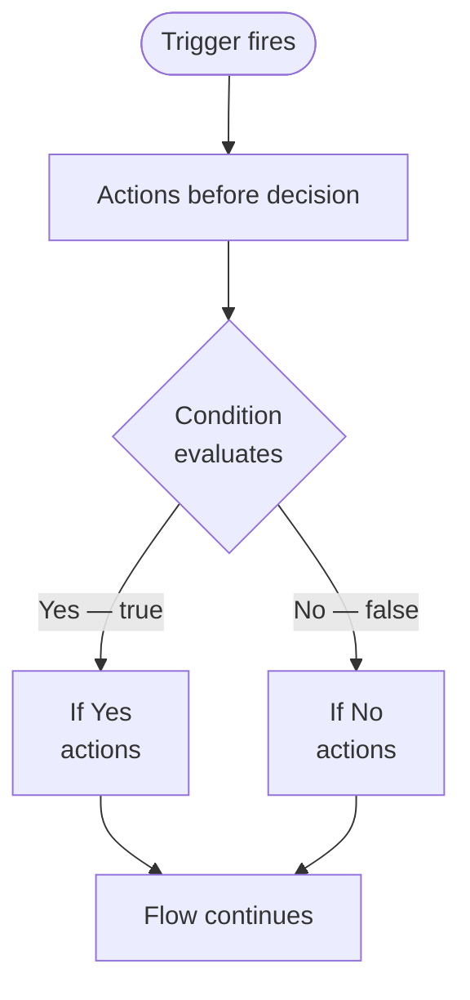
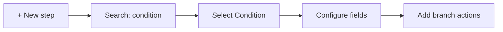
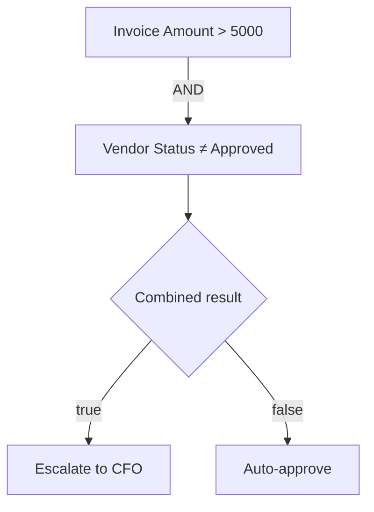
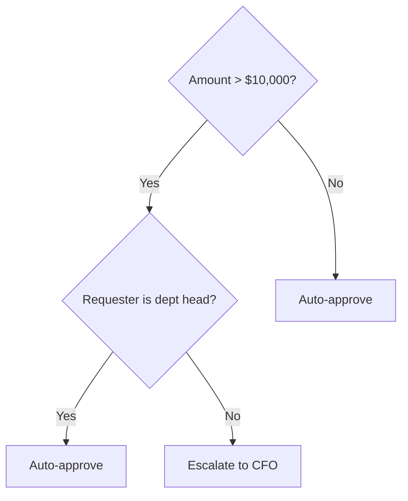
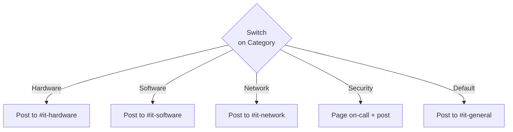
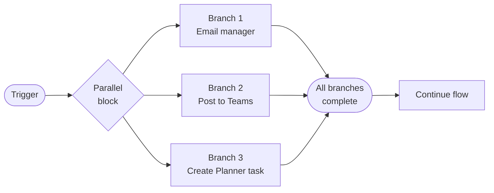
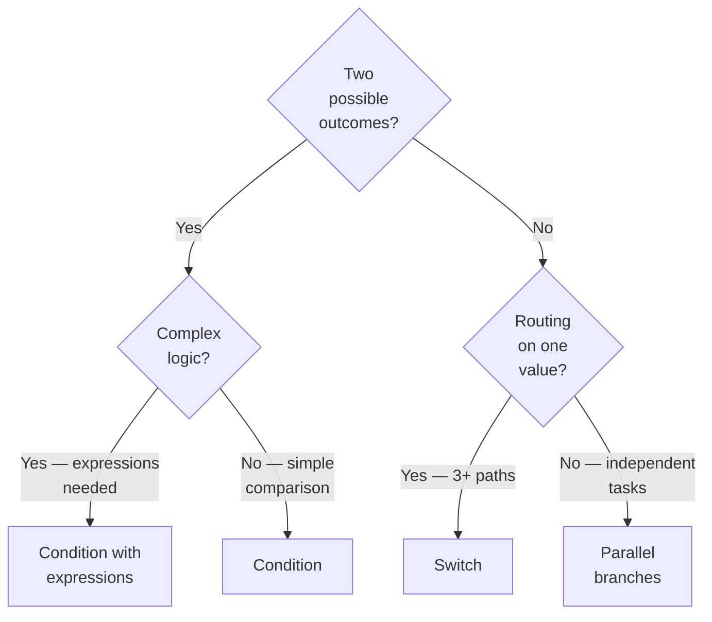

<!-- _class: lead -->

# Branching and Conditions
## Module 04 — Control Flow in Power Automate

> A flow that always does the same thing is a script. A flow that decides is an automation.

<!--
Speaker notes: Welcome to Module 04. This first section covers how Power Automate makes decisions. Before we had conditions, flows were linear — every run took the same path. Conditions, Switch, and Parallel branches are what turn a rigid sequence into a real business process. We'll build from the simplest Yes/No split all the way to parallel execution.
-->

---

# What You Will Learn

- **Condition action** — binary Yes/No branching
- **Operators** — equals, contains, greater than, expressions
- **Nested conditions** — decisions inside decisions
- **Switch action** — multiple named paths from one value
- **Parallel branches** — running actions simultaneously

By the end you will design multi-path flows that handle real business logic.

<!--
Speaker notes: Five topics, all building on each other. Condition is the foundation — everything else is a variation or extension. We spend the most time on Condition because understanding it deeply makes Switch and Parallel branches easy to grasp.
-->

---

# The Condition Action: How It Works



**Key behavior:** Both branches rejoin. The flow continues after the Condition block regardless of which path ran.

<!--
Speaker notes: This diagram is worth studying. The two branches are symmetric — Yes and No are equally valid paths. Neither is the "error path." After both branches finish, flow execution resumes from below the Condition block. This is different from an early-exit pattern; you'd need a Terminate action for that.
-->

---

# Adding a Condition — UI Walkthrough

<div class="columns">
<div>

**Step 1:** Click **+ New step**

**Step 2:** Search for `condition`

**Step 3:** Click **Condition**

**Step 4:** Configure three fields:
- Left value (dynamic content)
- Operator (dropdown)
- Right value (literal or expression)

**Step 5:** Add actions to **If yes** and **If no**

</div>
<div>



> **On screen:** The Condition block appears with two labeled sections. The **If yes** section is on the left, **If no** on the right.

</div>
</div>

<!--
Speaker notes: The search is important — "Condition" is the action name. Don't search for "if" or "branch." The three-field layout (left value, operator, right value) maps directly to a comparison expression: `[thing] [operator] [value]`. Walk learners through clicking inside the left field to open the dynamic content panel.
-->

---

# Operator Reference

<div class="columns">
<div>

**Equality**
- `is equal to`
- `is not equal to`

**Numeric / Date**
- `is greater than`
- `is greater than or equal to`
- `is less than`
- `is less than or equal to`

</div>
<div>

**String**
- `contains`
- `does not contain`
- `starts with`
- `ends with`

**Null checks**
- `is null`
- `is not null`

</div>
</div>

> **Rule of thumb:** Use `contains` for partial text matches. Use `is equal to` for exact matches. Use `is null` to detect missing optional fields.

<!--
Speaker notes: Most beginner mistakes come from using `is equal to` when they need `contains`, or vice versa. "Approved" is equal to "Approved" — but "The request has been Approved" is not equal to "Approved." For substring checks, always use contains. The null operators are underused — they're essential for optional fields that may or may not be populated at trigger time.
-->

---

# Multiple Conditions: AND / OR Groups



<div class="columns">
<div>

**AND** — all rows must be true

```
Amount > 5000
AND
Vendor ≠ "Approved"
```

</div>
<div>

**OR** — any row being true is enough

```
Category = "Security"
OR
Priority = "Critical"
```

</div>
</div>

> **On screen:** Click **+ Add** inside the Condition block, then **Add row**. Toggle the combinator between **And** and **Or** by clicking the label between rows.

<!--
Speaker notes: AND and OR are the building blocks of compound logic. A critical concept: AND narrows the result (fewer items pass), OR widens it (more items pass). When mixing AND and OR, use groups — click "Add group" — to control precedence. Without grouping, Power Automate evaluates rows top to bottom with the same combinator.
-->

---

# Expressions in Condition Values

<div class="columns">
<div>

**Common patterns:**

| Goal | Expression |
|---|---|
| Case-insensitive match | `toUpper(field)` |
| Check string length | `length(field)` |
| Get today's date | `utcNow()` |
| Days from now | `addDays(utcNow(), 7)` |
| Day of week | `dayOfWeek(utcNow())` |
| Check if empty | `empty(field)` |
| Convert to number | `int(field)` |

</div>
<div>

**Example — skip weekends:**

Left value:
```
dayOfWeek(utcNow())
```

Operator: `is greater than or equal to`

Right value: `1`

AND

Left value:
```
dayOfWeek(utcNow())
```

Operator: `is less than or equal to`

Right value: `5`

</div>
</div>

<!--
Speaker notes: Expressions unlock the cases where the raw dynamic value isn't in the right form for comparison. The most common need is case normalization — if a user typed "approved" instead of "Approved", toUpper() on both sides fixes it. The date functions are invaluable for time-sensitive workflows like escalation rules.
-->

---

# Nested Conditions



**When to nest:** The second question only makes sense given the first answer is Yes.

**When NOT to nest:** Use Switch instead when you have 3+ distinct paths from a single value.

> **Depth limit:** Two levels of nesting is the practical maximum before readability suffers. Deeper logic belongs in a child flow.

<!--
Speaker notes: The diagram shows a classic two-level nest. The key question to ask is: "Does this second decision only apply when the first condition is true?" If yes, nest. If the second decision applies regardless of the first, it belongs after the Condition block, not inside it. Readability matters — a flow someone else cannot follow is a flow they will break.
-->

---

# The Switch Action: Multiple Paths



**Switch evaluates one value against equality for each Case.**

| Condition | Switch |
|---|---|
| Yes / No | Many named paths |
| Any operator | Equality only |
| 2 branches | Unlimited cases + Default |

<!--
Speaker notes: Switch is the right tool when routing on a category field. The mental model: think of a post office sorting machine — the package has one label, and the machine sends it to one of many bins. Default is the bin for anything that doesn't match a known label. Always populate Default in production — an unexpected value that silently goes nowhere is hard to diagnose.
-->

---

# Switch Action — UI Walkthrough

<div class="columns">
<div>

**Step 1:** Click **+ New step**, search `switch`

**Step 2:** Click **Switch**

**Step 3:** Set the **On** field to the dynamic value you're routing on (e.g., `Category`)

**Step 4:** In Case 1, type the value in the **Equals** field (e.g., `Hardware`)

**Step 5:** Click **+ Add an action** inside the case

**Step 6:** Click **+ Add case** to add more paths

**Step 7:** Populate the **Default** case

</div>
<div>

> **On screen:** The Switch block shows the **On** field at the top, then stacked Case blocks below it, with a Default block at the bottom. Each Case has an **Equals** field and an **Add an action** button inside it.

**Tip:** Case matching is case-sensitive. If your data has inconsistent casing, wrap the **On** value in `toLower()` and use lowercase values in each Case's Equals field.

</div>
</div>

<!--
Speaker notes: The case-sensitive gotcha trips up almost everyone at least once. If your Category field contains "hardware" in some records and "Hardware" in others, none of your cases will match all records. The fix is toLower() on the On value — then all Case Equals values must also be lowercase to match.
-->

---

# Parallel Branches: Simultaneous Execution



**All branches start simultaneously. The flow waits for all to finish.**

Sequential time: 3 × 2s = **6 seconds**
Parallel time: max(2s, 2s, 2s) = **2 seconds**

<!--
Speaker notes: Parallel branches are the solution to a real performance problem. Approval flows that notify five approvers sequentially can take 10+ seconds; the same flow with parallel branches takes 2 seconds. The important constraint: branches cannot pass data to each other. Each branch sees the same inputs from before the parallel block. If you need to aggregate results, use variables set inside each branch and read after.
-->

---

# Adding Parallel Branches — UI Walkthrough

> **On screen:** Hover over the **connecting line** between two sequential actions until a **+** button appears. Click it. Instead of **Add an action**, select **Add a parallel branch**. Two branches appear side by side. To add a third branch, hover over the same connecting line again and repeat.

<div class="columns">
<div>

**Constraints:**
- Branches see the same inputs from before the parallel block
- Branches cannot read each other's outputs
- Flow waits for all branches before continuing
- One branch failing fails the whole block (by default)

</div>
<div>

**Workaround for sharing data:**
1. Initialize a variable before the parallel block
2. Each branch sets the variable
3. Read the variable after the parallel block

> Note: Last-writer-wins if multiple branches write the same variable.

</div>
</div>

<!--
Speaker notes: The variable workaround is important. If Branch 1 sets `var_result_1` and Branch 2 sets `var_result_2`, those are independent writes and both are safe. The problem is when two branches write to the same variable — only the last one wins, and which is "last" is non-deterministic in parallel execution. Design variable names to be branch-specific.
-->

---

# Branching Patterns: Decision Guide



<!--
Speaker notes: Use this decision tree as a quick reference when designing new flows. Start by asking how many outcomes you need. Two outcomes → Condition. Multiple named outcomes → Switch. Actions that don't depend on a decision at all but need to run simultaneously → Parallel branches. When in doubt, start with Condition — you can always refactor.
-->

---

# Summary

<div class="columns">
<div>

**Condition**
- Binary Yes/No split
- Any comparison operator
- Support for AND/OR groups
- Expressions in value fields

**Nested Conditions**
- Decision inside a branch
- Use when path A requires a follow-up decision
- Max 2 levels for readability

</div>
<div>

**Switch**
- Route on one value
- Equality matching per Case
- Default catches everything else
- Cleaner than deep nesting for 3+ paths

**Parallel Branches**
- Simultaneous execution
- Same inputs to all branches
- Flow waits for all to complete

</div>
</div>

> Next: Loops and Error Handling — Apply to Each, Do Until, Scope, Run After

<!--
Speaker notes: Recap the four tools and their distinct use cases. Emphasize that these tools compose — you can put a Switch inside a Condition branch, or a Condition inside a Switch Case. The next section continues control flow with loops and error handling, which build directly on what we covered here.
-->
