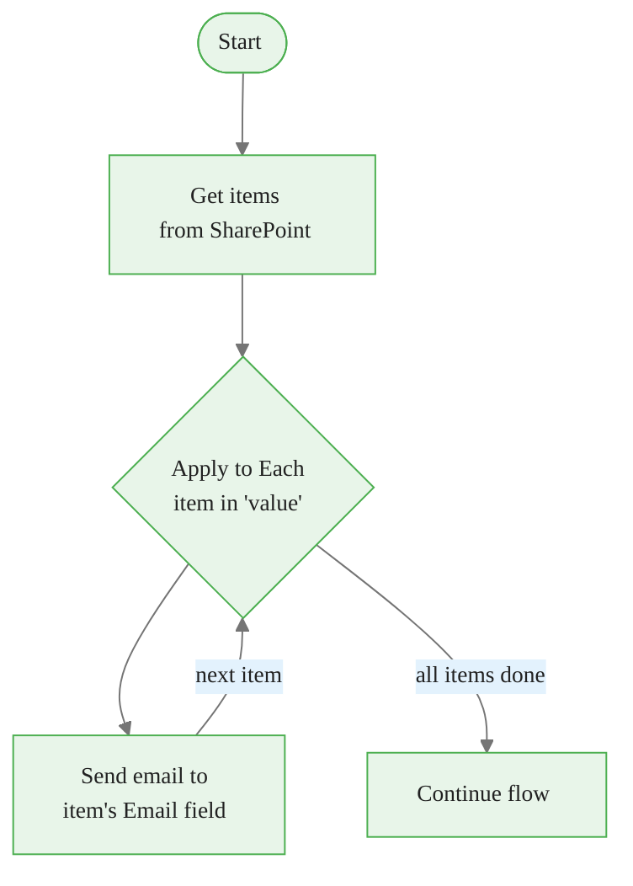
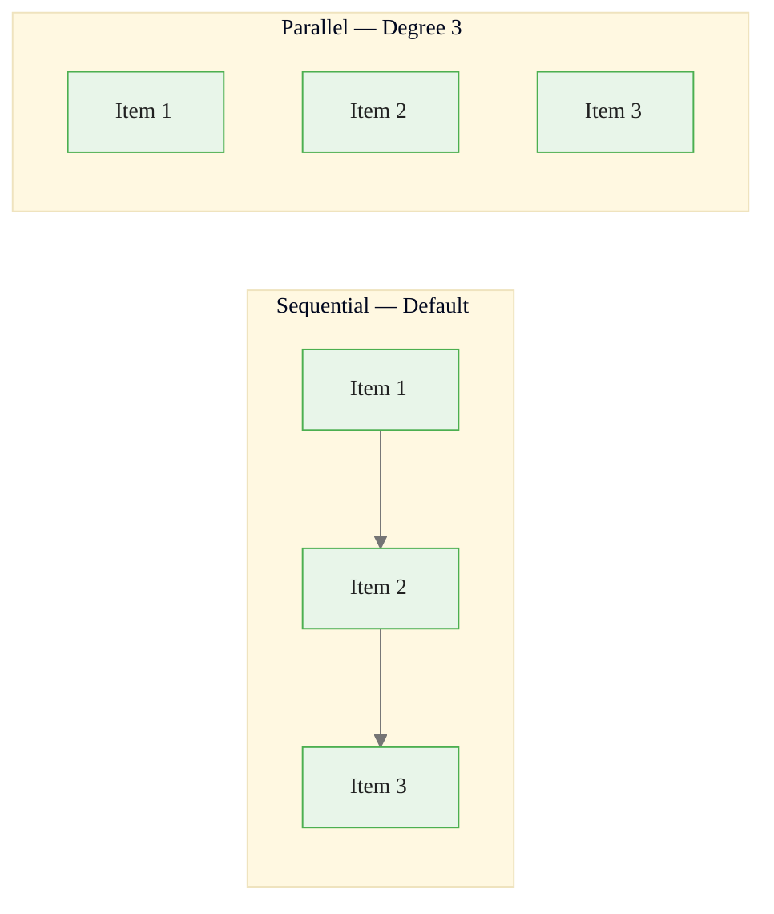
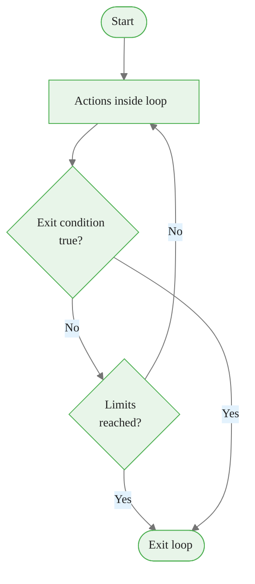
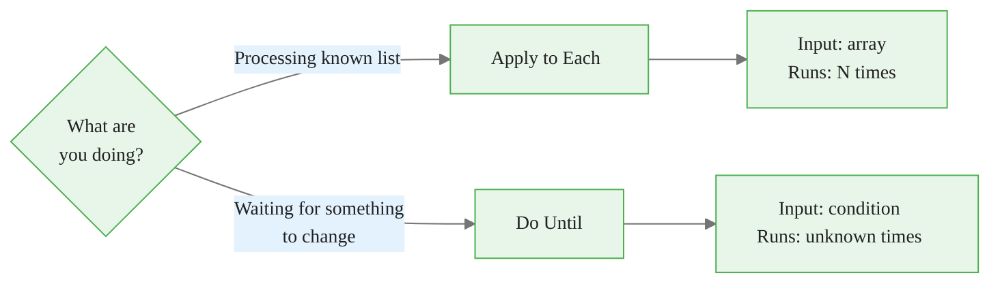
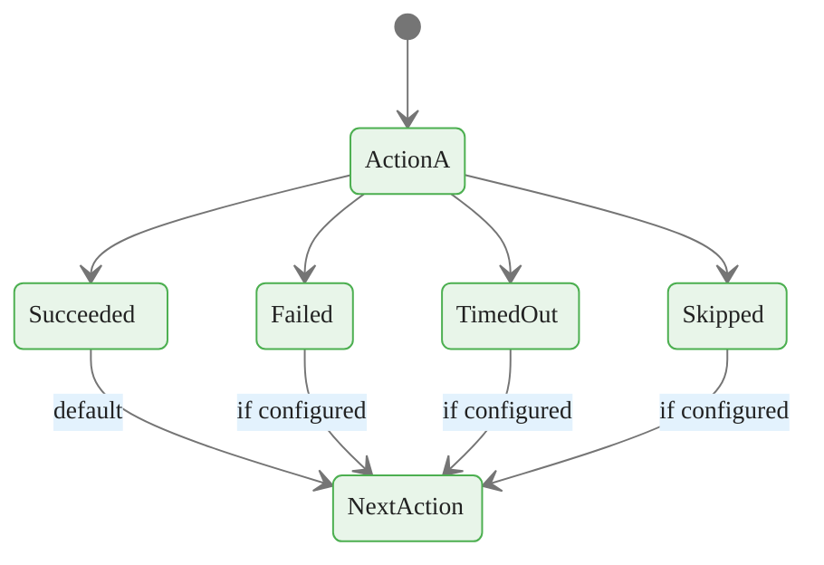
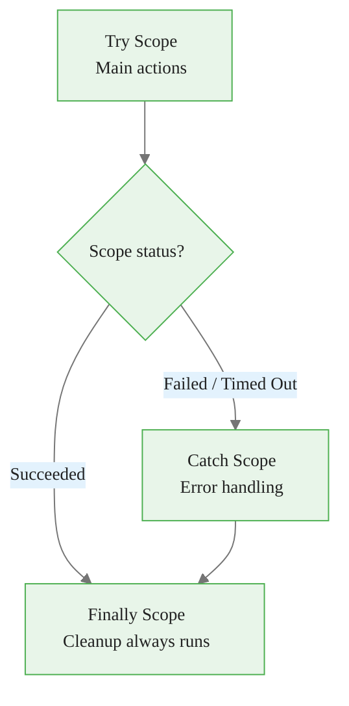
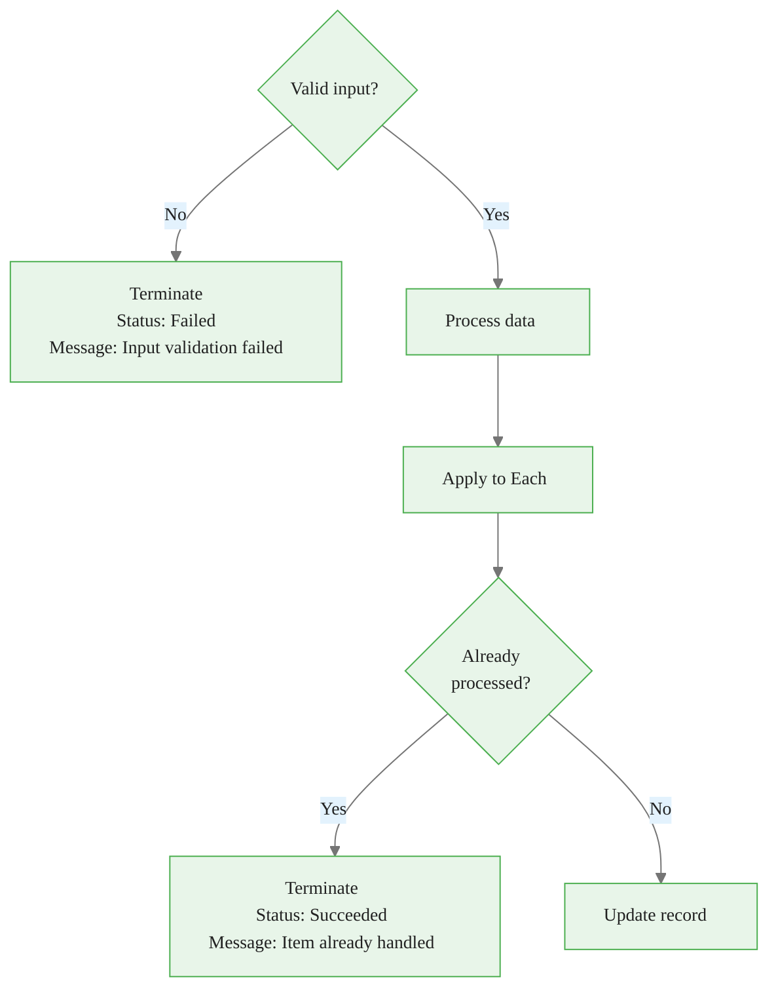
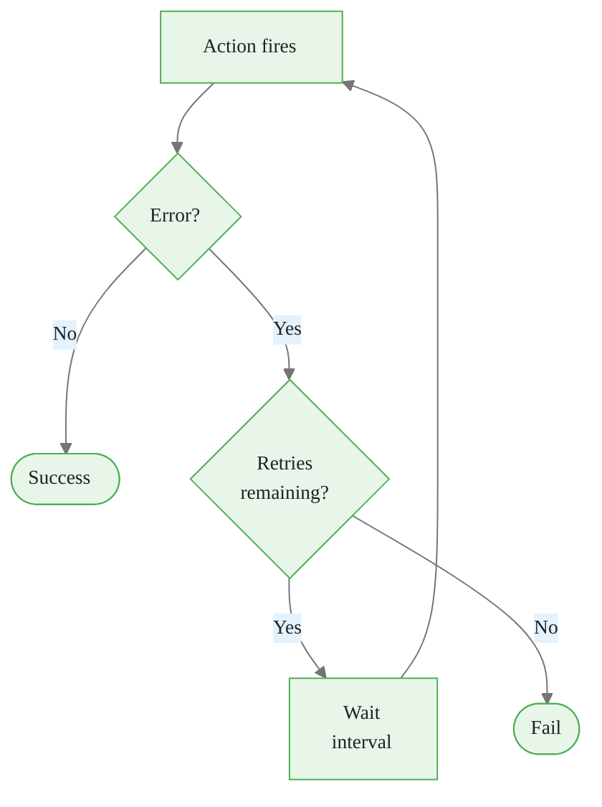

<!-- _class: lead -->

# Loops and Error Handling
## Module 04 — Control Flow in Power Automate

> A flow that handles failure gracefully is more valuable than a flow that never fails.

<!--
Speaker notes: The first half of Module 04 covered decisions — what path to take. This half covers repetition and resilience. Loops handle collections; error handling handles the unexpected. Together they make the difference between a proof-of-concept flow and one you'd trust in production.
-->

<!-- Speaker notes: Cover the key points on this slide about Loops and Error Handling. Pause for questions if the audience seems uncertain. -->

---

# What You Will Learn

- **Apply to Each** — iterate over every item in an array
- **Do Until** — repeat until a condition is true
- **Concurrency control** — process items in parallel
- **Configure Run After** — control what runs when things fail
- **Scope actions** — build try/catch/finally patterns
- **Terminate** — controlled flow ending
- **Retry policies** — automatic recovery from transient failures

<!--
Speaker notes: These seven topics form a progression. Loops handle normal repetition. Error handling tools take over when the normal path breaks. By the end you'll be able to build flows that process large datasets AND recover from failures without manual intervention.
-->


<div class="callout-insight">
<strong>Insight:</strong> This is a key takeaway from this section that connects to the broader course themes.
</div>

<!-- Speaker notes: Cover the key points on this slide about What You Will Learn. Pause for questions if the audience seems uncertain. -->

---

# Apply to Each: Process Every Item



**Input:** Any array — SharePoint results, HTTP response, array variable
**Runs:** Once per item, accessing each item's fields via **Current item** tokens

<!--
Speaker notes: The diagram shows the loop executing multiple times before continuing. "value" is the standard token name for SharePoint Get items results — the array of rows. Inside the loop, "Current item" tokens give you access to each row's fields. Walk through the example: Get items returns 50 rows, Apply to Each sends 50 emails, one per row.
-->


<div class="callout-key">
<strong>Key Point:</strong> Remember this concept — it appears repeatedly in later modules.
</div>

<!-- Speaker notes: Cover the key points on this slide about Apply to Each: Process Every Item. Pause for questions if the audience seems uncertain. -->

---

# Apply to Each — UI Walkthrough

<div class="columns">
<div>

**Step 1:** Add **Apply to each** (Built-in)

**Step 2:** Set input to the array token (e.g., `value` from Get items)

**Step 3:** Click **+ Add an action** inside the loop

**Step 4:** In action fields, select **Current item** tokens from dynamic content

> **On screen:** Dynamic content inside the loop shows a "Current item" group. These tokens refer to the current loop iteration's data, not all items.

</div>
<div>

**Accessing nested properties:**

If Current item tokens don't appear, use an expression:

```
items('Apply_to_each')?['Email']
items('Apply_to_each')?['Address']?['City']
```

The function name in parentheses matches your Apply to Each action's name (rename it for clarity).

</div>
</div>

<!--
Speaker notes: The most common beginner mistake is selecting a token from outside the loop when they meant to select Current item. The result: every email goes to the same address — the first item's address — instead of each person's address. If something looks like it's using the wrong item's data, check whether the tokens inside the loop are from the Current item group.
-->


<div class="callout-warning">
<strong>Warning:</strong> This is a common source of confusion. Pay close attention to the distinction here.
</div>

<!-- Speaker notes: Cover the key points on this slide about Apply to Each — UI Walkthrough. Pause for questions if the audience seems uncertain. -->

---

# Concurrency Control in Apply to Each



| Degree | Processing | Time for 30 items × 2s each |
|---|---|---|
| 1 (default) | Sequential | 60 seconds |
| 5 | 5 at a time | ~12 seconds |
| 50 (max) | All at once | ~2 seconds |

> **On screen:** Click **...** on Apply to Each → **Settings** → enable **Concurrency Control** → set **Degree of Parallelism**.

<!--
Speaker notes: The performance difference is dramatic. 30 items that each take 2 seconds = 60 seconds sequential vs ~2 seconds at max concurrency. BUT: concurrency is only safe when items are independent. If item processing writes to a shared variable or a single destination record, concurrent writes will conflict. Always ask: "If two iterations ran at the same time, would they interfere?" If yes, leave concurrency off.
-->


<div class="callout-info">
<strong>Info:</strong> This detail is useful context but not required to memorize.
</div>

<!-- Speaker notes: Cover the key points on this slide about Concurrency Control in Apply to Each. Pause for questions if the audience seems uncertain. -->

---

# Do Until: Loop Until Condition Is True



**Use when:** You don't know how many iterations are needed in advance.

**Examples:** Poll for job status, wait for file to appear, retry until success

<!--
Speaker notes: Do Until is the right tool when the number of iterations is unknown at flow design time. The polling pattern is very common: check a status every 30 seconds until it's "Complete." The key difference from Apply to Each — Apply to Each has a known array to iterate over; Do Until has a condition to check. The safety limits (Count and Timeout) prevent infinite loops.
-->

<!-- Speaker notes: Cover the key points on this slide about Do Until: Loop Until Condition Is True. Pause for questions if the audience seems uncertain. -->

---

# Do Until — Configuration

<div class="columns">
<div>

**Setting the exit condition:**

Same three-field layout as a Condition action:
- Left value: the variable or dynamic value to check
- Operator: `is equal to`, `is not null`, etc.
- Right value: the target state

**Example:** `Job_Status` is equal to `Completed`

</div>
<div>

**Safety limits (prevent infinite loops):**

| Setting | Default | Max |
|---|---|---|
| Count | 60 iterations | 5,000 |
| Timeout | PT1H (1 hour) | PT24H (24 hours) |

**ISO 8601 quick reference:**
- `PT30S` = 30 seconds
- `PT5M` = 5 minutes
- `PT1H` = 1 hour
- `P1D` = 1 day

> **On screen:** Click **...** on Do Until → **Settings** to adjust limits.

</div>
</div>

<!--
Speaker notes: The safety limits are non-negotiable in production. A Do Until that runs forever will eventually hit Microsoft's 30-day flow run limit, but before that it will consume your action quota and possibly cause billing issues. Count is the simpler limit — it's a hard ceiling on iterations. Timeout is a wall-clock limit — use it when you know the operation should complete within a certain time window.
-->

<!-- Speaker notes: Cover the key points on this slide about Do Until — Configuration. Pause for questions if the audience seems uncertain. -->

---

# Apply to Each vs. Do Until



<div class="columns">
<div>

**Apply to Each**
- Input is an array
- Runs exactly once per item
- Predictable duration

</div>
<div>

**Do Until**
- Input is a condition
- Runs until true or limit hit
- Duration depends on external state

</div>
</div>

<!--
Speaker notes: The decision rule is: do you have an array of things to process, or are you waiting for something to become true? Array → Apply to Each. Condition → Do Until. You can nest them: a Do Until that polls an API, then an Apply to Each inside to process the results once they arrive.
-->

<!-- Speaker notes: Cover the key points on this slide about Apply to Each vs. Do Until. Pause for questions if the audience seems uncertain. -->

---

# Configure Run After: Control the Error Path



**Default:** Every action runs only after the previous action **Succeeded**.

**Configure Run After** lets you override this for any action.

<!--
Speaker notes: This is the gateway to all error handling in Power Automate. Every action has a Run After configuration — most people never see it because the default (run after Succeeded) works for the happy path. When you need to respond to failure, you change this setting. Think of it as the "when should this action fire?" control for each step.
-->

<!-- Speaker notes: Cover the key points on this slide about Configure Run After: Control the Error Path. Pause for questions if the audience seems uncertain. -->

---

# Run After: Four States

| State | Meaning | When it happens |
|---|---|---|
| **Succeeded** | Previous action worked | Normal operation |
| **Failed** | Previous action errored | Service down, bad data, timeout |
| **Skipped** | Previous action was skipped | ITS predecessor failed |
| **Timed Out** | Previous action didn't finish in time | Slow external service |

> **On screen:** Click **...** on an action → **Configure run after** → check the states after which this action should run → **Done**.

**Three common configurations:**

- Success only (default): check **Succeeded** only
- Error handler: check **Failed** + **Timed Out**, uncheck **Succeeded**
- Always run: check **Succeeded** + **Failed** + **Timed Out**

<!--
Speaker notes: Walk through each state carefully. Succeeded is clear. Failed means the action itself threw an error — service unavailable, connection refused, HTTP 500. Skipped is the subtle one: it propagates through the flow like a chain reaction. If Action A fails, Action B (run after Succeeded) is Skipped. If Action C is also run after Succeeded only, C is also Skipped. Understanding skip propagation is key to designing error paths that actually fire.
-->

<!-- Speaker notes: Cover the key points on this slide about Run After: Four States. Pause for questions if the audience seems uncertain. -->

---

# Scope Actions: Try / Catch / Finally



<div class="columns">
<div>

**Try Scope**
Contains the actions you want to protect. If any action inside fails, the whole scope is Failed.

**Catch Scope**
Run After: Failed + Timed Out
Contains: log error, send alert, rollback

</div>
<div>

**Finally Scope**
Run After: Succeeded + Failed + Timed Out
Contains: always-run cleanup

> Use `result('Try')` expression inside Catch to access error details from the Try scope.

</div>
</div>

<!--
Speaker notes: The Scope action is the building block of structured error handling. Three scopes named Try, Catch, Finally implement the same pattern programmers know from every language. The key insight: Scope itself is just a container, but its Run After configuration is what makes it a catch or finally block. The Try scope has no special configuration — it's the Catch scope's Run After setting that defines the relationship.
-->

<!-- Speaker notes: Cover the key points on this slide about Scope Actions: Try / Catch / Finally. Pause for questions if the audience seems uncertain. -->

---

# Accessing Error Details in the Catch Scope

Inside the Catch Scope, use the `result()` expression to get error information:

```
result('Try')
```

Returns an array. Each element:
```json
{
  "name": "Get_item",
  "status": "Failed",
  "error": {
    "code": "ItemNotFound",
    "message": "The item with ID 42 was not found"
  }
}
```

**In an email body or Teams message:**
```
Error in flow: @{result('Try')[0]['error']['message']}
Failed action: @{result('Try')[0]['name']}
```

> **On screen:** In a Compose or Send email action inside the Catch scope, click **Expression** and type `result('Try')[0]['error']['message']`.

<!--
Speaker notes: Without result(), your error notifications say "something failed" with no actionable information. With result(), they say "Get item failed: The item with ID 42 was not found." The difference between investigating for 20 minutes and fixing in 2 minutes. The array index [0] gets the first failed action. Use first(result('Try')) as a safer alternative.
-->

<!-- Speaker notes: Cover the key points on this slide about Accessing Error Details in the Catch Scope. Pause for questions if the audience seems uncertain. -->

---

# Terminate: Controlled Flow Stopping



| Status | Use case |
|---|---|
| **Succeeded** | Work is done, no need to continue |
| **Failed** | Unrecoverable condition detected |
| **Cancelled** | Intentional stop, not an error |

<!--
Speaker notes: Terminate is a hard stop. Once it fires, no more actions run. It's most useful at the beginning of a flow for input validation — check that required fields exist, that IDs resolve to real items, that the request is not a duplicate. If validation fails, Terminate immediately with a clear message. This prevents confusing downstream failures that are really caused by bad inputs.
-->

<!-- Speaker notes: Cover the key points on this slide about Terminate: Controlled Flow Stopping. Pause for questions if the audience seems uncertain. -->

---

# Retry Policies: Automatic Recovery



> **On screen:** Click **...** on any action → **Settings** → **Retry Policy** section → select type.

| Policy | Behavior | Best for |
|---|---|---|
| Default | 4 retries, exponential backoff | General use |
| None | No retries | Idempotency-sensitive actions |
| Fixed interval | N retries, same wait each time | Predictable outages |
| Exponential interval | N retries, doubling wait + jitter | Throttled APIs |

<!--
Speaker notes: Retry policies are the easiest form of resilience to add — one setting change, no additional actions needed. The default policy (4 retries, exponential backoff) handles most transient failures automatically. You should set None for actions where retrying would cause a duplicate — for example, "Create item" — because if the action succeeded but the response was lost, retrying would create a second item. Use exponential interval for any public API that rate-limits requests.
-->

<!-- Speaker notes: Cover the key points on this slide about Retry Policies: Automatic Recovery. Pause for questions if the audience seems uncertain. -->

---

# Error Handling: Full Architecture

```mermaid
%%{init: {"theme": "base", "themeVariables": {"primaryColor": "#e8f5e9", "primaryBorderColor": "#4caf50", "primaryTextColor": "#212121", "secondaryColor": "#e3f2fd", "tertiaryColor": "#fff8e1", "lineColor": "#757575", "fontFamily": "Inter, sans-serif", "fontSize": "14px"}}}%%
flowchart TD
    T([Trigger]) --> TRY
    subgraph TRY [Try Scope]
        AE[Apply to Each\nwith retry policy\non inner actions]
        DU[Do Until\nfor polling]
    end
    TRY -->|Succeeded| FIN
    TRY -->|Failed / Timed Out| CAT
    subgraph CAT [Catch Scope]
        LOG[Log error details\nusing result&#40;'Try'&#41;]
        ALT[Send alert email]
        STAT[Update status: Error]
    end
    CAT --> FIN
    subgraph FIN [Finally Scope]
        TS[Write timestamp\nto audit log]
    end
```



<!--
Speaker notes: This is the complete pattern for production-grade flows. Try contains all the work. Catch handles anything that goes wrong, with access to error details via result(). Finally always runs — it's your audit trail and cleanup mechanism. Retry policies sit on individual actions inside Try, providing the first line of defense. Scope is the second line for errors that exhaust retries.
-->

<!-- Speaker notes: Cover the key points on this slide about Error Handling: Full Architecture. Pause for questions if the audience seems uncertain. -->

---

# Common Error Patterns

<div class="columns">
<div>

**Item not found**
Cause: Item deleted between trigger and action
Fix: Check existence before lookup; handle in Catch scope

**Loop runs forever**
Cause: Do Until exit variable never changes
Fix: Ensure loop body updates the condition variable; set Count limit

**Apply to Each uses wrong item**
Cause: Token from outside loop used instead of Current item
Fix: Select from Current item group in dynamic content

</div>
<div>

**Timeout on large payload**
Cause: Single action processes too much data
Fix: Enable concurrency; paginate with Do Until

**Concurrent modification conflict**
Cause: Two runs update same record simultaneously
Fix: Add retry policy (exponential); use queuing for critical data

**Skipped actions not firing**
Cause: Error path configured with wrong Run After settings
Fix: Open Configure Run After; verify Failed and Timed Out are checked

</div>
</div>

<!--
Speaker notes: These six patterns cover the majority of production issues. For each one, emphasize the diagnostic step — how do you know which pattern you're dealing with? Run history in Power Automate shows each action's status: Succeeded, Failed, Skipped, or Timed Out. That status plus the error message in the Failed action's output is usually enough to identify the pattern and apply the fix.
-->

<!-- Speaker notes: Cover the key points on this slide about Common Error Patterns. Pause for questions if the audience seems uncertain. -->

---

# Summary

<div class="columns">
<div>

**Loops**
- Apply to Each: known array, one action set per item
- Do Until: unknown count, stop when condition is true
- Concurrency control: parallel items in Apply to Each

**Terminate**
- Hard stop with status code
- Use for validation failures and early success exits

</div>
<div>

**Error Handling**
- Configure Run After: control which states trigger each action
- Scope: group actions for Try/Catch/Finally patterns
- result('ScopeName'): access error details in Catch
- Retry policies: automatic recovery from transient failures

</div>
</div>

> Build flows that process collections efficiently and recover from failure without manual intervention.

<!--
Speaker notes: Summarize the two big categories: loops for repetition, error handling for resilience. These are not advanced features — they're what separates a flow you'd trust in production from one that needs babysitting. The next module applies all of these patterns to real SharePoint and Excel automation scenarios.
-->

<!-- Speaker notes: Cover the key points on this slide about Summary. Pause for questions if the audience seems uncertain. -->
