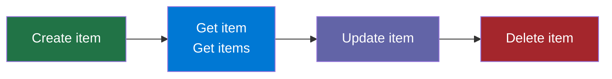

# SharePoint Integration with Power Automate

## In Brief

Power Automate has first-class support for SharePoint: you can react to list events, read and write list items, manage document libraries, and apply fine-grained OData filters — all without writing a single line of server-side code. This guide walks through every major trigger and action, column type considerations, and a complete document approval workflow.

## Learning Objectives

By the end of this guide you will be able to:

1. Choose the correct SharePoint trigger for a given automation scenario
2. Configure Get items with OData filter queries to retrieve only the rows you need
3. Handle choice, person, lookup, and managed-metadata column types correctly
4. Build a document approval workflow that routes a file through an approver and updates its status

---

## Prerequisites

- Completed Module 04 (Branching, Loops, Error Handling)
- A SharePoint site you can create lists and libraries on (any Microsoft 365 work or school account)
- Familiarity with dynamic content tokens from Module 01

---

## 1. SharePoint Triggers

A trigger is the event that fires your flow. SharePoint exposes three commonly used triggers in Power Automate.

```
SharePoint Triggers
├── When an item is created            → fires once, when a new list item is saved
├── When an item is created or modified → fires on create AND every edit
└── For a selected item                → manual trigger, user clicks "Automate" in the list view
```

### 1.1 When an item is created

Use this trigger when you only want to react to brand-new submissions — for example, sending a welcome email when someone fills out a registration form.

> **On screen:** In the flow designer, click **+ New step** → search **SharePoint** → under **Triggers**, select **When an item is created**.

```
┌────────────────────────────────────────────────────┐
│  When an item is created                        ▲  │
│  ──────────────────────────────────────────────    │
│  Site Address:  [ https://contoso.sharepoint.com ] │
│  List Name:     [ Employee Onboarding          ▼ ] │
└────────────────────────────────────────────────────┘
```

**Configuration fields:**

| Field | What to enter | Notes |
|-------|--------------|-------|
| Site Address | The root URL of your SharePoint site | Dropdown shows sites you have access to |
| List Name | The display name of the list | Dropdown populates after Site Address is set |

The trigger outputs the full item record, including all column values, the item ID, and metadata like `Created` and `Modified` timestamps.

### 1.2 When an item is created or modified

Use this when you need to respond to both new submissions and later edits — for example, syncing a SharePoint list row to an external system whenever anything changes.

> **On screen:** Same connector search as above, but select **When an item is created or modified**.

This trigger fires once per save event. If a user opens an item and saves it without changing anything, the trigger still fires. Design your downstream logic to be idempotent where possible.

### 1.3 For a selected item

This trigger places an **Automate** button in the SharePoint list's command bar. A user selects one or more rows, then clicks that button to launch the flow manually.

> **On screen:** Select **For a selected item**. The trigger requires **Site Address** and **List Name** exactly as the other two triggers do, but also lets you define **User inputs** — text or number fields the user fills in when they click the button.

```
┌────────────────────────────────────────────────────────┐
│  For a selected item                               ▲   │
│  ────────────────────────────────────────────────────  │
│  Site Address:  [ https://contoso.sharepoint.com ]     │
│  List Name:     [ Project Requests             ▼ ]     │
│  ────────────────────────────────────────────────────  │
│  User inputs (optional)                                 │
│  + Add input                                            │
└────────────────────────────────────────────────────────┘
```

**When to use each trigger:**

| Scenario | Best trigger |
|----------|-------------|
| New expense report submitted | When an item is created |
| Keep CRM in sync with SharePoint contact list | When an item is created or modified |
| Ad-hoc action on a selected record | For a selected item |
| Process only rows where Status = "Pending" | When an item is created or modified + Condition |

---

## 2. SharePoint Actions — CRUD on List Items

Power Automate exposes the full create-read-update-delete set for SharePoint list items.



### 2.1 Create item

Adds a new row to a SharePoint list.

> **On screen:** Click **+ New step** → search **SharePoint** → select **Create item**.

```
┌────────────────────────────────────────────────────┐
│  Create item                                    ▲  │
│  ──────────────────────────────────────────────    │
│  Site Address:  [ https://contoso.sharepoint.com ] │
│  List Name:     [ Expense Reports           ▼ ]    │
│  ─ Dynamic fields appear after List Name is set ─  │
│  Title:         [ [Email Subject]           ]      │
│  Amount:        [ [Form Amount]             ]      │
│  SubmittedBy:   [ [Trigger User Email]      ]      │
└────────────────────────────────────────────────────┘
```

After you select the list, every column in that list appears as a field. Required columns are marked with a red asterisk.

### 2.2 Get item

Retrieves a single list item by its numeric ID.

> **On screen:** Select **Get item** (singular). Enter **Site Address**, **List Name**, and **Id** (an integer — usually a dynamic token from the trigger or a previous step).

Use this when you already know the exact row ID — for example, inside a loop that is processing items by ID.

### 2.3 Get items

Retrieves multiple list items. This is the workhorse action for reading SharePoint data.

> **On screen:** Select **Get items** (plural). After entering Site Address and List Name, expand **Show advanced options** to access the filter and limit controls.

```
┌─────────────────────────────────────────────────────────┐
│  Get items                                           ▲  │
│  ─────────────────────────────────────────────────────  │
│  Site Address:   [ https://contoso.sharepoint.com ]     │
│  List Name:      [ Expense Reports              ▼ ]     │
│  ▼ Show advanced options                                 │
│  ─────────────────────────────────────────────────────  │
│  Filter Query:   [ Status eq 'Pending'          ]       │
│  Order By:       [ Created desc                 ]       │
│  Top Count:      [ 100                          ]       │
│  Limit Columns:  [ Id,Title,Amount,Status       ]       │
└─────────────────────────────────────────────────────────┘
```

**Advanced options explained:**

| Field | Purpose | Example |
|-------|---------|---------|
| Filter Query | OData `$filter` expression — server-side filtering | `Status eq 'Approved'` |
| Order By | OData `$orderby` expression | `Created desc` |
| Top Count | Maximum rows to return (default 100, max 5000 for indexed columns) | `500` |
| Limit Columns by View | Only retrieve columns from a specific view — improves performance | Select a view |

> The **Get items** action returns a `value` array. Wrap it in an **Apply to each** loop to process individual rows.

### 2.4 Update item

Modifies one or more columns of an existing list item.

> **On screen:** Select **Update item**. Enter Site Address, List Name, and the **Id** of the row to update. Only the columns you explicitly populate will be changed — all other columns retain their current values.

```
┌────────────────────────────────────────────────────┐
│  Update item                                    ▲  │
│  ──────────────────────────────────────────────    │
│  Site Address:  [ https://contoso.sharepoint.com ] │
│  List Name:     [ Expense Reports           ▼ ]    │
│  Id:            [ [items('Apply_to_each')?['ID']]  │
│  Status:        [ Approved                  ]      │
│  ApprovedBy:    [ [Approver Email]          ]      │
└────────────────────────────────────────────────────┘
```

### 2.5 Delete item

Permanently removes a list item by ID.

> **On screen:** Select **Delete item**. Enter Site Address, List Name, and Id.

There is no recycle-bin safety net through the Power Automate action — the item is deleted immediately. Consider updating a `Status` column to "Archived" instead of deleting unless permanent removal is the explicit requirement.

---

## 3. SharePoint OData Filter Queries

OData filters run on the SharePoint server before results are returned to your flow. Filtering server-side is always faster and cheaper than retrieving all items and filtering with a **Condition** action.

### 3.1 Basic syntax

```
ColumnInternalName operator 'value'
```

The column name must be the **internal name** (the programmatic name SharePoint uses internally), not the display name. You can find internal names by navigating to **List Settings → Column name → check the URL**.

### 3.2 Comparison operators

| Operator | Meaning | Example |
|----------|---------|---------|
| `eq` | Equal | `Status eq 'Pending'` |
| `ne` | Not equal | `Status ne 'Cancelled'` |
| `gt` | Greater than | `Amount gt 1000` |
| `ge` | Greater than or equal | `Amount ge 500` |
| `lt` | Less than | `Priority lt 3` |
| `le` | Less than or equal | `DueDate le '2024-12-31T00:00:00Z'` |

### 3.3 Logical operators

Combine multiple conditions with `and` and `or`:

```
Status eq 'Pending' and Amount gt 500
```

```
Department eq 'Finance' or Department eq 'Legal'
```

Use parentheses to control precedence:

```
(Status eq 'Pending' or Status eq 'In Review') and Priority le 2
```

### 3.4 String functions

| Function | Example | Matches |
|----------|---------|---------|
| `startswith` | `startswith(Title, 'Q4')` | Items whose title starts with "Q4" |
| `substringof` | `substringof('urgent', Title)` | Items whose title contains "urgent" |

> `substringof` is the OData v3 syntax SharePoint uses. Modern OData uses `contains()` — do not use that syntax here.

### 3.5 Date filtering

Use ISO 8601 format for date values:

```
Created ge '2024-01-01T00:00:00Z'
```

To filter relative to today, use the `utcNow()` expression function in the filter string:

```
Modified ge '@{addDays(utcNow(), -7)}'
```

> **On screen:** In the Filter Query field, type the expression string. When you need to embed a dynamic value (like today's date), click the expression editor icon (fx) and build the expression, or type it directly using the `@{...}` interpolation syntax.

### 3.6 Filtering on lookup and choice columns

For **choice** columns, filter on the text value directly:

```
Status eq 'Approved'
```

For **lookup** columns, filter on the lookup ID:

```
DepartmentId eq 5
```

For **person** columns (People Picker), filter on the person's email:

```
AssignedTo/EMail eq 'user@contoso.com'
```

---

## 4. Working with SharePoint Document Libraries

Document libraries store files. Power Automate provides separate actions for file content and file metadata.

### 4.1 Get file content

Retrieves the binary content of a file. Use this before sending a file as an email attachment or uploading it to another system.

> **On screen:** Select **Get file content**. The **File Identifier** field accepts either a file path (e.g., `/sites/Finance/Shared Documents/Report.xlsx`) or the file's unique identifier token from a trigger.

```
┌────────────────────────────────────────────────────┐
│  Get file content                               ▲  │
│  ──────────────────────────────────────────────    │
│  Site Address:     [ https://contoso.sharepoint.com│
│  File Identifier:  [ /sites/Finance/Shared         │
│                      Documents/Q4Report.xlsx ]     │
└────────────────────────────────────────────────────┘
```

The output token is **File Content**, which is a binary blob. Pass it directly to email attachments (`Attachments Content`) or file-creation actions.

### 4.2 Create file

Uploads a new file to a document library.

> **On screen:** Select **Create file**. Specify Site Address, the **Folder Path** (e.g., `/Shared Documents/Reports`), the **File Name**, and the **File Content** (binary content from a prior step or an expression).

```
┌────────────────────────────────────────────────────┐
│  Create file                                    ▲  │
│  ──────────────────────────────────────────────    │
│  Site Address:  [ https://contoso.sharepoint.com ] │
│  Folder Path:   [ /Shared Documents/Processed  ]   │
│  File Name:     [ [Trigger File Name]          ]   │
│  File Content:  [ [Get file content - File Content]│
└────────────────────────────────────────────────────┘
```

### 4.3 Update file properties

Updates the metadata columns of a file (not the file content itself).

> **On screen:** Select **Update file properties**. This action works identically to **Update item** but targets a document library.

Use **Get file properties** first to retrieve the file's `{ID}` token, then pass that ID into **Update file properties**.

### 4.4 Document library trigger

When a file is created or modified in a library:

> **On screen:** Use **When a file is created or modified (properties only)** trigger. This fires on file uploads and metadata edits but does not retrieve file content automatically — use **Get file content** as a next step.

---

## 5. SharePoint Column Types — Handling in Power Automate

Different column types require different treatment when reading or writing values.

### 5.1 Choice column

A choice column stores a single selection from a predefined list.

**Reading:** The value comes back as a plain string: `"Approved"`, `"Pending"`, `"Rejected"`.

**Writing:** Pass the string value directly into the column field:

```
Status: Approved
```

For multi-select choice columns, the value is a semicolon-delimited string: `"Red;Blue;Green"`.

### 5.2 Person or Group column (People Picker)

**Reading:** The value is an object with sub-properties. Access them using the `?['DisplayName']`, `?['Email']`, or `?['Id']` notation:

```
[Assigned To Email]     → body/AssignedTo/Email
[Assigned To Name]      → body/AssignedTo/DisplayName
```

**Writing:** Pass a person object. The easiest method is to use the **Office 365 Users** connector to look up a person first, then pass their ID:

```
AssignedTo Claims: i:0#.f|membership|user@contoso.com
```

Or use the format `[{"claims": "i:0#.f|membership|user@contoso.com", "displayName": "First Last"}]` when the column expects an array.

> **Practical tip:** Use **Send an HTTP request to SharePoint** or the **Office 365 Users — Get user profile (V2)** action to resolve a display name to a claims string before writing to a person column.

### 5.3 Lookup column

A lookup column references an item in another list.

**Reading:** Returns `LookupId` (an integer) and `LookupValue` (the display text).

**Writing:** Provide the numeric ID of the item being looked up:

```
DepartmentId: 5
```

The `LookupId` and `LookupValue` tokens appear in the dynamic content panel under the `body` of the action.

### 5.4 Managed Metadata column (Term Store)

**Reading:** Returns an object with `Label` (the term label) and `TermGuid` (a GUID string).

**Writing:** This column type cannot be written to via the standard **Create item / Update item** actions because they do not support the required Term Store format. Use the **Send an HTTP request to SharePoint** action with a REST call to the `/_api/web/lists/getbytitle(...)` endpoint instead, passing the taxonomy field in the correct format.

> **On screen:** Select **Send an HTTP request to SharePoint** → Method: `POST` or `PATCH` → URI: `_api/web/lists/getbytitle('YourList')/items([ID])` → Headers: `{"Content-Type": "application/json;odata=verbose", "IF-MATCH": "*", "X-HTTP-Method": "MERGE"}` → Body: `{"__metadata":{"type":"SP.Data.YourListListItem"},"YourTaxFieldId":{"__metadata":{"type":"SP.Taxonomy.TaxonomyFieldValue"},"Label":"Your Term","TermGuid":"...","WssId":-1}}`

---

## 6. Build a Document Approval Workflow

This workflow monitors a SharePoint document library. When a new file is uploaded, it emails the designated approver, waits for their response, and updates the document's approval status.

### Architecture overview

```
New file uploaded to library
         ↓
Get file properties (retrieve metadata)
         ↓
Start and wait for an approval
         ↓
    ┌────────────────────┐
    │  Approved?         │
    ├─── Yes ────────────┤
    │  Update Status     │
    │  = "Approved"      │
    │  Send approval     │
    │  confirmation email│
    ├─── No ─────────────┤
    │  Update Status     │
    │  = "Rejected"      │
    │  Send rejection    │
    │  email with notes  │
    └────────────────────┘
```

### Step 1 — Set up the library

Before building the flow, add two columns to your document library:

| Column | Type | Purpose |
|--------|------|---------|
| `ApprovalStatus` | Choice: Pending / Approved / Rejected | Tracks the approval state |
| `ApprovalNotes` | Multiple lines of text | Stores the approver's comments |

> **On screen:** Go to your SharePoint document library → **+ Add column** → Choice → Name it `ApprovalStatus` → add the three choices.

### Step 2 — Create the flow

> **On screen:** In Power Automate: **+ Create** → **Automated cloud flow** → Search for trigger: **When a file is created (properties only)** → select it → click **Create**.

```
┌────────────────────────────────────────────────────────────────┐
│  When a file is created (properties only)                   ▲  │
│  ────────────────────────────────────────────────────────────  │
│  Site Address:  [ https://contoso.sharepoint.com           ]   │
│  Library Name:  [ Contracts for Approval                 ▼ ]   │
└────────────────────────────────────────────────────────────────┘
```

### Step 3 — Set initial status to Pending

> **On screen:** Click **+ New step** → **SharePoint** → **Update file properties**.

```
┌─────────────────────────────────────────────────────────────────┐
│  Update file properties                                      ▲  │
│  ─────────────────────────────────────────────────────────────  │
│  Site Address:    [ https://contoso.sharepoint.com           ]  │
│  Library Name:    [ Contracts for Approval                 ▼ ]  │
│  Id:              [ [Trigger body/ID]                        ]  │
│  ApprovalStatus:  [ Pending                                  ]  │
└─────────────────────────────────────────────────────────────────┘
```

### Step 4 — Start the approval

> **On screen:** Click **+ New step** → search **Approvals** → select **Start and wait for an approval**.

```
┌─────────────────────────────────────────────────────────────────┐
│  Start and wait for an approval                              ▲  │
│  ─────────────────────────────────────────────────────────────  │
│  Approval type:   [ Approve/Reject - First to respond       ▼ ] │
│  Title:           [ Please review: [Trigger Name]           ]   │
│  Assigned to:     [ approver@contoso.com                    ]   │
│  Details:         [ File uploaded by [Trigger Created By    ]   │
│                     on [Trigger Created]                    ]   │
│  Item link:       [ [Trigger Link to item]                  ]   │
│  Item link desc:  [ Open file in SharePoint                 ]   │
└─────────────────────────────────────────────────────────────────┘
```

**Approval types:**

| Type | Behaviour |
|------|-----------|
| Approve/Reject — First to respond | Multiple approvers, first response wins |
| Approve/Reject — Everyone must approve | All listed approvers must respond |
| Custom responses | Define your own response options (e.g., "Approve", "Request Changes", "Reject") |

> The flow **pauses** at this step until the approver clicks Approve or Reject in their email or in the Approvals portal. There is no timeout unless you implement one with a **Parallel branch** and a **Delay** action.

### Step 5 — Branch on the outcome

> **On screen:** Click **+ New step** → **Condition**.

```
┌──────────────────────────────────────────────────────────────────┐
│  Condition                                                    ▲  │
│  ────────────────────────────────────────────────────────────    │
│  [Approval Outcome]    [is equal to]    [Approve]                │
│                                                                  │
│  ┌─── If yes ──────────┐  ┌─── If no ───────────┐               │
│  │  Update file props  │  │  Update file props  │               │
│  │  Status: Approved   │  │  Status: Rejected   │               │
│  │  Send email         │  │  Send email         │               │
│  │  "File approved"    │  │  "File rejected"    │               │
│  └─────────────────────┘  └─────────────────────┘               │
└──────────────────────────────────────────────────────────────────┘
```

The **Approval Outcome** token comes from the "Start and wait for an approval" step in the dynamic content panel. Its value is the string `"Approve"` or `"Reject"`.

### Step 6 — Update the status and notify the uploader

**In the "If yes" branch:**

1. Add **Update file properties** → set `ApprovalStatus` to `Approved`, set `ApprovalNotes` to `[Approval Comments]` from the dynamic content panel.
2. Add **Send an email (V2)** → To: `[Trigger Created By Email]` → Subject: `Your file has been approved` → Body includes the file name and approver's comments.

**In the "If no" branch:**

1. Add **Update file properties** → set `ApprovalStatus` to `Rejected`, set `ApprovalNotes` to `[Approval Comments]`.
2. Add **Send an email (V2)** → To: `[Trigger Created By Email]` → Subject: `Your file requires changes` → Body includes the approver's comments.

### Step 7 — Save and test

> **On screen:** Click **Save** (top toolbar). Then upload a test file to the library. The flow triggers automatically within 30 seconds. Check your approver's inbox for the approval email, click Approve or Reject, and verify the file's `ApprovalStatus` column updates in SharePoint.

---

## 7. Common Pitfalls

- **Internal column names vs display names in OData filters:** If the OData filter returns 0 results unexpectedly, check that you are using the column's internal name. A column called "Assigned To" may have the internal name `AssignedTo0` or `Assigned_x0020_To`.
- **Get items returns only 100 rows by default:** Set the Top Count to the maximum you expect, and use a filter to avoid fetching unnecessary data. For lists over 5,000 items, columns used in Filter Query must be indexed.
- **Person column writes fail with 400 Bad Request:** The claims string format `i:0#.f|membership|user@domain.com` is required. Use the **Office 365 Users** connector to resolve emails to user objects before writing.
- **Approval flow runs indefinitely:** Add a parallel branch with a **Delay** (e.g., 3 days) and a **Cancel an approval** action if the approval has not completed, then send a reminder email.
- **Managed metadata cannot be written via standard actions:** Use **Send an HTTP request to SharePoint** with the taxonomy format described in section 5.4.

## Connections

- **Builds on:** Module 04 — Condition, Apply to each, error handling scope
- **Leads to:** Module 06 — Advanced approval flows with multiple levels and escalation
- **Related to:** Module 02 — Trigger types and connector authentication

## Further Reading

- [SharePoint connector reference (Microsoft Docs)](https://learn.microsoft.com/en-us/connectors/sharepointonline/)
- [OData query operations supported in SharePoint REST API](https://learn.microsoft.com/en-us/sharepoint/dev/sp-add-ins/use-odata-query-operations-in-sharepoint-rest-requests)
- [Work with lists and list items with REST](https://learn.microsoft.com/en-us/sharepoint/dev/sp-add-ins/working-with-lists-and-list-items-with-rest)
