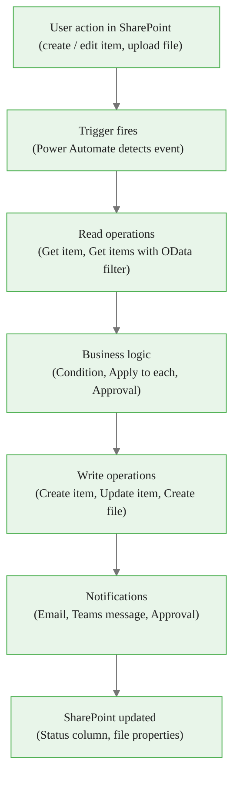
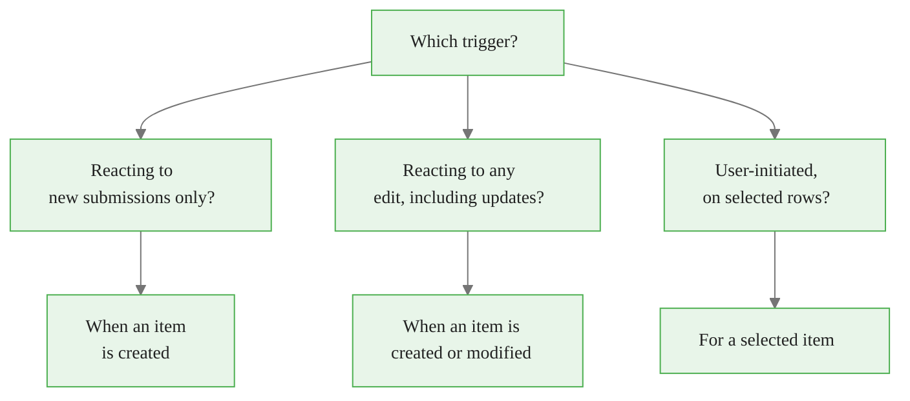
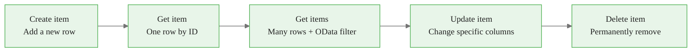
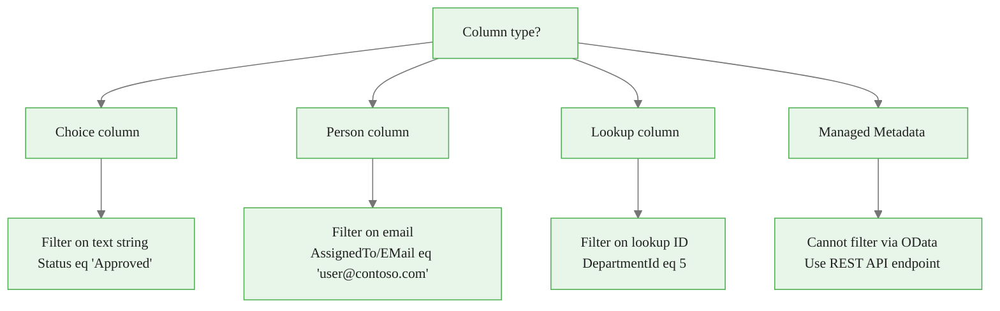
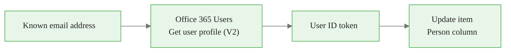
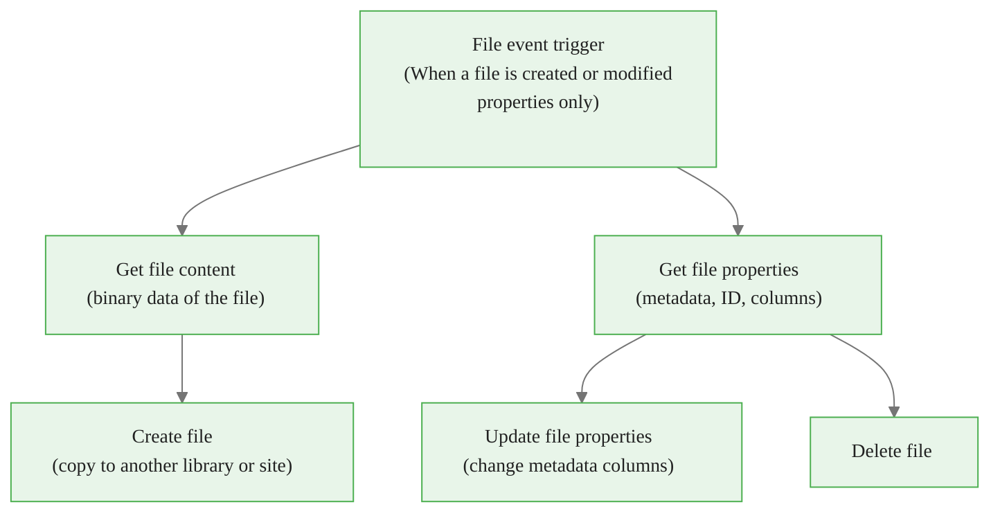
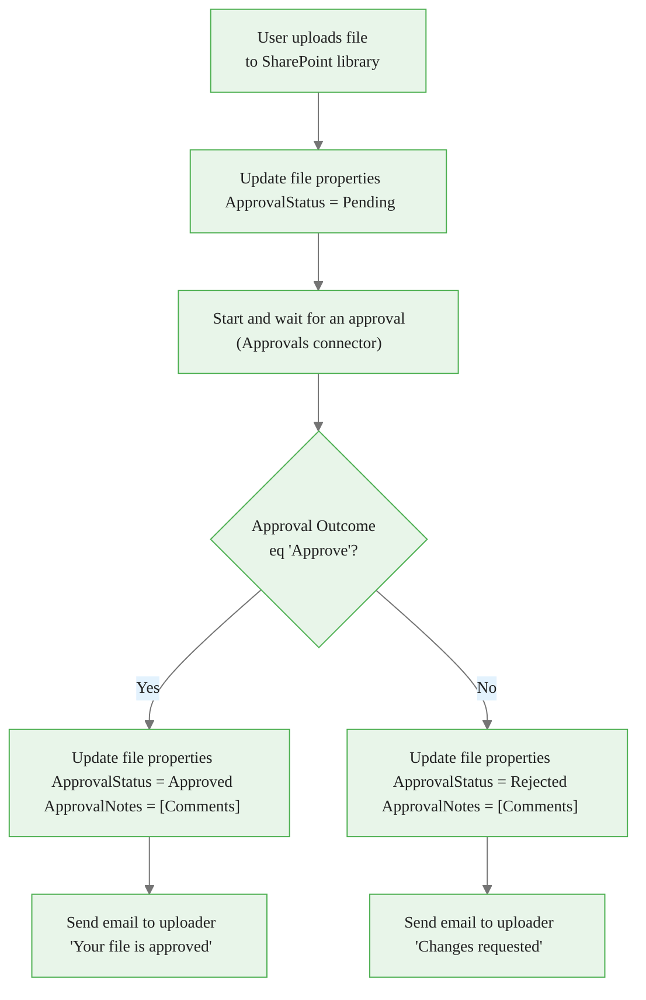
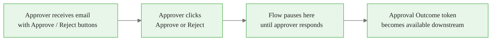
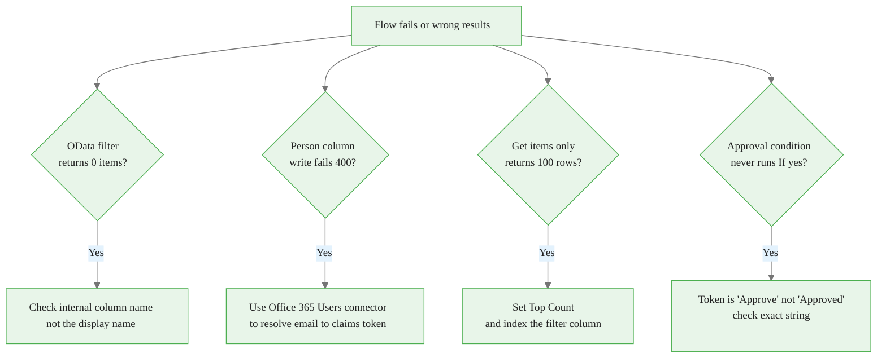
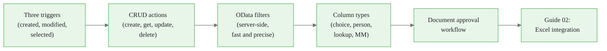

<!-- _class: lead -->

# SharePoint Integration with Power Automate

**Module 05 — Working with SharePoint and Excel**

> SharePoint is the backbone of Microsoft 365 collaboration. Power Automate turns list events and document uploads into automated workflows — without any server code.

<!--
Speaker notes: Welcome to Module 05. This deck covers the full SharePoint integration story: triggers that react to list events, all four CRUD actions, OData filtering, document library operations, and a complete document approval workflow. By the end of this deck learners will be able to build production-ready SharePoint automations. No server-side code or SharePoint app development knowledge is required.
-->

<!-- Speaker notes: Cover the key points on this slide about SharePoint Integration with Power Automate. Pause for questions if the audience seems uncertain. -->

---

# SharePoint and Power Automate Data Lifecycle



<!--
Speaker notes: This diagram is the mental model for the entire module. Data enters from the left (a user does something in SharePoint), Power Automate reacts, processes, writes back, and notifies people. Every flow in this module follows this left-to-right lifecycle. Keep returning to this diagram when learners ask "where does this fit?".
-->


<div class="callout-insight">
<strong>Insight:</strong> This is a key takeaway from this section that connects to the broader course themes.
</div>

<!-- Speaker notes: Cover the key points on this slide about SharePoint and Power Automate Data Lifecycle. Pause for questions if the audience seems uncertain. -->

---

# Three SharePoint Triggers



| Trigger | Fires when | Typical use |
|---------|-----------|-------------|
| When an item is created | A new list row is saved | Registration, intake forms |
| When an item is created or modified | Any save on any row | Sync to external systems |
| For a selected item | User clicks Automate button | Ad-hoc per-row actions |

<!--
Speaker notes: The decision tree replaces a wall of text. Ask learners: if you are syncing a SharePoint contacts list to Salesforce, which trigger do you pick? Answer: created or modified — you need to capture edits too. If you are sending a welcome pack to new hires, which trigger? Answer: created only — you do not want to resend the welcome pack every time the HR manager edits the row. Spend one minute on each trigger before moving to CRUD actions.
-->


<div class="callout-key">
<strong>Key Point:</strong> Remember this concept — it appears repeatedly in later modules.
</div>

<!-- Speaker notes: Cover the key points on this slide about Three SharePoint Triggers. Pause for questions if the audience seems uncertain. -->

---

# CRUD Operations: The Complete Picture



**Key rule:** `Get items` returns an **array** — always wrap downstream processing in **Apply to each**.

```
Get items (returns array)
    └── Apply to each → [value]
            ├── Update item  (process row N)
            └── Send email   (notify about row N)
```

<!--
Speaker notes: Emphasise the Get items → Apply to each pairing. It trips up nearly every beginner. Get items does not return one item — it returns a collection. The dynamic content token to feed into Apply to each is `value` (the entire array output from Get items). If learners feed a single field instead of the array, Apply to each will iterate over individual characters. Show the correct token selection explicitly.
-->


<div class="callout-warning">
<strong>Warning:</strong> This is a common source of confusion. Pay close attention to the distinction here.
</div>

<!-- Speaker notes: Cover the key points on this slide about CRUD Operations: The Complete Picture. Pause for questions if the audience seems uncertain. -->

---

# OData Filter Syntax Reference

OData filters run on the **SharePoint server** — only matching rows travel over the network to your flow.

<div class="columns">

**Comparison**
```
Status eq 'Pending'
Amount gt 1000
DueDate le '2024-12-31T00:00:00Z'
Priority ne 3
```

**Logic**
```
Status eq 'Pending' and Amount gt 500

Department eq 'Finance'
  or Department eq 'Legal'

(Status eq 'Pending'
  or Status eq 'In Review')
  and Priority le 2
```

</div>

**String functions:**

| Function | Example |
|----------|---------|
| `startswith` | `startswith(Title, 'Q4')` |
| `substringof` | `substringof('urgent', Title)` |

<!--
Speaker notes: The most important rule: OData uses the column INTERNAL name, not the display name. "Assigned To" in the UI might be "AssignedTo0" or "Assigned_x0020_To" internally. Find it via List Settings → click the column → look at the URL. A missing or wrong column name returns 0 results silently, which learners mistakenly interpret as "there are no matching items." Also: dates must be ISO 8601 format with a Z suffix. The common mistake is writing "2024-01-01" without the time and Z, which causes a 400 error.
-->


<div class="callout-info">
<strong>Info:</strong> This detail is useful context but not required to memorize.
</div>

<!-- Speaker notes: Cover the key points on this slide about OData Filter Syntax Reference. Pause for questions if the audience seems uncertain. -->

---

# OData: Special Column Types



<!--
Speaker notes: Four column types, four different filter approaches. Choice is the simplest — plain string match. Person columns require the slash notation to access the Email sub-property. Lookup columns require the numeric ID, which learners often do not know offhand — they may need a Get items call on the lookup list first to resolve a name to an ID. Managed metadata cannot be filtered via standard OData at all — this is a known SharePoint limitation. If a learner needs to filter on a taxonomy column, they need to use the REST API directly.
-->

<!-- Speaker notes: Cover the key points on this slide about OData: Special Column Types. Pause for questions if the audience seems uncertain. -->

---

# Writing to Special Column Types

| Column type | How to write in Power Automate |
|-------------|-------------------------------|
| Choice (single) | Pass the choice string: `Approved` |
| Choice (multi) | Semicolon-delimited: `Red;Blue;Green` |
| Person | Claims string: `i:0#.f|membership|user@contoso.com` |
| Lookup | Pass the numeric lookup item ID: `5` |
| Managed Metadata | Use **Send an HTTP request to SharePoint** with taxonomy JSON |

**Resolving a person to a claims string:**



<!--
Speaker notes: The person column is the most common pain point. Learners think they can just type an email into the person column field and it will work. It does not — SharePoint requires the claims token format, which looks like "i:0#.f|membership|jane@contoso.com". The cleanest solution is the Office 365 Users connector: feed it the email address, get back a user profile object, then use the ID from that object as the value for the person column. Walk through the diagram step by step. Managed metadata is an advanced topic — flag it as "use the HTTP action" and move on.
-->

<!-- Speaker notes: Cover the key points on this slide about Writing to Special Column Types. Pause for questions if the audience seems uncertain. -->

---

# Document Library Actions



> The file trigger gives you **properties only** — you must explicitly call **Get file content** to retrieve binary data.

<!--
Speaker notes: The key insight here is the split between properties and content. The trigger (and Get file properties) gives you columns and metadata — things like the file name, who uploaded it, custom columns you added to the library. To actually get the bytes of the file — so you can attach it to an email or copy it somewhere — you need a separate Get file content step. This is different from list items where Get items gives you everything. Emphasise this split or learners will be confused why the email attachment is empty.
-->

<!-- Speaker notes: Cover the key points on this slide about Document Library Actions. Pause for questions if the audience seems uncertain. -->

---

<!-- _class: lead -->

# Document Approval Workflow

**Architecture deep dive**

<!--
Speaker notes: This is the capstone example for the module. We will walk through every step of building a document approval workflow. This pattern appears in virtually every enterprise that uses SharePoint — contracts, policies, HR documents, financial reports all go through approval cycles. By the end of this section learners will have a complete, working approval flow they can adapt to any document type.
-->

<!-- Speaker notes: Cover the key points on this slide about Document Approval Workflow. Pause for questions if the audience seems uncertain. -->

---

# Approval Workflow Architecture



<!--
Speaker notes: Walk through the architecture before touching the flow designer. Label each box: the trigger is passive (Power Automate watches the library), the initial status update is defensive programming (set to Pending before sending for approval so you do not accidentally leave a file with no status), the approval step PAUSES the flow, the condition reads the Approval Outcome token, and the two branches update the file and notify the uploader. There are no loops in this flow — it is a straight line that branches once.
-->

<!-- Speaker notes: Cover the key points on this slide about Approval Workflow Architecture. Pause for questions if the audience seems uncertain. -->

---

# Start and Wait for an Approval



**Approval types:**

| Type | Behaviour |
|------|-----------|
| First to respond | Multiple approvers listed; whoever responds first, wins |
| Everyone must approve | All approvers must click Approve or it rejects |
| Custom responses | Define your own options: Approve / Request Changes / Reject |

> Without a timeout, the flow waits **indefinitely**. Add a **Parallel branch** with a **Delay** + **Cancel approval** + reminder email for production flows.

<!--
Speaker notes: The "flow pauses" behaviour surprises learners who expect it to continue immediately. It does not. The flow is literally suspended in the cloud until a human responds. This means the flow can wait minutes, hours, or weeks. In production, you must handle the "what if the approver goes on vacation" scenario — that is the Parallel branch + Delay + Cancel approval pattern mentioned in the callout. For the exercise in this module, learners will build the basic version first and add the timeout as an extension task.
-->

<!-- Speaker notes: Cover the key points on this slide about Start and Wait for an Approval. Pause for questions if the audience seems uncertain. -->

---

# Approval: Reading the Outcome

After the approval step, these tokens are available in the dynamic content panel:

| Token | Value | Use |
|-------|-------|-----|
| `Outcome` | `"Approve"` or `"Reject"` | Drive the Condition action |
| `Comments` | Approver's typed notes | Save to `ApprovalNotes` column |
| `Response summary` | Combined response from all approvers | Use with multi-approver flows |
| `Responses Approver name` | Who responded | Audit trail |
| `Responses Request date` | When they responded | Audit trail |

**Condition configuration:**

```
[Outcome]    [is equal to]    Approve
```

<!--
Speaker notes: Learners often forget to use the Outcome token and instead try to test the Comments field. Comments can be blank — the approver is not required to enter notes. Always branch on Outcome. The value is the string "Approve" (capital A, no trailing space) or "Reject". If you have configured Custom responses, the Outcome will be whatever string you defined. One common mistake: learners type "Approved" (past tense) in the Condition — the token value is "Approve" (present tense as shown on the button). This silent mismatch causes the "if yes" branch to never run.
-->

<!-- Speaker notes: Cover the key points on this slide about Approval: Reading the Outcome. Pause for questions if the audience seems uncertain. -->

---

# Common SharePoint Flow Mistakes



<!--
Speaker notes: This diagnostic tree maps each symptom to its fix. Spend time on each node. The 100-row limit is particularly sneaky — the flow succeeds, it does not error out, but it silently ignores everything after the 100th row. The fix is two things together: set Top Count to the real maximum AND make sure the filter column is indexed in SharePoint (List Settings → Indexed Columns) or SharePoint will refuse to filter on it for large lists. The approval condition string mismatch ("Approve" vs "Approved") is responsible for a disproportionate number of forum questions.
-->

<!-- Speaker notes: Cover the key points on this slide about Common SharePoint Flow Mistakes. Pause for questions if the audience seems uncertain. -->

---

# Summary and What Is Next



**You can now:**
- Choose the right SharePoint trigger for any scenario
- Read and write list items and document library files
- Write OData filter queries to retrieve exactly the rows you need
- Handle choice, person, lookup, and managed-metadata columns correctly
- Build a complete document approval workflow

**Next:** Guide 02 covers the Excel Online (Business) connector — reading and writing tables, generating reports, and choosing between Excel and SharePoint for a given data requirement.

<!--
Speaker notes: Recap the five capabilities from the learning objectives. Confirm learners have a working flow before moving to Guide 02. The Notebook for this module (01_sharepoint_graph_api.ipynb) shows how to perform the same SharePoint operations using the Microsoft Graph API from Python — useful for developers who need to integrate Power Automate flows with external Python pipelines.
-->

<!-- Speaker notes: Cover the key points on this slide about Summary and What Is Next. Pause for questions if the audience seems uncertain. -->
