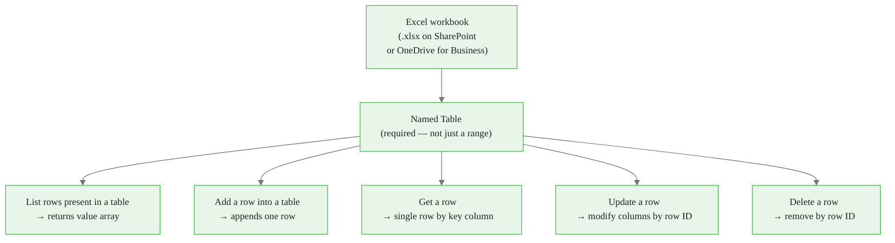
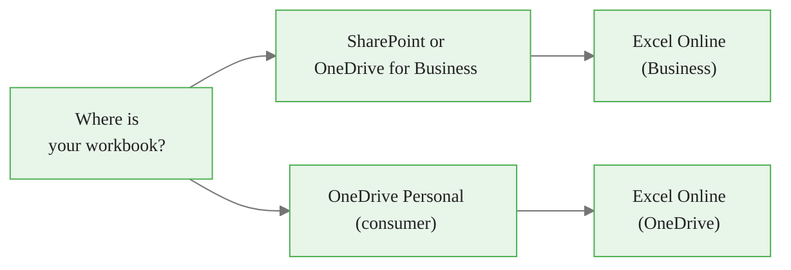
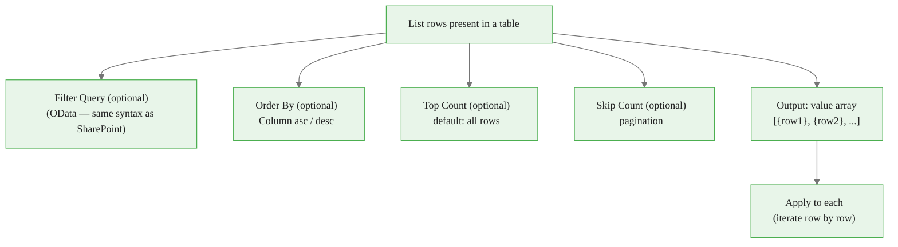
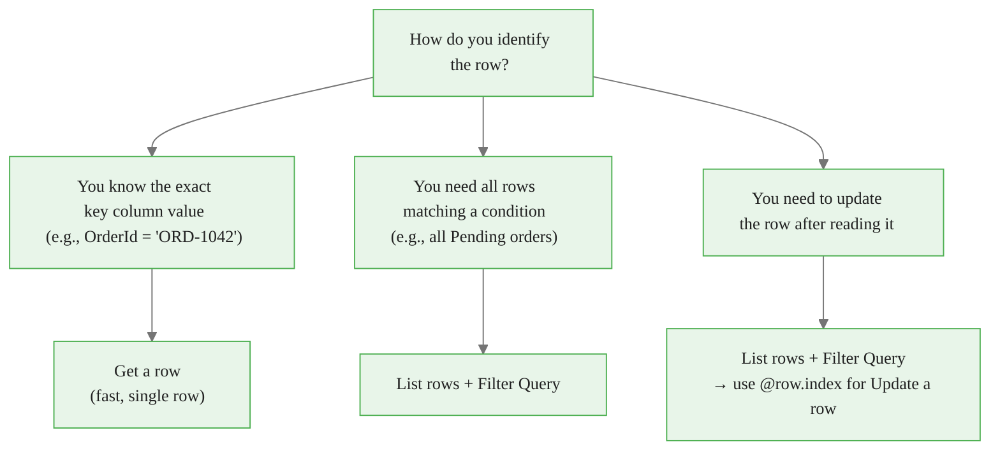
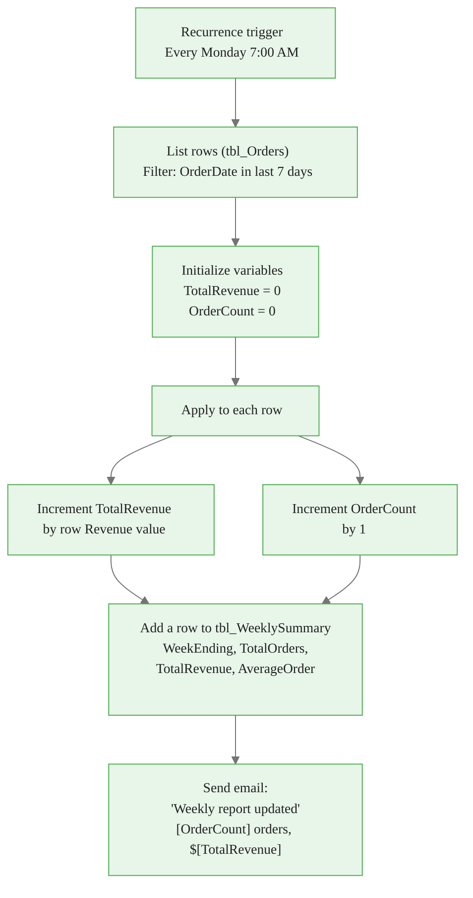
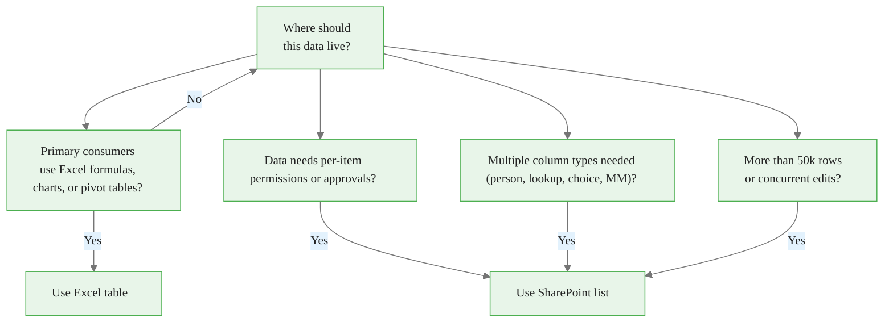
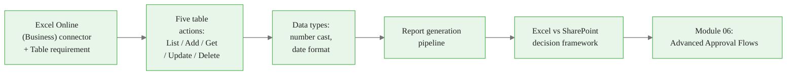

<!-- _class: lead -->

# Excel Integration with Power Automate

**Module 05 — Working with SharePoint and Excel**

> Excel is the language of business data. Power Automate speaks it natively — read tables, append rows, generate reports, all without opening a spreadsheet.

<!--
Speaker notes: Guide 02 picks up directly from Guide 01. Learners who completed the SharePoint guide will find the Excel connector familiar — the OData filter syntax is identical, the file/table picker pattern is the same, and Apply to each is still required for multi-row results. The key new concepts are: the mandatory Table requirement, data type coercion, and the report generation pipeline. This deck covers all of those plus the Excel vs SharePoint decision framework.
-->

<!-- Speaker notes: Cover the key points on this slide about Excel Integration with Power Automate. Pause for questions if the audience seems uncertain. -->

---

# Excel Data Flow: Table Operations



> All five actions require a **named Table** — not a raw range. Press **Ctrl+T** in Excel to create one.

<!--
Speaker notes: The diagram shows the single most important prerequisite: the workbook must have a formal named Table. Raw ranges with headers do not count. The Table gives every column a stable name that Power Automate reads from the workbook's metadata. Without a Table, the connector returns "Table not found" and learners often spend 20 minutes wondering why. Walk through each action briefly — detailed coverage follows. Point out that List rows and Get a row are read-only; Add row, Update row, and Delete row are write operations.
-->


<div class="callout-insight">
<strong>Insight:</strong> This is a key takeaway from this section that connects to the broader course themes.
</div>

<!-- Speaker notes: Cover the key points on this slide about Excel Data Flow: Table Operations. Pause for questions if the audience seems uncertain. -->

---

# Connector Choices: Business vs Personal

| | Excel Online (Business) | Excel Online (OneDrive) |
|--|------------------------|------------------------|
| File location | SharePoint or OneDrive for Business | OneDrive Personal (consumer) |
| Sign-in | Microsoft 365 work/school account | Personal Microsoft account |
| Best for | Team workflows, enterprise automation | Personal automations |
| Licensing | Microsoft 365 Business or Enterprise | Microsoft 365 Personal/Family |



> For all enterprise scenarios in this course, use **Excel Online (Business)**.

<!--
Speaker notes: The two connectors look almost identical in the action picker, which causes confusion. The green icon with "Business" in the name is the enterprise one. If a learner's file is on a SharePoint site or a work OneDrive account, they must use Business. If they accidentally pick the personal one and their file is on SharePoint, authentication will fail with a vague "file not found" error. This is worth spending 60 seconds on to prevent support questions.
-->


<div class="callout-key">
<strong>Key Point:</strong> Remember this concept — it appears repeatedly in later modules.
</div>

<!-- Speaker notes: Cover the key points on this slide about Connector Choices: Business vs Personal. Pause for questions if the audience seems uncertain. -->

---

# List Rows: The Primary Read Action



**Always feed `value` into Apply to each — not an individual column token.**

<!--
Speaker notes: Repeat the Apply to each rule from Guide 01 — it applies here too. The most common beginner mistake: they grab a column token from the dynamic content panel (e.g., "Revenue") and feed that into Apply to each. Power Automate then iterates over the individual characters of the Revenue value instead of the rows. The fix: in Apply to each, select the `value` output from the List rows step specifically (it appears with a small table icon). Spend extra time confirming learners can identify the correct token in the dynamic content panel.
-->


<div class="callout-warning">
<strong>Warning:</strong> This is a common source of confusion. Pay close attention to the distinction here.
</div>

<!-- Speaker notes: Cover the key points on this slide about List Rows: The Primary Read Action. Pause for questions if the audience seems uncertain. -->

---

# Get a Row vs List Rows: When to Use Which



> **Get a row does not return a row ID.** If you need to update afterward, use List rows instead.

<!--
Speaker notes: This decision point trips up learners who use Get a row to find a record, then try to use Update a row immediately afterward — only to discover Get a row does not provide the @row.index they need. Walk through the diagram explicitly. If the goal is read-only lookup: Get a row is perfect and simpler. If the goal is find-then-modify: List rows with a filter, then use @row.index from the loop to feed into Update a row. Write the rule on the slide: "Get a row = read only. List rows = read + modify."
-->


<div class="callout-info">
<strong>Info:</strong> This detail is useful context but not required to memorize.
</div>

<!-- Speaker notes: Cover the key points on this slide about Get a Row vs List Rows: When to Use Which. Pause for questions if the audience seems uncertain. -->

---

# Data Type Coercion Rules

Excel stores data in typed cells. Power Automate sends strings — type mismatch causes silent data corruption.

| Excel column format | Correct Power Automate value | Wrong value |
|--------------------|------------------------------|-------------|
| Number | `1299.99` (float) | `"1,299.99"` (string with comma) |
| Integer | `5` (integer) | `"5"` (string) |
| Date (date only) | `2024-03-15` | `2024-03-15T14:30:00Z` |
| Date + Time | `2024-03-15T14:30:00Z` | `"March 15"` |
| Text | Any string | — |

**Useful expressions:**

```
float(triggerBody()?['amount'])           // cast string to float
int(variables('count'))                   // cast to integer
formatDateTime(utcNow(), 'yyyy-MM-dd')    // date only, no time component
```

<!--
Speaker notes: The silent corruption cases are the dangerous ones. If you write "1,299.99" to a Number column, Excel stores it as text — sum formulas return 0, charts look blank. The learner opens the workbook, sees the data there, but the formulas are broken. No error appears in Power Automate. The fix is always to cast the value before writing using float() or int(). For dates: date-only columns in Excel expect "yyyy-MM-dd" format; if you include a time component, Excel may show the date as a decimal number (Excel's internal date serial). formatDateTime is the reliable fix.
-->

<!-- Speaker notes: Cover the key points on this slide about Data Type Coercion Rules. Pause for questions if the audience seems uncertain. -->

---

# Report Generation Pipeline



<!--
Speaker notes: Walk through the pipeline from top to bottom before building it. The Recurrence trigger fires at 7 AM every Monday. List rows fetches only the past 7 days of orders using a date filter. Initialize variables creates the two accumulators before the loop — if you initialize inside the loop, they reset on every iteration. Apply to each loops over each order row. The two Increment steps add to the running totals. After the loop, one row is appended to the summary table using the accumulated totals. The division for AverageOrder needs a zero-check — if there are no orders (OrderCount = 0), the div() expression will cause a "division by zero" error. Show learners how to add a Condition before the summary row step.
-->

<!-- Speaker notes: Cover the key points on this slide about Report Generation Pipeline. Pause for questions if the audience seems uncertain. -->

---

# Filter Query for Date Ranges

To filter Excel rows where `OrderDate` falls within the past 7 days:

```
OrderDate ge '@{formatDateTime(addDays(utcNow(), -7), 'yyyy-MM-dd')}'
```

**Breaking down the expression:**

| Part | Meaning |
|------|---------|
| `utcNow()` | Current timestamp in UTC |
| `addDays(utcNow(), -7)` | Timestamp 7 days ago |
| `formatDateTime(..., 'yyyy-MM-dd')` | Format as date-only string |
| `@{...}` | Inline expression inside a filter string |

> Type this directly into the Filter Query field. The single quotes around `@{...}` are required — they tell OData the value is a string.

<!--
Speaker notes: The `@{...}` syntax is Power Automate's string interpolation. When the field is not an expression field (not an fx box) but a regular text field, you use @{expression} to embed computed values. The outer single quotes around the entire @{...} expression are OData syntax — they mark the value as a string literal. Forgetting either the @ braces or the outer single quotes are the two most common mistakes here. Write the full expression on the slide so learners can copy it exactly. Also note: for date-time columns, use 'yyyy-MM-ddTHH:mm:ssZ' format instead.
-->

<!-- Speaker notes: Cover the key points on this slide about Filter Query for Date Ranges. Pause for questions if the audience seems uncertain. -->

---

# Excel vs SharePoint: Decision Framework



<!--
Speaker notes: This decision tree codifies the guidance from section 6 of the guide. The key insight is that Excel and SharePoint serve different masters. Excel serves people who live in spreadsheets — analysts, finance teams, anyone who wants formulas and pivot tables. SharePoint serves workflows — approvals, routing, lookups, and audit trails. There is no universal right answer; the question is "who is going to consume this data and how?" Walk through each decision node with a real example. For instance, a sales tracking sheet that feeds a pivot table dashboard stays in Excel. A vendor onboarding form that triggers multi-step approvals belongs in SharePoint.
-->

<!-- Speaker notes: Cover the key points on this slide about Excel vs SharePoint: Decision Framework. Pause for questions if the audience seems uncertain. -->

---

# Common Excel Connector Mistakes

| Mistake | Symptom | Fix |
|---------|---------|-----|
| No named Table in workbook | "Table not found" error | Insert → Table in Excel (Ctrl+T) |
| Feeding column token into Apply to each | Iterates over characters not rows | Feed the `value` array from List rows |
| Writing number as string | Formulas return 0 | Use `float()` or `int()` expression |
| Date column shows serial (e.g., 45365) | Excel cell shows a number | Format column as Date in Excel, or pass `yyyy-MM-dd` |
| Zero-division in average calculation | Flow run fails | Add Condition: if OrderCount > 0 |
| Update a row changes wrong row | Wrong data modified | Row indices shift if rows are added concurrently |

<!--
Speaker notes: The Table-not-found and Apply-to-each-characters mistakes are the two most common first-time errors. Run through the entire row quickly, then pause on the zero-division case — it is subtle because it only fails when there is genuinely no data matching the filter (e.g., running the Monday morning report on a holiday week with no orders). The fix is a single Condition action before the Add a row step: if `variables('OrderCount')` is equal to 0, skip the summary row entirely or write 0 for the average. The concurrent edit / row index shifting problem is an advanced concern — flag it as a known limitation and move on.
-->

<!-- Speaker notes: Cover the key points on this slide about Common Excel Connector Mistakes. Pause for questions if the audience seems uncertain. -->

---

# Summary and What Is Next



**You can now:**
- Connect Power Automate to any Excel table on SharePoint or OneDrive for Business
- List, add, update, and delete rows using all five table actions
- Cast numeric and date values correctly to prevent silent data corruption
- Build a scheduled report generation flow with variable accumulation
- Choose between Excel and SharePoint based on your data's primary consumers

**Next:** Module 06 covers advanced approval flows — multiple levels, escalation, custom responses, and SLA enforcement with timeouts.

<!--
Speaker notes: Wrap up with the five capabilities. Confirm learners have built and tested at least one Excel flow before moving to Module 06. The Notebook for this module (01_sharepoint_graph_api.ipynb) covers Microsoft Graph API for SharePoint and can be extended to cover the Excel REST API as well — learners who want programmatic Excel access from Python can use the same Graph API patterns. The exercise file (01_sharepoint_excel_exercise.py) has self-check problems covering OData filters, column type handling, and Graph API request construction for both SharePoint and Excel.
-->

<!-- Speaker notes: Cover the key points on this slide about Summary and What Is Next. Pause for questions if the audience seems uncertain. -->
