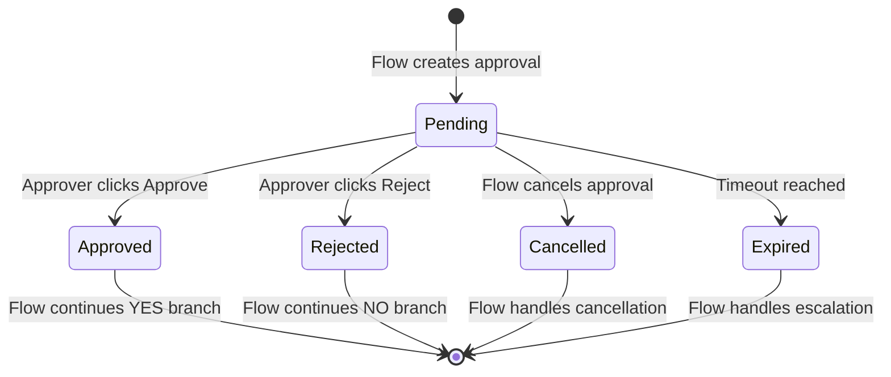
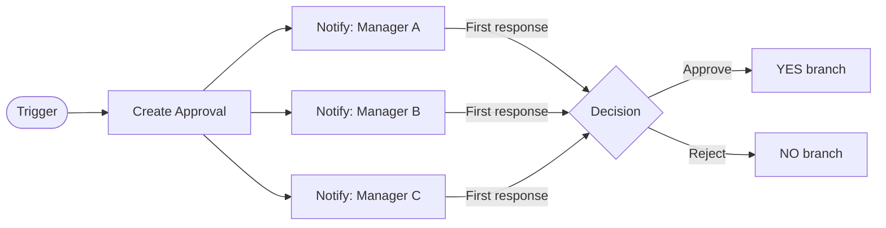
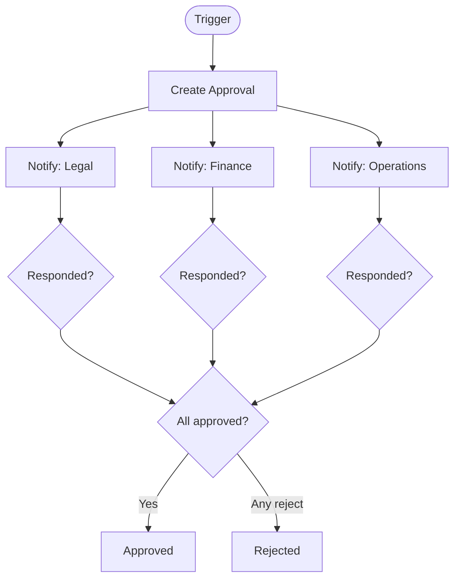
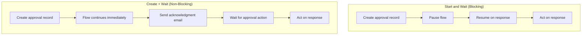
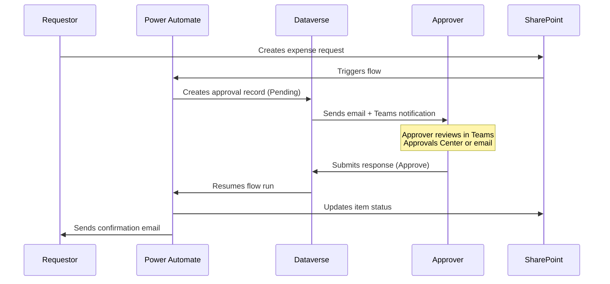
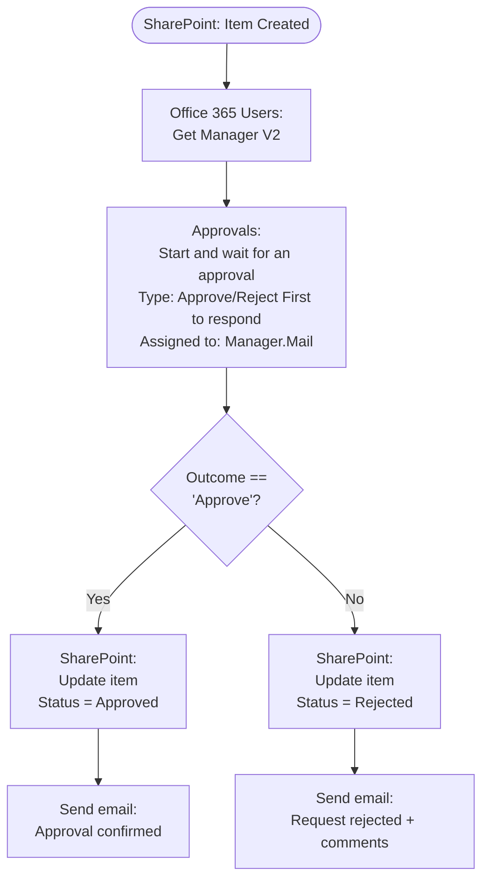

<!-- _class: lead -->

# Approvals Connector
## Automating Human Decision Points in Power Automate

**Module 06 — Approval Flows and Business Process Patterns**

> Approvals turn ad-hoc email sign-offs into structured, trackable, auditable workflow decisions.

<!-- Speaker notes: Welcome to Module 06. Today we move beyond automation that runs without human input, into automation that coordinates human decisions. The Approvals connector is the bridge between fully automated logic and the people who must authorize action. The key mental shift: approvals are not email notifications—they are persistent records with state. -->

---

# The Problem With Email-Based Sign-Offs

<div class="columns">

**Before Approvals Connector**
- Email sent to manager
- Reply gets buried in inbox
- Spreadsheet updated manually
- No audit trail
- Requestor must follow up manually
- Escalation depends on memory

**After Approvals Connector**
- Structured request with tracked status
- Approvals Center aggregates all pending items
- SharePoint/Dataverse record updated automatically
- Full audit trail with timestamps
- Requestor sees status in real time
- Escalation built into the flow

</div>

<!-- Speaker notes: This slide frames the problem we are solving. Ask the audience: who has ever had a purchase order or contract sit in someone's inbox for two weeks? The Approvals connector converts that chaos into a managed process. Every request has an ID, a status, and a response that feeds directly back into the automation. -->

---

# Approvals Are Persistent Records



<!-- Speaker notes: Approvals are not fire-and-forget emails. They exist as records in Dataverse with this state machine. Power Automate resumes the flow run the moment the state changes from Pending. This is why flows can wait for days without consuming compute—they are paused, not polling. The Expired and Cancelled states are often overlooked but critical for production flows. -->

---

<!-- _class: lead -->

# The Four Approval Types

<!-- Speaker notes: Power Automate gives you four routing patterns. Choosing the wrong one is a common source of bugs. We will cover each one and when to use it. The choice drives the notification behavior, the completion condition, and what data comes back in the response object. -->

---

# Approve/Reject: First to Respond



**Completion condition:** First approver to respond determines the outcome.
**Best for:** Requests where any authorized person can approve.

<!-- Speaker notes: This is the most common pattern. All approvers are notified simultaneously, and the moment one responds, the others receive a cancellation notification. Use this when you have a pool of approvers and want the fastest response time. Example: expense requests under $500 where any team lead can authorize. -->

---

# Approve/Reject: Everyone Must Approve



**Completion condition:** All approvers must respond. One rejection = Rejected outcome.

<!-- Speaker notes: This pattern is critical for compliance scenarios. Useful when the approval requires multiple independent authorities—legal, financial, and operational sign-off for a contract, for instance. Note that a single rejection immediately sets the outcome to Rejected even if others have approved. Also note: all approvers are notified in parallel, not sequentially. For sequential routing, see guide 02. -->

---

# Custom Responses

<div class="columns">

**When binary is not enough**

Standard approval gives two choices:
- Approve
- Reject

Custom responses let you define your own set of options. Examples:

| Scenario | Options |
|----------|---------|
| IT change request | Approve, Reject, Defer to Next Sprint |
| Content review | Publish, Revise, Archive |
| Budget request | Approve, Approve Partial, Reject |

</div>

**Routing:** First to respond, or everyone must respond — same two patterns apply.

<!-- Speaker notes: Custom responses are powerful but underused. The response strings you define here are what appears as buttons in the email and Teams card. These exact strings come back in the Outcome field, so your condition checks must match character-for-character. Case matters. "Approve Partial" is not the same as "approve partial". Document your response strings carefully. -->

---

# Two Core Actions



<!-- Speaker notes: The blocking pattern is simpler and covers 90% of use cases. The non-blocking pattern matters when you need to do something immediately after creating the approval—like emailing the requestor to confirm their request was received—before waiting for the approver to respond. Both patterns ultimately retrieve the same response object. -->

---

# Response Data Structure

After the approval action completes, these outputs are available:

| Output | Type | Contains |
|--------|------|----------|
| `Outcome` | String | "Approve", "Reject", or custom response string |
| `Responses` | Array | Each approver's individual response |
| `Completion date` | DateTime | When approval was finalized |
| `Approval ID` | String | Unique record identifier |

**Accessing individual responses:**

```
Responses[0]['responder']         → approver email
Responses[0]['approvalResponse'] → their decision
Responses[0]['comments']          → their comments text
Responses[0]['requestDate']       → when they were notified
```

<!-- Speaker notes: The Outcome field is the headline result. The Responses array is where you get the details—who approved, what they said in comments, and when. For single-approver flows, Responses has one entry. For everyone-must-approve flows, it has one entry per approver. Use Apply to each to loop through all responses when building an audit log. -->

---

# Approval Lifecycle: Complete Picture



<!-- Speaker notes: This sequence diagram shows every system involved in a typical approval flow. Notice that Dataverse is the central record store—it holds the approval object and orchestrates notifications. Power Automate is not polling Dataverse; Dataverse triggers the flow resumption. This is why approvals scale well: the compute is only used at the start and end, not during the wait period. -->

---

# Building the Expense Approval Flow



<!-- Speaker notes: This is the complete expense approval pattern. Seven actions in total. The Get Manager step is what makes this dynamic—you don't hardcode the approver's email. The approval action pauses the flow for as long as needed. The condition reads the Outcome string. Both branches update SharePoint and send a notification. Walk through each action and explain what field maps to what. -->

---

# Approval Email: What Approvers See

<div class="columns">

**Email notification includes:**
- Your Title field as the subject
- Your Details field as the body (HTML supported)
- Approve / Reject buttons directly in email
- Link to Approvals Center for comments
- Item link as a "View Item" button

**Supported HTML in Details:**
- `<b>` bold, `<i>` italic
- `<br>` line breaks
- `<a href>` hyperlinks
- Plain text (always safe)

**Not supported:**
- Tables, images, CSS styling

</div>

<!-- Speaker notes: The Details field is your control over the approver experience. Use HTML to structure the information clearly. Always include the key facts—who requested, what they want, what justification they gave—so the approver can decide without clicking through to another system. Use the Item link field for the "View Item" button, which is prominently placed in both email and Teams. -->

---

# Common Pitfalls and Fixes

| Pitfall | Cause | Fix |
|---------|-------|-----|
| Approval goes to wrong person | Display name used instead of email | Use Office 365 Users connector to resolve to Mail property |
| Flow times out after 30 days | No response within default limit | Build escalation with parallel timer branch |
| Condition never matches | Outcome string case mismatch | Check exact string: "Approve" not "Approved" |
| Comments field empty | Approver skipped comment | Check `comments` with `empty()` function before using |
| HTML not rendering | Malformed HTML in Details | Validate HTML; avoid nested or unclosed tags |

<!-- Speaker notes: These are the top five issues you will encounter in production approval flows. The most dangerous one is the case mismatch—the Condition will always take the NO branch even when the approver clicked Approve. Always copy the exact Outcome string from a test run, don't type it from memory. The timeout issue is covered in depth in Guide 02 with the escalation pattern. -->

---

<!-- _class: lead -->

# Module 06 Guide 01 Complete

**Next:** Guide 02 — Adaptive Cards and Multi-Stage Approval Pipelines

Build approval experiences that render rich interactive cards in Microsoft Teams, and chain multiple approval stages with escalation and SLA enforcement.

<!-- Speaker notes: You now have the full foundation for the Approvals connector: the four types, the two core actions, how to read responses, and how to build a complete single-stage approval. Guide 02 extends this to multi-stage pipelines and Teams-native approval experiences using Adaptive Cards. -->

---
