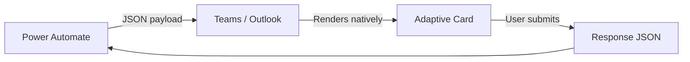
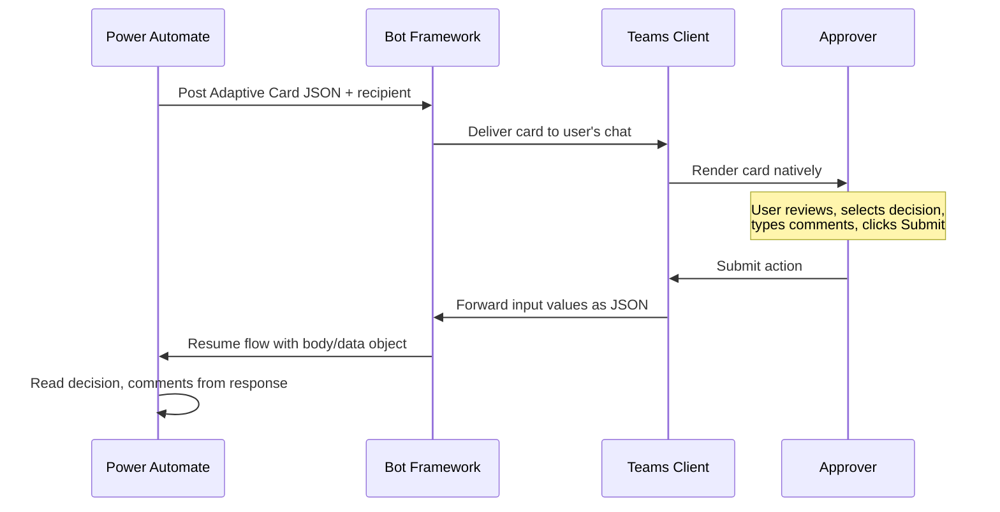
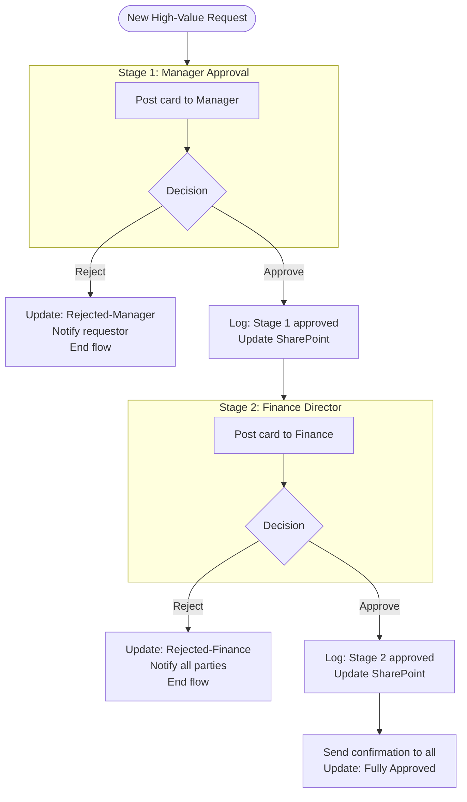
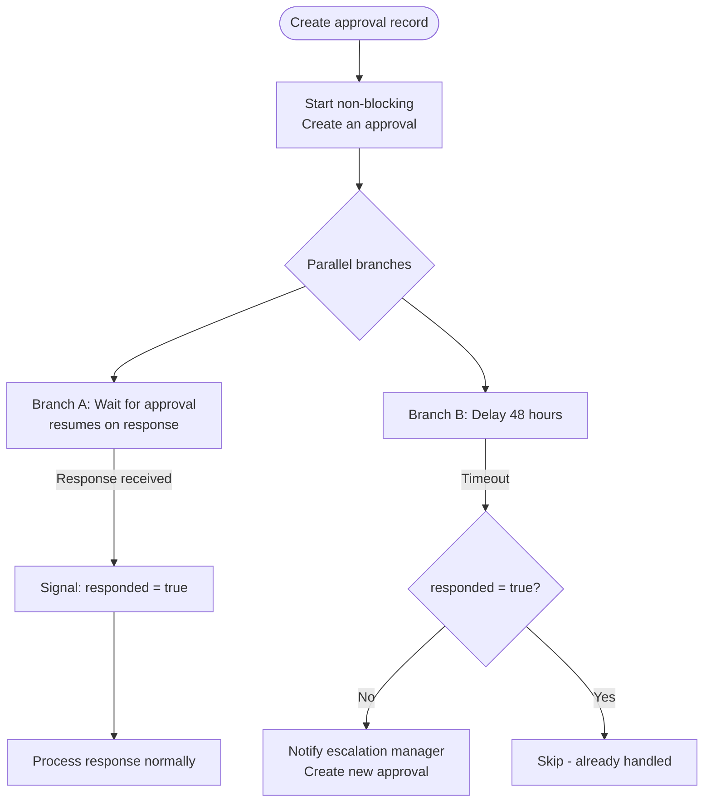
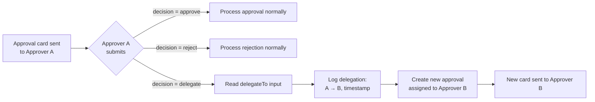
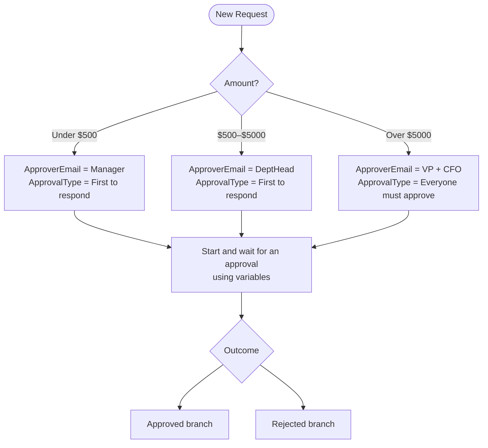

<!-- _class: lead -->

# Adaptive Cards and Business Process Patterns

**Module 06 — Approval Flows and Business Process Patterns**

> Adaptive Cards transform approval emails into interactive applications inside Teams and Outlook.

<!-- Speaker notes: This guide extends what you learned about the Approvals connector into two advanced areas: Adaptive Cards for richer approver experiences, and business process patterns like escalation, delegation, and SLA enforcement. By the end, you will be able to design multi-stage approval pipelines with full audit trails. -->

---

# Email Approval vs. Adaptive Card Approval

<div class="columns">

**Standard Approval Email**
- Plain HTML email
- Two buttons: Approve, Reject
- Opens browser for comments
- No dynamic data layout
- Limited context visible

**Adaptive Card in Teams**
- Native Teams component
- Custom input fields inline
- Submit without leaving Teams
- Structured fact display
- Full request context visible

</div>



<!-- Speaker notes: The core difference is interactivity. With a standard approval email, the approver clicks Approve or Reject and that is it. With an Adaptive Card, you can collect a structured decision, comments, delegation target, or any other input—all inline, without the approver leaving Teams. The card renders using Teams native components, so it feels like a first-class Teams feature, not an external tool. -->

---

# Adaptive Card JSON Structure

```json
{
    "type": "AdaptiveCard",
    "version": "1.4",
    "body": [
        {
            "type": "TextBlock",
            "text": "Expense Approval Required",
            "size": "Large",
            "weight": "Bolder"
        },
        {
            "type": "FactSet",
            "facts": [
                { "title": "Amount:", "value": "$450.00" },
                { "title": "Submitted by:", "value": "Priya Patel" }
            ]
        },
        {
            "type": "Input.ChoiceSet",
            "id": "decision",
            "choices": [
                { "title": "Approve", "value": "approve" },
                { "title": "Reject", "value": "reject" }
            ]
        }
    ],
    "actions": [
        { "type": "Action.Submit", "title": "Submit Decision" }
    ]
}
```

<!-- Speaker notes: Walk through this JSON top to bottom. The body is an array—order here is display order. TextBlock for headings, FactSet for labeled data pairs, Input.ChoiceSet for the decision dropdown. The actions array defines the submit button. When the user clicks Submit, Teams sends all input values back to Power Automate keyed by the id property of each input. The id "decision" becomes the key in the response JSON. -->

---

# Key Body Element Types

| Element | Purpose | Key Properties |
|---------|---------|---------------|
| `TextBlock` | Display text | `text`, `size`, `weight`, `color`, `wrap` |
| `FactSet` | Label-value list | `facts[]` with `title` and `value` |
| `Container` | Group elements | `style` (emphasis, good, warning, attention) |
| `ColumnSet` | Side-by-side layout | `columns[]` with `width` |
| `Input.Text` | Free text input | `id`, `isMultiline`, `label`, `isRequired` |
| `Input.ChoiceSet` | Dropdown/radio | `id`, `choices[]`, `style` (expanded/compact) |
| `Input.Date` | Date picker | `id`, `label` |
| `Image` | Show an image | `url`, `altText`, `size` |

<!-- Speaker notes: You will use TextBlock and FactSet in nearly every approval card. Container with style "emphasis" creates a visually distinct section—useful for the justification text so it stands out. Input.Text with isMultiline for comments, Input.ChoiceSet with style "expanded" shows radio buttons rather than a dropdown, which reduces clicks for binary choices. Always set id carefully—it is how you read the response in Power Automate. -->

---

# Rendering Flow: From JSON to Teams Card



<!-- Speaker notes: The Bot Framework acts as the delivery mechanism. Power Automate sends the card JSON to the Bot Framework, which routes it to the correct Teams user. When the user submits, the input values travel back the same path. Power Automate reads the response from the output body/data object. This is a request-response pattern where the flow is paused between the Post and the Resume steps. -->

---

# Reading Card Responses in Power Automate

After the **Post adaptive card and wait for a response** action:

```
Full response object:
outputs('Post_adaptive_card_and_wait')?['body/data']

Access specific inputs (by id):
outputs('Post_adaptive_card_and_wait')?['body/data/decision']
outputs('Post_adaptive_card_and_wait')?['body/data/comments']
outputs('Post_adaptive_card_and_wait')?['body/data/delegateTo']

Who submitted the card:
outputs('Post_adaptive_card_and_wait')?['body/responder/userPrincipalName']
```

**Best practice:** Store the full body/data in a variable immediately:

```
Set variable: CardResponse = outputs('Post_adaptive_card_and_wait')?['body/data']
Then reference: variables('CardResponse')?['decision']
```

<!-- Speaker notes: The expression path for card responses is long and easy to mistype. Creating a variable right after the card action lets you reference the clean variable name everywhere downstream. The responder property is important for audit trails—it tells you which Teams user actually clicked Submit, not just who the card was sent to, which matters if someone else was covering the approver's account. -->

---

<!-- _class: lead -->

# Multi-Stage Approval Pipeline

<!-- Speaker notes: Now we move from single-stage to multi-stage. A multi-stage pipeline chains approvals sequentially—each stage must complete before the next begins, and a rejection at any stage terminates the pipeline early. This is the standard pattern for high-value purchases, contract approvals, and compliance sign-off workflows. -->

---

# Multi-Stage Architecture



<!-- Speaker notes: Each stage is a self-contained unit: post card, wait, read decision, branch on outcome. The NO branches terminate the pipeline immediately with appropriate notifications. The YES branches log the stage outcome to SharePoint and proceed to the next stage. The key design principle: fail fast. Don't create a Stage 2 approval record until Stage 1 is confirmed. This keeps the audit trail clean and prevents approvers from receiving cards for requests that were already rejected. -->

---

# Approval History Tracking Schema

Track every stage in SharePoint for a full audit trail:

| Column | Type | Example Value |
|--------|------|--------------|
| `Status` | Choice | Pending / Approved / Rejected |
| `Stage1Approver` | Email | manager@contoso.com |
| `Stage1Decision` | Text | approve |
| `Stage1Comments` | Multiline | Looks good, within budget |
| `Stage1CompletedAt` | Date/Time | 2024-03-15T14:32:00Z |
| `Stage2Approver` | Email | finance@contoso.com |
| `Stage2Decision` | Text | approve |
| `Stage2Comments` | Multiline | Coded to correct cost center |
| `Stage2CompletedAt` | Date/Time | 2024-03-16T09:15:00Z |

Write each stage's data immediately after it completes using **Update item** (SharePoint).

<!-- Speaker notes: Why SharePoint instead of Dataverse for this? Visibility. SharePoint lists are easy for managers and auditors to query without any special tooling. They can filter by Status, sort by date, and export to Excel without IT help. Use Dataverse when you need relational queries, complex reporting, or when the volume exceeds SharePoint list limits (30 million rows for lists, but performance degrades much earlier). For most approval pipelines, SharePoint is the right choice. -->

---

# Escalation Pattern: SLA Enforcement



<!-- Speaker notes: This is the most complex pattern in this module. The key challenge is that parallel branches cannot share a variable. Instead, use a SharePoint column or Dataverse field called "RespondedFlag". Branch A sets it to true when a response arrives. Branch B checks it after 48 hours. If it is false, escalate. If it is true, skip. This pattern requires the non-blocking Create an approval action, because Start and wait for an approval cannot be combined with a parallel timeout branch. -->

---

# Escalation: Timeline View

```mermaid
gantt
    title Approval SLA Timeline
    dateFormat HH:mm
    axisFormat %H:%M

    section Normal Flow
    Request submitted       :milestone, m1, 00:00, 0m
    Manager notified        :notify1, 00:00, 30m
    Manager responds        :done, respond1, 00:30, 2h
    Fully processed         :milestone, m2, 02:30, 0m

    section SLA Breach
    Request submitted       :milestone, m3, 00:00, 0m
    Manager notified        :notify2, 00:00, 30m
    48h SLA window          :crit, sla, 00:00, 48h
    Escalation triggered    :milestone, m4, 48:00, 0m
    Escalation manager      :escalate, 48:00, 4h
```

<!-- Speaker notes: This timeline shows two scenarios side by side. In the normal flow, the manager responds within 2.5 hours. In the SLA breach scenario, no response arrives within 48 hours, the escalation triggers, and the escalation manager receives a new approval request. The SLA window is shown in red (critical) to emphasize it is the constraint. In practice, you might also send a reminder notification at 24 hours—a pre-escalation warning to the original approver. -->

---

# Delegation Pattern



To implement: add a third choice to the card's ChoiceSet and an Input.Text field for the delegate's email address.

<!-- Speaker notes: Delegation is a quality-of-life feature that prevents approval bottlenecks when the designated approver is out of office. The key implementation detail: log the delegation chain. You need to know that Manager A delegated to Manager B before B approved, for audit purposes. Store both emails and the timestamp in your tracking record. You can also enforce delegation rules in the flow—for example, preventing delegation to someone more junior than the original approver. -->

---

# Conditional Routing by Request Value



Use a **Switch** action to set `ApproverEmail` and `ApprovalType` variables before the approval action.

<!-- Speaker notes: This pattern demonstrates why variables matter. By setting the approver and type in variables before the approval action, you write the approval logic once. Without variables, you would need three separate approval actions—one per amount tier—each duplicating the subsequent condition and branch logic. The Switch action is cleaner than nested Conditions for three or more cases. -->

---

# Adaptive Card Designer: Your Development Tool

<div class="columns">

**Use adaptivecards.io/designer for:**
- Visual drag-and-drop card building
- Live preview in Teams / Outlook host modes
- JSON validation with error messages
- Sample cards to start from
- Schema documentation inline

**Workflow:**
1. Build card in the designer
2. Copy the JSON payload
3. Paste into Power Automate card field
4. Replace static values with dynamic content expressions
5. Test with a real Teams message

</div>

<!-- Speaker notes: The Adaptive Card Designer is essential. Do not attempt to write card JSON by hand in the Power Automate designer—you will not get validation feedback until the flow actually runs. Build it in the designer first, validate it, then bring it into Power Automate. The "Sample Data" editor on the left side of the designer lets you preview what the card looks like with real data values. -->

---

# Common Pitfalls and Fixes

| Issue | Symptom | Fix |
|-------|---------|-----|
| Card JSON invalid | Flow fails at card action | Validate at adaptivecards.io first |
| ChoiceSet returns null | Decision expression is null | Set `isRequired: true` on the input |
| Card version too high | Card doesn't render in Teams | Use schema version 1.4 or below |
| Teams bot not enabled | Flow bot can't post | Enable Power Automate bot in Teams Admin |
| Long expression paths | Hard to read, easy to mistype | Store `body/data` in a variable first |
| Parallel branch state conflict | Escalation logic fails | Use SharePoint/Dataverse for shared state |

<!-- Speaker notes: Run through these quickly—they are all learnable lessons from production deployments. The most common one is the null ChoiceSet. If someone submits the card without selecting a decision (possible when isRequired is false), your condition checking the decision value will fail silently or take the wrong branch. Always set isRequired true on decision inputs and test with a card submission before the input is filled in. -->

---

<!-- _class: lead -->

# Module 06 Guide 02 Complete

**You can now build:**
- Rich Adaptive Card approval experiences in Teams
- Multi-stage sequential approval pipelines
- Escalation flows with SLA enforcement
- Delegation and conditional routing patterns

**Next:** Notebook 01 — Build and validate Adaptive Card JSON with Python

<!-- Speaker notes: Guide 02 covers the complete business process pattern toolkit. The notebook that follows applies these concepts in Python, letting you generate and validate card JSON programmatically—useful for when you need to generate cards dynamically from data rather than hardcoding their structure. -->

---
