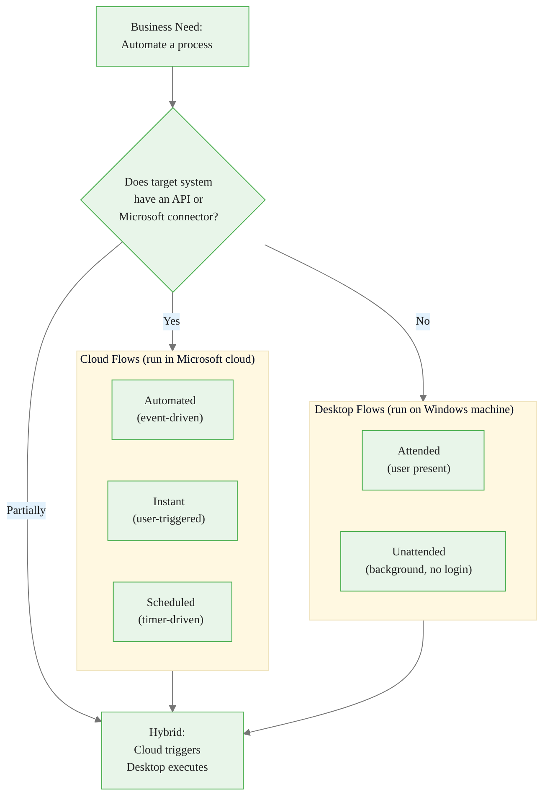
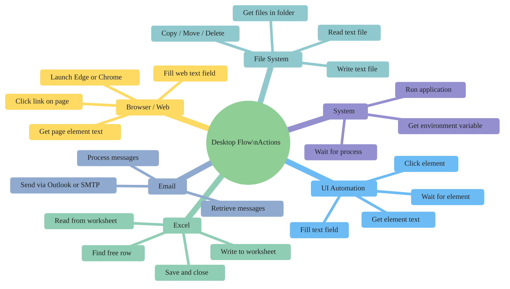
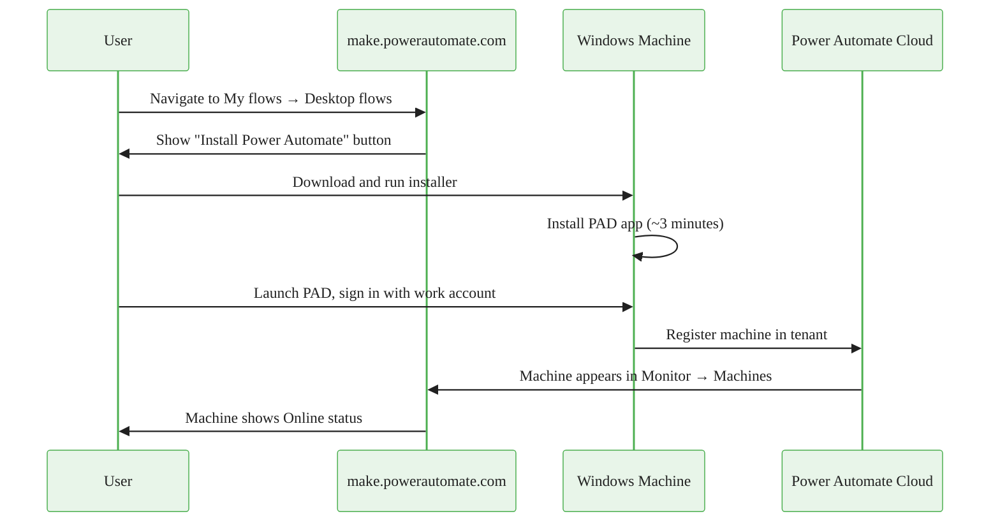
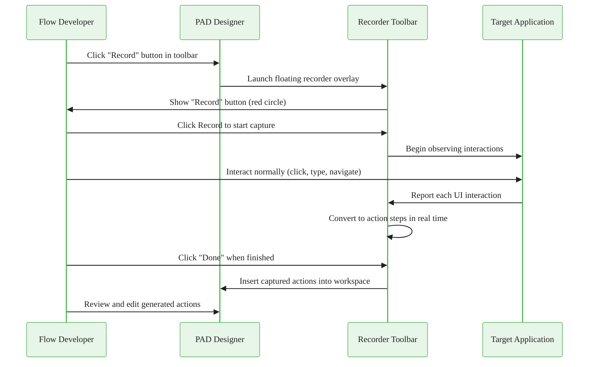
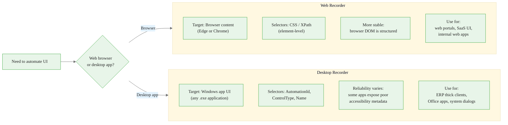
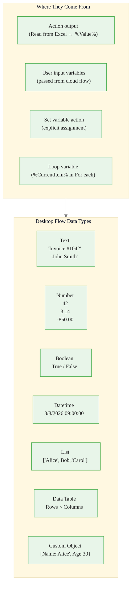
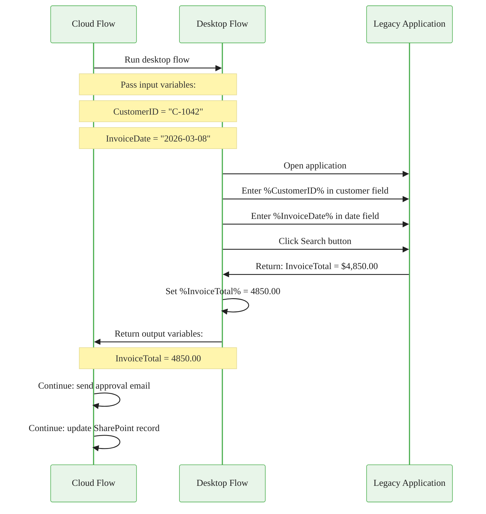

<!-- _class: lead -->

# Desktop Flows and RPA Fundamentals
## Power Automate Desktop

**Module 07 — Desktop Flows and RPA**

> When the target system has no API, automation must work at the screen level. Desktop flows are Power Automate's answer: a full RPA engine that can automate anything visible on a Windows machine.

<!-- Speaker notes: Welcome to Module 07. This is the module where Power Automate goes beyond cloud-to-cloud integration and into the world of legacy systems, thick-client desktop apps, and any application that has never heard of a REST API. RPA stands for Robotic Process Automation — the term for software that operates a computer the way a human would. After this module, learners will be able to install Power Automate Desktop, record actions against real applications, build reusable desktop flows with typed variables, and connect them to cloud flows for end-to-end automation pipelines. -->

---

# Why Desktop Flows Exist

Not every system has an API.

| System Type | API Available? | Solution |
|---|---|---|
| Modern SaaS (Salesforce, ServiceNow) | Yes — REST API | Cloud flow connector |
| SharePoint, Teams, Outlook | Yes — Microsoft Graph | Cloud flow connector |
| Legacy ERP (AS/400, old SAP GUI) | Rarely | Desktop flow (RPA) |
| Thick-client Windows app (VB6, Delphi) | Almost never | Desktop flow (RPA) |
| Internal web portal (no external API) | Usually not | Desktop flow (web recorder) |
| Local Excel with complex macros | COM object only | Desktop flow (Excel actions) |

> **RPA closes the automation gap** for the systems organizations cannot or will not modernize.


<div class="callout-insight">
<strong>Insight:</strong> This is a key takeaway from this section that connects to the broader course themes.
</div>

<!-- Speaker notes: Start with the business problem. Organizations have hundreds of applications, and only a fraction of them expose APIs. The rest require a human to open a window, click buttons, and type data. RPA replaces that human for repetitive, rule-based tasks. Power Automate Desktop is Microsoft's RPA engine, built into the Power Automate platform so it inherits connectors, licensing, environments, and governance. Ask learners: "What systems in your organization have no API?" — this is always a revealing question because the list is typically long. -->

---

# Cloud Flows vs Desktop Flows




<div class="callout-key">
<strong>Key Point:</strong> Remember this concept — it appears repeatedly in later modules.
</div>

<!-- Speaker notes: This decision diagram is the most important concept in the module. Train learners to ask the API question first. If the answer is yes, stay in the cloud — it is simpler, cheaper, and more reliable. If the answer is no, desktop flows are the path. If the answer is "partially" — for example, a cloud system triggers the process but a local legacy app must be touched — the hybrid pattern is the solution, which Guide 02 covers in detail. The hybrid pattern is by far the most common production deployment. -->

---

# Desktop Flow Action Categories




<div class="callout-warning">
<strong>Warning:</strong> This is a common source of confusion. Pay close attention to the distinction here.
</div>

<!-- Speaker notes: Walk through each branch of the mind map. The key mental model is: UI Automation = Windows desktop app elements; Browser/Web = web page elements in Edge or Chrome; Excel = direct COM automation of Excel workbooks (does not need Excel visible); File System = operating on the file system directly; Email = desktop mail clients or SMTP/IMAP; System = OS-level operations. In practice, most enterprise desktop flows combine several of these categories in sequence — for example, reading a file list (File System), opening each file in Excel (Excel), copying data to a legacy app (UI Automation), and sending a completion email (Email). -->

---

# Power Automate Desktop: Installation



> **On screen:** After installation, navigate to `make.powerautomate.com` → **Monitor** → **Machines**. Your machine name should appear with a green **Online** indicator while Power Automate Desktop is running.


<div class="callout-info">
<strong>Info:</strong> This detail is useful context but not required to memorize.
</div>

<!-- Speaker notes: The machine registration step is critical and often missed. Without the machine appearing in Monitor → Machines, a cloud flow cannot target that machine to run a desktop flow. If the machine is not appearing, check: (1) is the user signed into the desktop app with the correct work account, (2) is the correct environment selected in the desktop app settings, (3) is there a firewall or proxy blocking the registration call to Power Automate cloud endpoints. The official troubleshooting doc at learn.microsoft.com/power-automate/desktop-flows/troubleshoot covers all common registration failures. -->

---

# The Desktop Flow Designer Layout

```
┌───────────────────────────────────────────────────────────────────────┐
│  [Run F5]  [Stop]  [Step F10]  [Record]  [Save Ctrl+S]  [Flow name] │
├────────────────┬──────────────────────────────┬───────────────────────┤
│                │                              │                       │
│  ACTION        │         WORKSPACE            │   VARIABLES           │
│  PANEL         │                              │   PANEL               │
│                │  1. Launch Excel             │                       │
│  Search...     │  2. Read from worksheet      │  Input/Output:        │
│                │  3. For each row             │  ├── CustomerID (Text)│
│  ▸ Browser     │     4. Open legacy app       │  └── ReportDate (Date)│
│  ▸ Excel       │     5. Fill text field       │                       │
│  ▸ File        │     6. Click Save button     │  Flow variables:      │
│  ▸ System      │     7. Wait for dialog       │  ├── ExcelData        │
│  ▸ UI Auto     │     8. Close dialog          │  ├── CurrentRow       │
│  ▸ Web         │  End (For each)              │  └── RowCount         │
│  ▸ Email       │  9. Save Excel               │                       │
│  ...           │  10. Close Excel             │                       │
└────────────────┴──────────────────────────────┴───────────────────────┘
```

<!-- Speaker notes: Orient learners to the three-panel layout. Left panel = the catalog of available actions. Center workspace = the actual flow steps in order, like a script. Right panel = variable declarations and live values during testing. Emphasize that the workspace is sequential — actions run top to bottom unless a loop or condition changes the path. The Step (F10) key is the single most useful debugging tool: run one action, inspect the Variables panel to see what value was captured, then step to the next. -->

---

# Recording Desktop Actions



<!-- Speaker notes: The recording workflow is the fastest path to a working draft flow. The key message is "record then edit" — recordings are starting points, not finished products. Common edits needed after recording: (1) replace hardcoded string literals with variable references, (2) stabilize selectors that used volatile window titles or list positions, (3) add Wait for element actions before steps that depend on a UI loading, (4) wrap risky steps in error handlers. Teach learners to record, then immediately test step-by-step with F10, watching for failures — this is the fastest debugging cycle. -->

---

# Web Recorder vs Desktop Recorder



<!-- Speaker notes: The selector technology is the key difference. Web browsers (Edge and Chrome) expose a fully structured DOM that CSS selectors and XPath can target precisely and stably. Desktop Windows applications expose UI Automation accessibility trees — the quality varies widely. Well-written apps (Microsoft Office, modern .NET apps) have good AutomationId and Name properties. Old VB6 or Delphi apps often expose only raw window class names and text content, making selectors fragile. When learners encounter a fragile desktop selector, the fix is usually to switch from using the text property (which can change) to using the control position within its parent (which is more stable, but still not ideal). -->

---

# Variables and Data Types



> Variables are referenced with `%` delimiters: `%CustomerID%`, `%InvoiceTotal%`, `%FileList%`

<!-- Speaker notes: The percent-sign delimiter syntax is unique to Power Automate Desktop — it is different from cloud flow dynamic content expressions (which use curly brace syntax). Learners who work across both environments sometimes mix them up. Inside a desktop flow action field, type `%` to get an IntelliSense popup showing all available variables. This is the fastest way to reference variables without typing errors. Data tables are particularly important — the Read from Excel worksheet action with "all sheet values" option returns a data table, and For each iterates over its rows. Teach learners to use Get data table row item action to extract individual column values from a row. -->

---

# Input/Output Variables: Cloud ↔ Desktop Bridge



<!-- Speaker notes: This sequence diagram shows the complete data handoff. The cloud flow is the orchestrator — it holds the business logic context and calls the desktop flow as a specialized sub-routine for the UI interaction portion. The desktop flow is stateless between runs: it receives inputs, does its work, and returns outputs. It does not maintain its own memory between calls. Emphasize that input and output variables must be declared in the Variables panel before saving the flow — they do not appear automatically in the cloud flow action card until the desktop flow is saved with those variables declared. -->

---

# Input Variable Declaration

> **On screen:** In the Variables panel → click **+** → **Input**

```
Variable name:    CustomerID
External name:    CustomerID           ← shown in the cloud flow action card
Data type:        Text
Default value:    C-0000               ← used during manual test runs only
Description:      The customer account ID to look up in the legacy billing system
```

> **On screen:** In the Variables panel → click **+** → **Output**

```
Variable name:    InvoiceTotal
External name:    InvoiceTotal
Data type:        Number
Description:      Total invoice value in USD extracted from the billing system
```

After saving: open the cloud flow → add action → **Run a flow built with Power Automate Desktop** → the input fields and output variables appear automatically.

<!-- Speaker notes: The external name defaults to the variable name but can differ — the external name is what the cloud flow sees in its action card. Keep them the same to avoid confusion. The description field is shown as a tooltip in the cloud flow action card, so write it for the person building the cloud flow who may not have seen the desktop flow code. The default value for input variables is only used when running the flow manually from the designer — it never affects production execution where the cloud flow passes real values. -->

---

# Common Pitfalls

| Pitfall | Symptom | Fix |
|---|---|---|
| Unsaved flow | Changes lost on app close | Ctrl+S frequently; no auto-save |
| Fragile selector | Flow breaks when window title changes | Edit selector to use stable AutomationId |
| Fixed-time Wait | Flow fails if system is slow | Use **Wait for UI element** instead |
| Type mismatch | Runtime error on variable use | Add explicit type conversion action |
| Machine offline | Cloud flow fails with "machine unavailable" | Keep PAD app running; use machine groups |
| Hardcoded values in recording | Flow works for one customer only | Replace literals with `%VariableName%` references |

<!-- Speaker notes: Run through each pitfall quickly but leave time for questions. The fragile selector issue is the most common production failure for desktop flows — selectors built during recording often use the window title (which changes when the document changes) or a list position index (which changes when a row is added above). The fix is to open the UI element picker and switch to a more stable attribute like AutomationId or Name. The machine offline issue becomes a design consideration in production: for unattended flows, the machine must be always-on with the desktop app running as a service or startup application. -->

---

# Module 07 Guide 01 Summary

**What you now know:**

1. Desktop flows run on a Windows machine and automate any visible UI — with or without an API.

2. Power Automate Desktop installs in minutes; the machine must be registered and show **Online** in Monitor → Machines before cloud flows can use it.

3. Six action groups cover the most common automation needs: UI Automation, Web, Excel, File System, Email, and System.

4. Recording bootstraps flows quickly — always edit recordings to replace hardcoded values and stabilize selectors.

5. Input and output variables are the data contract between the calling cloud flow and the desktop flow.

**Next:** Guide 02 — connecting desktop flows to cloud flows, attended vs unattended execution, machine groups, and hybrid automation patterns.

<!-- Speaker notes: Close with the key mindset shift: desktop flows are not standalone tools — they are sub-routines called by cloud flows in production. The cloud flow provides the trigger, the business logic, and the follow-up actions (notifications, record updates, approvals). The desktop flow provides the specialized UI interaction capability. Once learners internalize this orchestration model, the rest of Module 07 falls into place naturally. -->

---

<!-- _class: lead -->

# Up Next: Cloud ↔ Desktop Integration

**Guide 02** covers the full integration pattern: triggering desktop flows from cloud flows, attended versus unattended execution modes, machine group architecture, and error handling across the hybrid boundary.

> Open Power Automate Desktop now and create your first blank flow before reading Guide 02.

<!-- Speaker notes: Encourage learners to have Power Automate Desktop installed and open before starting Guide 02. The conceptual content in Guide 02 lands much better when learners can follow along in the actual designer. If they have not yet installed PAD, the installation sequence takes about 10 minutes total including machine registration. The first blank flow they create in the designer — even an empty one with a few Print message actions — builds the spatial memory for the panels and toolbar that Guide 02 references throughout. -->
