<!-- _class: lead -->

# Cloud ↔ Desktop Integration
## Orchestrating RPA from Cloud Flows

**Module 07 — Desktop Flows and RPA**

> A desktop flow running in isolation is a script. A desktop flow called by a cloud flow is part of a production automation pipeline. This guide connects the two.

<!-- Speaker notes: This guide moves from desktop flow fundamentals (Guide 01) to integration — the pattern that makes desktop flows production-worthy. The core shift in mental model: the cloud flow is the orchestrator and the desktop flow is a specialized sub-routine. The cloud flow holds the trigger, the business logic, the follow-up notifications, and the audit trail. The desktop flow contributes only the UI interaction capability that cloud connectors cannot provide. By the end of this deck, learners will understand attended vs unattended execution, machine groups, error signaling across the boundary, and the three hybrid automation patterns used in enterprise deployments. -->

---

# The Scenario: Legacy Billing to Excel

A finance team manually looks up invoice totals in an old billing application (no API) and copies them into an Excel tracker. Dozens of records per day.

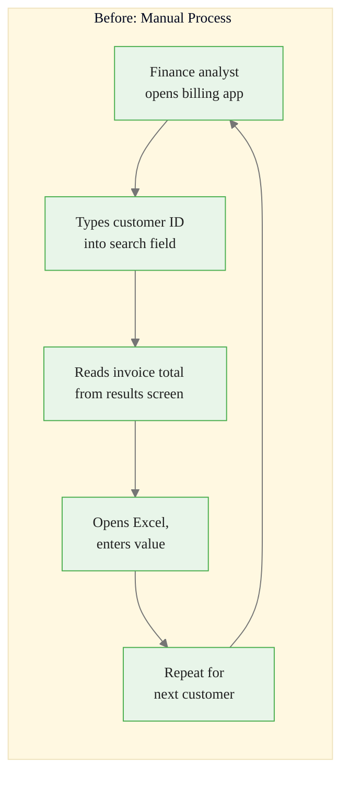

**Pain points:** Error-prone, time-consuming, no audit trail, analyst tied up 2 hours per day.

**Automation target:** Replace the loop with a scheduled cloud flow + desktop flow.

<strong>Insight:</strong> This is a key takeaway from this section that connects to the broader course themes.

<!-- Speaker notes: Start with the business problem to anchor the technical content. This scenario is deliberately generic — every organization has a version of it. The legacy billing app could be SAP GUI, a Delphi application, an AS/400 terminal, or any other thick-client that predates REST APIs. The swivel-chair pattern (copy from one app, paste into another) is among the top three automation use cases in enterprise RPA projects. After showing the "before" diagram, ask learners to think of a swivel-chair task in their own work — this creates immediate personal relevance for the technical content that follows. -->

---

# The Automated Solution

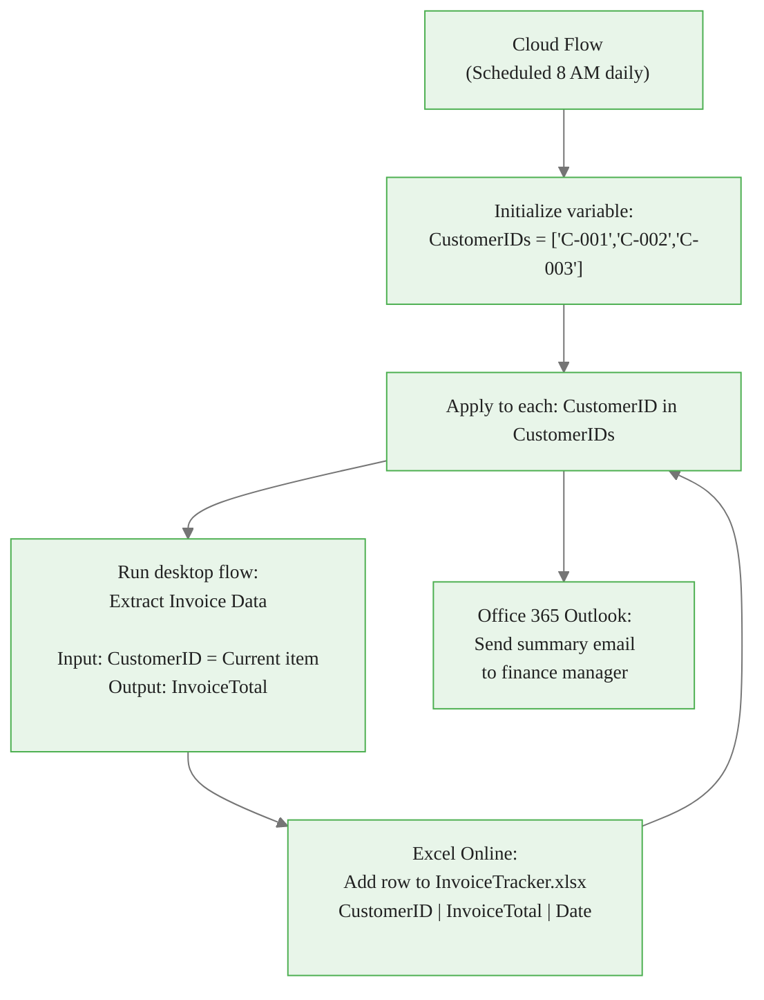

<strong>Key Point:</strong> Remember this concept — it appears repeatedly in later modules.

<!-- Speaker notes: Walk through this diagram step by step. The cloud flow (blue) handles everything that cloud connectors can do: scheduling, variable management, Excel Online writes, and email. The desktop flow (purple) handles the one step that requires local UI access — the legacy billing app lookup. The loop runs the desktop flow once per customer ID. This separation of concerns is the key architectural principle: keep cloud logic in cloud flows and UI interaction in desktop flows. The cloud flow also provides the audit trail — Power Automate logs every run with inputs, outputs, and duration in the run history. -->

---

# Building the Desktop Flow: Input/Output Variables First

Before recording a single action, declare the data contract.

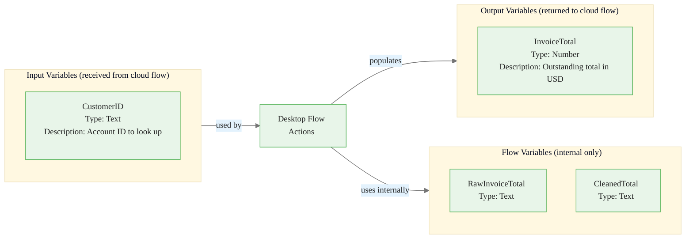

> **On screen:** Variables panel → **+** → **Input** for CustomerID. Variables panel → **+** → **Output** for InvoiceTotal. Save the flow. These now appear in the cloud flow action card automatically.

<strong>Warning:</strong> This is a common source of confusion. Pay close attention to the distinction here.

<!-- Speaker notes: Declaring variables before recording is a professional habit that prevents a common beginner mistake: recording first, then discovering there is no clean way to parameterize the hardcoded values. With input variables declared first, the recorder captures the correct structure and the developer only needs to replace the default value reference. The three-tier variable structure shown here — Input, Output, Flow — is a useful mental model. Input and Output are visible to the cloud flow. Flow variables are private implementation details. Teaching this distinction early prevents learners from accidentally marking internal working variables as outputs. -->

---

# Recording and Editing: The Two-Step Workflow

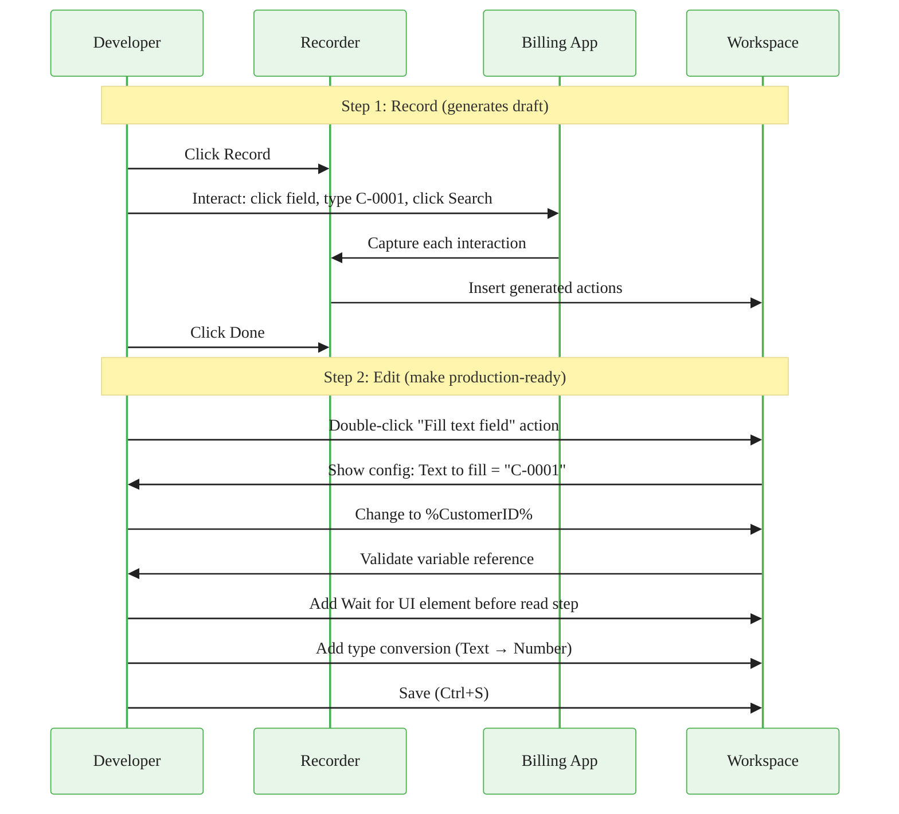

<strong>Info:</strong> This detail is useful context but not required to memorize.

<!-- Speaker notes: The two-step workflow — record, then edit — is the correct mental model. Recordings are rough drafts, not finished products. The most common edits: (1) replace literal strings with variable references (as shown in the diagram), (2) add Wait for UI element actions before steps that depend on a UI loading — recordings capture clicks but not the wait time, (3) fix selector fragility by editing selectors to use stable AutomationId instead of volatile window title or positional index, (4) add type conversions — the UI always returns text, even for numbers. Teach learners that a recording that needs zero edits is the exception; expecting to edit is the professional approach. -->

---

# Triggering the Desktop Flow from a Cloud Flow

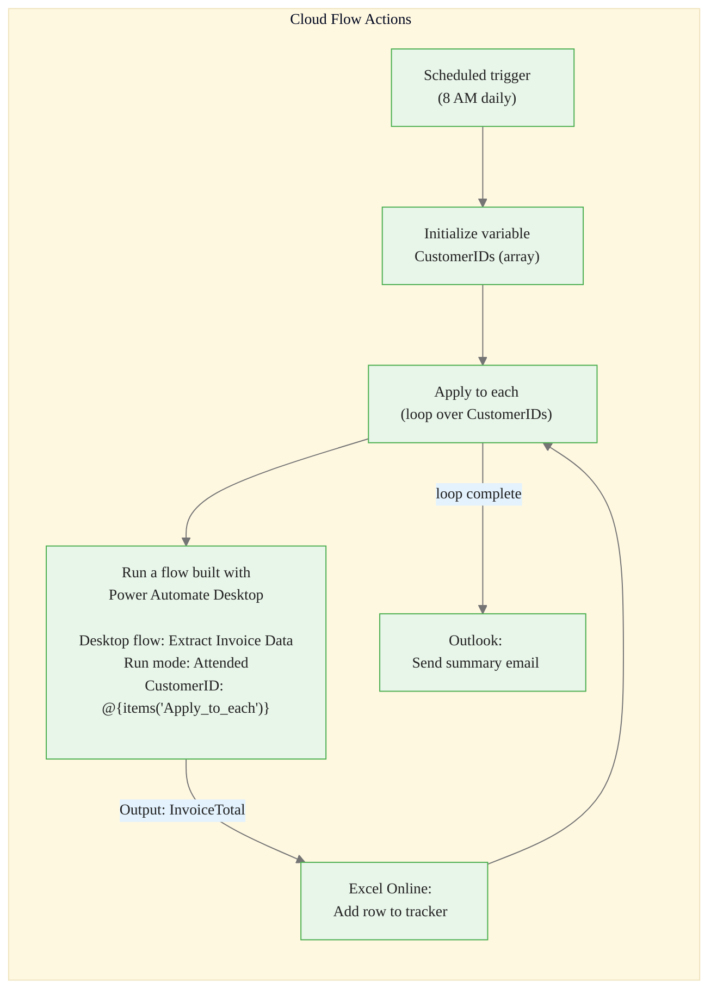

> **On screen:** In the **Run a flow built with Power Automate Desktop** action card, the **Desktop flow** dropdown lists all saved desktop flows. Select **Extract Invoice Data**. The input field **CustomerID** and output **InvoiceTotal** appear automatically — no manual mapping needed.

<!-- Speaker notes: The automatic appearance of input and output fields in the cloud flow action card is one of the best-designed aspects of this integration — the metadata from the desktop flow's variable declarations flows through automatically. This reduces configuration errors significantly. Walk through finding the action: in the cloud flow builder, click "New step" → search "desktop flows" → the action is called "Run a flow built with Power Automate Desktop." It is under the Power Automate Desktop connector. The connector requires the machine to be registered and online at the time the cloud flow runs. -->

---

# Attended vs Unattended: The Core Decision

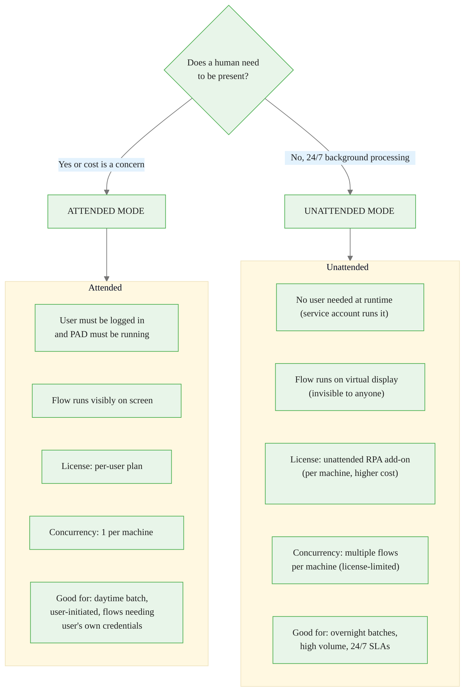

<!-- Speaker notes: The attended vs unattended choice is primarily a licensing and process design decision. Attended is simpler and cheaper — it uses the per-user Power Automate license most organizations already have for cloud flows. Unattended requires an add-on license per machine and a more complex setup (service account, virtual desktop configuration). For a finance team running a daily extract during business hours on their own machines, attended is perfectly appropriate. For a 2 AM nightly batch that must process 10,000 records without anyone present, unattended is required. Emphasize that attended flows run in the user's active session — they can access resources the user can access (including locally-installed software and user-specific credentials). Unattended flows run as a service account — that account must have explicit access to everything the flow needs. -->

---

# Attended vs Unattended: Side-by-Side

| Dimension | Attended | Unattended |
|---|---|---|
| User logged in at runtime | Required | Not required |
| Flow visible on screen | Yes | No (virtual display) |
| License | Per-user plan | Unattended RPA add-on |
| Can run overnight | No | Yes |
| Service account needed | No | Yes |
| Concurrency per machine | 1 | Multiple (license-limited) |
| Setup complexity | Low | Higher |
| Cost | Lower | Higher |
| Best for | Daytime batch, ≤ 100 records | Overnight, high volume, 24/7 SLA |

> **Practical rule:** Start with Attended during development. Switch to Unattended only when business requirements demand overnight or high-volume processing.

<!-- Speaker notes: The "start with attended" advice is practical because attended mode is easier to debug — the developer can watch the flow run and see exactly what happens. Once the flow is proven, converting to unattended is mostly a licensing and service account configuration task; the desktop flow actions themselves do not change. One important nuance: some applications behave differently under a service account versus an interactive user account — pop-ups, license dialogs, and network share access may differ. Always test unattended flows with the service account credentials before deploying to production. -->

---

# Machine Group Architecture

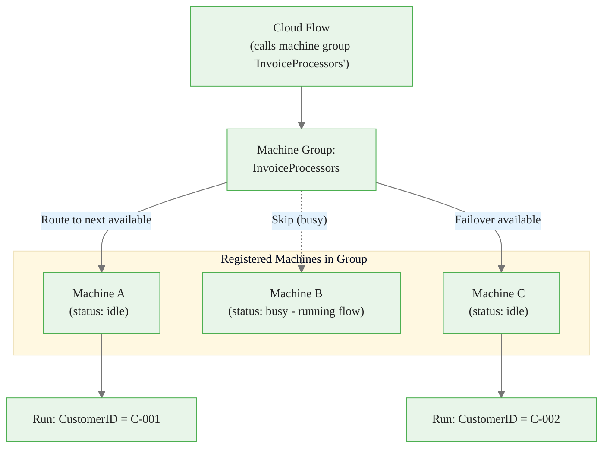

> **On screen:** Navigate to **Monitor** → **Machine groups** → **New machine group**. Add registered machines. Target the group name in the cloud flow action instead of a single machine name.

<!-- Speaker notes: Machine groups are the path to scale. A single machine can only run one attended flow at a time. A machine group with three machines can run three flows concurrently. The cloud flow runtime automatically routes each run to an available machine — the developer does not need to write any load-balancing logic. Machine groups also provide resilience: if Machine B goes offline for maintenance, runs route to A and C automatically. The portal's Monitor → Machine groups view shows real-time status of each machine in the group — online, offline, running, idle. This is the operational monitoring view that an automation COE (Center of Excellence) team would use in production. -->

---

# Error Handling Across the Cloud–Desktop Boundary

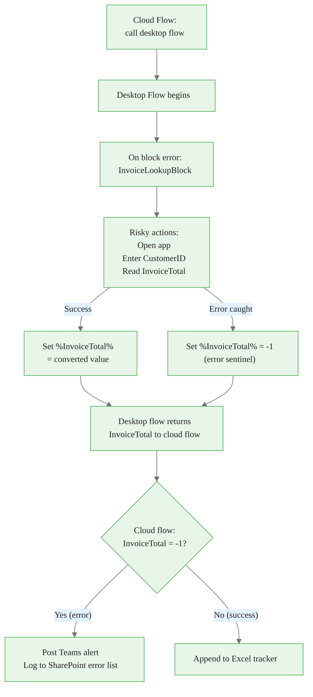

<!-- Speaker notes: The sentinel value pattern (-1 for error) is the recommended approach for signaling desktop flow errors to cloud flows. The alternative — letting the desktop flow throw an unhandled exception — causes the cloud flow action to fail, which stops the entire Apply to each loop and skips all remaining customer IDs. By catching errors internally and returning a sentinel, the cloud flow loop continues for all customers and only the failed records are flagged. The On block error action in the desktop flow is the mechanism. Place it above the risky action sequence, configure "continue flow run on error," and ensure the error path sets the output variables to their sentinel values before the flow exits. The cloud flow then applies conditional logic to each return value. -->

---

# Hybrid Automation Pattern: Cloud → Desktop → Cloud

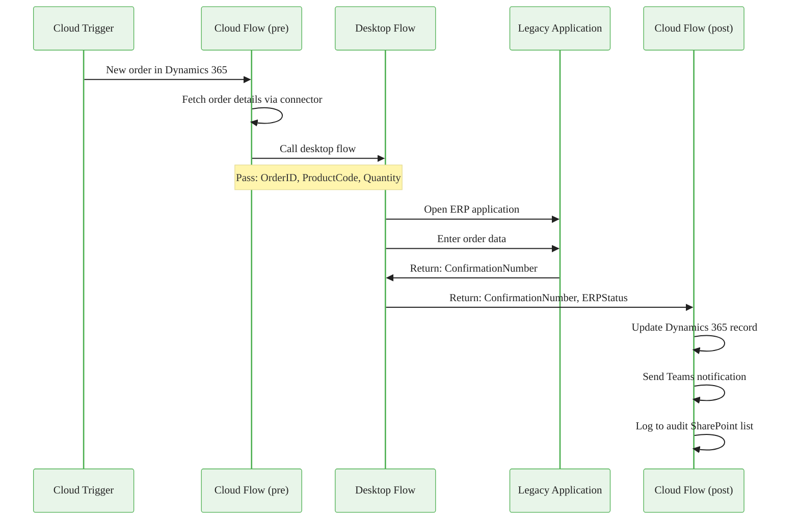

<!-- Speaker notes: This sequence diagram shows the complete hybrid pattern. The Dynamics 365 event triggers the cloud flow, which uses a Dynamics connector to fetch full order details — this is a cloud-to-cloud operation. The cloud flow then delegates only the ERP UI interaction to the desktop flow. After the desktop flow returns, the cloud flow continues with more cloud-to-cloud operations: updating Dynamics, sending a Teams notification, and logging to SharePoint. The key insight is that the desktop flow is a narrow, specialized component — it does the minimum UI work necessary and returns results to the cloud. Keeping the desktop flow focused makes it easier to test, maintain, and replace if the ERP eventually gets an API. -->

---

# Machine Management: Setup and Monitoring

> **On screen:** Machine lifecycle in the Power Automate portal

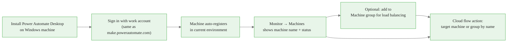

**Machine status meanings:**

| Status | Meaning |
|---|---|
| Online | PAD app is running; machine can accept desktop flow runs |
| Offline | PAD app not running or machine is off; cloud flow runs will queue |
| Running | Machine is actively executing a desktop flow |
| Session disconnected | RDP session was closed; may still be running depending on session type |

<!-- Speaker notes: The Monitor → Machines page is the operational dashboard for desktop flow infrastructure. Teach learners to check machine status before testing a cloud flow that calls a desktop flow — a common frustration is an apparently working cloud flow that queues forever because the machine is Offline. The fix is usually just opening Power Automate Desktop on the machine. For production environments, ensure Power Automate Desktop starts automatically when the machine boots — this is done by adding it to Windows startup or configuring it as a scheduled task that runs at login. For unattended flows, the machine is typically a server VM and the PAD app is configured as a Windows service. -->

---

# Complete Integration Checklist

Before declaring a desktop flow integration production-ready:

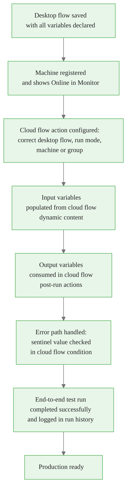

<!-- Speaker notes: Use this checklist as a go/no-go gate before any desktop flow integration goes to production. Walk through each node. The most commonly skipped steps are C6 (error handling) and C7 (end-to-end test on the actual production machine with real data). Developers often test on their own machine in attended mode, then deploy to a production unattended machine and discover the service account lacks rights to the target application. The end-to-end test with the exact production configuration — service account, unattended mode, production machine — is non-negotiable before go-live. -->

---

# Module 07 Guide 02 Summary

**What you now know:**

1. Cloud flows orchestrate desktop flows — the cloud flow holds the trigger, loop, follow-up actions, and error routing; the desktop flow contributes only the UI interaction.

2. **Attended** execution requires a logged-in user; **Unattended** runs in the background on a service account with a premium license add-on.

3. **Machine groups** enable load balancing and failover — target the group name in the cloud flow action instead of a single machine.

4. **Error handling** uses the sentinel value pattern: desktop flow catches errors internally and returns a known "error" value; cloud flow applies conditional logic to route failures appropriately.

5. The **hybrid pattern** (Cloud trigger → Desktop execution → Cloud follow-up) is the dominant production deployment model for organizations with legacy systems.

<!-- Speaker notes: Close by reinforcing the architectural perspective. Desktop flows are not standalone automation tools in production — they are components in a larger cloud-orchestrated pipeline. The cloud flow provides the reliability, monitoring, retry logic, and integration with the rest of the organization's systems. The desktop flow provides the specialized UI capability. Together they close the automation gap that cloud connectors alone cannot address. The notebook (01_rpa_patterns.ipynb) shows Python equivalents of these patterns, which gives technically-oriented learners a familiar reference point for understanding what Power Automate Desktop is doing under the hood. -->

Attended

&#8594;

Machine groups

&#8594;

Error handling

---

<!-- _class: lead -->

# Up Next: The RPA Patterns Notebook

**Notebook 01** explores RPA patterns in Python — using `pyautogui` and `selenium` as conceptual equivalents to Power Automate Desktop actions — and builds a decision framework for choosing between RPA and API integration.

> Open `notebooks/01_rpa_patterns.ipynb` and run cell 1 before the next session.

<!-- Speaker notes: The Python notebook serves two purposes: (1) it gives learners who come from a coding background a familiar reference frame for understanding what RPA tools do mechanically, and (2) it develops decision-making skills for choosing between RPA and API-based automation. The decision framework is the most practically valuable output — in the real world, learners will regularly face the question "should I build an RPA or call the API?" and the framework gives them a principled way to answer it. Remind learners that the notebook is conceptual — they are not expected to build production Python automation from it, but to understand the concepts well enough to make better design decisions in Power Automate. -->
