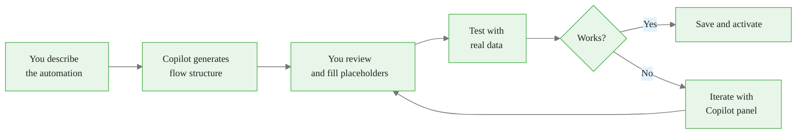
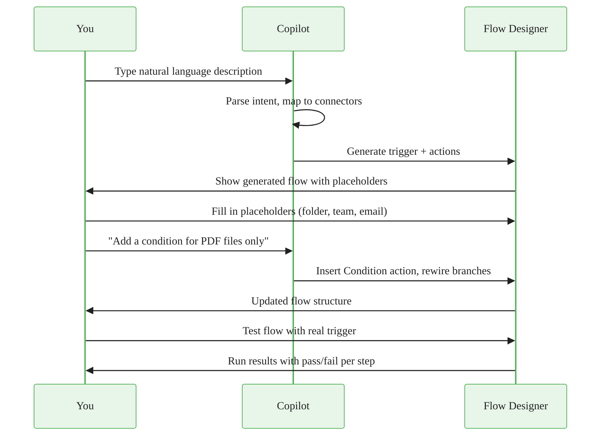
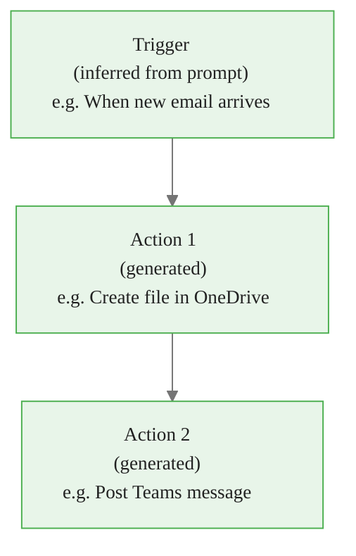
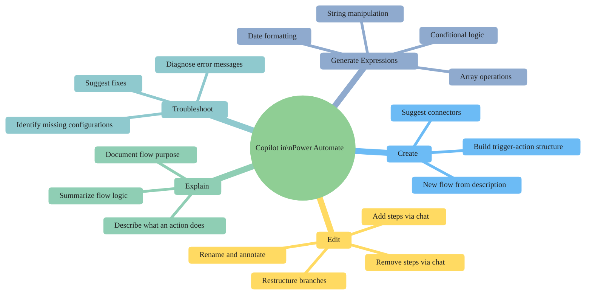
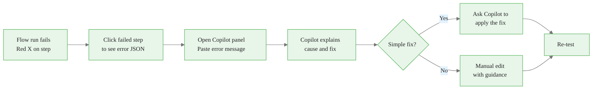

<!-- _class: lead -->

# Copilot in Power Automate

**Module 08 — Copilot and AI in Power Automate**

> Build and edit flows using natural language — describe what you want, review what gets generated, and iterate.

<!--
Speaker notes: Key talking points for this slide
- Welcome to Module 08, the point where automation creation shifts from visual drag-and-drop to conversational AI
- The core promise: you describe the automation in plain English, Copilot generates the structure
- Important framing: Copilot generates a STARTING POINT, not a finished flow — your job is to review, fill in placeholders, and test
- This module covers two major tools: Copilot (natural language flow creation) and AI Builder (embedding AI models into flows)
-->

<!-- Speaker notes: Cover the key points on this slide about Copilot in Power Automate. Pause for questions if the audience seems uncertain. -->

---

# What Copilot Can Do

<div class="columns">
<div>

**Creation**
- Generate flows from natural language prompts
- Suggest connectors and actions automatically
- Build trigger-to-action structure instantly

**Editing**
- Add or remove steps by describing the change
- Restructure logic with conversational prompts

</div>
<div>

**Support**
- Generate Power Automate expressions on demand
- Explain what an existing flow does
- Diagnose and suggest fixes for run errors

</div>
</div>



<!--
Speaker notes: Key talking points for this slide
- The five capabilities map to different stages of the flow development lifecycle
- Creation: fastest path from idea to structure — replaces the connector search and blank canvas problem
- Editing: the Copilot panel stays open inside the designer, so you chat while you build
- Support: expressions and troubleshooting are the hidden power features — most learners discover these late
- The diagram shows the ITERATIVE nature — generating once and saving without testing is a common mistake
-->


<div class="callout-insight">
<strong>Insight:</strong> This is a key takeaway from this section that connects to the broader course themes.
</div>

<!-- Speaker notes: Cover the key points on this slide about What Copilot Can Do. Pause for questions if the audience seems uncertain. -->

---

# Copilot Interaction Model



<!--
Speaker notes: Key talking points for this slide
- Walk through the sequence: your description → Copilot's interpretation → generated structure → your configuration
- Placeholders are the key gap: Copilot cannot know your OneDrive folder path or your Teams channel name
- The chat-based refinement loop (add condition, rewire branches) is the most powerful usage pattern
- Testing with real data is mandatory — never save a Copilot-generated flow without at least one test run
- The sequence shows two rounds; real workflows often have 3-5 refinement rounds before a flow is production-ready
-->


<div class="callout-key">
<strong>Key Point:</strong> Remember this concept — it appears repeatedly in later modules.
</div>

<!-- Speaker notes: Cover the key points on this slide about Copilot Interaction Model. Pause for questions if the audience seems uncertain. -->

---

# Two Ways to Access Copilot

<div class="columns">
<div>

**From the Home Page**

The center of the Home page has a "Describe what you'd like to automate" text field with a lightning bolt icon.

Type and press Enter — Copilot builds the flow and opens the designer.

</div>
<div>

**From Create > Describe it to design it**

Click **+ Create** in the left nav, then select **Describe it to design it** under "Start from a description."

Also: the **Copilot panel** (sparkle icon, top-right of the designer) is available inside any flow for chat-based editing.

</div>
</div>

> The Copilot panel inside the designer is a persistent chat interface — it stays open while you work and lets you ask questions or request changes at any time.

<!--
Speaker notes: Key talking points for this slide
- Two entry points, one underlying capability — they connect to the same Copilot model
- Home page entry point is for NEW flows from scratch
- The Copilot panel inside the designer is for EDITING and SUPPORT on any flow (Copilot-generated or manually built)
- Licensing note: Copilot requires Microsoft 365 Copilot licensing or Power Platform premium — check with your organization
- The sparkle icon (✨) is the universal Microsoft Copilot indicator across M365 apps
-->


<div class="callout-warning">
<strong>Warning:</strong> This is a common source of confusion. Pay close attention to the distinction here.
</div>

<!-- Speaker notes: Cover the key points on this slide about Two Ways to Access Copilot. Pause for questions if the audience seems uncertain. -->

---

# Anatomy of a Copilot-Generated Flow



**What Copilot fills in:** connector choice, action sequence, parameter names

**What YOU must fill in:** specific folder paths, site URLs, channel names, email addresses, dynamic content mappings

> Green = Copilot is confident. Yellow = placeholder required. Always inspect every action before saving.

<!--
Speaker notes: Key talking points for this slide
- Copilot is strong at structure (which connectors, which actions, what order) and weak at specifics (your actual folder names, your actual Teams channels)
- The color coding is a mental model — in the actual UI, look for fields showing placeholder text or empty required fields
- Dynamic content mappings are the most error-prone part: Copilot may reference a field that exists in the schema but not in your actual data
- Practical tip: after Copilot generates the flow, click EVERY action and check that required fields are populated
-->


<div class="callout-info">
<strong>Info:</strong> This detail is useful context but not required to memorize.
</div>

<!-- Speaker notes: Cover the key points on this slide about Anatomy of a Copilot-Generated Flow. Pause for questions if the audience seems uncertain. -->

---

<!-- _class: lead -->

# Prompt Engineering for Better Flows

<!--
Speaker notes: Key talking points for this slide
- Transitioning from "what Copilot can do" to "how to get the best results"
- The quality difference between a vague prompt and a specific prompt is dramatic
- This section gives learners concrete patterns they can use immediately
-->

<!-- Speaker notes: Cover the key points on this slide about Prompt Engineering for Better Flows. Pause for questions if the audience seems uncertain. -->

---

# What Makes a Good Copilot Prompt

<div class="columns">
<div>

**Include in your prompt:**
- The specific trigger (what starts it)
- The systems involved (OneDrive, Teams, SharePoint)
- The actions in sequence
- Any conditions or filters
- What NOT to include (exclusions)

</div>
<div>

**Avoid:**
- Generic verbs ("do something with," "handle")
- Missing the trigger ("save files and notify")
- Ambiguous system references ("save to storage")
- Single-word prompts ("approval flow")

</div>
</div>

<!--
Speaker notes: Key talking points for this slide
- The trigger is the most important part — without a clear trigger, Copilot guesses and often guesses wrong
- Named systems (OneDrive vs SharePoint vs Azure Blob) tell Copilot which connector to use — ambiguity forces a coin flip
- Conditions described explicitly produce condition blocks; conditions described vaguely produce missing logic
- The NOT exclusion pattern is underused: "do not process files in subfolders" prevents a common mistake
-->

<!-- Speaker notes: Cover the key points on this slide about What Makes a Good Copilot Prompt. Pause for questions if the audience seems uncertain. -->

---

# Prompt Before/After Comparison

<div class="columns">
<div>

**Before (vague)**

```
save email attachments somewhere
and let me know
```

Copilot generates:
- Wrong trigger (scheduled, not email)
- Generic "create file" with no path
- Missing notification action

</div>
<div>

**After (specific)**

```
When I receive an email with an
attachment in Outlook, save each
attachment to the /Attachments
folder in my OneDrive and send
me a Teams chat message with the
file name and sender's address
```

Copilot generates:
- Correct Outlook trigger with attachment filter
- OneDrive create file with dynamic name
- Teams personal chat notification

</div>
</div>

<!--
Speaker notes: Key talking points for this slide
- The vague version forces Copilot to make 3-4 guesses, each of which may be wrong
- The specific version gives Copilot enough signal to get the connector, trigger type, and action sequence correct
- "Each attachment" signals to Copilot that an Apply to Each loop is needed — without it, the flow may only process the first attachment
- The Teams "personal chat" vs "channel post" distinction matters — being specific avoids extra configuration
- Practice exercise: take a vague prompt and rewrite it using the before/after framework
-->

<!-- Speaker notes: Cover the key points on this slide about Prompt Before/After Comparison. Pause for questions if the audience seems uncertain. -->

---

# Copilot Capabilities Map



<!--
Speaker notes: Key talking points for this slide
- The mindmap shows the FULL scope — many users only discover the Create capability and miss the other four
- Generate Expressions is the sleeper feature: expressions like formatDateTime and substring are where most beginners get stuck, and Copilot handles them conversationally
- Troubleshoot is invaluable for learners: paste the error JSON and ask for a fix — much faster than searching documentation
- Explain is useful for flows you inherit from colleagues — ask "what does this flow do?" before modifying someone else's automation
-->

<!-- Speaker notes: Cover the key points on this slide about Copilot Capabilities Map. Pause for questions if the audience seems uncertain. -->

---

# Generating Expressions with Copilot

Ask the Copilot panel in plain English:

| What You Ask | Expression Copilot Returns |
|---|---|
| Format today as MM/DD/YYYY | `formatDateTime(utcNow(), 'MM/dd/yyyy')` |
| Get first 100 chars of a string | `substring(variables('Text'), 0, 100)` |
| Check if subject contains "urgent" | `contains(triggerBody()?['Subject'], 'urgent')` |
| Days between two dates | `div(sub(ticks(variables('End')), ticks(variables('Start'))), 864000000000)` |
| Convert string to lowercase | `toLower(triggerBody()?['Name'])` |

> Always test expressions in the expression editor's **Test** tab before embedding them in a live flow.

<!--
Speaker notes: Key talking points for this slide
- Power Automate expressions follow a Workflow Definition Language — similar to Excel formulas but different syntax
- Learners do NOT need to memorize expression syntax — Copilot generates it on demand
- The key skill is knowing WHEN you need an expression: any time a field needs dynamic calculation, not just a static value
- The test tab in the expression editor lets you preview the output — use it every time
- Copy the expression from the Copilot panel chat, paste it into the expression editor — straightforward workflow
-->

<!-- Speaker notes: Cover the key points on this slide about Generating Expressions with Copilot. Pause for questions if the audience seems uncertain. -->

---

# Troubleshooting Errors with Copilot



**Common errors Copilot diagnoses well:**
- Array index out of range (no attachments, empty list)
- Missing required field (null dynamic content)
- Connection not authorized (need to reconnect)
- Expression syntax errors

<!--
Speaker notes: Key talking points for this slide
- The error → Copilot → fix loop reduces debugging time dramatically for beginners
- Paste the FULL error JSON — truncated messages give Copilot less signal
- "Array index out of range" is the most common beginner error: triggers fire even when collections are empty
- "Connection not authorized" cannot be fixed by Copilot — it requires re-signing into the connector
- After Copilot suggests a fix, ask it to apply it: "add a condition to check if there are attachments before proceeding"
-->

<!-- Speaker notes: Cover the key points on this slide about Troubleshooting Errors with Copilot. Pause for questions if the audience seems uncertain. -->

---

# Copilot Limitations

| Limitation | Impact | Workaround |
|---|---|---|
| Cannot read your data | Folder paths, channel names left blank | Fill placeholders manually |
| Complex loops may be wrong | Nested Apply to Each incorrect | Rebuild manually |
| Expression field names may be wrong | Expression references missing field | Test in expression editor |
| Advanced settings not configured | Pagination, retry left at defaults | Configure manually after |
| Uncommon connectors underrepresented | May suggest wrong connector | Use manual connector search |
| Large flows built at once are imprecise | 15+ step flows often have gaps | Build iteratively in steps |

> Rule of thumb: Copilot is excellent for flows with 1 trigger and 2-6 actions. For flows with branching, loops, and error handling, use Copilot to build the skeleton and manual editing to complete it.

<!--
Speaker notes: Key talking points for this slide
- This slide prevents a common frustration: learners who expect Copilot to generate a production-ready flow on the first prompt
- The "skeleton" mental model is the right expectation: Copilot gives you the structure, you provide the specifics
- The 1 trigger + 2-6 actions guideline is a practical heuristic, not a hard limit
- Nested Apply to Each loops are particularly prone to wrong structure — always verify the branch logic manually
- Pagination settings (for SharePoint lists with 5000+ items) are never configured by Copilot — this is a common production gap
-->

<!-- Speaker notes: Cover the key points on this slide about Copilot Limitations. Pause for questions if the audience seems uncertain. -->

---

<!-- _class: lead -->

# Key Takeaways

<!--
Speaker notes: Key talking points for this slide
- Summary slide — reinforce the three-part mental model: generate, fill, iterate
- The next guide covers AI Builder actions, which extend this workflow with pre-built AI models
-->

<!-- Speaker notes: Cover the key points on this slide about Key Takeaways. Pause for questions if the audience seems uncertain. -->

---

# What to Remember

<div class="columns">
<div>

**The Copilot Workflow**
1. Write a specific, trigger-first prompt
2. Review generated structure
3. Fill in all placeholders
4. Test with real data
5. Iterate with the Copilot panel
6. Manual edit for complex logic

</div>
<div>

**Copilot Strengths**
- Flow structure from plain English
- Expression generation on demand
- Error diagnosis in plain English
- Iterative editing via chat

**Copilot Limits**
- Cannot read your specific data
- Complex logic needs manual review
- Build iteratively for large flows

</div>
</div>

> Next: AI Builder actions — embedding pre-built AI models (sentiment analysis, document processing, text generation) directly into your flows.

<!--
Speaker notes: Key talking points for this slide
- The six-step workflow is the practical takeaway — post this somewhere visible while practicing
- The strengths and limits columns give learners a decision framework: "should I ask Copilot or edit manually?"
- Bridge to the next guide: AI Builder takes Copilot-assisted flows further by adding AI processing capabilities to the flow logic itself
- Encourage learners to practice: take a real automation they currently do manually and try to prompt Copilot to build it
-->

<!-- Speaker notes: Cover the key points on this slide about What to Remember. Pause for questions if the audience seems uncertain. -->
