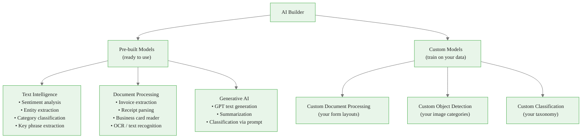
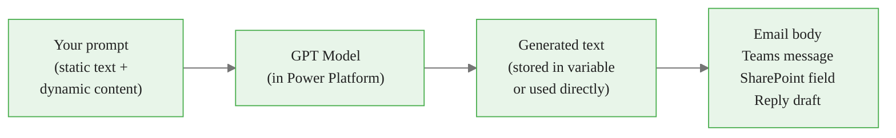
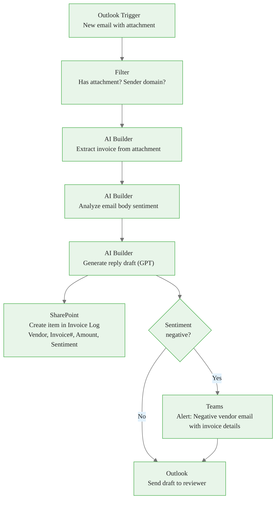
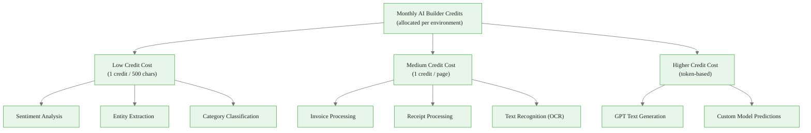
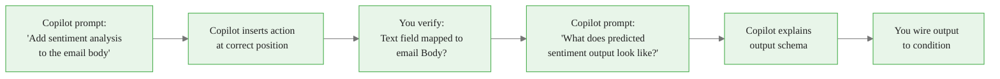

<!-- _class: lead -->

# AI Builder Actions in Power Automate

**Module 08 — Copilot and AI in Power Automate**

> Embed pre-built AI models into your flows — analyze sentiment, extract invoice data, classify text, and generate replies without writing any ML code.

<!--
Speaker notes: Key talking points for this slide
- AI Builder is the second major capability in Module 08 — Copilot helps you BUILD flows, AI Builder helps you process data WITHIN flows
- The value proposition: Microsoft-trained AI models available as simple drag-and-drop actions
- No data science required — pre-built models work out of the box for common business documents and text
- This guide covers the most useful action types for business automation scenarios
-->

<!-- Speaker notes: Cover the key points on this slide about AI Builder Actions in Power Automate. Pause for questions if the audience seems uncertain. -->

---

# AI Builder Model Types



<!--
Speaker notes: Key talking points for this slide
- Two branches: pre-built (zero setup, works immediately) and custom (requires training data and time)
- For this module, focus on the pre-built branch — 80% of business automation scenarios are covered
- The GPT text generation action is the most powerful and flexible — it can do summarization, classification, and generation using natural language prompts
- Custom models are introduced here but covered in depth in advanced modules
- Document processing models (invoices, receipts) are remarkably accurate for standard formats — Microsoft trained them on millions of real documents
-->


<div class="callout-insight">
<strong>Insight:</strong> This is a key takeaway from this section that connects to the broader course themes.
</div>

<!-- Speaker notes: Cover the key points on this slide about AI Builder Model Types. Pause for questions if the audience seems uncertain. -->

---

# Pre-built Text Intelligence Actions

<div class="columns">
<div>

**Sentiment Analysis**
- Input: any text
- Output: Positive / Negative / Neutral / Mixed
- + confidence score per sentiment
- Use: route support tickets, flag negative feedback

**Entity Extraction**
- Input: any text
- Output: array of (type, value) pairs
- Types: Person, Org, Location, DateTime, Quantity
- Use: extract names, dates from unstructured text

</div>
<div>

**Category Classification**
- Input: text + your category list
- Output: best matching category + confidence
- Use: classify support tickets, tag documents

**Key Phrase Extraction**
- Input: any text
- Output: list of key phrases
- Use: auto-tag documents, build search indexes

</div>
</div>

<!--
Speaker notes: Key talking points for this slide
- All four actions share the same pattern: text in → structured data out
- Sentiment analysis is the most commonly used — practically every customer-facing automation can benefit from knowing if an incoming message is negative
- Entity extraction is underused but very powerful: it converts free-form text into structured fields without any configuration
- Category classification requires you to define your categories — the model adapts to your taxonomy using few-shot learning built into the prompt
- Key phrase extraction creates a tag list automatically — useful for SharePoint document tagging workflows
-->


<div class="callout-key">
<strong>Key Point:</strong> Remember this concept — it appears repeatedly in later modules.
</div>

<!-- Speaker notes: Cover the key points on this slide about Pre-built Text Intelligence Actions. Pause for questions if the audience seems uncertain. -->

---

# Document Processing Actions

<div class="columns">
<div>

**Invoice Processing**

Extracts from PDF/image invoices:
- Vendor name and address
- Invoice number, date, due date
- Line items (description, quantity, price)
- Subtotal, tax, total

Supports: PDF, JPEG, PNG, TIFF, BMP
Max size: 20 MB

</div>
<div>

**Receipt Processing**

Extracts from receipt images:
- Merchant name and address
- Transaction date and time
- Line items with prices
- Total, tax, tip
- Payment method

Best for: standard retail, restaurant, travel receipts

</div>
</div>

> Pre-built document models are trained on millions of real documents. For non-standard layouts (custom forms, legal contracts, multi-page tables), use custom document processing models.

<!--
Speaker notes: Key talking points for this slide
- These actions replace manual data entry — the "extract from invoice" use case alone justifies AI Builder adoption for any company processing vendor invoices
- The file format requirements are important: PDFs work best when they are machine-generated (not scanned handwritten documents)
- The max file size limit (20 MB) is rarely hit for standard documents but worth knowing for multi-page PDFs
- Pre-built vs custom: if your invoices come from major vendors (standard QuickBooks, SAP, etc. formats), pre-built works. Custom layouts (government forms, proprietary formats) need custom models
- Accuracy tip: rotate images right-side up before processing — orientation affects extraction accuracy significantly
-->


<div class="callout-warning">
<strong>Warning:</strong> This is a common source of confusion. Pay close attention to the distinction here.
</div>

<!-- Speaker notes: Cover the key points on this slide about Document Processing Actions. Pause for questions if the audience seems uncertain. -->

---

# GPT Text Generation Action

The **Create text with GPT using a prompt** action is the most flexible AI Builder action.



**Prompt pattern:**
```
Role: You are a [role description].

Task: [what to do with the input]

Input: [dynamic content from flow]

Constraints: [length, format, tone, exclusions]
```

<!--
Speaker notes: Key talking points for this slide
- GPT text generation is the "AI Swiss Army knife" in Power Automate — with the right prompt it can summarize, classify, extract, translate, and generate
- The prompt follows the same pattern as direct LLM prompting — role + task + input + constraints
- The output is plain text, which you can write to any text field: email body, SharePoint column, Teams message, Word document
- Credit cost: GPT actions consume more credits than the analytic actions — factor this into high-volume flows
- The model runs inside the Power Platform data boundary — data does not go to external OpenAI endpoints directly, which matters for enterprise data governance
-->


<div class="callout-info">
<strong>Info:</strong> This detail is useful context but not required to memorize.
</div>

<!-- Speaker notes: Cover the key points on this slide about GPT Text Generation Action. Pause for questions if the audience seems uncertain. -->

---

# Email Processing Pipeline with AI Builder



<!--
Speaker notes: Key talking points for this slide
- This is the reference architecture for the step-by-step guide in this module
- Three AI Builder steps in sequence: extract (structured data from document), analyze (classification of text), generate (new text from context)
- The filter step is critical — without it, the flow fires on every email, including internal emails without attachments
- The sentiment condition is the routing branch — negative sentiment gets an escalation alert to Teams before the draft goes to the reviewer
- The SharePoint step captures the audit trail: every processed invoice is logged regardless of sentiment
- Walking through this diagram before the hands-on portion helps learners understand what they are building
-->

<!-- Speaker notes: Cover the key points on this slide about Email Processing Pipeline with AI Builder. Pause for questions if the audience seems uncertain. -->

---

# AI Builder Credit Consumption Model



<!--
Speaker notes: Key talking points for this slide
- Credits are the "currency" for AI Builder — each model call costs credits from the environment's monthly allocation
- Three tiers: text analytics (cheapest), document processing (medium), generative AI (most expensive)
- For planning purposes: a flow processing 100 emails/day with sentiment analysis costs roughly 100 credits/day — modest
- A flow processing 100 invoices/day with multi-page PDFs could cost 300-500 credits/day — needs planning
- GPT text generation costs depend on prompt length and output length — longer prompts cost more
- Credit exhaustion stops AI Builder actions with an error — monitor usage in the Power Platform admin center
- Organizations can purchase AI Builder credit add-ons if the included allocation is insufficient
-->

<!-- Speaker notes: Cover the key points on this slide about AI Builder Credit Consumption Model. Pause for questions if the audience seems uncertain. -->

---

# Copilot-Assisted Flow Editing with AI Builder

Use the Copilot panel to add and configure AI Builder steps conversationally:

<div class="columns">
<div>

**What Copilot handles well:**
- Adding AI Builder actions at the right position
- Wiring obvious output → input connections
- Explaining what each action returns
- Adding conditions based on AI outputs

</div>
<div>

**What you configure manually:**
- Specific field name mappings in outputs
- GPT prompt text (write this yourself)
- Apply to Each loop for multi-item arrays
- Credit cost planning per flow

</div>
</div>



<!--
Speaker notes: Key talking points for this slide
- The split between Copilot-handled and manually-configured is the practical workflow
- Copilot is accurate at inserting the action and placing it in the right sequence
- Copilot is less reliable at field-level mapping — "which field name is the extracted total amount?" needs manual verification
- The "explain output schema" query to Copilot is very useful: ask "what fields does invoice processing return?" and use the answer to configure downstream steps
- GPT prompt text is always written by you — do not ask Copilot to write your AI Builder prompt, because that produces generic results
-->

<!-- Speaker notes: Cover the key points on this slide about Copilot-Assisted Flow Editing with AI Builder. Pause for questions if the audience seems uncertain. -->

---

# Best Practices

<div class="columns">
<div>

**Prompt Design (GPT actions)**
- State a role: "You are a..."
- Specify output format and length
- Include dynamic context fields
- Say what NOT to do
- Test with representative data

**Flow Validation**
- Test with non-production data first
- Create test SharePoint lists and Teams channels
- Check dynamic content field names in run history
- Verify credit consumption before going live

</div>
<div>

**Performance and Cost**
- Add filters at the trigger to reduce unnecessary runs
- Cache AI outputs in variables before reusing
- Avoid AI Builder calls in high-volume loops (thousands of items)
- Monitor credit usage weekly during initial rollout

**Error Handling**
- AI Builder actions fail on unsupported file types
- Add a Configure Run After with "has failed" to catch extraction errors
- Log failures to SharePoint for review

</div>
</div>

<!--
Speaker notes: Key talking points for this slide
- Role-based GPT prompts consistently outperform generic prompts — the model "adopts" the persona and applies relevant domain knowledge
- The non-production testing rule is critical: AI Builder actions WRITE data — always test where you can clean up
- High-volume loops are the most common credit drain: never put an AI Builder call inside an Apply to Each loop that iterates over thousands of items
- Configure Run After for error handling is essential for production flows — without it, one bad file crashes the entire flow
- Weekly credit monitoring during rollout prevents the surprise of running out mid-month
-->

<!-- Speaker notes: Cover the key points on this slide about Best Practices. Pause for questions if the audience seems uncertain. -->

---

<!-- _class: lead -->

# Key Takeaways

<!--
Speaker notes: Key talking points for this slide
- Summary slide — three-part mental model: choose the right action, wire the outputs, handle credits and errors
- This module bridges reactive automation (flows) with intelligent automation (AI-powered flows)
-->

<!-- Speaker notes: Cover the key points on this slide about Key Takeaways. Pause for questions if the audience seems uncertain. -->

---

# What to Remember

<div class="columns">
<div>

**AI Builder Action Types**
- Sentiment analysis → route by tone
- Entity extraction → structure free text
- Category classification → route by topic
- Invoice / receipt processing → structured data from documents
- GPT text generation → summarize, draft, classify

</div>
<div>

**The Build Pattern**
1. Trigger provides raw data
2. AI Builder processes it
3. Conditions route on AI output
4. Actions write results

**Credit Awareness**
- Text analytics: low cost
- Document processing: medium cost
- GPT generation: token-based, plan ahead

</div>
</div>

> Next module: Copilot agents — autonomous AI workflows that reason and act across multiple steps without a human in the loop.

<!--
Speaker notes: Key talking points for this slide
- The action types list maps directly to business scenarios — sentiment routes support tickets, invoice processing replaces manual data entry, GPT drafts replies
- The four-step build pattern is the repeatable template for every AI Builder flow
- Credit awareness is a practical skill: building a flow that costs 10,000 credits/day needs approval and planning, not just technical implementation
- Bridge to next module: Copilot agents go beyond individual flows — they make decisions and chain multiple actions autonomously, which is the direction intelligent automation is heading
-->

<!-- Speaker notes: Cover the key points on this slide about What to Remember. Pause for questions if the audience seems uncertain. -->
