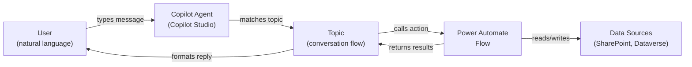
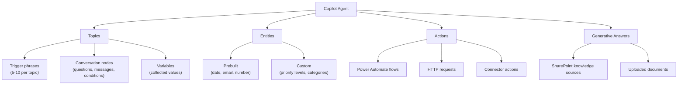
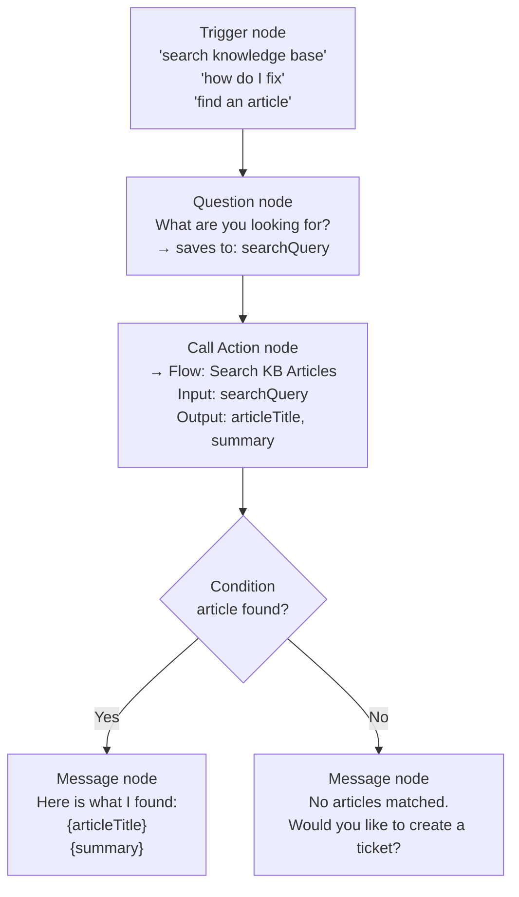
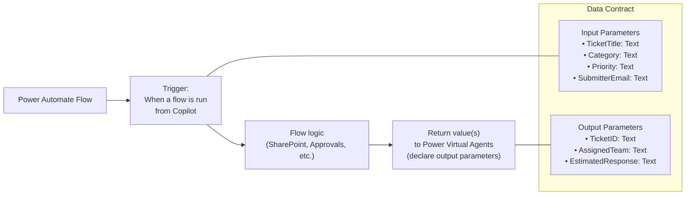
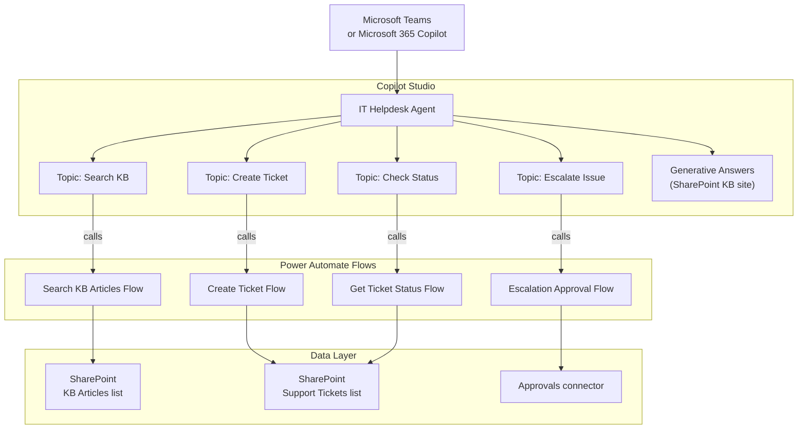
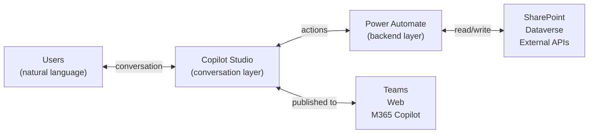

<!-- _class: lead -->

# Copilot Agents with Power Automate

**Module 09 — Building Copilot Agents with Copilot Studio**

> Where standalone flows respond to events, Copilot agents respond to people.

<!--
Speaker notes: Key talking points for this slide
- This is the capstone module: everything built in modules 01–08 feeds into what we build here
- Copilot Studio was formerly called Power Virtual Agents — learners may see that name in older documentation
- The core shift: we are adding a conversational interface in front of Power Automate automation
- By the end of this module learners will have a working IT helpdesk agent connected to real Power Automate flows
-->

---

# What Is a Copilot Agent?



- **Agent** = conversational shell that understands natural language
- **Topic** = structured conversation unit wired to actions
- **Flow** = backend automation that handles data and systems

<!--
Speaker notes: Key talking points for this slide
- The diagram shows the complete data path from user message to data source and back
- The agent itself does not access data directly — flows are the data layer
- Topics are the intelligence layer: they decide which flow to call and what parameters to pass
- Emphasise: this is not a chatbot for conversation's sake — it is automation with a conversational front-end
-->

---

# Agent vs. Standalone Flow: Decision Matrix

| Scenario | Use Standalone Flow | Use Copilot Agent |
|----------|--------------------|--------------------|
| Trigger | Automated event | User initiates on demand |
| Request format | Always identical | Variable, natural language |
| User interaction | None needed | Questions, clarifications |
| Output destination | System (write to list, send email) | User sees conversational reply |
| NLU required | No | Yes |

**Rule of thumb:** If a human needs to ask the automation something first, use an agent.

<!--
Speaker notes: Key talking points for this slide
- The most common mistake is building an agent for something that should be a simple flow
- Example of when NOT to use an agent: daily report email — that is a scheduled flow, no conversation needed
- Example of when an agent is essential: "I need to book a meeting room" — the request type varies, clarifying questions are needed, user expects a reply
- Both can coexist: agent collects context, flow does the work
-->

---

<!-- _class: lead -->

# Copilot Studio Components

<!--
Speaker notes: Key talking points for this slide
- Copilot Studio is a separate application from Power Automate, but they integrate tightly
- URL: copilotstudio.microsoft.com — bookmark this
- The three building blocks we care about most: Topics, Entities, Actions
- Generative AI features (Generative Answers) are the fourth dimension — powerful for knowledge base scenarios
-->

---

# Copilot Studio: Four Building Blocks



<!--
Speaker notes: Key talking points for this slide
- Topics: the primary unit of agent design — one topic per distinct user intent
- Entities: what the agent extracts from user messages — "urgent" becomes Priority=High
- Actions: the integration point — Power Automate flows are called here
- Generative Answers: the escape hatch for questions that don't match any topic
- In this module we focus primarily on Topics and Actions
-->

---

# Topics: Conversation Structure



<!--
Speaker notes: Key talking points for this slide
- This is a typical topic structure: trigger → collect → act → condition → respond
- Each node type has a specific purpose: triggers (entry points), questions (data collection), actions (integration), messages (replies)
- The condition node is identical in concept to the Condition control in Power Automate
- Variables (searchQuery, articleTitle, summary) are topic-scoped — they exist for the lifetime of the conversation topic
-->

---

# Entities: Extracting Structured Data

```
User says: "My laptop screen is cracked and it's urgent"

Without entities:          With entities configured:
─────────────────          ────────────────────────────
Raw text only              Category  = Hardware      (custom entity)
Agent must ask             Component = Screen        (custom entity)
  "What type?"             Priority  = Critical      (mapped from "urgent")
  "How urgent?"
  "Hardware or software?"
```

**Custom entity configuration:**
- Category entity: Hardware, Software, Network, Account, Other
- Priority entity: Low, Medium, High, Critical (with synonyms: "urgent" → Critical, "ASAP" → High)

<!--
Speaker notes: Key talking points for this slide
- Entities eliminate the need for a follow-up question when the user already stated the value
- The synonym mapping is what makes "urgent" automatically resolve to "Critical" — configure this in the entity definition
- Fewer questions = faster resolution = better user experience
- Prebuilt entities (email, date, number) work out of the box — no configuration needed
- Custom entities are defined once and reused across all topics in the agent
-->

---

<!-- _class: lead -->

# Connecting Power Automate Flows

<!--
Speaker notes: Key talking points for this slide
- This is the most technically important section — the integration between Copilot Studio and Power Automate
- The key rule: flows must use a specific trigger to be visible in Copilot Studio
- There is a formal data contract: input parameters and output parameters must be declared
- Mistakes here are the most common source of broken agents in production
-->

---

# Flow Requirements for Agent Actions



<!--
Speaker notes: Key talking points for this slide
- The trigger "When a flow is run from Copilot" is in the Microsoft Copilot Studio connector — search for it exactly
- Input parameters are what the agent sends to the flow; output parameters are what the flow sends back
- The "Return value(s) to Power Virtual Agents" action is the last step of every agent-callable flow
- If either the trigger or the return action is missing, the flow will not appear or will not return data
- Both trigger inputs and return outputs require a type declaration: Text, Number, Boolean, or Table
-->

---

# Wiring Flow to Topic: The Mapping Step

```
Copilot Studio — Action node configuration
─────────────────────────────────────────────────────────
Flow: "Create Support Ticket"

INPUT MAPPING                    OUTPUT MAPPING
─────────────────                ────────────────────────
Flow parameter  ← Topic variable  Flow output    → Topic variable
TicketTitle  ← ticketDescription  TicketID    → createdTicketID
Category     ← issueCategory      AssignedTeam→ responsibleTeam
Priority     ← urgencyLevel       EstimatedRes→ responseTimeEstimate
SubmitterEmail← System.User.Email
```

> **On screen:** In Copilot Studio's action node, input parameters appear as a list on the left. Click the arrow next to each parameter to open a variable picker showing all available topic variables plus system variables like `System.User.Email`.

<!--
Speaker notes: Key talking points for this slide
- The mapping step is where Copilot Studio variables connect to flow parameters — this is the handshake
- System.User.Email is provided automatically when the agent is published to Teams with authentication — no question needed
- Output variables from the flow are created automatically when you configure the action node — Copilot Studio names them based on the flow's declared output parameter names
- After the action node, these output variables are available to all subsequent nodes in the topic
-->

---

# Agent Architecture: Full Stack View



<!--
Speaker notes: Key talking points for this slide
- This is the complete architecture for Guide 02's IT helpdesk agent — preview it here, build it in the next guide
- Four topics, four flows, two SharePoint lists — a practical but realistic scope
- The agent also has Generative Answers pointing to the SharePoint KB site for questions that don't match any topic
- Teams is the primary channel but the same agent can publish to web or M365 Copilot simultaneously
- The Approvals connector in the escalation flow connects back to the approval infrastructure from Module 06
-->

---

# Authentication and Security Model

<div class="columns">
<div>

**Connection credentials**
- Flows run under the connection account, not the user
- Use a dedicated service account in production
- Service account needs permissions to SharePoint sites / Dataverse tables it accesses

**User identity in agent**
- Teams channel: Azure AD SSO — `System.User.Email` is available
- Web channel: no identity unless user provides it
- Pass user identity to flows as a parameter for audit trails

</div>
<div>

**DLP policies**
- Apply in Power Platform Admin Center
- Controls which connectors flows (and therefore agents) can use
- Same DLP policies apply to all flows in the environment

**Environment variables**
- Use for: SharePoint URLs, list names, API endpoints
- Change across environments without editing flows
- Set in Power Platform Admin Center or within the solution

</div>
</div>

<!--
Speaker notes: Key talking points for this slide
- The service account pattern is the most important production security practice — use it consistently
- The reason flows don't run as the calling user by default: it would require each user to consent to connections separately
- System.User.Email being available in Teams means the agent can personalise responses and stamp records with the real user
- DLP policies are the guardrails set by administrators — makers don't control these, they work within them
- Environment variables prevent hardcoded URLs from breaking when a solution is promoted from dev to production
-->

---

# Creating Your First Agent: Checklist

```
Step 1  copilotstudio.microsoft.com → + New agent → Skip to configure
        ├── Name: descriptive and audience-appropriate
        ├── Description: what the agent does (used in discovery)
        └── Instructions: behavioral guidelines for generative AI features

Step 2  Build Power Automate flows first
        ├── Trigger: "When a flow is run from Copilot"
        ├── Declare all input parameters with types
        ├── Add business logic (SharePoint, approvals, etc.)
        └── Return value(s) to Power Virtual Agents

Step 3  Create topics in Copilot Studio
        ├── Add 5-10 trigger phrases per topic
        ├── Add Question nodes to collect required parameters
        ├── Add Call Action → Flow to call your flow
        └── Add Message nodes to display flow output

Step 4  Test in the Test canvas (right-hand pane)
        └── Verify each topic routes correctly and flows return data

Step 5  Publish
        └── Settings → Channels → Teams / Web / M365 Copilot
```

<!--
Speaker notes: Key talking points for this slide
- Build the flows before building the topics — you need the flows to exist before you can wire them into topics
- The checklist order matters: environment setup → flows → agent topics → test → publish
- Each step in the checklist corresponds to a detailed walkthrough in Guide 01 and Guide 02
- Testing in the Test canvas before publishing prevents users from seeing broken conversations
- Publishing to Teams is the most common first channel for internal enterprise agents
-->

---

# Summary



**Key takeaways:**
- Copilot agents add a conversational interface to Power Automate flows
- Topics define what the agent understands; flows define what the agent does
- Flows need the Copilot Studio trigger and a return action to be callable from agents
- Publish to Teams for authenticated internal use; web for broader access

<!--
Speaker notes: Key talking points for this slide
- The diagram captures the entire module in one image: users speak to the agent, agent calls flows, flows touch data
- Repeat the core rule: topics = understanding, flows = doing
- Next guide builds this end-to-end with a real IT helpdesk scenario — four topics, four flows, two SharePoint lists
- Learners who complete Guide 02 will have a production-ready agent architecture they can reuse for any support workflow
-->
