<!-- _class: lead -->

# Building an IT Helpdesk Copilot Agent

**Module 09 — End-to-End Project**

> Four topics. Four flows. Two SharePoint lists. One agent your colleagues will actually use.

<!--
Speaker notes: Key talking points for this slide
- This is the capstone project for the entire Power Automate course
- Everything from modules 01-08 converges here: SharePoint (05), Approvals (06), Copilot (08), and now agent architecture
- The IT helpdesk agent is a real-world pattern that can be adapted to HR, Finance, Legal, or any service desk scenario
- Learners should follow Guide 02 step-by-step alongside this deck
-->

---

# Project Architecture

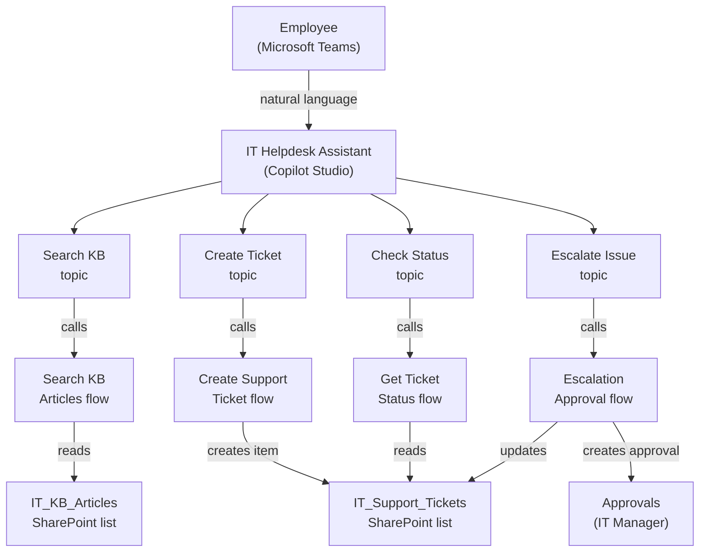

<!--
Speaker notes: Key talking points for this slide
- This is the complete system — everything that will be built across Steps 1-5 of Guide 02
- Read the diagram top-to-bottom: user → agent → topic → flow → data source
- Notice that F2, F3, and F4 all interact with the IT_Support_Tickets list — it is the central data store
- The Approvals connector in F4 connects back to the approval infrastructure learners built in Module 06
- Take a moment to count the components: 1 agent, 4 topics, 4 flows, 2 SharePoint lists, 1 approvals connection
-->

---

# Step 1: Data Layer — Two SharePoint Lists

<div class="columns">
<div>

**IT_KB_Articles**
| Column | Type |
|--------|------|
| Title | Text |
| Category | Choice |
| Summary | Multi-line text |
| ArticleBody | Rich text |
| Keywords | Text |
| ArticleURL | Hyperlink |
| IsActive | Yes/No |

</div>
<div>

**IT_Support_Tickets**
| Column | Type |
|--------|------|
| TicketID | Text |
| Category | Choice |
| Priority | Choice |
| Status | Choice |
| SubmitterEmail | Text |
| AssignedTeam | Text |
| EscalationStatus | Choice |
| ResolutionNotes | Multi-line |

</div>
</div>

> Build these lists before writing a single flow. Flows reference list columns by name — column names must match exactly.

<!--
Speaker notes: Key talking points for this slide
- The data layer is always the foundation — you cannot build flows that write to lists that don't exist yet
- IT_KB_Articles is read-only from the agent's perspective — flows query it but never modify it
- IT_Support_Tickets is the mutable data store — create, update, and query operations all target this list
- Choice column values (category, priority, status) must match exactly what the flow writes — case-sensitive in OData filters
- Add 3-5 sample KB articles immediately after creating the list so search tests return real results
-->

---

# Step 2: Flow Design — Shared Trigger Pattern

All four flows share this structure:

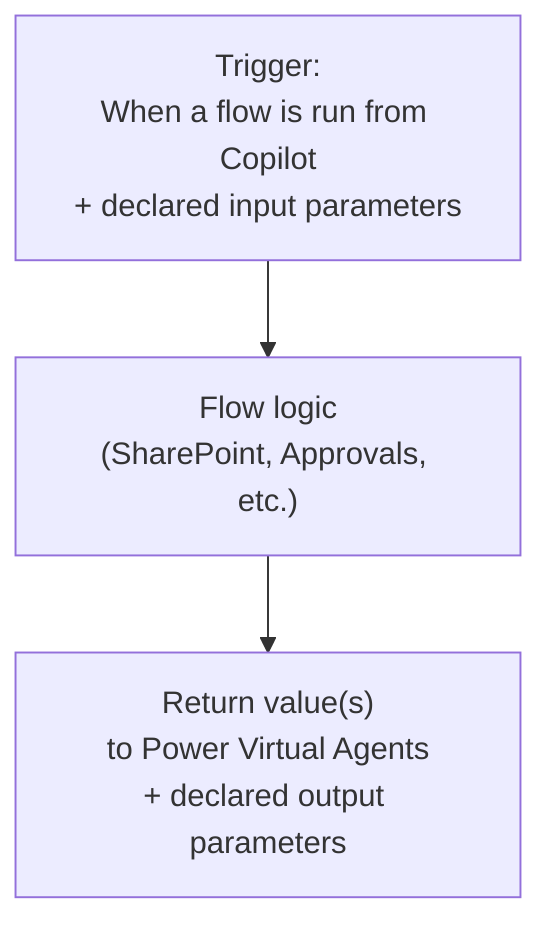

**The contract that makes it work:**
- Trigger = what the agent sends in
- Return action = what the agent gets back
- Both ends must declare matching parameter names and types

<!--
Speaker notes: Key talking points for this slide
- The shared trigger pattern means all four flows look the same from Copilot Studio's perspective
- The Copilot Studio connector (in the trigger dropdown) is the key — not just any trigger works
- Critically: if the Return action is not reached (flow errors out before it), the agent receives no output variables — blank
- This is the most common failure mode in production agent deployments
- Remind learners to always test flows in isolation (from Power Automate's test button) before wiring to the agent
-->

---

# Flow 1: Search KB Articles

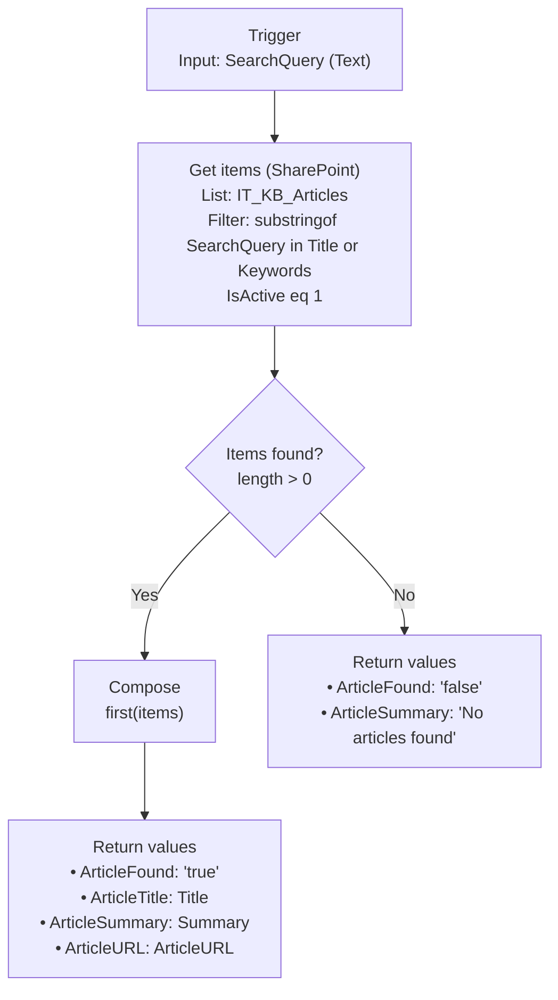

<!--
Speaker notes: Key talking points for this slide
- The OData filter in Get items is the trickiest part of this flow — substringof() syntax is unusual
- Full filter expression: IsActive eq 1 and (substringof('searchterm', Title) or substringof('searchterm', Keywords))
- The dynamic SearchQuery value is inserted using the expression editor, not point-and-click dynamic content
- The Compose action extracts the first item from the results array — first() returns a single object
- Both branches must reach a Return action — a flow that takes the NO path and returns no values leaves all output variables blank
-->

---

# Flow 2: Create Support Ticket

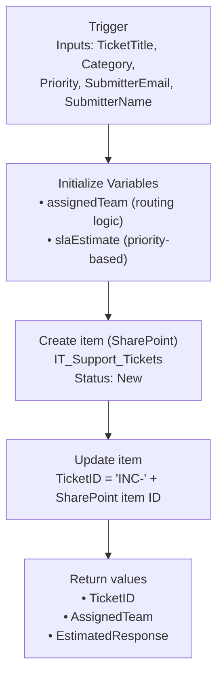

**Team routing logic:**
```
Category = Hardware  →  Hardware Team
Category = Software  →  Software Team
Category = Network   →  Network Team
Category = Account   →  Account Team
```

<!--
Speaker notes: Key talking points for this slide
- The two-step create + update pattern is necessary because SharePoint generates the ID only after the item is created
- You cannot know the ID before creation, so TicketID = 'INC-' + ID requires a separate update after create
- The routing logic uses nested if() expressions: if(equals(category,'Hardware'), 'Hardware Team', if(equals...))
- The SLA estimate is similarly a nested if() based on priority — set these to reflect your organisation's real SLAs
- The entire flow should run in under 3 seconds — fast enough that the user does not notice the wait in the conversation
-->

---

# Flow 3: Escalation Approval

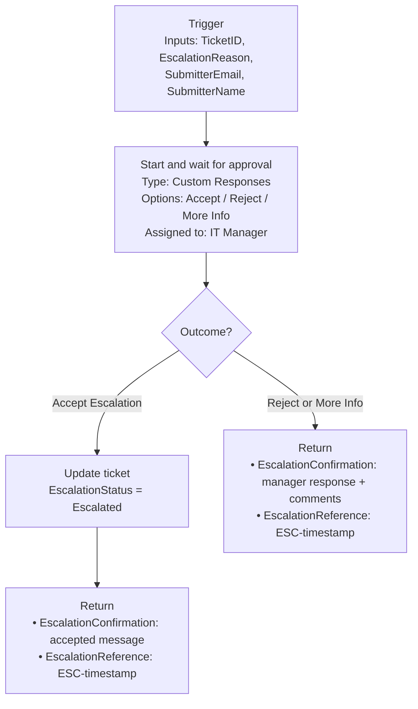

<!--
Speaker notes: Key talking points for this slide
- The approval action PAUSES the flow — the conversation in Teams will show "please wait" while the manager decides
- Design the agent conversation to set expectations: "I've submitted your escalation. You'll hear back within 30 minutes."
- The "Custom Responses" approval type gives the IT manager a third option: Request More Info — more nuanced than yes/no
- Manager comments from the approval response are surfaced to the user through the EscalationConfirmation output
- Set a Do Until timeout wrapping the approval action so the flow doesn't hang indefinitely if the manager doesn't respond
-->

---

# Flow 4: Get Ticket Status

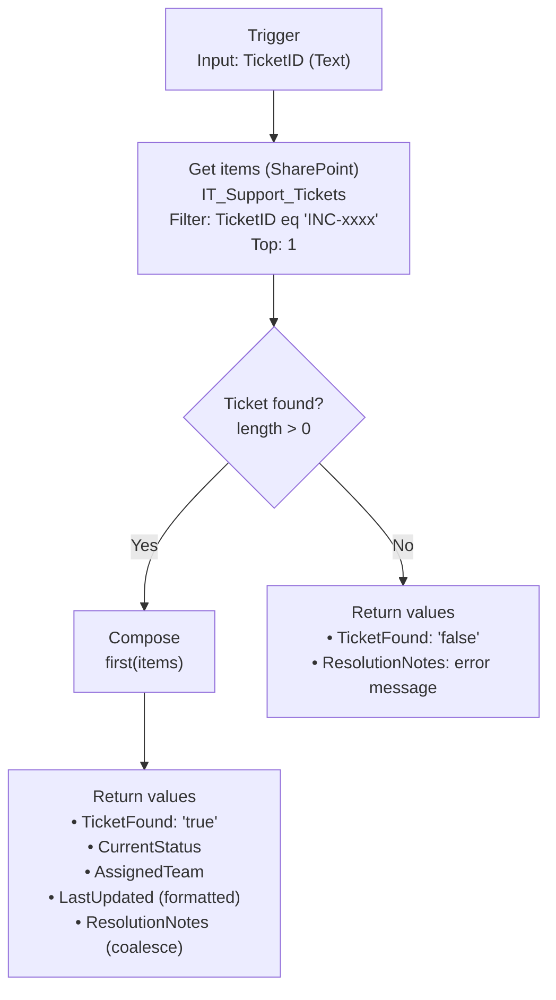

<!--
Speaker notes: Key talking points for this slide
- The OData filter here is simpler: TicketID eq 'INC-2094' — exact match, no text search needed
- formatDateTime() makes the timestamp human-readable: 'March 8, 2026 2:30 PM' instead of ISO 8601
- coalesce() for ResolutionNotes handles the case where a technician hasn't added notes yet — returns a default string rather than blank
- The TicketFound flag allows the topic to branch: found → show status details, not found → show helpful error
- This flow is entirely read-only — it never modifies the ticket list
-->

---

<!-- _class: lead -->

# Step 3: Building the Agent Topics

<!--
Speaker notes: Key talking points for this slide
- With all four flows built and tested, we are ready to wire them into Copilot Studio topics
- Rule to repeat: Build flows first, then topics. You cannot configure the action node until the flow exists.
- Each topic follows the same pattern: trigger → collect → act → respond
- The differences are in what is collected and which flow is called
-->

---

# Topic Structure: The Universal Pattern

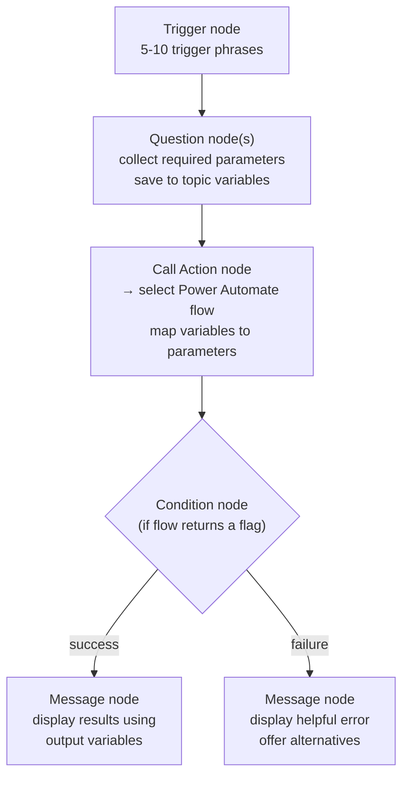

Every topic in this agent follows this pattern. The only differences: which variables are collected and which flow is called.

<!--
Speaker notes: Key talking points for this slide
- Teaching this pattern rather than each topic individually makes the content more transferable
- A learner who masters this pattern can build any service-desk topic, not just the four in this project
- The Condition node after the action is important — flows can return both successful and failed states
- Always handle the failure case: don't leave users in a dead-end branch
- The "offer alternatives" at the end of failure branches is what makes the agent feel helpful rather than broken
-->

---

# Conversation Flow: Create Ticket

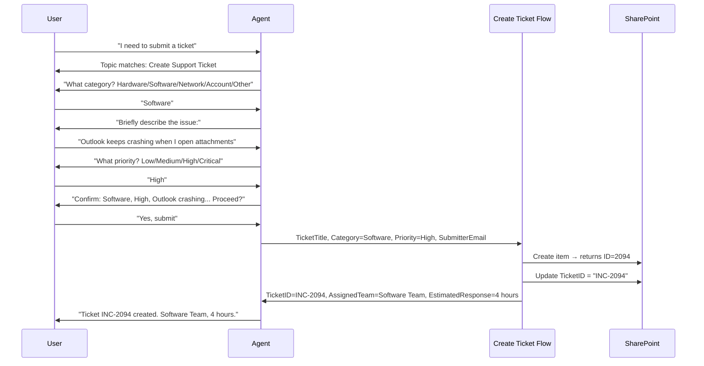

<!--
Speaker notes: Key talking points for this slide
- The sequence diagram shows every turn in the conversation including the async flow call
- The confirmation step ("Confirm: ... Proceed?") before calling the flow is deliberate — it prevents accidental ticket creation
- Note that the flow call is synchronous from the user's perspective: the agent pauses, calls the flow, waits, then resumes
- The two SharePoint operations (Create + Update) happen inside the flow — the user sees only the final result
- This entire conversation takes under 60 seconds for an experienced user to complete
-->

---

# Ticket Lifecycle: Status Flow

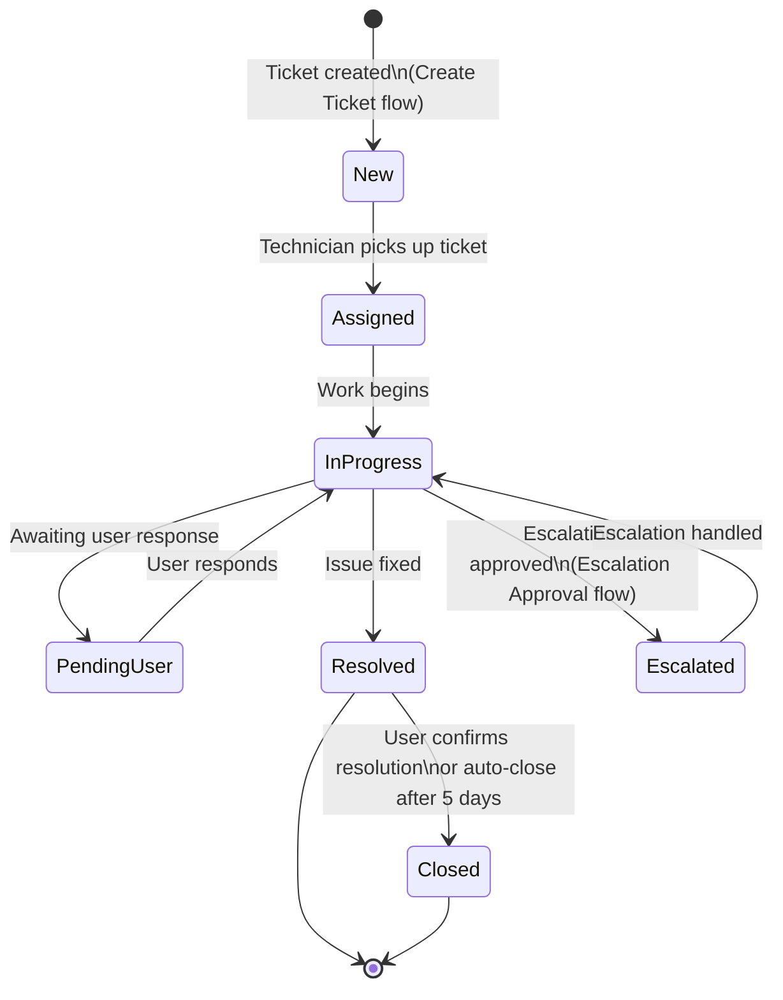

<!--
Speaker notes: Key talking points for this slide
- The status flow defines what values appear in the Status choice column of IT_Support_Tickets
- The agent's Get Ticket Status flow reads and displays whatever status the technician has set
- The Escalation Approval flow updates the ticket to Escalated status if the approval is accepted
- PendingUser is an important state: it signals that the user needs to provide more information
- Closed tickets should be excluded from check-status results that are more than 30 days old — add a date filter
-->

---

# Publishing Channels

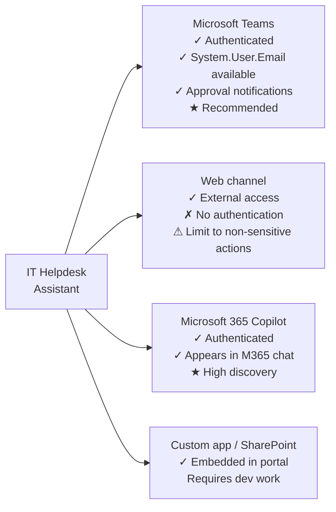

<!--
Speaker notes: Key talking points for this slide
- Teams is the recommended first channel for an IT helpdesk agent: employees are already there, authentication is seamless
- The Web channel is useful for contractors or external users but requires careful scoping — no sensitive data, no write operations
- M365 Copilot integration gives the agent the highest discovery potential — users find it while already chatting
- Custom app embedding is advanced — requires Power Platform CLI or manual configuration; covered in Microsoft documentation
- An agent can be published to multiple channels simultaneously — Teams for employees, web for contractors, for example
-->

---

# Testing Checklist Before Publishing

```
Topic: Search KB
  □ Trigger phrase "how do I fix VPN" routes to correct topic
  □ Agent asks for search query
  □ Flow returns article title and summary for a matching search
  □ Flow returns "not found" message for a non-matching search
  □ Redirect to Create Ticket works from the "no article" branch

Topic: Create Ticket
  □ Confirmation step shows correct collected values
  □ Ticket appears in IT_Support_Tickets SharePoint list
  □ TicketID is formatted correctly (INC-NNNN)
  □ AssignedTeam is correct for each category
  □ System.User.Email populated (test in Teams, not test canvas)

Topic: Check Status
  □ Known ticket ID returns status details
  □ Unknown ticket ID returns helpful error message
  □ Redirect to Escalate works from status display

Topic: Escalate Issue
  □ Approval email reaches IT manager
  □ Accepted escalation updates ticket EscalationStatus
  □ Rejection delivers manager's comments to user
```

<!--
Speaker notes: Key talking points for this slide
- Run through every checkbox before publishing — each one represents a real failure mode seen in production deployments
- System.User.Email is blank in the test canvas — use a Teams test before signing off on the create ticket topic
- The redirect between topics is a common failure point: ensure the receiving topic's trigger phrases don't conflict with the redirecting path
- SharePoint list verification (row created, columns populated) is important — the agent can look successful while the flow silently failed
- The approval email test must be done with a real Teams or Outlook session, not the test canvas
-->

---

# Monitoring: Key Metrics

<div class="columns">
<div>

**Copilot Studio Analytics**
- Sessions per day
- Engaged session rate (>1 turn)
- Topic resolution rate
- Escalation rate per topic
- Conversation abandonment rate

**Target benchmarks:**
- Resolution rate: >60%
- Escalation rate: <15%
- Abandonment: <20%

</div>
<div>

**Power Automate Flow Metrics**
- Flow run success rate per flow
- Average execution duration
- Error patterns by action

**Red flags to monitor:**
- Return action not reached (blank output variables)
- SharePoint filter returning 0 results unexpectedly
- Approval flow timing out (>30 day run limit)

</div>
</div>

<!--
Speaker notes: Key talking points for this slide
- Analytics in Copilot Studio require at least 7 days of data before trends are meaningful
- High escalation rate on a specific topic usually means the backing flow returns poor quality results
- High abandonment on the Create Ticket topic usually means too many questions — simplify by making some optional
- Flow run success rate below 95% in production is a signal to investigate connection health or permission issues
- Set up a weekly review of these metrics for the first 4 weeks after launch, then monthly thereafter
-->

---

# Summary: What You Built

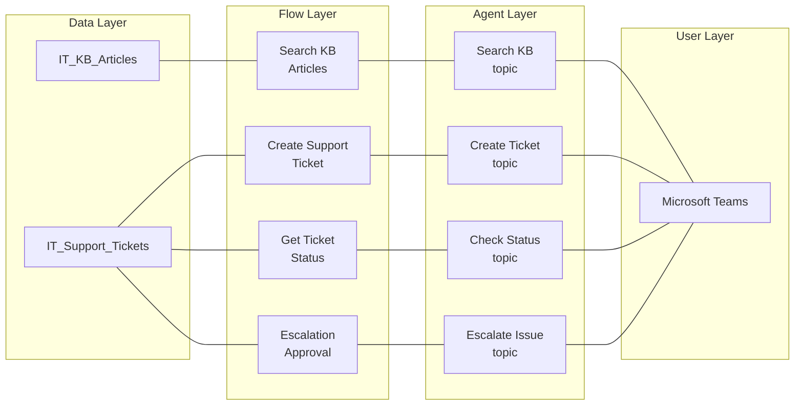

<!--
Speaker notes: Key talking points for this slide
- This diagram is the architecture view from the bottom up: data → flows → topics → users
- Everything was built in this order: data first, flows second, topics third
- The agent is the thinnest layer — it is entirely dependent on the flows below it for its capabilities
- This architecture pattern scales to any service desk domain: just change the SharePoint lists, adjust the flows, update the topics
- Learners now have a reusable template for HR tickets, finance approvals, legal requests, or any structured request workflow
- Congratulations on completing the Power Automate course capstone
-->
