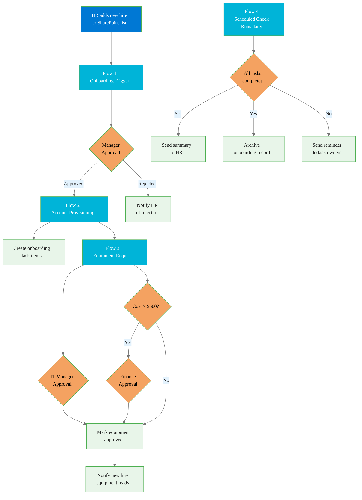

# Project: Automated Employee Onboarding Pipeline

## Overview

Build a complete, multi-flow onboarding automation in Power Automate that activates the moment HR adds a new hire to SharePoint and drives every subsequent step—manager approval, account provisioning, equipment procurement, and completion tracking—without any manual handoffs.

This project demonstrates production-level flow design: parallel branching, sequential approval chains, cross-list data orchestration, Adaptive Cards, and a scheduled reconciliation flow. When complete, you will have a portfolio artifact showing end-to-end process automation that any operations, HR, or IT hiring manager can recognize as real.

**Modules covered:** 02 (Triggers & Connectors), 03 (Data Operations), 04 (Branching & Error Handling), 05 (SharePoint), 06 (Approvals)

**Estimated build time:** 4–6 hours across all four flows

---

## What You Will Build

Four interconnected flows and three SharePoint lists that together replace a process most organizations currently run through email chains and spreadsheets.



---

## Part 1: SharePoint Setup

Build these three lists before touching Power Automate. Getting the schema right first prevents flow rebuild loops later.

### List 1: New Hires

Create this list at your SharePoint site root. Name it exactly `New Hires`.

| Column name | Type | Required | Notes |
|---|---|---|---|
| Title | Single line | Yes | Full name of new hire |
| Role | Single line | Yes | Job title |
| Department | Choice | Yes | Choices: Engineering, Sales, Finance, HR, Operations, IT |
| StartDate | Date | Yes | First day of employment |
| Manager | Person | Yes | Direct manager—used as approval recipient |
| EquipmentNeeds | Multi-line | No | Free text describing hardware, software, peripherals needed |
| EquipmentCost | Currency | No | Estimated total equipment cost in USD |
| OnboardingStatus | Choice | Yes | Choices: Pending, In Progress, Provisioning, Equipment Ordered, Complete, Rejected. Default: Pending |
| ProvisioningTrackingID | Single line | No | Auto-populated by Flow 2 |
| WelcomeEmailSent | Yes/No | No | Default: No |

### List 2: Onboarding Tasks

Name it `Onboarding Tasks`. This list tracks discrete steps for each hire.

| Column name | Type | Required | Notes |
|---|---|---|---|
| Title | Single line | Yes | Task name |
| NewHireID | Number | Yes | ID of the related New Hires item |
| NewHireName | Single line | Yes | Denormalized name for display |
| AssignedTo | Person | Yes | Person responsible for completing the task |
| DueDate | Date | Yes | Target completion date |
| Status | Choice | Yes | Choices: Not Started, In Progress, Complete, Blocked. Default: Not Started |
| Category | Choice | Yes | Choices: IT Setup, HR Admin, Facilities, Training, Access |
| Notes | Multi-line | No | Progress notes |

### List 3: Equipment Requests

Name it `Equipment Requests`. Tracks hardware and software procurement per hire.

| Column name | Type | Required | Notes |
|---|---|---|---|
| Title | Single line | Yes | Item description |
| NewHireID | Number | Yes | Related New Hires item ID |
| NewHireName | Single line | Yes | Denormalized name |
| Category | Choice | Yes | Choices: Hardware, Software, Peripherals, Access |
| EstimatedCost | Currency | Yes | Per-item cost |
| ApprovalStatus | Choice | Yes | Choices: Pending IT, Pending Finance, Approved, Rejected. Default: Pending IT |
| ITApprovalDate | Date | No | Auto-populated when IT approves |
| FinanceApprovalDate | Date | No | Auto-populated when Finance approves |
| PurchaseOrderNumber | Single line | No | Populated by procurement team |

### Populate test data

Before building flows, add three New Hires items with:
- One hire with equipment cost under $500
- One hire with equipment cost over $500
- One hire with no equipment listed

This gives you test cases for every branch in Flow 3.

---

## Part 2: Flow 1 — Onboarding Trigger

This flow fires immediately when HR saves a new item to the New Hires list. It sends a manager approval and, on approval, creates the task backlog and sends the new hire a welcome message.

### Trigger

**Connector:** SharePoint
**Action:** When an item is created
**Site:** Your SharePoint site
**List:** New Hires

### Step 1: Update status to In Progress

**Action:** SharePoint > Update item
**List:** New Hires
**ID:** `triggerOutputs()?['body/ID']`
**OnboardingStatus:** In Progress

### Step 2: Send manager approval

**Action:** Approvals > Start and wait for an approval

| Field | Value |
|---|---|
| Approval type | Approve/Reject — First to respond |
| Title | `New Hire Onboarding Request: [Title]` |
| Assigned to | Manager field from trigger |
| Details | Multi-line message containing role, department, start date, equipment summary, and equipment cost |
| Item link | SharePoint item URL |
| Item link description | `View new hire record` |

The "Start and wait" action blocks the flow until the manager responds. This is intentional—subsequent steps depend on the decision.

### Step 3: Condition on approval outcome

**Action:** Condition
**Left value:** `outputs('Start_and_wait_for_an_approval')?['body/outcome']`
**Operator:** is equal to
**Right value:** `Approve`

**If Yes branch (approved):**

#### Step 3a: Create onboarding task items

Use a **Scope** action named "Create Standard Tasks" containing five parallel **SharePoint > Create item** actions targeting the Onboarding Tasks list. Create one task for each category below. Set DueDate relative to the StartDate using `addDays(triggerOutputs()?['body/StartDate'], N)`.

| Task title | Category | Assigned to | Days from start |
|---|---|---|---|
| Set up laptop and workstation | IT Setup | IT distribution group email | -3 (before start) |
| Create accounts (M365, VPN, systems) | IT Setup | IT distribution group email | -2 |
| Complete I-9 and tax forms | HR Admin | HR distribution group email | 0 |
| Office access badge provisioning | Facilities | Facilities group email | -1 |
| Assign onboarding training courses | Training | Manager from trigger | 1 |

Use your organization's actual distribution group emails, or create placeholder emails that resolve to a shared mailbox.

#### Step 3b: Send welcome email with Adaptive Card

**Action:** Microsoft Teams > Post an Adaptive Card and wait for a response
**Post in:** Chat with user
**Recipient:** New hire's email (from New Hires list—add an Email column if not present)

Adaptive Card JSON:

```json
{
  "type": "AdaptiveCard",
  "version": "1.4",
  "body": [
    {
      "type": "TextBlock",
      "text": "Welcome to the Team!",
      "weight": "Bolder",
      "size": "Large",
      "color": "Accent"
    },
    {
      "type": "TextBlock",
      "text": "Hi ${NewHireName}, we're thrilled to have you joining us as ${Role} in ${Department}.",
      "wrap": true
    },
    {
      "type": "FactSet",
      "facts": [
        { "title": "Start Date", "value": "${StartDate}" },
        { "title": "Manager", "value": "${ManagerName}" },
        { "title": "Department", "value": "${Department}" }
      ]
    },
    {
      "type": "TextBlock",
      "text": "Your onboarding tasks have been created. Your IT setup will begin ${SetupDate}. Watch for a Teams message from IT about your equipment.",
      "wrap": true
    },
    {
      "type": "ActionSet",
      "actions": [
        {
          "type": "Action.OpenUrl",
          "title": "View Onboarding Checklist",
          "url": "${OnboardingTasksURL}"
        }
      ]
    }
  ]
}
```

Replace template variables with dynamic content from the trigger and previous steps.

#### Step 3c: Update status to Provisioning

**Action:** SharePoint > Update item
**OnboardingStatus:** Provisioning
**WelcomeEmailSent:** Yes

**If No branch (rejected):**

#### Step 3d: Notify HR of rejection

**Action:** Microsoft Teams > Post a message in a chat or channel
**Post in:** Channel
**Team:** HR team
**Channel:** Onboarding
**Message:** Include new hire name, role, manager name, rejection comments from `outputs('Start_and_wait_for_an_approval')?['body/responses'][0]/comments`

**Action:** SharePoint > Update item
**OnboardingStatus:** Rejected

### Flow 1 error handling

Wrap the entire flow body in a **Scope** action named "Main Flow". Add a second Scope named "Error Handler" configured to run **only if** the Main Flow scope has **Failed** or **TimedOut**.

In the Error Handler scope:

**Action:** Microsoft Teams > Post a message
**Message:** `Flow 1 Onboarding Trigger failed for [NewHireName]. Error: @{workflow()['run']['error']['message']}. Please investigate at [flow run URL].`
**Post to:** IT-Alerts channel

---

## Part 3: Flow 2 — Account Provisioning

This flow is triggered by the status update in Flow 1. It simulates AD account creation by writing a provisioning record to a tracking list, assigns training materials, and alerts the IT team.

### Trigger

**Connector:** SharePoint
**Action:** When an item is modified
**Site:** Your SharePoint site
**List:** New Hires
**Filter:** Add a trigger condition so the flow only runs when OnboardingStatus equals "Provisioning"

Trigger condition expression:
```
@equals(triggerOutputs()?['body/OnboardingStatus/Value'], 'Provisioning')
```

Add this expression under "Settings > Trigger Conditions" on the trigger action. Without this filter, every status update to any New Hire item will fire the flow.

### Step 1: Compose provisioning record data

**Action:** Data Operation > Compose
**Inputs:**

```json
{
  "employeeId": "@{concat('EMP-', padLeft(string(triggerOutputs()?['body/ID']), 6, '0'))}",
  "upn": "@{concat(replace(toLower(triggerOutputs()?['body/Title']), ' ', '.'), '@yourdomain.com')}",
  "displayName": "@{triggerOutputs()?['body/Title']}",
  "department": "@{triggerOutputs()?['body/Department/Value']}",
  "manager": "@{triggerOutputs()?['body/Manager/Email']}",
  "startDate": "@{triggerOutputs()?['body/StartDate']}",
  "provisioningTimestamp": "@{utcNow()}",
  "status": "account_created"
}
```

This Compose action simulates the payload you would send to an AD provisioning API or HR system. In a production environment with Azure AD Premium, you would replace this with an HTTP action calling the Microsoft Graph API.

### Step 2: Write provisioning record to tracking list

Create a fourth SharePoint list named `Provisioning Log` with columns: EmployeeID (single line), UPN (single line), DisplayName (single line), Department (single line), ManagerEmail (single line), StartDate (date), ProvisioningTimestamp (date/time), ProvisioningStatus (choice: Pending, Complete, Failed).

**Action:** SharePoint > Create item
**List:** Provisioning Log
Populate each column from the Compose output using `outputs('Compose_provisioning_record')?['employeeId']` etc.

### Step 3: Update New Hire record with tracking ID

**Action:** SharePoint > Update item
**List:** New Hires
**ID:** Trigger item ID
**ProvisioningTrackingID:** Employee ID from the Compose output

### Step 4: Assign training materials

**Action:** Microsoft Teams > Post a message in a chat or channel
**Post in:** Chat
**Recipient:** New hire's email
**Message:**

```
Hi [Name],

Your Microsoft 365 account has been created. Your login will be: [UPN]

Your onboarding training assignments:
- Microsoft 365 Fundamentals (due: Day 3)
- Security Awareness Training (due: Day 5)
- [Department]-specific onboarding course (due: Day 10)

Access your training at: https://your-lms-url/onboarding

Your manager [ManagerName] has been notified of your account creation.
```

### Step 5: Notify IT team via Teams

**Action:** Microsoft Teams > Post an Adaptive Card to a Teams channel

```json
{
  "type": "AdaptiveCard",
  "version": "1.4",
  "body": [
    {
      "type": "TextBlock",
      "text": "New Account Provisioned",
      "weight": "Bolder",
      "size": "Medium"
    },
    {
      "type": "FactSet",
      "facts": [
        { "title": "Name", "value": "${DisplayName}" },
        { "title": "UPN", "value": "${UPN}" },
        { "title": "Department", "value": "${Department}" },
        { "title": "Employee ID", "value": "${EmployeeID}" },
        { "title": "Start Date", "value": "${StartDate}" },
        { "title": "Manager", "value": "${Manager}" }
      ]
    },
    {
      "type": "TextBlock",
      "text": "Workstation setup task is assigned. Please confirm equipment readiness by end of day prior to start date.",
      "wrap": true
    }
  ],
  "actions": [
    {
      "type": "Action.OpenUrl",
      "title": "View Onboarding Tasks",
      "url": "${OnboardingTasksURL}"
    }
  ]
}
```

**Post to:** IT team > #new-employee-setup channel

---

## Part 4: Flow 3 — Equipment Request

This flow handles procurement approvals. IT manager approval is always required. Finance approval is conditionally required when the estimated equipment cost exceeds $500. Both approvals run in parallel when the cost threshold is met.

### Trigger

Same pattern as Flow 2: SharePoint item modified, filter on OnboardingStatus equals "Provisioning".

Add a second trigger condition to prevent double-firing with Flow 2:
```
@not(empty(triggerOutputs()?['body/EquipmentNeeds']))
```

This ensures the equipment flow only activates when equipment needs are specified.

### Step 1: Condition — does equipment exist?

**Action:** Condition
**Left:** `triggerOutputs()?['body/EquipmentNeeds']`
**Operator:** is not equal to
**Right:** (empty)

**If No:** No equipment specified. Update New Hire record with note "No equipment requested" and terminate gracefully.

**If Yes:** Continue to approval logic.

### Step 2: Create equipment request record

**Action:** SharePoint > Create item
**List:** Equipment Requests
Populate from trigger fields. Set ApprovalStatus to "Pending IT".

### Step 3: Condition — cost threshold

**Action:** Condition
**Left:** `triggerOutputs()?['body/EquipmentCost']`
**Operator:** is greater than
**Right:** 500

**If cost > $500 (If Yes branch): parallel approvals**

Use a **Parallel Branch** inside the Yes branch. Power Automate executes both branches simultaneously; the flow does not proceed until both complete.

**Branch A — IT Manager Approval:**

**Action:** Approvals > Start and wait for an approval
**Approval type:** Approve/Reject — First to respond
**Title:** `Equipment Approval (IT): [NewHireName] — $[EquipmentCost]`
**Assigned to:** IT Manager email (store in an environment variable)
**Details:** Equipment needs description, estimated cost, start date, department

**Branch B — Finance Approval:**

**Action:** Approvals > Start and wait for an approval
**Approval type:** Approve/Reject — First to respond
**Title:** `Equipment Approval (Finance): [NewHireName] — $[EquipmentCost]`
**Assigned to:** Finance Manager email (environment variable)
**Details:** Same details as IT approval plus note that IT approval is running in parallel

After the parallel branch completes, both approval outcomes are available.

**Condition — both approved:**

```
@and(
  equals(outputs('IT_Approval')?['body/outcome'], 'Approve'),
  equals(outputs('Finance_Approval')?['body/outcome'], 'Approve')
)
```

If both approved: update Equipment Requests item ApprovalStatus to "Approved". Capture both approval dates.

If either rejected: update ApprovalStatus to "Rejected". Send Teams message to IT channel with rejection comments from both approvers.

**If cost <= $500 (If No branch): IT approval only**

**Action:** Approvals > Start and wait for an approval
Same configuration as Branch A above, but titled to indicate no Finance review required.

On approval: update Equipment Requests ApprovalStatus to "Approved".
On rejection: update to "Rejected" with comments.

### Step 4: Notify new hire of equipment status

After both conditional paths converge, send the new hire a Teams message:

**Approved message:**
```
Good news! Your equipment request has been approved.

Your IT team will prepare your setup before your start date of [StartDate].
You will receive a confirmation when everything is ready at your workstation.

Questions? Contact IT at it-support@yourdomain.com
```

**Rejected message:**
```
Your equipment request requires review before processing.

An IT or Finance team member will contact you to discuss alternatives.
Your start date has not changed—your onboarding is still scheduled for [StartDate].

Contact your manager [ManagerName] with any questions.
```

---

## Part 5: Flow 4 — Onboarding Completion Check

A scheduled flow that runs daily at 8:00 AM. It queries all In Progress onboardings, checks whether all tasks are complete, sends reminders for blocked tasks, and archives finished onboardings.

### Trigger

**Action:** Recurrence
**Interval:** 1
**Frequency:** Day
**Start time:** 08:00 AM (your timezone)

### Step 1: Get all active onboarding records

**Action:** SharePoint > Get items
**List:** New Hires
**Filter query:** `OnboardingStatus ne 'Complete' and OnboardingStatus ne 'Rejected' and OnboardingStatus ne 'Pending'`

### Step 2: Loop over each active new hire

**Action:** Apply to each
**Input:** Value from Get items

Inside the loop:

#### Step 2a: Get tasks for this hire

**Action:** SharePoint > Get items
**List:** Onboarding Tasks
**Filter query:** `NewHireID eq [ID from current item]`

#### Step 2b: Count incomplete tasks

**Action:** Data Operation > Filter array
**From:** Value from Get items (tasks)
**Condition:** Status is not equal to Complete

Store the filtered array in a variable named `IncompleteTasks`.

#### Step 2c: Condition — all tasks complete?

**Left:** `length(variables('IncompleteTasks'))`
**Operator:** is equal to
**Right:** 0

**If Yes (all complete):**

**Action:** SharePoint > Update item
**List:** New Hires
**OnboardingStatus:** Complete

**Action:** Microsoft Teams > Post a message
**To:** HR channel
**Message:**

```
Onboarding Complete: [NewHireName]

[Name] has completed all onboarding tasks as of [today's date].

Role: [Role]
Department: [Department]
Start Date: [StartDate]
Manager: [ManagerName]

The onboarding record has been marked complete and is ready for archival.
```

**Action:** SharePoint > Create item
**List:** Create a fifth list named `Onboarding Archive` with the same schema as New Hires, plus an ArchiveDate column.
Copy all fields from the current New Hires item to the Archive list.

**Action:** SharePoint > Delete item
**List:** New Hires
**ID:** Current item ID

**If No (tasks remain):**

**Action:** Apply to each (nested)
**Input:** `variables('IncompleteTasks')`

Inside nested loop, for each incomplete task:

**Condition:** Is the task overdue?
**Left:** `items('Apply_to_each_task')?['DueDate']`
**Operator:** is less than
**Right:** `utcNow()`

If overdue:

**Action:** Microsoft Teams > Post a message
**To:** Task assignee (`items('Apply_to_each_task')?['AssignedTo/Email']`)
**Message:**

```
Overdue Onboarding Task

Task: [Title]
New Hire: [NewHireName]
Due: [DueDate]
Status: [Status]

Please update this task or contact your manager if blocked.
View task: [SharePoint URL]
```

---

## Testing Guide

Work through these test scenarios in order. Each scenario validates a specific branch or integration point.

### Test 1: Happy path — low-cost equipment

1. Add a New Hires item: any name, role, department, start date 14 days out, your email as Manager, simple equipment description (e.g., "Standard laptop"), EquipmentCost: 350.
2. Verify Flow 1 fires. Check the flow run history for the trigger in Power Automate.
3. Approve the manager approval from the Approvals app in Teams or at flow.microsoft.com/approvals.
4. Verify OnboardingStatus updates to "Provisioning".
5. Verify five Onboarding Tasks items are created in the Onboarding Tasks list.
6. Verify Teams welcome message arrives.
7. Verify Flow 2 fires. Check Provisioning Log for a new record. Check ProvisioningTrackingID is populated on the New Hire record.
8. Verify Flow 3 fires. Check Equipment Requests list for a new item.
9. Approve the IT Manager approval (sent to IT Manager email set in your environment variable).
10. Verify Equipment Requests item ApprovalStatus updates to "Approved".
11. Verify new hire notification message arrives.
12. Manually update all five Onboarding Tasks items to Status: Complete.
13. Wait for Flow 4 to fire at 8:00 AM, or trigger it manually using "Run" in the designer.
14. Verify HR receives completion summary.
15. Verify New Hire record moves to Onboarding Archive list and is removed from New Hires.

### Test 2: Manager rejection

1. Add a second New Hires item.
2. When the manager approval arrives, reject it with a comment.
3. Verify OnboardingStatus updates to "Rejected".
4. Verify HR receives rejection notification with the comment text.
5. Verify no tasks were created and no further flows fired.

### Test 3: High-cost equipment — both approvals

1. Add a New Hires item with EquipmentCost: 2500.
2. Approve the manager approval.
3. Verify both IT Manager and Finance Manager approvals are created simultaneously (check Approvals center—both should appear as pending).
4. Approve the IT Manager request.
5. Verify the flow is still waiting (Finance hasn't responded yet).
6. Approve the Finance request.
7. Verify Equipment Requests item updates to "Approved" with both approval dates populated.

### Test 4: High-cost equipment — Finance rejection

1. Add a New Hires item with EquipmentCost: 1800.
2. Approve manager, then approve IT, then reject Finance.
3. Verify ApprovalStatus updates to "Rejected".
4. Verify both IT and Finance rejection comments appear in the Teams notification.

### Test 5: Overdue task reminder

1. Create a New Hires item and progress it to Provisioning status.
2. Manually edit one Onboarding Tasks item: set DueDate to yesterday, Status to "Not Started".
3. Trigger Flow 4 manually.
4. Verify the assigned person receives an overdue reminder.

### Test 6: Flow error handling

1. Temporarily break Flow 1 by pointing its SharePoint trigger to a non-existent list name.
2. Add a New Hires item.
3. Verify the error handler scope fires and posts to the IT-Alerts Teams channel.
4. Restore the correct list name.

---

## Architecture Decisions and Tradeoffs

**Why trigger Flow 2 and Flow 3 from a status column update rather than a manual trigger or child flow?**

Using status-driven triggers keeps flows decoupled. Flow 1 does not need to know that Flow 2 exists. If you add a new downstream flow later (say, a building access provisioning flow), you add a new trigger on the same status column without modifying Flow 1. This is the pattern used in production enterprise automation.

The tradeoff is that status-driven triggers are harder to debug—you must check trigger conditions carefully and validate that no other process modifies the status unexpectedly.

**Why use Parallel Branch for high-cost equipment approvals?**

Sequential approvals are slower and introduce approval fatigue. If IT approves but Finance takes three days, the new hire's start date may be at risk. Parallel approvals give both parties their full review window simultaneously. The cost is that both approvers receive requests even if IT rejects immediately—a UX tradeoff worth making for time-sensitive onboarding scenarios.

**Why archive rather than delete completed records?**

HR audits and I-9 compliance require retention of onboarding records. Moving to an Archive list preserves the data while keeping the active New Hires list lean. A production system would additionally set retention policies in Microsoft Purview on the Archive list.

---

## Extension Ideas

Once your four flows are working end to end, these extensions move the project toward production quality.

### Azure AD Integration

Replace the Provisioning Log write in Flow 2 with an HTTP action calling Microsoft Graph:

```
POST https://graph.microsoft.com/v1.0/users
Authorization: Bearer {token}
Content-Type: application/json

{
  "accountEnabled": true,
  "displayName": "[NewHireName]",
  "mailNickname": "[alias]",
  "userPrincipalName": "[upn]",
  "passwordProfile": {
    "forceChangePasswordNextSignIn": true,
    "password": "[generated-temp-password]"
  }
}
```

This requires an Entra ID (Azure AD) app registration with `User.ReadWrite.All` permission and a custom connector or HTTP with Azure AD auth configured. The module 02 connector guide covers custom connectors.

### Power BI Onboarding Dashboard

Connect Power BI Desktop to your SharePoint lists via the SharePoint Online connector. Build a report with:
- Active onboardings by department and status
- Average time-to-completion by department
- Equipment approval cycle time (request created to final approval)
- Task overdue rate by category

Publish to Power BI Service and embed in a SharePoint page using the Power BI web part so HR leaders have a real-time view without navigating to Power BI.

### Onboarding Progress App (Power Apps)

Build a canvas app where managers can see all their pending new hire onboardings, mark tasks complete, and add notes—without accessing SharePoint directly. The app writes back to the Onboarding Tasks list, which Flow 4 reads. This separates the user experience from the underlying data model.

---

## What to Include in Your Portfolio

When publishing this project, capture these artifacts:

1. **Flow diagrams:** Export each flow as a screenshot showing the full logical structure (use the flow designer's zoom-out view).
2. **SharePoint schema screenshots:** Column configuration for each list.
3. **Live run history:** At least one successful run for each flow, showing green checkmarks on every action.
4. **Adaptive Card screenshots:** The welcome card and IT notification card rendered in Teams.
5. **A short write-up (200–300 words):** What problem does this solve, what was the hardest part to build, and what would you do differently with more time.

The run history is the most important artifact. Anyone evaluating your portfolio can see immediately whether the flows actually ran successfully—not just whether they were designed.
