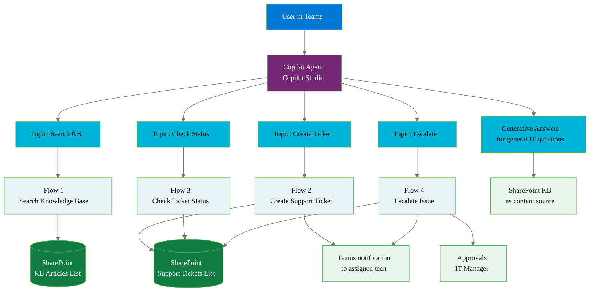
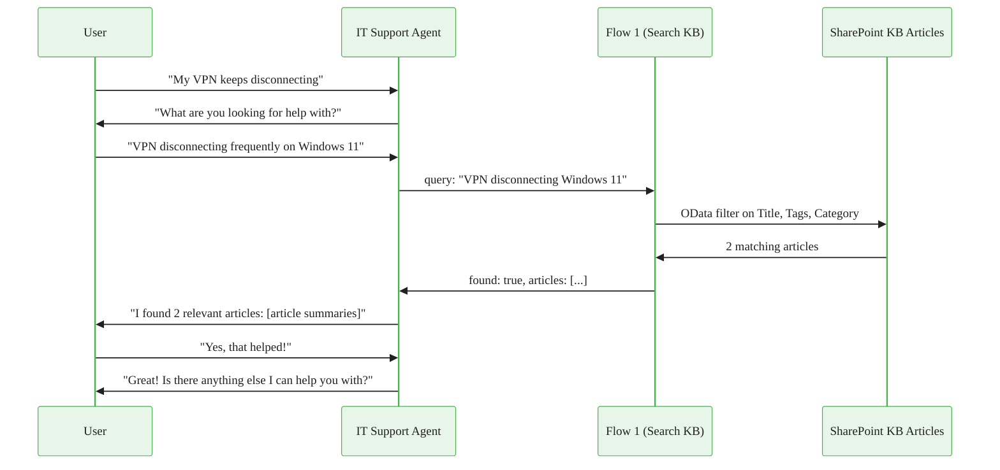
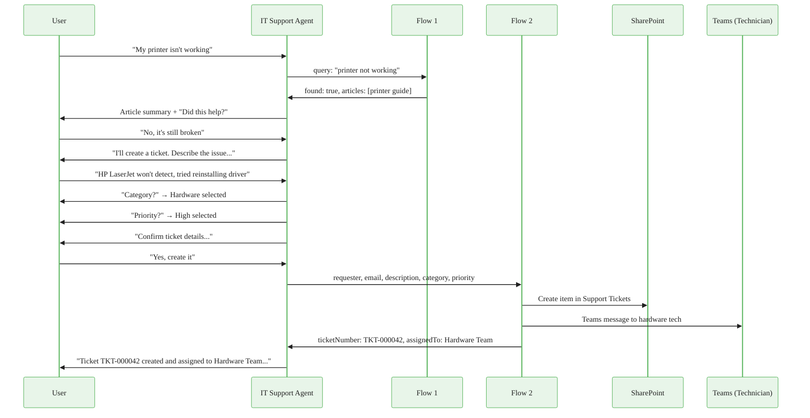
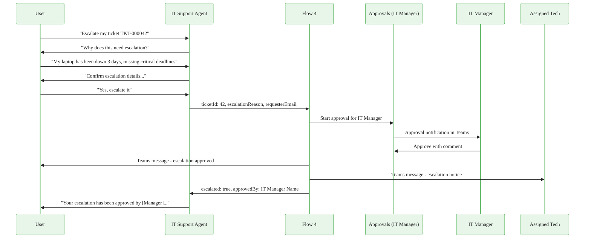

# Project: Copilot-Powered IT Support Agent

## Overview

Build a fully functional IT support agent in Microsoft Copilot Studio that handles knowledge base searches, ticket creation, status checks, and escalations through natural conversation—backed entirely by Power Automate flows as the execution layer.

When a user in Teams types "my laptop won't connect to VPN," the agent searches the knowledge base, returns relevant articles, offers to create a ticket if the articles don't help, routes the ticket to the right technician, and can escalate to IT management if needed—all within a single conversation thread.

This project demonstrates the production pattern for enterprise AI agents: Copilot Studio handles conversation and intent recognition; Power Automate handles data access and system integration. When complete, you have a portfolio artifact that directly maps to how organizations are deploying Microsoft 365 Copilot extensions in 2024 and 2025.

**Modules covered:** 02 (Triggers & Connectors), 03 (Data Operations), 05 (SharePoint), 06 (Approvals), 09 (Copilot Agents)

**Estimated build time:** 5–7 hours across flows and agent configuration

---

## Architecture



---

## Part 1: Data Setup

### List 1: KB Articles

Create this list at your SharePoint site. Name it exactly `KB Articles`.

| Column name | Type | Required | Notes |
|---|---|---|---|
| Title | Single line | Yes | Article headline, written as a problem statement. Example: "VPN fails to connect on Windows 11" |
| Content | Multi-line (enhanced rich text) | Yes | Full article body with step-by-step resolution |
| Category | Choice | Yes | Choices: Network, Hardware, Software, Access, Email, Teams, Security, Other |
| Tags | Multi-line | Yes | Comma-separated keywords. Example: vpn, network, remote access, windows |
| LastReviewed | Date | Yes | Date article was last verified accurate |
| IsActive | Yes/No | Yes | Default: Yes. Set to No to retire articles without deleting them |
| ViewCount | Number | No | Manually updated; useful for analytics extension |

**Populate 10 sample articles** before building flows. Write articles that cover common IT issues your flows will be able to find via keyword search. Suggested topics:

1. VPN fails to connect on Windows 11
2. Outlook not syncing new emails
3. Multi-factor authentication (MFA) setup guide
4. How to request software installation
5. Printer not detected on network
6. OneDrive sync errors and recovery steps
7. Teams audio/video not working in meetings
8. Password reset without IT access
9. Laptop won't wake from sleep mode
10. How to connect to guest Wi-Fi at office locations

Each article should have at least 200 words of actual resolution content—not placeholder text. The generative answers feature will draw from this content, so quality matters.

### List 2: Support Tickets

Name it `Support Tickets`.

| Column name | Type | Required | Notes |
|---|---|---|---|
| Title | Single line | Yes | Auto-generated: "TKT-[ID]: [short issue description]" |
| Requester | Single line | Yes | Display name of person who submitted |
| RequesterEmail | Single line | Yes | Email of requester |
| IssueDescription | Multi-line | Yes | Full description of the problem |
| Category | Choice | Yes | Same choices as KB Articles |
| Priority | Choice | Yes | Choices: Low, Medium, High, Critical. Default: Medium |
| Status | Choice | Yes | Choices: Open, In Progress, Pending User, Resolved, Escalated, Closed. Default: Open |
| AssignedTo | Single line | No | Technician name auto-assigned based on category |
| AssignedToEmail | Single line | No | Technician email for notifications |
| Resolution | Multi-line | No | Populated when ticket is resolved |
| EscalationReason | Multi-line | No | Populated on escalation |
| EscalationApprovedBy | Single line | No | Manager who approved escalation |
| CreatedDate | Date/Time | Yes | Auto-populated by SharePoint |
| ResolvedDate | Date | No | Populated on resolution |
| TicketNumber | Single line | No | Formatted ID: "TKT-000001" format |

### Technician routing table

Create a fourth list named `Tech Routing` with columns: Category (choice, same values), TechnicianName (single line), TechnicianEmail (single line), IsActive (yes/no). Populate with one row per category pointing to a real email address you can receive mail at (use your own email for all categories during testing).

| Category | Technician | Email |
|---|---|---|
| Network | Network team | your-email@domain.com |
| Hardware | Hardware team | your-email@domain.com |
| Software | Software team | your-email@domain.com |
| Access | Access team | your-email@domain.com |
| Email | Email/Exchange team | your-email@domain.com |
| Teams | Collaboration team | your-email@domain.com |
| Security | Security team | your-email@domain.com |
| Other | General support | your-email@domain.com |

---

## Part 2: Power Automate Flows

All four flows are built as **instant cloud flows** with **HTTP trigger** (also called "When an HTTP request is received"). This trigger type makes the flow callable from Copilot Studio as an action. Each flow receives a JSON payload from the agent and returns a JSON response.

Store all four flow HTTP trigger URLs as environment variables in Power Automate after creation. You will paste these URLs into Copilot Studio action configurations.

### Flow 1: Search Knowledge Base

**Purpose:** Accept a search query string, search the KB Articles list using OData filter, return the top 3 matching articles formatted as readable text.

#### Trigger: HTTP Request

**Request body JSON schema:**

```json
{
  "type": "object",
  "properties": {
    "query": {
      "type": "string",
      "description": "Search query from the user"
    }
  },
  "required": ["query"]
}
```

Paste this schema into the "Request Body JSON Schema" field on the HTTP trigger. Power Automate parses it and makes `triggerBody()?['query']` available as dynamic content.

#### Step 1: Search KB Articles list

**Action:** SharePoint > Get items
**List:** KB Articles
**Filter query:**

```
(IsActive eq 1) and (
  substringof('@{triggerBody()?['query']}', Title) or
  substringof('@{triggerBody()?['query']}', Tags) or
  substringof('@{triggerBody()?['query']}', Category)
)
```

**Top count:** 3
**Order by:** ViewCount desc

Note: SharePoint OData `substringof` is case-insensitive for text columns. The filter checks the query string against the title, tags, and category of active articles.

#### Step 2: Condition — articles found?

**Left:** `length(body('Get_items')?['value'])`
**Operator:** is greater than
**Right:** 0

**If Yes (articles found):**

#### Step 3a: Format articles as text

**Action:** Data Operation > Select
**From:** `body('Get_items')?['value']`
**Map:**

| Key | Value |
|---|---|
| articleNumber | `@{add(indexOf(body('Get_items')?['value'], item()), 1)}` |
| title | `@{item()?['Title']}` |
| content | `@{item()?['Content']}` |
| category | `@{item()?['Category/Value']}` |
| url | `@{item()?['{Link}']}` |

**Action:** Data Operation > Compose
**Inputs:**

```
@{join(
  array(
    concat('**Article 1: ', body('Select')[0]?['title'], '**\n', substring(body('Select')[0]?['content'], 0, min(500, length(body('Select')[0]?['content']))), '...\n'),
    if(greater(length(body('Select')), 1), concat('**Article 2: ', body('Select')[1]?['title'], '**\n', substring(body('Select')[1]?['content'], 0, min(500, length(body('Select')[1]?['content']))), '...\n'), ''),
    if(greater(length(body('Select')), 2), concat('**Article 3: ', body('Select')[2]?['title'], '**\n', substring(body('Select')[2]?['content'], 0, min(500, length(body('Select')[2]?['content']))), '...\n'), '')
  ),
  '\n---\n'
)}
```

#### Step 3b: Return response

**Action:** Response
**Status code:** 200
**Headers:** `Content-Type: application/json`
**Body:**

```json
{
  "found": true,
  "articleCount": @{length(body('Get_items')?['value'])},
  "articles": @{outputs('Compose_formatted')}
}
```

**If No (no articles found):**

#### Step 3c: Return not found response

**Action:** Response
**Status code:** 200
**Body:**

```json
{
  "found": false,
  "articleCount": 0,
  "articles": "No knowledge base articles found matching your search. I can create a support ticket so a technician can investigate."
}
```

---

### Flow 2: Create Support Ticket

**Purpose:** Accept requester information and issue details, create a ticket in SharePoint, auto-assign to a technician based on category, notify the technician via Teams, and return a confirmation.

#### Trigger: HTTP Request

**Request body JSON schema:**

```json
{
  "type": "object",
  "properties": {
    "requester": { "type": "string" },
    "requesterEmail": { "type": "string" },
    "issueDescription": { "type": "string" },
    "category": { "type": "string" },
    "priority": { "type": "string" }
  },
  "required": ["requester", "requesterEmail", "issueDescription", "category"]
}
```

#### Step 1: Look up assigned technician

**Action:** SharePoint > Get items
**List:** Tech Routing
**Filter query:** `Category eq '@{triggerBody()?['category']}' and IsActive eq 1`
**Top count:** 1

#### Step 2: Set priority with default

**Action:** Initialize variable
**Name:** TicketPriority
**Type:** String
**Value:**

```
@{if(empty(triggerBody()?['priority']), 'Medium', triggerBody()?['priority'])}
```

#### Step 3: Create ticket in SharePoint

**Action:** SharePoint > Create item
**List:** Support Tickets

| Field | Value |
|---|---|
| Title | `@{concat('Support Request: ', substring(triggerBody()?['issueDescription'], 0, min(50, length(triggerBody()?['issueDescription']))))}` |
| Requester | `@{triggerBody()?['requester']}` |
| RequesterEmail | `@{triggerBody()?['requesterEmail']}` |
| IssueDescription | `@{triggerBody()?['issueDescription']}` |
| Category | `@{triggerBody()?['category']}` |
| Priority | `@{variables('TicketPriority')}` |
| Status | Open |
| AssignedTo | `@{first(body('Get_items_routing')?['value'])?['TechnicianName']}` |
| AssignedToEmail | `@{first(body('Get_items_routing')?['value'])?['TechnicianEmail']}` |

#### Step 4: Update TicketNumber field

**Action:** SharePoint > Update item
**List:** Support Tickets
**ID:** `outputs('Create_item')?['body/ID']`
**TicketNumber:** `@{concat('TKT-', padLeft(string(outputs('Create_item')?['body/ID']), 6, '0'))}`
**Title:** `@{concat('TKT-', padLeft(string(outputs('Create_item')?['body/ID']), 6, '0'), ': ', substring(triggerBody()?['issueDescription'], 0, min(50, length(triggerBody()?['issueDescription']))))}`

#### Step 5: Notify assigned technician via Teams

**Action:** Microsoft Teams > Post a message in a chat or channel
**Post in:** Chat
**Recipient:** `@{first(body('Get_items_routing')?['value'])?['TechnicianEmail']}`
**Message:**

```
New Support Ticket Assigned

Ticket: @{concat('TKT-', padLeft(string(outputs('Create_item')?['body/ID']), 6, '0'))}
Priority: @{variables('TicketPriority')}
Category: @{triggerBody()?['category']}

Requester: @{triggerBody()?['requester']} (@{triggerBody()?['requesterEmail']})

Issue:
@{triggerBody()?['issueDescription']}

View ticket: @{outputs('Update_item')?['body/{Link}']}
```

#### Step 6: Send confirmation to requester

**Action:** Microsoft Teams > Post a message in a chat or channel
**Post in:** Chat
**Recipient:** `@{triggerBody()?['requesterEmail']}`
**Message:**

```
Your support ticket has been created.

Ticket number: @{concat('TKT-', padLeft(string(outputs('Create_item')?['body/ID']), 6, '0'))}
Priority: @{variables('TicketPriority')}
Assigned to: @{first(body('Get_items_routing')?['value'])?['TechnicianName']}

You will be contacted within:
- Critical: 1 hour
- High: 4 hours
- Medium: 1 business day
- Low: 3 business days

You can check your ticket status by asking the IT Support agent: "What is the status of TKT-@{outputs('Create_item')?['body/ID']}?"
```

#### Step 7: Return response

**Action:** Response
**Status code:** 200
**Body:**

```json
{
  "ticketCreated": true,
  "ticketNumber": "@{concat('TKT-', padLeft(string(outputs('Create_item')?['body/ID']), 6, '0'))}",
  "ticketId": @{outputs('Create_item')?['body/ID']},
  "assignedTo": "@{first(body('Get_items_routing')?['value'])?['TechnicianName']}",
  "priority": "@{variables('TicketPriority')}",
  "confirmationMessage": "Ticket @{concat('TKT-', padLeft(string(outputs('Create_item')?['body/ID']), 6, '0'))} created and assigned to @{first(body('Get_items_routing')?['value'])?['TechnicianName']}. You will receive a Teams message confirmation shortly."
}
```

---

### Flow 3: Check Ticket Status

**Purpose:** Accept a ticket number or requester email, find matching tickets, and return a formatted status summary.

#### Trigger: HTTP Request

**Request body JSON schema:**

```json
{
  "type": "object",
  "properties": {
    "ticketNumber": { "type": "string" },
    "requesterEmail": { "type": "string" }
  }
}
```

Both fields are optional—the flow handles either identifier. At least one must be provided; validate this in the agent topic before calling the flow.

#### Step 1: Condition — ticket number provided?

**Left:** `triggerBody()?['ticketNumber']`
**Operator:** is not equal to
**Right:** (empty)

**If Yes (lookup by ticket number):**

**Action:** SharePoint > Get items
**List:** Support Tickets
**Filter query:** `TicketNumber eq '@{triggerBody()?['ticketNumber']}'`
**Top count:** 1

**If No (lookup by email):**

**Action:** SharePoint > Get items
**List:** Support Tickets
**Filter query:** `RequesterEmail eq '@{triggerBody()?['requesterEmail']}' and Status ne 'Closed'`
**Order by:** Created desc
**Top count:** 5

#### Step 2: Condition — tickets found?

After both branches, use a union variable or separate response paths. For simplicity, use two Response actions—one per lookup path—rather than trying to merge results.

For the ticket-number path:

**Condition:** `length(body('Get_items_by_ticket')?['value'])` is greater than 0

**If ticket found:**

**Action:** Response
**Body:**

```json
{
  "found": true,
  "ticketCount": 1,
  "summary": "**Ticket @{first(body('Get_items_by_ticket')?['value'])?['TicketNumber']}**\n\nStatus: @{first(body('Get_items_by_ticket')?['value'])?['Status/Value']}\nPriority: @{first(body('Get_items_by_ticket')?['value'])?['Priority/Value']}\nCategory: @{first(body('Get_items_by_ticket')?['value'])?['Category/Value']}\nAssigned to: @{first(body('Get_items_by_ticket')?['value'])?['AssignedTo']}\nOpened: @{first(body('Get_items_by_ticket')?['value'])?['Created']}\nIssue: @{first(body('Get_items_by_ticket')?['value'])?['IssueDescription']}\nResolution: @{if(empty(first(body('Get_items_by_ticket')?['value'])?['Resolution']), 'Pending', first(body('Get_items_by_ticket')?['value'])?['Resolution'])}"
}
```

**If ticket not found:**

**Action:** Response
**Body:**

```json
{
  "found": false,
  "ticketCount": 0,
  "summary": "No ticket found with number @{triggerBody()?['ticketNumber']}. Please verify the ticket number and try again, or I can create a new ticket if you have a different issue."
}
```

For the email-lookup path, build a formatted summary using a Select action to transform the array into text, then join with newlines before returning in the Response body.

---

### Flow 4: Escalate Issue

**Purpose:** Accept a ticket ID and escalation reason, start an approval flow to IT management, update the ticket priority, and notify all stakeholders.

#### Trigger: HTTP Request

**Request body JSON schema:**

```json
{
  "type": "object",
  "properties": {
    "ticketId": { "type": "integer" },
    "escalationReason": { "type": "string" },
    "requesterEmail": { "type": "string" }
  },
  "required": ["ticketId", "escalationReason", "requesterEmail"]
}
```

#### Step 1: Get current ticket details

**Action:** SharePoint > Get item
**List:** Support Tickets
**ID:** `triggerBody()?['ticketId']`

#### Step 2: Update ticket status to Escalated

**Action:** SharePoint > Update item
**List:** Support Tickets
**ID:** `triggerBody()?['ticketId']`
**Status:** Escalated
**Priority:** High
**EscalationReason:** `@{triggerBody()?['escalationReason']}`

#### Step 3: Start approval with IT manager

**Action:** Approvals > Start and wait for an approval
**Approval type:** Approve/Reject — First to respond
**Title:** `Ticket Escalation Request: @{body('Get_item')?['TicketNumber']}`
**Assigned to:** IT Manager email (environment variable: `IT_MANAGER_EMAIL`)
**Details:**

```
Ticket: @{body('Get_item')?['TicketNumber']}
Requester: @{body('Get_item')?['Requester']} (@{body('Get_item')?['RequesterEmail']})
Original Category: @{body('Get_item')?['Category/Value']}
Current Assignee: @{body('Get_item')?['AssignedTo']}

Issue Description:
@{body('Get_item')?['IssueDescription']}

Escalation Reason (provided by user):
@{triggerBody()?['escalationReason']}

Action Required: Approve to acknowledge escalation and personally oversee resolution. Reject if escalation is not warranted and add a comment explaining why.
```

**Item link:** SharePoint ticket URL
**Requestor:** `@{triggerBody()?['requesterEmail']}`

#### Step 4: Condition on approval outcome

**If Approved:**

**Action:** SharePoint > Update item
**EscalationApprovedBy:** `@{outputs('Start_and_wait_for_an_approval')?['body/responses'][0]/responder/displayName}`

**Action:** Microsoft Teams > Post a message
**To:** `@{triggerBody()?['requesterEmail']}`
**Message:**

```
Your escalation request for @{body('Get_item')?['TicketNumber']} has been approved by @{outputs('Start_and_wait_for_an_approval')?['body/responses'][0]/responder/displayName}.

IT management is now overseeing your issue. You should receive a direct contact within the next 2 hours.

Escalation comments from IT Manager:
@{outputs('Start_and_wait_for_an_approval')?['body/responses'][0]/comments}
```

**Action:** Microsoft Teams > Post a message
**To:** Assigned tech email (`body('Get_item')?['AssignedToEmail']`)
**Message:**

```
ESCALATION NOTICE: @{body('Get_item')?['TicketNumber']}

This ticket has been escalated and approved by @{outputs('Start_and_wait_for_an_approval')?['body/responses'][0]/responder/displayName}.

Please prioritize this immediately. IT management is monitoring this ticket.

Escalation reason: @{triggerBody()?['escalationReason']}
```

**Action:** Response
**Body:**

```json
{
  "escalated": true,
  "approvedBy": "@{outputs('Start_and_wait_for_an_approval')?['body/responses'][0]/responder/displayName}",
  "message": "Your escalation has been approved by IT management. You will be contacted directly within 2 hours. The technician assigned to your ticket has also been notified of the escalation."
}
```

**If Rejected:**

**Action:** SharePoint > Update item
**Status:** In Progress (revert from Escalated)
**EscalationReason:** `@{concat(body('Get_item')?['EscalationReason'], '\n\nEscalation declined: ', outputs('Start_and_wait_for_an_approval')?['body/responses'][0]/comments)}`

**Action:** Response
**Body:**

```json
{
  "escalated": false,
  "message": "The escalation request was reviewed by IT management. Response: @{outputs('Start_and_wait_for_an_approval')?['body/responses'][0]/comments}. Your ticket remains open and assigned to @{body('Get_item')?['AssignedTo']}. If you continue to experience issues, please contact IT directly at it-support@yourdomain.com."
}
```

---

## Part 3: Copilot Agent Setup

### Create the agent in Copilot Studio

1. Navigate to [copilotstudio.microsoft.com](https://copilotstudio.microsoft.com).
2. Select your environment (use the same environment where your SharePoint lists and flows live).
3. Select **Create** > **New agent**.
4. Name: `IT Support Agent`
5. Description: `Helps employees search IT knowledge base articles, create support tickets, check ticket status, and escalate urgent issues.`
6. Instructions (agent-level system prompt):

```
You are an IT support agent for [Your Organization]. Your role is to help employees resolve IT issues efficiently.

Your capabilities:
- Search the knowledge base for solutions to common IT problems
- Create support tickets when users need hands-on help
- Check the status of existing support tickets
- Escalate tickets when issues are urgent or unresolved too long

Always search the knowledge base first before creating a ticket. If a knowledge base article resolves the user's question, confirm with them before closing the conversation. Only create a ticket if the user confirms the KB article did not help, or if the issue clearly requires hands-on intervention.

When creating tickets, always ask for:
1. A clear description of the issue
2. The category (if the user is unsure, infer from their description)
3. Priority (default to Medium unless the user indicates urgency)

Never ask for information you already have from the conversation context. Keep responses concise and action-oriented.
```

7. Select **Create**.

### Configure generative answers

In the agent settings, enable **Generative AI** > **Generative answers**.

Add the KB Articles SharePoint list as a content source:
1. Select **Add knowledge**.
2. Select **SharePoint**.
3. Enter your SharePoint site URL.
4. Select the KB Articles document library or list.
5. Select **Add**.

Generative answers allows the agent to answer general IT questions by reading KB article content directly, even for queries that don't trigger a specific topic. This handles the long tail of IT questions that don't fit neatly into your four defined topics.

### Topic 1: Search Knowledge Base

**Trigger phrases** (add at least 8 variations):
- How do I fix [issue]
- Search for articles about
- Is there a guide for
- Help me with my [device/software]
- I have a problem with
- KB search
- Look up articles
- Find information about

**Conversation nodes:**

**Node 1 — Question**
Ask: "What are you looking for help with? Please describe your issue or question."
Save response to: `SearchQuery` (string variable)

**Node 2 — Call Flow 1**
Action: Call the "Search Knowledge Base" Power Automate flow
Input: `SearchQuery` → `query`
Output variables: `KB_Found` (boolean), `KB_ArticleCount` (number), `KB_Articles` (string)

**Node 3 — Condition: articles found?**
If `KB_Found` equals true:

**Node 4a — Send articles**
Message:
```
I found @{KB_ArticleCount} relevant articles:

@{KB_Articles}

Did this help resolve your issue?
```

**Node 4b — Quick replies:** Yes, No, Create a ticket

If user selects "Yes" or confirms resolved:
Message: "Great! Is there anything else I can help you with today?"
End conversation.

If user selects "No" or "Create a ticket":
Redirect to Topic 2 (Create Ticket) using a **Redirect** node, passing `SearchQuery` as the issue description seed.

If `KB_Found` equals false:

**Node 4c — No results message**
Message: "I couldn't find any knowledge base articles matching your description. Would you like me to create a support ticket so a technician can investigate?"
Quick replies: Yes, No

If Yes: Redirect to Topic 2.
If No: "No problem. If you need help later, just ask. Is there anything else I can help with?"

### Topic 2: Create Support Ticket

**Trigger phrases:**
- Create a ticket
- Submit a ticket
- I need help from IT
- Open a support request
- Log an issue
- Report a problem
- I need a technician
- None of those articles helped

**Conversation nodes:**

**Node 1 — Collect issue description**
If the topic was redirected from Topic 1 with a `SearchQuery` value, use it as a seed and ask for confirmation:
"Based on our conversation, your issue is: [SearchQuery]. Is that a good description, or would you like to add more detail?"

If entered directly, ask: "Please describe your IT issue in as much detail as possible."
Save to: `IssueDescription` (string)

**Node 2 — Identify category**
Message: "What best describes this issue?"
Quick reply options: Network, Hardware, Software, Access, Email, Teams, Security, Other

Save to: `IssueCategory` (string)

**Node 3 — Identify priority**
Message: "How urgent is this issue?"
Quick replies:
- Low — Can wait a few days
- Medium — Need help within a day
- High — Impacting my work today
- Critical — Cannot work at all

Save to: `IssuePriority` (string)

**Node 4 — Collect requester info**
The agent can use the authenticated user's information if available. Use `System.User.DisplayName` and `System.User.Email` system variables.

Message: "I'll create a ticket for @{System.User.DisplayName} at @{System.User.Email}. Is that correct?"
Quick replies: Yes, Use different email

If "Use different email": Ask for email. Save to `RequesterEmail`.
If "Yes": Set `RequesterEmail` = `System.User.Email`, `RequesterName` = `System.User.DisplayName`.

**Node 5 — Confirm before creating**
Message:
```
Here's what I'll submit:

Issue: @{IssueDescription}
Category: @{IssueCategory}
Priority: @{IssuePriority}
Your email: @{RequesterEmail}

Shall I create this ticket?
```
Quick replies: Yes, create it / No, let me edit

**Node 6 — Call Flow 2**
Action: Call the "Create Support Ticket" Power Automate flow
Inputs:
- `requester` → `RequesterName`
- `requesterEmail` → `RequesterEmail`
- `issueDescription` → `IssueDescription`
- `category` → `IssueCategory`
- `priority` → `IssuePriority`

Output variables: `Ticket_Number` (string), `Ticket_AssignedTo` (string), `Ticket_ConfirmationMessage` (string)

**Node 7 — Confirmation message**
Message:
```
@{Ticket_ConfirmationMessage}

Your ticket number is **@{Ticket_Number}**. Save this number—you can ask me about your ticket status anytime by saying "check status of @{Ticket_Number}".

Is there anything else I can help with?
```

### Topic 3: Check Ticket Status

**Trigger phrases:**
- What is the status of my ticket
- Check my ticket
- Where is my ticket
- Has my issue been resolved
- TKT-
- Status update
- What's happening with my request
- Any update on my ticket

**Conversation nodes:**

**Node 1 — Identify lookup method**
Message: "How would you like to look up your ticket?"
Quick replies: By ticket number, Show all my open tickets

**If By ticket number:**

**Node 2a — Ask for ticket number**
Ask: "What is your ticket number? (Format: TKT-000000)"
Save to: `TicketNumber` (string)

Call Flow 3 with `ticketNumber` = `TicketNumber`, `requesterEmail` = empty string.

**If Show all my open tickets:**

**Node 2b — Use authenticated email**
Call Flow 3 with `ticketNumber` = empty string, `requesterEmail` = `System.User.Email`.

**Node 3 — Display result**
Output: `@{Status_Summary}`

If `Status_Found` is false: "I couldn't find that ticket. Please verify the number and try again. If you believe this is an error, type 'create ticket' to report the issue."

If ticket is showing "Resolved" status, offer: "Your ticket shows as resolved. Did your issue get fixed?"
If Yes: End conversation.
If No: "I'll note that the issue persists. Would you like me to reopen the ticket or create a new one?" Route accordingly.

### Topic 4: Escalate Issue

**Trigger phrases:**
- Escalate my ticket
- This is urgent
- I need to speak to a manager
- My ticket hasn't been resolved
- I need this fixed immediately
- Escalate to management
- This is critical
- My issue is being ignored

**Conversation nodes:**

**Node 1 — Identify ticket**
Ask: "Which ticket would you like to escalate? Please provide the ticket number (TKT-XXXXXX)."
Save to: `EscalateTicketNumber` (string)

Parse ticket ID from the number: Extract the numeric portion using `last(split(EscalateTicketNumber, '-'))`.
Save to: `EscalateTicketId` (integer)

**Node 2 — Collect escalation reason**
Ask: "Please describe why this issue needs urgent escalation. The more context you provide, the faster IT management can assess and respond."
Save to: `EscalationReason` (string)

**Node 3 — Confirm escalation**
Message:
```
I'll escalate ticket @{EscalateTicketNumber} to IT management with the following reason:

"@{EscalationReason}"

IT management will review this within 30 minutes and either approve the escalation or contact you with additional questions. Shall I proceed?
```
Quick replies: Yes, escalate it / No, not yet

**Node 4 — Call Flow 4**
Action: Call the "Escalate Issue" Power Automate flow
Inputs:
- `ticketId` → `EscalateTicketId`
- `escalationReason` → `EscalationReason`
- `requesterEmail` → `System.User.Email`

Output variables: `Escalation_Approved` (boolean), `Escalation_Message` (string)

**Node 5 — Display result**
Message: `@{Escalation_Message}`

---

## Part 4: Authentication Configuration

### Agent authentication

In Copilot Studio agent settings, navigate to **Security** > **Authentication**.

Select **Authenticate with Microsoft** (formerly "Azure Active Directory"). This configuration:
- Ensures the agent knows who the user is (`System.User.Email` and `System.User.DisplayName` are populated automatically)
- Allows the agent to post Teams messages on behalf of the organization
- Restricts agent access to licensed Microsoft 365 users in your tenant only

Do not use "No authentication" for this project. The flows use `System.User.Email` to look up the requester's tickets; without authentication, this variable is empty and ticket lookups fail.

### Flow authentication

Each Power Automate flow uses the HTTP trigger with "Anyone" can call the flow (scoped to Copilot Studio via the connection reference). In production, you would add a shared secret or use Entra ID OAuth for the HTTP trigger. For this project, use the default HTTP trigger URL and store it in an environment variable.

---

## Part 5: Publishing to Teams

### Deploy to Teams channel

1. In Copilot Studio, navigate to **Publish**.
2. Select **Publish** to make the latest agent version available.
3. Navigate to **Channels** > **Microsoft Teams**.
4. Select **Add to Teams**.
5. Configure the Teams app manifest:
   - **App name:** IT Support
   - **Short description:** Get IT help, create tickets, and check ticket status
   - **Long description:** An AI-powered assistant that helps you find IT solutions, submit support requests, and track issue resolution without waiting on hold or sending emails.
   - **App icon:** Upload a 192x192 PNG (use a wrench or headset icon from Microsoft's Fluent UI icon set)
6. Select **Submit for admin approval** (or if you are the Teams admin, publish directly).

### Configure for Microsoft 365 Copilot

If your tenant has Microsoft 365 Copilot licenses:

1. In Copilot Studio, navigate to **Channels** > **Microsoft 365 Copilot**.
2. Enable the agent as a Microsoft 365 Copilot extension.
3. This makes the agent available when users type "@IT Support" in the Microsoft 365 Copilot chat interface.

### Analytics tracking

In Copilot Studio, navigate to **Analytics**. After publishing, you can view:
- Session count by topic
- Escalation rate (percentage of sessions reaching the Escalate topic)
- Resolution without ticket rate (sessions ending after KB search)
- Average session length

Export analytics data weekly for 30 days. Include a screenshot of the analytics dashboard in your portfolio. The goal metric is KB resolution rate > 40%—meaning more than 40% of users find their answer in the KB without needing a ticket.

---

## Conversation Flow Diagrams

### Successful KB resolution



### Ticket creation flow



### Escalation flow



---

## Security Checklist

Complete these configuration steps before sharing the agent with other users.

### Data Loss Prevention (DLP)

1. Navigate to the Power Platform admin center > **Data policies**.
2. Verify the SharePoint connector is in the **Business** data group (not **Non-business** or **Blocked**).
3. Verify the Microsoft Teams connector is in the **Business** data group.
4. Verify the Approvals connector is in the **Business** data group.
5. Confirm HTTP connector is allowed in your environment policy (required for HTTP trigger flows called from Copilot Studio).

If any connector is blocked by your tenant DLP policy, the flows will fail at runtime with a "blocked by DLP policy" error. Contact your Power Platform admin to adjust policies before testing.

### Environment variables

Store these values as environment variables rather than hardcoding in flows:

| Variable name | Description |
|---|---|
| `IT_MANAGER_EMAIL` | Email address used for escalation approvals |
| `IT_ALERTS_CHANNEL_ID` | Teams channel ID for IT alert notifications |
| `SHAREPOINT_SITE_URL` | Base URL of your SharePoint site |
| `FLOW_SEARCH_KB_URL` | HTTP trigger URL for Flow 1 |
| `FLOW_CREATE_TICKET_URL` | HTTP trigger URL for Flow 2 |
| `FLOW_CHECK_STATUS_URL` | HTTP trigger URL for Flow 3 |
| `FLOW_ESCALATE_URL` | HTTP trigger URL for Flow 4 |

In Power Automate, create environment variables at **Solutions** > your solution > **Environment variables**. Reference them in flows using `parameters('variable_name')` syntax.

### Connector permissions

In each flow, verify the connections used are running under a service account or a shared connection, not your personal account. If a flow runs under your personal Microsoft 365 account and you leave the organization, all flows stop working.

Recommended approach for production:
1. Create a service account (e.g., `pa-service@yourdomain.com`) with a Microsoft 365 license.
2. Grant the service account SharePoint Contribute permission to the relevant lists.
3. Use the service account credentials when creating connections in the flows.

For this project, running under your own account is acceptable. Note this as a production consideration in your portfolio write-up.

### Ticket data sensitivity

The Support Tickets list contains issue descriptions that may reference sensitive systems, credentials, or personal information. Apply a sensitivity label in SharePoint:

1. Navigate to the Support Tickets list settings.
2. Select **Information management policy**.
3. Apply your organization's "Internal" or "Confidential" label.
4. Enable auditing for all list item events.

---

## Testing Guide

### Test 1: KB search — match found

1. Open Teams and find the IT Support agent (or use the Copilot Studio Test Bot panel).
2. Type: "I'm having trouble connecting to VPN"
3. Expected: Agent prompts for more detail, sends query to Flow 1, returns 1–3 articles about VPN.
4. Select "No, it didn't help" or "Create a ticket."
5. Expected: Agent redirects to ticket creation topic.

### Test 2: KB search — no match

1. Type: "My badge reader stopped working"
2. Expected: Agent searches KB, returns no results, offers to create a ticket.
3. Verify in Power Automate run history that Flow 1 ran and returned `found: false`.

### Test 3: Direct ticket creation

1. Type: "Create a support ticket"
2. Expected: Agent collects issue description, category, priority in sequence.
3. Complete all prompts, confirm.
4. Verify in SharePoint Support Tickets list that a new item was created.
5. Verify the formatted ticket number (TKT-000001 format) appears on the item.
6. Verify Teams notification was sent to the technician email.
7. Verify confirmation Teams message was sent to your email.

### Test 4: Ticket status — by number

1. Note the ticket number from Test 3.
2. Type: "Check status of [ticket number]"
3. Expected: Agent returns formatted status summary with assignee, priority, and description.

### Test 5: Ticket status — by email

1. Type: "Show all my open tickets"
2. Expected: Agent uses your authenticated email to look up tickets in SharePoint.
3. Verify the tickets created in Tests 2 and 3 appear.

### Test 6: Escalation — approved

1. Type: "Escalate [ticket number from Test 3]"
2. Expected: Agent asks for escalation reason.
3. Provide reason. Confirm.
4. Verify IT Manager receives approval request in Teams Approvals center.
5. Approve the request.
6. Verify your email receives escalation approval notification.
7. Verify technician email receives escalation notice.
8. Verify ticket Status in SharePoint updates to "Escalated".
9. Check that agent returns the approval confirmation message.

### Test 7: Escalation — rejected

1. Create another ticket first (repeat Test 3).
2. Escalate it.
3. Reject the approval with a comment.
4. Verify ticket status reverts from Escalated to In Progress.
5. Verify rejection comment from the manager appears in the agent response to the user.

### Test 8: Authentication validation

1. Check that `System.User.Email` is populated correctly by viewing any flow run that used `requesterEmail` — it should show your actual email, not "null" or empty.
2. If empty, verify the agent authentication is set to "Authenticate with Microsoft," not "No authentication."

### Test 9: DLP validation

1. Navigate to Power Automate > run any flow manually.
2. If you see "DLP violation" errors, refer to the Security Checklist DLP section above.

### Test 10: Analytics baseline

1. Run all 7 test scenarios above.
2. Navigate to Copilot Studio > Analytics.
3. Verify session data is appearing for each topic.
4. Note the "sessions without tickets" count — this is your baseline KB deflection rate.

---

## Extension Ideas

### AI Builder ticket classification

Replace the manual category quick-reply in Topic 2 with an AI Builder text classification model:

1. Build a custom classification model in AI Builder using 50+ example ticket descriptions labeled with categories.
2. In Flow 2, add an AI Builder action before the SharePoint create: "Classify text with a custom model."
3. Use the predicted category as the default, but let the user override.

This eliminates the manual category selection step and makes ticket routing more consistent. AI Builder models in Power Automate require a Power Apps Premium license or AI Builder credits.

### Power BI support metrics dashboard

Connect Power BI Desktop to the Support Tickets SharePoint list. Build a report with:

- Tickets by status (donut chart)
- Average resolution time by category (bar chart)
- Ticket volume trend over 30/60/90 days (line chart)
- Top 5 issue categories by volume (table)
- Escalation rate by technician (table)
- KB deflection rate (tickets created vs. KB searches that ended without a ticket)

Publish to Power BI Service and embed in a SharePoint page. Share the link in your agent's greeting message so IT managers can self-serve on metrics without asking for a report.

### Proactive notifications

Add a fifth scheduled flow that runs daily at 4:00 PM and queries tickets where:
- Status is Open or In Progress
- Created more than 24 hours ago (Medium priority) or 4 hours ago (High)
- No update has been made to the Resolution field

Send a Teams message to the assigned technician with a list of tickets needing attention. This closes the loop on tickets that go silent after creation—a common failure mode in email-based IT support.

---

## What to Include in Your Portfolio

1. **Agent conversation screenshots:** Capture full conversation threads for at least three of the test scenarios above. Show the multi-turn dialogue, not just the final message.
2. **Flow run histories:** Success indicators for all four flows from the run history view.
3. **SharePoint list data:** Screenshot of the Support Tickets list showing 5+ tickets created during testing, with correctly formatted ticket numbers, categories, and statuses.
4. **Copilot Studio analytics screenshot:** Topic engagement counts after running all test scenarios.
5. **Architecture diagram:** A clean version of the architecture diagram from Part 1 (export the Mermaid diagram or recreate in Visio/draw.io).
6. **Write-up (300–400 words):** Cover three points: what problem this agent solves versus the status quo (email-based IT support), the specific technical challenge you found hardest to build and why, and one thing you would change if building this for a real organization of 500+ employees.

The conversation screenshots are the most compelling portfolio artifact. Hiring managers and clients evaluating Power Platform skills understand instantly what a Copilot agent is—seeing it actually work in Teams, handling multi-turn conversation, and routing to the right backend flow demonstrates end-to-end capability in a way a flow diagram alone cannot.
