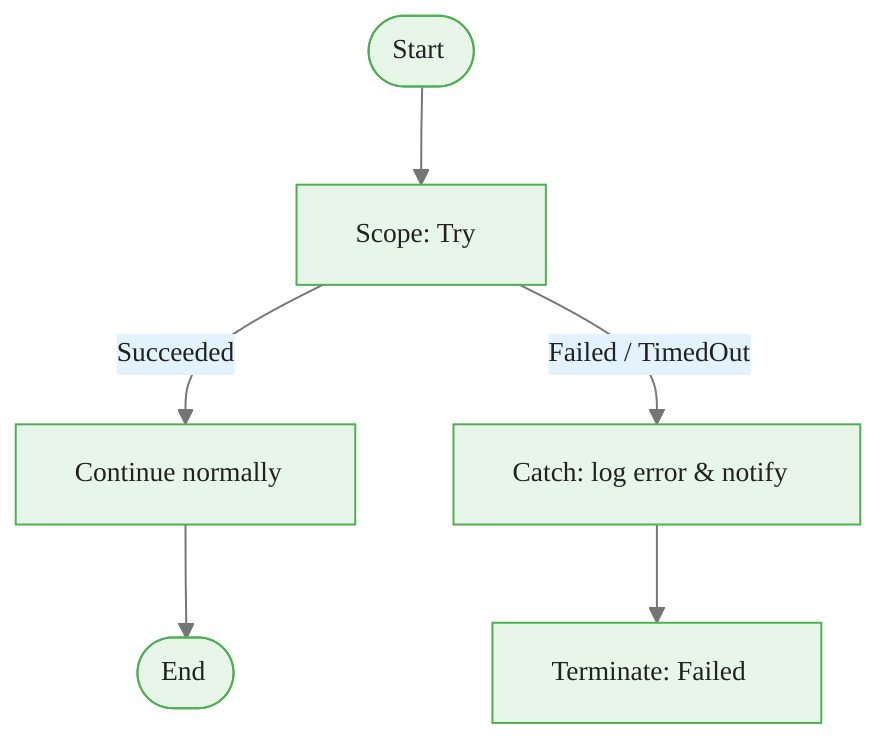
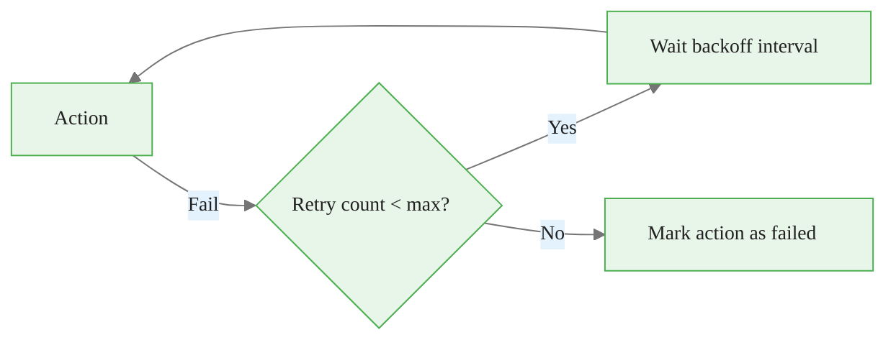
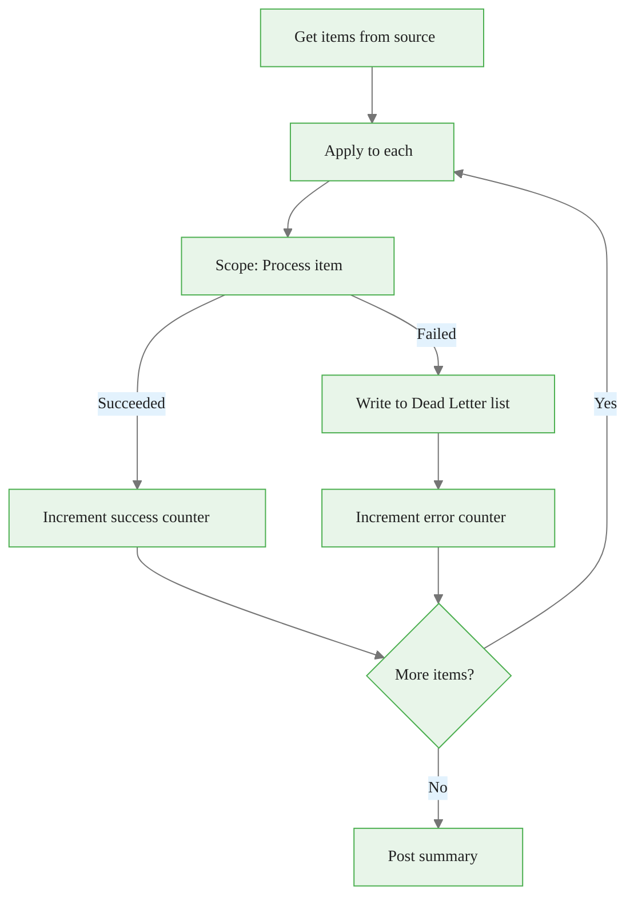
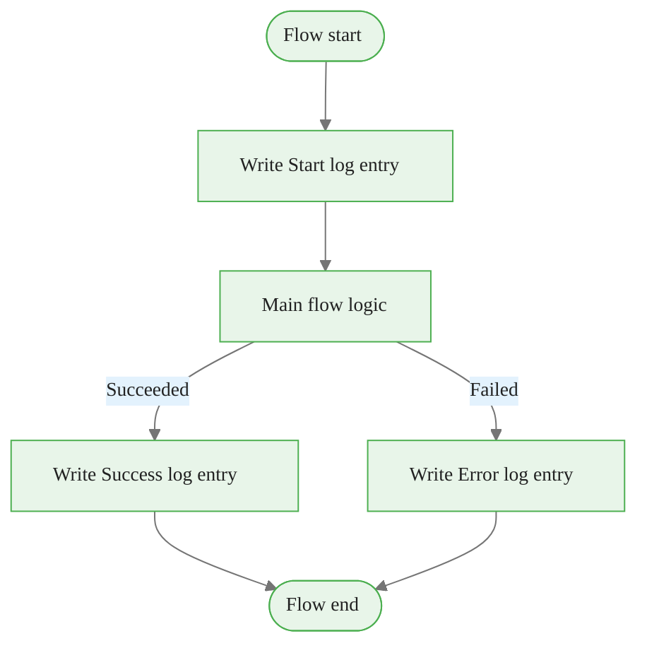
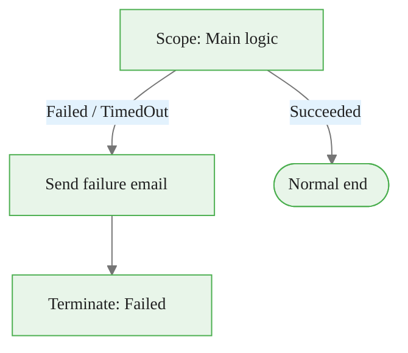
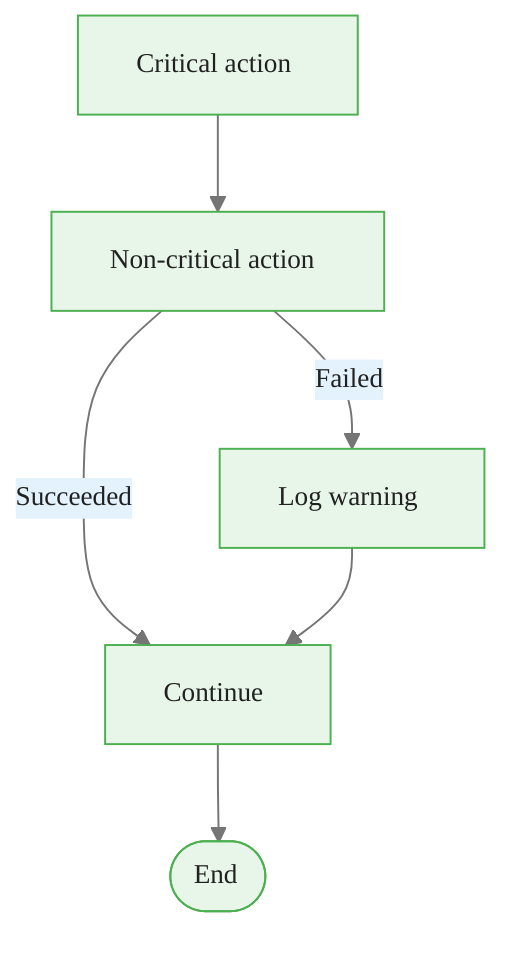
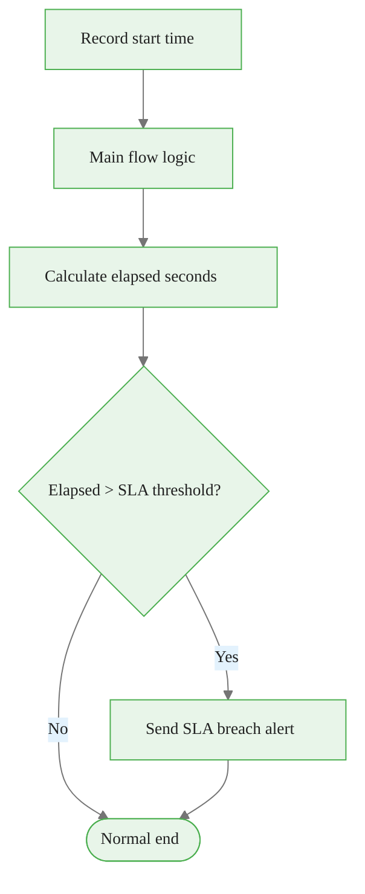

# Error Handling Patterns

Resilience recipes for Power Automate flows. Each pattern includes a Mermaid diagram,
implementation steps, and the exact action settings to configure.

---

## Pattern 1: Try / Catch with Scope

The fundamental building block for error isolation. A **Scope** action groups related
actions; a **Configure run after** setting on a subsequent action acts as the catch block.



### Implementation steps

1. Add a **Scope** action and rename it `Scope_Try`.
2. Place all actions that could fail inside `Scope_Try`.
3. Add a **Compose** action after `Scope_Try` — rename it `Catch_Error`.
4. Open **Compose** settings → **Configure run after** → tick **has failed** and **has timed out**, untick **is successful**.
5. In the **Compose** inputs, capture the error:
   ```
   result('Scope_Try')
   ```
6. Add a **Terminate** action after the catch with `Status = Failed` and a meaningful error message.

### Accessing error details in the catch

```
result('Scope_Try')?[0]?['error']?['message']
result('Scope_Try')?[0]?['error']?['code']
result('Scope_Try')?[0]?['name']
```

`result()` returns an array of action results inside the scope. Index `[0]` is the
first failing action.

---

## Pattern 2: Retry on Transient Failures

Use the built-in **Retry policy** on individual actions for transient errors
(HTTP 429 Too Many Requests, HTTP 5xx server errors).



### Implementation steps

1. Click the `...` (ellipsis) on the action you want to make resilient.
2. Select **Settings**.
3. Under **Retry policy**, choose **Exponential interval**.
   - Count: `4`
   - Interval: `PT5S` (5 seconds)
   - Minimum: `PT2S`
   - Maximum: `PT1H`
4. Click **Done**.

The exponential policy doubles the wait time after each attempt, up to the maximum.
Use `Fixed interval` when the external system has a fixed rate-limit reset window.

### When NOT to use built-in retry

- When the error is a 4xx client error (bad request, auth failure) — retrying immediately will not help.
- When idempotency is not guaranteed — retrying may create duplicate records.
- For those cases, use Pattern 1 (Scope) and fix the root cause in the catch branch.

---

## Pattern 3: Dead Letter Pattern for Failed Items

When processing a list of items in a loop, log failures to a "dead letter" list
rather than stopping the entire run. Operators can review and reprocess failed items.



### Implementation steps

**Prerequisite:** Create a SharePoint list named `FlowDeadLetter` with columns:
- `FlowName` (Single line of text)
- `RunId` (Single line of text)
- `ItemKey` (Single line of text)
- `ErrorMessage` (Multiple lines of text)
- `ErrorTime` (Date and Time)
- `Payload` (Multiple lines of text — stores the raw item JSON for reprocessing)

**Flow setup:**

1. Initialize two integer variables: `SuccessCount = 0`, `ErrorCount = 0`.
2. Add an **Apply to each** over the source array.
3. Inside the loop, add `Scope_Process_Item` and put all processing actions inside it.
4. After the scope (still inside the loop), add a **Create item** (SharePoint) action:
   - Configure run after: **has failed**, **has timed out**
   - `FlowName`: `'My Flow Name'`
   - `RunId`: `@{workflow()?['run']?['name']}`
   - `ItemKey`: `@{items('Apply_to_each')?['ID']}`
   - `ErrorMessage`: `@{result('Scope_Process_Item')?[0]?['error']?['message']}`
   - `ErrorTime`: `@{utcNow()}`
   - `Payload`: `@{string(items('Apply_to_each'))}`
5. Add **Increment variable** actions for both counters with appropriate run-after settings.

---

## Pattern 4: Logging to a SharePoint List

Centralised logging makes it easy to query run history and build dashboards without
opening the Power Automate run history interface.



### Implementation steps

**Prerequisite:** Create a SharePoint list named `FlowAuditLog` with columns:
- `FlowName` (Single line of text)
- `RunId` (Single line of text)
- `EventType` (Choice: Started / Succeeded / Failed / Warning)
- `Message` (Multiple lines of text)
- `EventTime` (Date and Time)
- `Duration` (Number — seconds)

**Flow setup:**

1. At the top of the flow, add **Create item** (SharePoint) to `FlowAuditLog`:
   - `FlowName`: `'Purchase Approval'`
   - `RunId`: `@{workflow()?['run']?['name']}`
   - `EventType`: `'Started'`
   - `EventTime`: `@{utcNow()}`
   - `Message`: `'Run triggered by @{triggerBody()?['Author']?['DisplayName']}'`
   - Save the item's `ID` in a variable `LogItemId` for later updates.

2. Wrap main logic in `Scope_Main`.

3. After the scope, add two **Update item** actions (one for success, one for failure)
   with **Configure run after** set appropriately:
   - Update `EventType` to `'Succeeded'` or `'Failed'`
   - Calculate duration: `div(sub(ticks(utcNow()), ticks(outputs('Get_start_time'))), 10000000)`

---

## Pattern 5: Email Notification on Failure

Send an alert email when any part of a flow fails. Use this as a lightweight
alternative to logging when you do not have a SharePoint list for audit logs.



### Implementation steps

1. Wrap all main flow actions in a `Scope_Main` action.
2. After `Scope_Main`, add **Send an email (V2)**:
   - Configure run after: **has failed**, **has timed out**
   - To: on-call alias or admin email
   - Subject: `FLOW FAILURE: @{workflow()?['tags']?['flowDisplayName']} — @{formatDateTime(utcNow(), 'yyyy-MM-dd HH:mm')}`
   - Body (HTML):
     ```html
     <h2>Flow failure detected</h2>
     <table>
       <tr><td><strong>Flow:</strong></td><td>@{workflow()?['tags']?['flowDisplayName']}</td></tr>
       <tr><td><strong>Run ID:</strong></td><td>@{workflow()?['run']?['name']}</td></tr>
       <tr><td><strong>Time:</strong></td><td>@{utcNow()}</td></tr>
       <tr><td><strong>Error:</strong></td><td>@{result('Scope_Main')?[0]?['error']?['message']}</td></tr>
     </table>
     <p><a href="https://make.powerautomate.com">View run history</a></p>
     ```
3. After the email action, add **Terminate** with `Status = Failed`.

---

## Pattern 6: Graceful Degradation

When a non-critical action fails (e.g. posting a Teams notification), allow the flow
to continue rather than failing entirely.



### Implementation steps

1. After the non-critical action (e.g. a Teams post), add a **Compose** action.
2. Configure run after: tick **is successful**, **has failed**, **has skipped**, **has timed out**.
3. In the compose expression, branch on success:
   ```
   if(
     equals(outputs('Post_Teams_Message')?['statusCode'], 200),
     'Teams notification sent',
     concat('Teams notification failed: ', outputs('Post_Teams_Message')?['body']?['message'])
   )
4. The flow continues past this point regardless of the Teams action result.

---

## Pattern 7: SLA Monitoring

Detect when a flow run exceeds an expected duration and trigger an escalation.



### Implementation steps

1. At the flow start, **Initialize variable** `StartTicks` = `@{ticks(utcNow())}` (type: String).
2. After the main logic completes, add **Compose** to calculate elapsed seconds:
   ```
   div(sub(ticks(utcNow()), int(variables('StartTicks'))), 10000000)
   ```
3. Add a **Condition**:
   - `@{outputs('Compose_Elapsed')}` is greater than `300` (5 minutes = 300 seconds)
4. In the true branch, send a **Send an email** or **Post Teams message** SLA breach alert.

### Setting meaningful SLA thresholds

| Flow type | Suggested SLA |
|-----------|--------------|
| Approval notification | 30 seconds |
| SharePoint sync (< 1000 items) | 5 minutes |
| SharePoint sync (> 5000 items) | 30 minutes |
| HTTP integration with retry | 2 minutes |
| Document generation | 60 seconds |
