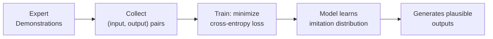
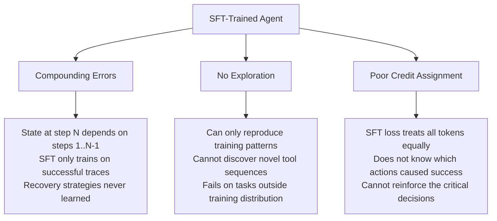

<!-- _class: lead -->

# Supervised Fine-Tuning vs Reinforcement Learning

**Module 00 — Foundations**

> SFT teaches a model what to say. RL teaches a model what to do. For multi-step tool-using agents, the difference is everything.

<!--
Speaker notes: Key talking points for this slide
- Welcome to the first concept in the foundations module
- The central question: why can't we just collect expert demonstrations and fine-tune on them?
- Answer: we can, and we should — but that alone is not enough for agentic tasks
- This lecture will make the failure mode concrete and show exactly what RL adds
- No math required yet — we are building intuition first
-->

---

# What Does SFT Actually Train?

```
Training data:  (prompt, ideal_completion) pairs
Training signal: maximize P(completion | prompt)
What the model learns: "produce tokens that look like this"
```



**SFT is powerful for:** single-turn tasks, format learning, tool syntax

<!--
Speaker notes: Key talking points for this slide
- SFT is maximum likelihood estimation — the model learns to reproduce what experts produce
- The loss function is identical for every token: it doesn't know which tokens were "important"
- "Plausible outputs" is doing a lot of work here — plausible is not the same as correct
- Ask the audience: can you think of a task where producing plausible-looking output is sufficient? (Summarization, translation, QA)
- Now ask: where would plausible-looking output NOT be sufficient?
-->

---

<!-- _class: lead -->

# The Problem: Agents Are Sequential Decision-Makers

<!--
Speaker notes: Key talking points for this slide
- We are about to look at why SFT's imitation approach breaks specifically for agents
- Key word: sequential. Each action changes the state of the world.
- This creates a distribution shift problem that SFT cannot solve
-->

---

# The Compounding Error Problem

<div class="columns">

<div>

**Training trajectories (SFT)**
All examples are "correct"
The model never sees failure states

```
Step 1: ✓  (on distribution)
Step 2: ✓  (on distribution)
Step 3: ✓  (on distribution)
...
Step N: ✓  → Task succeeds
```

</div>

<div>

**Inference trajectories (agent)**
One deviation → off distribution
Model has learned nothing about recovery

```
Step 1: ✓  (on distribution)
Step 2: ✗  (slightly off)
Step 3: ???  (never seen this state)
...
Step N: ???  (model hallucinates)
```

</div>

</div>

<!--
Speaker notes: Key talking points for this slide
- This is the "distributional shift" problem — a classic issue in imitation learning (see DAgger paper, Ross et al. 2011)
- The model is only trained on states that experts visit. At inference time, if it deviates, it enters unknown territory.
- For a 1-step task, one error = task failure. For a 10-step task, one error = 9 remaining steps off distribution.
- Analogy: learning to drive only by watching videos of perfect drives. First time you swerve slightly, you have no idea how to correct.
- This is NOT a data quality problem. More expert demonstrations do not fix compounding errors.
-->

---

# Three Failure Modes of SFT for Agents



<!--
Speaker notes: Key talking points for this slide
- Three distinct, compounding problems — not just one
- Compounding errors: distributional shift (the one we just covered)
- No exploration: the model is bounded by what humans demonstrated. If a better tool sequence exists, it cannot discover it.
- Credit assignment: SFT cannot distinguish "this specific tool call at step 4 was the decisive action" from "this filler phrase was necessary"
- All three are solved, or at least improved, by RL
-->

---

<!-- _class: lead -->

# The Chess Analogy

<!--
Speaker notes: Key talking points for this slide
- Before getting into RL mechanics, let's build intuition with an analogy that most people find clarifying
- Chess is well-understood, and the training paradigm difference maps cleanly
-->

---

# Rulebook vs Experience

<div class="columns">

<div>

**SFT: Reading the Rulebook**

- Study annotated grandmaster games
- Learn what moves look like
- Learn common patterns and notation
- Result: produce moves that look plausible

**Collapses in novel positions**
(positions not covered in training data)

</div>

<div>

**RL: Playing Thousands of Games**

- Try moves, observe outcomes
- Win/lose signal at end of each game
- Discover what actually works
- Result: internalize what leads to winning

**Generalizes to novel positions**
(learned underlying strategy, not patterns)

</div>

</div>

$$\text{SFT: } \hat{y} = \arg\max_y P(y \mid x, \text{demonstrations})$$

$$\text{RL: } \pi^* = \arg\max_\pi \mathbb{E}_{\tau \sim \pi}[R(\tau)]$$

<!--
Speaker notes: Key talking points for this slide
- The chess player who only read annotated games knows what good moves look like — but has not learned why they work
- The chess player who played 10,000 games has internalized causal relationships: this type of position leads to winning if I do X
- For agents: the "game" is the multi-step task. The "win signal" is task completion.
- The math: SFT maximizes likelihood of observed outputs. RL maximizes expected cumulative reward across entire trajectories.
- Note that τ (tau) is a trajectory — a complete sequence of actions — not a single output token
-->

---

# SFT Data Format vs RL Reward Signal

<div class="columns">

<div>

**SFT: fixed target string**

```python
sft_example = {
    "input": "What is 15% of 847?",
    "output": (
        "<tool_call>"
        "calculator(expr='847*0.15')"
        "</tool_call>"
    )
}
# Training signal:
# "Produce exactly these tokens"
```

</div>

<div>

**RL: outcome-based scalar**

```python
def reward(rollout, ground_truth):
    score = 0.0
    if ground_truth in rollout.answer:
        score += 0.6  # correctness
    if len(rollout.actions) <= 3:
        score += 0.2  # efficiency
    if valid_tool_syntax(rollout):
        score += 0.2  # format
    return score

# Training signal:
# "Maximize this score across many tries"
```

</div>

</div>

<!--
Speaker notes: Key talking points for this slide
- SFT: the model must produce a specific string. Right or wrong is all-or-nothing at the token level.
- RL: the model gets a scalar for the whole episode. It can discover many different valid paths to a high score.
- Key insight: the reward function lets you express WHAT you care about (correctness, efficiency, format) independently of HOW to achieve it
- The model figures out how. That's the exploration.
- Ask: what would happen if we set the reward to just 1.0 for any correct answer and 0.0 otherwise? (Binary reward — we cover this in Guide 02)
-->

---

# The Decision Framework

| Criterion | SFT | RL |
|-----------|-----|-----|
| Task length | 1–2 steps | 3+ steps |
| Data available | Many demonstrations | Few demos, can rollout |
| Success signal | Easy to write as target string | Easy to write as reward function |
| Error recovery | Not needed | Critical |
| Novel strategies | Not needed | Desired |

**In practice: use both**

```
Phase 1 — SFT:  Get model into the right format/tool-use neighborhood
Phase 2 — RL:   Optimize toward actual task success
```

<!--
Speaker notes: Key talking points for this slide
- This is a practical guide, not a religious war — SFT and RL complement each other
- SFT is faster, cheaper, and gets you 80% of the way on many tasks
- RL is slower, more expensive, but pushes past the ceiling that imitation learning imposes
- The canonical pipeline: SFT first (InstructGPT style), then RL (RLHF / GRPO / PPO)
- DeepSeek-R1 showed that RL alone from base model can work but is extremely sample-inefficient without SFT warmup
-->

---

# Common Pitfalls

**Pitfall 1: "More SFT data will fix it"**
- Compounding errors are a structural problem, not a data quantity problem
- Even with 1M perfect demonstrations, recovery from off-distribution states cannot be learned from demonstrations alone

**Pitfall 2: "The reward function is secondary"**
- The reward function IS the optimization target
- A proxy reward (e.g., "number of tool calls") produces reward-hacking behavior
- We cover reward design in depth in Guide 02

**Pitfall 3: "Skip SFT, go straight to RL"**
- Exploration from a random policy is catastrophically inefficient
- SFT provides the initialization that makes RL tractable

<!--
Speaker notes: Key talking points for this slide
- These three pitfalls are the most common mistakes when teams first try RL for agents
- Pitfall 1: often comes from confusion between "model hasn't seen enough examples" and "model cannot learn what it needs from examples"
- Pitfall 2: reward hacking is a real and documented failure mode — Goodhart's Law: when a measure becomes a target, it ceases to be a good measure
- Pitfall 3: this is why the GRPO paper still uses SFT-initialized models — cold-start RL for language models is very hard
-->

---

<!-- _class: lead -->

# Summary

**SFT:** Teaches the model to imitate.
Powerful, efficient, necessary — but bounded by the demonstrations.

**RL:** Teaches the model to succeed.
Slower, requires a reward function — but overcomes the ceiling.

**For multi-step tool-using agents:** SFT is the starting point. RL is the optimization engine.

**Up next:** Guide 02 — What makes a good reward signal?

<!--
Speaker notes: Key talking points for this slide
- Reinforce the core message: imitation vs outcome optimization
- The "ceiling" is the key intuition: you cannot surpass the quality of your demonstrations through imitation alone
- Preview: Guide 02 will cover the three types of reward signals (binary, scalar, relative) and how to choose between them
- The reward function is the most important design decision in any RL-for-agents project — worth spending significant time on
-->
