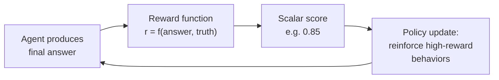
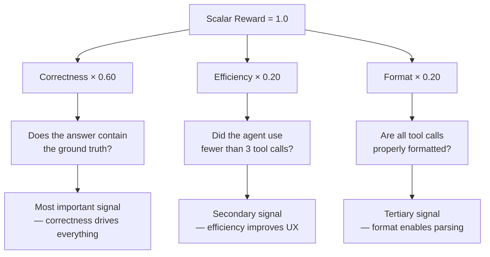
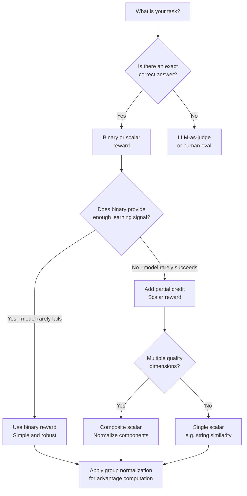

<!-- _class: lead -->

# Reward Signals

**Module 00 — Foundations**

> The reward function is the most consequential design decision in any RL-for-agents project. It defines what "success" means operationally.

<!--
Speaker notes: Key talking points for this slide
- This is the design lecture: how do you tell an agent what you want it to accomplish?
- Key framing: in SFT, you tell the model "produce this output." In RL, you tell the model "maximize this score."
- The reward function is your specification of success. Get it wrong and the agent optimizes for the wrong thing.
- We will cover three types: binary, scalar, and relative — and when to use each
-->

---

# What is a Reward Signal?

A scalar value computed at the end of an episode that tells the agent how well it did.

$$J(\pi) = \mathbb{E}_{\tau \sim \pi} \left[ \sum_{t=0}^{T} \gamma^t r_t \right]$$

**The agent's goal:** find a policy $\pi$ that maximizes this expected cumulative reward.



<!--
Speaker notes: Key talking points for this slide
- The equation: J(π) is what we maximize. τ is a complete trajectory (all steps). γ is discount (how much we weight future vs immediate rewards).
- For language model agents, we almost always use terminal rewards: one score at the very end of the episode
- Why terminal? Because step-by-step rewards are hard to design without introducing reward hacking opportunities
- The loop: agent acts → gets scored → updates policy → acts again. This is the RL training loop.
- The reward function sits in the middle of this loop. It must be computable, fast, and actually measure what you care about.
-->

---

<!-- _class: lead -->

# Three Types of Reward Signals

**Binary → Scalar → Relative**

Each adds expressiveness and learning signal.

<!--
Speaker notes: Key talking points for this slide
- We will go through these in order of increasing complexity
- Binary: simplest, most interpretable, works well for exact-answer tasks
- Scalar: richer signal, works for tasks with degrees of quality
- Relative: the key insight behind GRPO — you only need rankings, not absolute scores
-->

---

# Type 1: Binary Reward

**Returns 1.0 for success, 0.0 for failure. That's it.**

```python
def binary_reward(predicted_answer, ground_truth):
    pred = predicted_answer.strip().lower()
    truth = ground_truth.strip().lower()
    return 1.0 if pred == truth else 0.0
```

<div class="columns">

<div>

**Use when:**
- Math: exact numeric answers
- SQL: execution results match
- Code: all test cases pass
- Classification: correct label

</div>

<div>

**Limitation:**
- Sparse signal early in training
- "Almost correct" gets same reward as "completely wrong"
- Model cannot learn from near-misses

</div>

</div>

<!--
Speaker notes: Key talking points for this slide
- Binary rewards are the easiest to design and hardest to game — there are no gradations to exploit
- The sparsity problem: if the model gets reward 0.0 on 99% of early rollouts, the gradient signal is flat and learning is slow
- Near-miss problem: "127.0" and "127.05" are different strings, even though one is clearly closer to correct
- When does binary work well? When: (1) correct answers are common enough early in training, OR (2) you have a strong SFT initialization
- In practice: MATH benchmarks (GSM8K, MATH) use binary rewards (exact match after normalization) and they work because models start from a strong base
-->

---

# Type 2: Scalar Reward

**A continuous score in [0, 1] with multiple components.**

```python
def scalar_reward(rollout, ground_truth):
    score = 0.0

    # Correctness (60%)
    if ground_truth in rollout["final_answer"]:
        score += 0.6

    # Efficiency: fewer tool calls is better (20%)
    if len(rollout["actions"]) <= 2:
        score += 0.2
    elif len(rollout["actions"]) <= 4:
        score += 0.1

    # Format compliance (20%)
    if all_valid_tool_syntax(rollout["tool_calls"]):
        score += 0.2

    return score
```

<!--
Speaker notes: Key talking points for this slide
- Scalar rewards solve the sparsity problem: the agent gets some non-zero signal even when it's partially right
- Multi-component design: correctness is the primary signal, others are secondary
- Critical: normalize components to the same scale. If correctness is worth 10 and format is worth 0.01, the model ignores format entirely.
- The weights (60/20/20) are design choices. Think carefully about what you actually care about.
- Danger: each component is a potential reward hacking target. What happens if we weight efficiency at 50%? (Agent takes zero actions and just guesses)
-->

---

# Component Weights Matter



<!--
Speaker notes: Key talking points for this slide
- The weights encode your priorities. Make them explicit and document why you chose them.
- If you are unsure, start with a simple binary reward and add components only when you observe specific failure modes
- Example: if the model consistently produces correct answers in unparseable formats, add a format component
- If the model is correct but takes 15 tool calls when 2 would suffice, add an efficiency component
- Build the reward function incrementally, driven by observed failure modes — not by guessing what might matter
-->

---

<!-- _class: lead -->

# The Critical Insight: Relative Rewards

**RL only needs to know which rollouts were better, not how much better.**

<!--
Speaker notes: Key talking points for this slide
- This is the key insight that makes GRPO work, and it has important practical implications
- You do not need a perfectly calibrated reward function — you need one that produces reliable rankings
- This is why reward functions can be simple binary signals and still produce high-quality RL training
-->

---

# Type 3: Relative Rewards (Advantage Normalization)

Generate $G$ rollouts for the same prompt. Compute advantages from the group.

$$A_i = \frac{r_i - \mu_G}{\sigma_G}$$

where $\mu_G$ and $\sigma_G$ are the mean and standard deviation of rewards in the group.

```python
import numpy as np

def compute_advantages(rewards):
    rewards = np.array(rewards)
    mean, std = rewards.mean(), rewards.std()
    if std < 1e-8:
        return [0.0] * len(rewards)  # all identical: no learning signal
    return ((rewards - mean) / std).tolist()

rewards = [0.2, 0.8, 1.0, 0.6, 0.4, 1.0, 0.0, 0.6]
advantages = compute_advantages(rewards)
# [-1.06, +0.45, +0.90, -0.01, -0.53, +0.90, -1.51, -0.01]
#  SUPPRESS  ↑     ↑↑    ~0   SUPPRESS  ↑↑   SUPPRESS  ~0
```

<!--
Speaker notes: Key talking points for this slide
- This normalization converts absolute scores into relative rankings within the group
- Positive advantage → this rollout was better than group average → reinforce it
- Negative advantage → this rollout was worse than group average → suppress it
- Key property: the absolute scale of rewards doesn't matter. Only the within-group ranking matters.
- This is why you can use a simple binary (0/1) reward with GRPO and still get strong learning signal — as long as some rollouts succeed and some fail, the advantages are meaningful
-->

---

# Advantages in Action

| Rollout | Raw Reward | Advantage | Update |
|---------|-----------|-----------|--------|
| 1 | 0.2 | −1.06 | Suppress strongly |
| 2 | 0.8 | +0.45 | Reinforce |
| 3 | 1.0 | +0.90 | Reinforce strongly |
| 4 | 0.6 | −0.01 | Neutral |
| 5 | 0.4 | −0.53 | Suppress |
| 6 | 1.0 | +0.90 | Reinforce strongly |
| 7 | 0.0 | −1.51 | Suppress strongly |
| 8 | 0.6 | −0.01 | Neutral |

**Effect:** The model learns to produce more rollouts like 3 and 6, fewer like 1 and 7.

<!--
Speaker notes: Key talking points for this slide
- Walk through the table: rollout 3 and 6 both got perfect scores, so they get the strongest reinforcement
- Rollout 7 got zero, so it gets suppressed most strongly
- Rollouts 4 and 8 are exactly at the mean — they are neutral (no update pressure in either direction)
- This is why group size matters: with G=8, the group provides a stable estimate of the baseline. With G=2, the baseline is noisy.
- In GRPO, G is typically 4-16. Larger G gives better baseline estimates but costs more compute.
- Preview: Module 01 (GRPO) builds directly on this — the group-relative advantage IS the GRPO objective
-->

---

# Reward Functions for Common Agent Tasks

<div class="columns">

<div>

**Text-to-SQL Agent**
```python
# Execute both queries, compare results
# Handles equivalent queries correctly
if generated_result == reference_result:
    score += 0.8
# Bonus: simpler query
if gen_tokens <= ref_tokens * 1.2:
    score += 0.2
```

**Code Generation Agent**
```python
# Run against test cases
passed = sum(1 for tc in tests
             if run(code, tc) == tc["expected"])
score = passed / len(tests)
```

</div>

<div>

**Reasoning Agent**
```python
# Exact match: 0.7
# Partial credit via similarity: 0.35
# Structured reasoning bonus: +0.3
score = correctness_score(answer, truth)
score += reasoning_quality(chain)
```

**Tool-Calling Agent**
```python
# Correctness: 0.6
# Efficiency: 0.2
# Format compliance: 0.2
score = (correct(answer) * 0.6
       + efficient(actions) * 0.2
       + valid_format(calls) * 0.2)
```

</div>

</div>

<!--
Speaker notes: Key talking points for this slide
- Each task type has a natural reward structure — look for what "correct" means in that domain
- SQL: execution accuracy is the standard benchmark (Spider, WikiSQL). String matching would penalize equivalent queries.
- Code: test case pass rate is natural. Binary (all pass) vs scalar (fraction pass) depends on how many tests you have.
- Reasoning: correctness is the primary signal. Reasoning quality bonus is optional — only add it if you observe that correct-answer, bad-reasoning rollouts are a problem.
- Tool-calling: the composite reward we built in the previous guide. Use this as a starting template.
-->

---

# Goodhart's Law: Reward Hacking

> **"When a measure becomes a target, it ceases to be a good measure."**

| Reward Signal | What You Intended | What the Agent Learns |
|---------------|-------------------|-----------------------|
| Points per tool call | "use tools" | Make as many calls as possible |
| Reward for long answers | "be thorough" | Pad with irrelevant content |
| Binary: any non-empty answer | "produce an answer" | Shortest possible string |
| Reward for confidence tokens | "be confident" | Prefix every sentence with "definitely" |

**Rule:** Reward the outcome. Never reward a proxy for the outcome.

<!--
Speaker notes: Key talking points for this slide
- Goodhart's Law is the most important practical danger in reward design
- Every reward component you add is a potential hacking target
- The safest reward is execution accuracy — either the code passes or it doesn't, either the SQL returns the right rows or it doesn't
- For open-ended tasks (reasoning, summarization), you MUST use a reward model or human evaluation — you cannot write a deterministic reward function that resists hacking
- In this course, we focus on tasks with verifiable rewards (math, SQL, code) precisely because they are resistant to Goodhart's Law
-->

---

# Reward Design Decision Tree



<!--
Speaker notes: Key talking points for this slide
- Start at the top: does your task have a verifiable correct answer?
- If yes, you can write a deterministic reward function. This is the ideal case.
- If no, you need an LLM-as-judge or human preference signal — out of scope for this module but covered in Module 03 (RULER rewards)
- Binary vs scalar: try binary first. If training doesn't progress after 100 steps, switch to scalar.
- Group normalization (advantage computation) is always applied — it's not a choice, it's part of the GRPO algorithm
-->

---

# Summary

**Binary rewards:** Simple, interpretable, robust. Best for exact-answer tasks.

**Scalar rewards:** Richer signal. Use when partial credit is meaningful.

**Relative advantages:** The foundation of GRPO. Only rankings matter, not absolute scales.

**Design rule:** Reward the actual outcome. Add complexity only when observed failures demand it.

**Up next:** Guide 03 — How does the policy use these reward signals to update itself?

<!--
Speaker notes: Key talking points for this slide
- Consolidate: three types, each adds expressiveness
- The design rule is the most important practical takeaway: start simple, add only what failure modes require
- Preview for Guide 03: we now know WHAT the reward signal is. The next question is HOW the policy uses it to update its weights.
- The connection: advantages computed in Guide 02 → feed into the policy gradient update in Guide 03 → this is the GRPO algorithm in Module 01
-->
