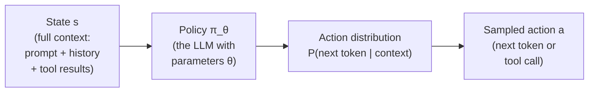
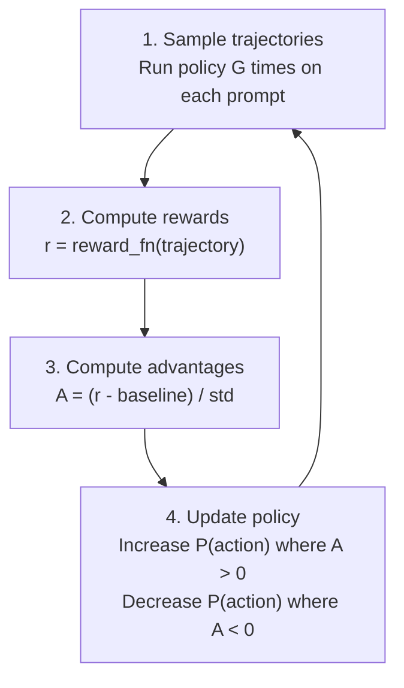
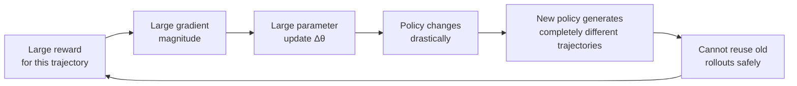

<!-- _class: lead -->

# Policy Optimization Basics

**Module 00 — Foundations**

> A policy maps states to actions. Policy gradient methods update the policy by reinforcing actions that led to better-than-average outcomes.

<!--
Speaker notes: Key talking points for this slide
- This is the mechanical foundation for understanding GRPO in Module 01
- We have covered WHAT we optimize (reward signals). Now we cover HOW the policy learns from those signals.
- Goal: by the end of this lecture, you should be able to explain how a policy gradient update works in one sentence
- One-sentence version: "Sample trajectories, compute advantages, increase probability of good actions, decrease probability of bad ones."
-->

---

# What is a Policy?

$$\pi_\theta(a \mid s) = P(\text{action} = a \mid \text{state} = s; \text{parameters} = \theta)$$

For a language model agent:



**Optimization goal:** Find $\theta^*$ that maximizes $J(\pi_\theta) = \mathbb{E}_{\tau \sim \pi_\theta}[R(\tau)]$

<!--
Speaker notes: Key talking points for this slide
- The policy is a probability distribution over actions, conditioned on state
- For language models: the state is the entire context window, the action is the next token
- At a higher level of abstraction: the action can be the next tool call or the final answer
- Parameters θ are the model weights — the billions of numbers that define the model's behavior
- J(π) is the expected reward across all possible trajectories the policy might produce
- We want θ* — the weights that maximize expected reward. Policy optimization is finding those weights.
-->

---

# The LLM as an RL Policy

<div class="columns">

<div>

**RL terminology**
- State $s_t$: everything in the context
- Action $a_t$: next token generated
- Policy $\pi_\theta$: the model
- Trajectory $\tau$: a complete generation
- Reward $R(\tau)$: outcome quality

</div>

<div>

**LLM terminology**
- Context: prompt + conversation history
- Generation: next token (sampled)
- Model weights: define probabilities
- Rollout: full response or tool sequence
- Score: task success metric

</div>

</div>

The two vocabularies describe the same thing. We will use both interchangeably.

<!--
Speaker notes: Key talking points for this slide
- The mapping is 1:1. RL invented the vocabulary for this problem; LLM training adopted it.
- Why this mapping matters: it lets us apply decades of RL theory directly to language model training
- Key implication: we can treat every token generation as an "action" and apply policy gradient updates at the token level
- In practice, we often work at a higher abstraction level (tool calls or full responses), but the math is the same
- The trajectory τ is a full episode: from the initial prompt to the final answer, including all tool calls
-->

---

<!-- _class: lead -->

# Policy Gradient Intuition

**Four steps. Repeat until convergence.**

<!--
Speaker notes: Key talking points for this slide
- The algorithm is conceptually simple. The engineering challenges are in making it stable and efficient.
- Walk through the four steps slowly — this is the core loop that runs inside every policy gradient method
-->

---

# The Four-Step Loop



$$\nabla_\theta J(\pi_\theta) = \mathbb{E}_{\tau \sim \pi_\theta} \left[ \sum_{t} \nabla_\theta \log \pi_\theta(a_t \mid s_t) \cdot A_t \right]$$

<!--
Speaker notes: Key talking points for this slide
- Step 1: Generate G complete trajectories. G is typically 4-16 in GRPO.
- Step 2: Score each trajectory. This uses the reward function from Guide 02.
- Step 3: Compute advantages. This uses the group-relative normalization from Guide 02.
- Step 4: Gradient update. The formula says: for each action taken, scale its gradient by the advantage.
- The loop: after updating, the policy has changed. So in the next iteration, we generate new trajectories from the updated policy.
- This is "on-policy" training: we always use the CURRENT policy to generate trajectories.
-->

---

# The Update Rule in Plain Language

```
For each trajectory τ and each action a_t in τ:

    If A_t > 0  (this trajectory was better than average):
        → Increase P(a_t | s_t) by a small amount
        → This action contributed to a good outcome: make it more likely

    If A_t < 0  (this trajectory was worse than average):
        → Decrease P(a_t | s_t) by a small amount
        → This action contributed to a bad outcome: make it less likely

    If A_t = 0  (exactly average):
        → No update
        → This action was neutral: leave its probability unchanged
```

$$\Delta \theta \propto \nabla_\theta \log \pi_\theta(a_t \mid s_t) \cdot A_t$$

<!--
Speaker notes: Key talking points for this slide
- This is the policy gradient theorem, stated in plain English
- The gradient of log π(a|s) points in the direction that increases the probability of action a
- Scaling by A_t: if A_t is large and positive, take a big step to increase probability. If A_t is small, take a small step.
- If A_t is negative, we move in the OPPOSITE direction — decreasing probability
- Key: we are not saying "produce this output." We are saying "produce outputs like the good trajectories and avoid outputs like the bad trajectories."
- This is the fundamental difference from SFT: SFT has a fixed target. Policy gradient has a relative target.
-->

---

# Two Problems with Vanilla Policy Gradient

<div class="columns">

<div>

**Problem 1: High Variance**

Same policy, same prompt → different rewards due to sampling randomness

```python
# 1000 rollouts of the same policy
rewards = np.random.normal(
    loc=0.6, scale=0.3, size=1000
)
print(rewards.std())  # 0.30 — high!

# Gradient estimates are this noisy
# Need many samples for stability
```

</div>

<div>

**Problem 2: Sample Inefficiency**

Each rollout used for exactly one gradient update, then discarded

```python
# REINFORCE: 1 rollout, 1 update
rollout = policy.generate(prompt)
reward = score(rollout)
gradient = grad(rollout, reward)
policy.update(gradient)
# rollout discarded — wasted compute
```

</div>

</div>

<!--
Speaker notes: Key talking points for this slide
- These two problems explain why vanilla REINFORCE is almost never used in practice for LLMs
- High variance: the gradient direction is so noisy that the model oscillates rather than converging. You need thousands of rollouts to average out the noise.
- Sample inefficiency: generating an LLM rollout is expensive (GPU compute). Throwing it away after one update is wasteful. PPO and GRPO both address this.
- The solution to variance: baseline subtraction (advantages)
- The solution to sample inefficiency: multiple gradient steps per rollout, or group rollouts
- Both solutions are built into GRPO
-->

---

# The Fix: Advantage Estimation

$$A_t = R(\tau) - b(s_t)$$

**Baseline $b(s_t)$:** expected reward from state $s_t$ under the current policy.

Subtracting the baseline does NOT change the expected gradient (mathematically proven), but it dramatically reduces variance.

```python
import numpy as np

# Without baseline: gradient is noisy
rewards = [0.2, 0.8, 1.0, 0.6, 0.4, 1.0, 0.0, 0.6]
print(f"Reward std (without baseline): {np.std(rewards):.3f}")  # 0.327

# With baseline (group mean): advantages are lower variance
baseline = np.mean(rewards)
advantages = [r - baseline for r in rewards]
print(f"Advantage std (with baseline): {np.std(advantages):.3f}")  # same value

# With normalization (GRPO): scale is removed
normalized = (np.array(rewards) - np.mean(rewards)) / np.std(rewards)
print(f"Normalized std: {np.std(normalized):.3f}")  # always 1.0
```

<!--
Speaker notes: Key talking points for this slide
- The baseline reduces variance because it removes the "constant" component of the reward
- If the policy always gets ~0.6 reward, the raw gradient signal contains a lot of "0.6 reward → increase everything by 0.6" which is not informative
- Subtracting the baseline makes the signal mean-zero: "this was better than average" or "this was worse than average"
- Proof that baseline doesn't change expected gradient: it's a standard result. The intuition: the baseline is a constant with respect to the actions sampled, so it doesn't change which direction the policy should move on average.
- GRPO uses normalization (divide by std) additionally: this removes scale dependence. If you change the reward function's scale, the gradient magnitude stays the same.
-->

---

# Advantage Estimation: Group Mean Baseline

For GRPO, the baseline is the mean of the group:

$$A_i = \frac{r_i - \text{mean}(\{r_1, ..., r_G\})}{\text{std}(\{r_1, ..., r_G\})}$$

```python
rewards = [0.2, 0.8, 1.0, 0.6, 0.4, 1.0, 0.0, 0.6]
advantages = compute_advantages(rewards)

# Advantages:
# [-1.06, +0.45, +0.90, -0.01, -0.53, +0.90, -1.51, -0.01]

# Policy gradient update:
# rollout 3 (A=+0.90): strongly increase probability of its tokens
# rollout 7 (A=-1.51): strongly decrease probability of its tokens
# rollout 4 (A=-0.01): barely any update (was average)
```

No separate value network needed. The group itself provides the baseline.

<!--
Speaker notes: Key talking points for this slide
- GRPO's key simplification over PPO: no value network (critic)
- PPO learns a neural network to estimate b(s) — the expected reward from each state. This adds complexity and instability.
- GRPO uses the group mean as the baseline. Simple, robust, surprisingly effective.
- The tradeoff: the group mean is a noisier estimate of b(s) than a learned value function, but it's much simpler to implement and less likely to diverge
- This simplification is what makes GRPO tractable for LLM training at scale
- The group size G controls the quality of the baseline estimate: larger G → better baseline → lower variance → more stable training
-->

---

# Why Vanilla PG is Unstable: The Step Size Problem



**The instability cycle:** big updates → policy drifts → old data is stale → need new rollouts → repeat.

PPO and GRPO break this cycle with **clipping**.

<!--
Speaker notes: Key talking points for this slide
- This is the fundamental instability of vanilla policy gradient: there is no bound on how much the policy can change in one step
- If one trajectory has a reward of 10 and others have reward of 1, the gradient update is 10x larger than usual
- This can cause the policy to collapse: it becomes highly peaked on one behavior and stops exploring
- Clipping (PPO's contribution): cap the policy change to a small neighborhood around the current policy
- GRPO inherits clipping from PPO and adds the group-relative normalization
- Full derivation of the clipped objective: Module 01
-->

---

# Preview: What GRPO Adds

| Component | Vanilla PG | GRPO |
|-----------|-----------|------|
| Trajectories | 1 per update | G per prompt (group) |
| Baseline | None or learned critic | Group mean/std (simple) |
| Update size | Unconstrained | Clipped (PPO-style) |
| Policy drift | Unconstrained | KL penalty vs reference |
| Sample efficiency | 1 update per rollout | Multiple updates per group |

```python
# GRPO objective (preview — full derivation in Module 01)
ratio = exp(new_log_probs - old_log_probs)  # how much did policy change?
ratio_clipped = clip(ratio, 1-ε, 1+ε)      # bound the change
objective = min(ratio × A, ratio_clipped × A)  # pessimistic bound
loss = -mean(objective) + β × KL_divergence   # also penalize drift
```

<!--
Speaker notes: Key talking points for this slide
- This slide previews Module 01 — everything here will be derived fully in the next module
- The table summarizes exactly what GRPO adds on top of vanilla PG
- Each row addresses a specific problem: group rollouts → sample efficiency, group baseline → variance reduction, clipping → stability, KL penalty → prevents forgetting
- The code snippet shows the GRPO objective formula. Don't worry about memorizing it now — Module 01 derives each term step by step.
- Key message: Module 01 is a direct continuation of this guide. All four concepts here (policy, PG, advantage, stability) connect to GRPO components.
-->

---

# Summary

**Policy:** a language model parameterized by $\theta$, mapping context → action distribution.

**Policy gradient:** update $\theta$ by scaling log-probability gradients by advantage values.

**Advantage:** how much better than average? Reduces variance while preserving gradient direction.

**Vanilla PG problems:** high variance, sample inefficiency, unstable updates.

**GRPO (Module 01):** solves all three with group rollouts, clipping, and KL penalty.

> The foundation is set. Module 01 builds the full algorithm.

<!--
Speaker notes: Key talking points for this slide
- Consolidate all four concepts from this guide
- The progression: Guide 01 (SFT fails) → Guide 02 (what to optimize) → Guide 03 (how to optimize) → Module 01 (the full algorithm)
- By completing these three guides, learners have all the intuition they need to understand GRPO in Module 01
- Exercise: the self-check exercise in exercises/01_sft_vs_rl_exercise.py puts all three guides together in code
- Encourage: the math here is not trivial, but it is not the point of this module. The point is the intuition. Module 01 will make it concrete.
-->
