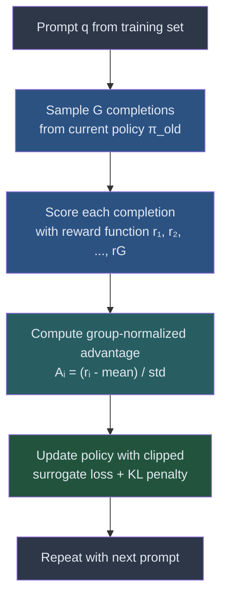
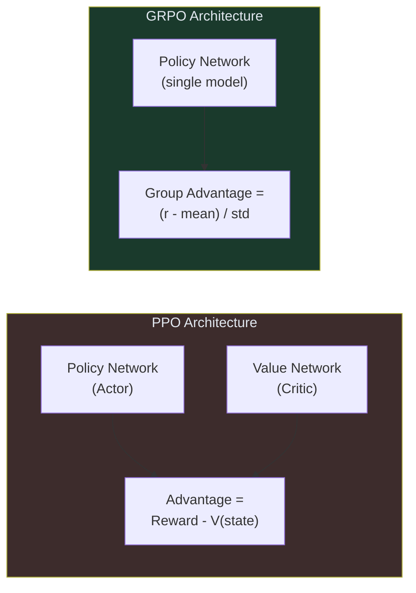

# Guide 01: GRPO Intuition — How Group Relative Policy Optimization Works

## Learning Objectives

By the end of this guide you will be able to:

1. Describe the group sampling strategy and why it replaces a value network
2. Trace the four-step GRPO update cycle from prompt to policy update
3. Explain why only relative rankings matter, not absolute reward scores
4. Compute normalized advantages from a group of four scored completions
5. Explain the key architectural difference between GRPO and PPO

---

## The Core Idea in One Sentence

GRPO generates multiple completions for the same prompt, ranks them relative to each other, and updates the policy to produce more of whatever ranked highest — no critic network required.

---

## Why Relative Ranking?

Before GRPO, the dominant RL approach for language models was PPO (Proximal Policy Optimization). PPO requires a *value network* — a second neural network trained to predict how good a state is, so that the policy network can estimate how much better or worse a completion was compared to what was expected.

Training two large neural networks doubles compute, doubles memory, and adds training instability from the value network's own errors.

GRPO's insight: if you sample multiple completions for the *same* prompt, you already have the baseline you need. The average reward of the group is your baseline. Each completion's advantage is simply how far it deviates from that average. No second network. No learned value function.

This is the same principle a teacher uses when grading on a curve: the class average sets the baseline, and each student's grade is relative to the group, not to some absolute standard.

---

## The Four-Step GRPO Update

**Step 1 — Sample G completions.** For a single prompt $q$, the current policy $\pi_{old}$ generates $G$ different completions $o_1, o_2, \ldots, o_G$. $G$ is typically 4–16 in practice. Each completion is an independent sample — you are exploring the policy's response distribution.

**Step 2 — Score each completion.** A reward function $r$ evaluates each completion and produces a scalar score. The reward function can be a rule (does the SQL query execute correctly?), an LLM judge (is this answer helpful?), or a combination.

**Step 3 — Compute relative advantages.** Normalize the scores within the group:

$$A_i = \frac{r_i - \text{mean}(r_1, \ldots, r_G)}{\text{std}(r_1, \ldots, r_G)}$$

Completions above the group average get positive advantage. Completions below get negative advantage. This is what drives learning: reinforce what worked better than typical, discourage what worked worse.

**Step 4 — Update the policy.** Apply gradient ascent on the clipped surrogate objective (covered in depth in Guide 02). The update pushes the policy to increase the probability of high-advantage completions and decrease the probability of low-advantage completions, while a KL divergence penalty keeps the new policy from straying too far from a reference model.

---

## Worked Numerical Example

You have one prompt: *"What is the capital of France?"*

Your policy generates four completions and a reward function scores each:

| Completion | Response | Reward |
|------------|----------|--------|
| $o_1$ | "The capital is Paris." | 0.9 |
| $o_2$ | "Paris is the capital city." | 0.7 |
| $o_3$ | "I believe it might be Paris." | 0.5 |
| $o_4$ | "France has many cities." | 0.3 |

**Compute the group statistics:**

$$\text{mean} = \frac{0.9 + 0.7 + 0.5 + 0.3}{4} = \frac{2.4}{4} = 0.6$$

$$\text{std} = \sqrt{\frac{(0.9-0.6)^2 + (0.7-0.6)^2 + (0.5-0.6)^2 + (0.3-0.6)^2}{4}}$$
$$= \sqrt{\frac{0.09 + 0.01 + 0.01 + 0.09}{4}} = \sqrt{0.05} \approx 0.2236$$

**Compute advantages:**

| Completion | Reward | Advantage $A_i = (r_i - 0.6) / 0.2236$ |
|------------|--------|------------------------------------------|
| $o_1$ | 0.9 | $(0.9 - 0.6) / 0.2236 \approx +1.342$ |
| $o_2$ | 0.7 | $(0.7 - 0.6) / 0.2236 \approx +0.447$ |
| $o_3$ | 0.5 | $(0.5 - 0.6) / 0.2236 \approx -0.447$ |
| $o_4$ | 0.3 | $(0.3 - 0.6) / 0.2236 \approx -1.342$ |

**What GRPO does with these values:**

- $o_1$ (+1.342): strongly reinforce — this was much better than the group typical
- $o_2$ (+0.447): mildly reinforce — slightly better than average
- $o_3$ (-0.447): mildly discourage — slightly below average
- $o_4$ (-1.342): strongly discourage — much worse than the group

Notice: the absolute reward values (0.3 to 0.9) do not directly matter. Only how each completion ranks within the group matters. If all four completions scored 0.9, all advantages would be 0 (standard deviation of 0 → no update). The model only learns when completions differ in quality.

---

## Key Insight: Only Relative Rankings Matter

This property has important practical consequences:

**Reward scale does not matter.** You can use rewards in any range (0–1, -10 to +10, 0–100) and normalization handles it. You do not need to calibrate absolute reward values.

**No signal when all completions are equal.** If the policy has already converged to generating only excellent (or only terrible) completions for a prompt, the group standard deviation collapses to near zero and that prompt contributes no gradient. This is actually desirable behavior — the model is already consistent on that type of prompt.

**Hard examples drive learning.** Prompts where the model produces a mix of good and bad completions (high within-group variance) produce the largest gradients. GRPO naturally concentrates learning capacity on the cases where the model is most uncertain.

---

## GRPO vs PPO: The Architectural Difference

PPO trains two networks: a policy network that selects actions and a value network that estimates how good each state is. The value network's job is to provide the baseline for advantage estimation.

GRPO eliminates the value network entirely. The baseline comes from the group mean reward, which is computed from actual rollouts rather than a learned approximation. This makes GRPO:

- **Simpler to implement** — one network, one optimizer, no critic loss
- **More memory efficient** — no second large model in memory
- **Less prone to value network instability** — a common failure mode in PPO for LLMs

The tradeoff: GRPO requires $G$ completions per prompt per update step, which increases inference cost. You are trading value network compute for inference compute.

---

## Summary

| Concept | What it means |
|---------|---------------|
| Group sampling | Generate G completions per prompt from the current policy |
| Relative advantage | Normalize rewards by group mean and std — only rankings matter |
| No value network | The group mean replaces the critic's learned baseline |
| Learning signal | High-variance groups → large gradients; uniform groups → no update |
| Policy update | Reinforce above-average completions, discourage below-average |

The mathematics behind the update step — the clipped surrogate loss and the KL penalty — are covered in Guide 02.

---

## Next

Guide 02 — GRPO Mathematics: the full objective function, the clipping mechanism, and the KL divergence penalty.
