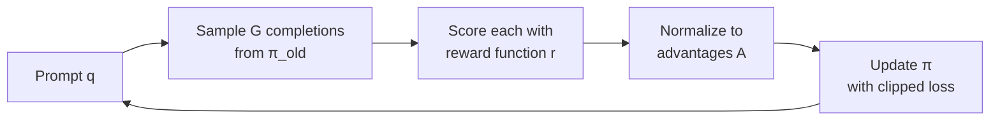
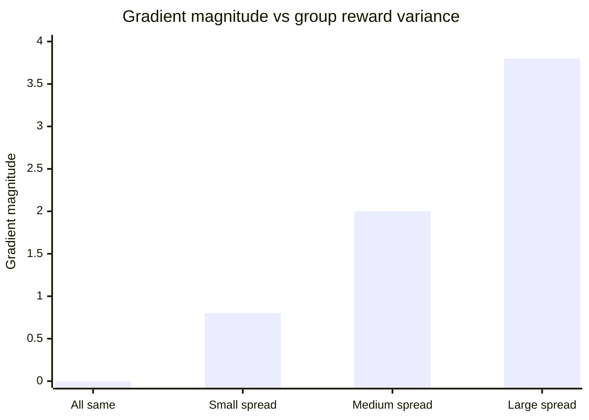

<!-- _class: lead -->

# GRPO Intuition
## Group Relative Policy Optimization

**Module 01 — Reinforcement Learning for AI Agents**

The algorithm behind DeepSeek-R1

<!-- Speaker notes: This deck covers the intuition for GRPO before the math. The key message: GRPO replaces a learned value network with a statistical baseline computed from a group of completions. Everything else follows from that design decision. Estimated lecture time: 20 minutes. -->

---

## What You'll Understand After This Deck

- Why PPO needs a critic network — and why GRPO doesn't
- The four-step GRPO update cycle
- Why only **relative rankings** matter, not absolute scores
- Numerical example: 4 completions → normalized advantages

<!-- Speaker notes: Set expectations. Students coming from Module 00 already know what a policy gradient is and what advantage estimation means. This deck shows how GRPO operationalizes those ideas specifically by exploiting the structure of language model generation: you can always generate multiple completions for the same prompt. -->

---

## The Problem With PPO for LLMs

<div class="columns">

<div>

**PPO requires two large models:**

1. Policy network (actor)
2. Value network (critic)

The critic learns: *"How good is this state?"*

Its answer becomes the baseline for advantage estimation.

</div>

<div>

**The cost:**

- 2× memory
- 2× training complexity
- Critic errors corrupt policy gradients
- Common failure mode in LLM fine-tuning

</div>

</div>

<!-- Speaker notes: This is the motivation for GRPO. PPO is the dominant RL algorithm in robotics and game-playing, and it was adapted for LLMs in InstructGPT/RLHF. The value network problem is well-documented — when the critic learns slowly or inaccurately, it poisons the policy updates. Ask students: if you didn't have a critic, how else could you estimate a baseline? That question leads directly to the next slide. -->

---

## GRPO's Insight: The Group IS the Baseline

Instead of learning a value function, **generate multiple completions and use their average as the baseline**.

$$A_i = \frac{r_i - \text{mean}(r_1, \ldots, r_G)}{\text{std}(r_1, \ldots, r_G)}$$

- Above average → positive advantage → reinforce
- Below average → negative advantage → discourage
- At average → zero advantage → no update

> "Grade on a curve. The class mean is the baseline."

<!-- Speaker notes: This is the core conceptual jump. The group mean is a Monte Carlo estimate of the expected reward under the current policy for this specific prompt. It's not learned — it's sampled. The standard deviation normalization ensures that advantage magnitudes are comparable across prompts with different reward scales. The teacher grading on a curve analogy usually lands well. -->

---

## The Four-Step GRPO Cycle



One pass through this cycle = one GRPO update step.

<!-- Speaker notes: Walk through each step slowly. Step 1: you need a training set of prompts — these are inputs your agent will encounter. Step 2: G is a hyperparameter, typically 4–16. Step 3: the reward function is external — it's not learned, it's designed. Step 4: the clipped loss and KL penalty are covered in Guide 02. The arrow back to A means this loops over your training dataset. -->

---

## Step 1 & 2: Sample and Score

For prompt: *"What is the capital of France?"*

| # | Completion | Reward |
|---|-----------|--------|
| $o_1$ | "The capital is Paris." | **0.9** |
| $o_2$ | "Paris is the capital city." | **0.7** |
| $o_3$ | "I believe it might be Paris." | **0.5** |
| $o_4$ | "France has many cities." | **0.3** |

Four completions. Four rewards. Group mean = **0.6**

<!-- Speaker notes: Keep this example in view for the next two slides — you'll build on it. The reward function here might check: does the response contain 'Paris'? Is it direct and confident? Note that o4 is clearly wrong — it doesn't answer the question. The reward function correctly scores it lowest. -->

---

## Step 3: Normalize to Advantages

$$\text{mean} = 0.6, \quad \text{std} = \sqrt{0.05} \approx 0.2236$$

| Completion | Reward | Advantage |
|-----------|--------|-----------|
| $o_1$ | 0.9 | $\frac{0.9 - 0.6}{0.2236} \approx \mathbf{+1.34}$ |
| $o_2$ | 0.7 | $\frac{0.7 - 0.6}{0.2236} \approx \mathbf{+0.45}$ |
| $o_3$ | 0.5 | $\frac{0.5 - 0.6}{0.2236} \approx \mathbf{-0.45}$ |
| $o_4$ | 0.3 | $\frac{0.3 - 0.6}{0.2236} \approx \mathbf{-1.34}$ |

<!-- Speaker notes: Two things to notice: (1) the advantages sum to approximately zero by construction, (2) the magnitudes are symmetric here because the rewards were evenly spaced. In real training they'll be asymmetric. Ask: what would the advantages look like if all four completions scored 0.9? Answer: all zero — no gradient, no update. This is the right behavior; the model is already consistent. -->

---

## Key Insight: Only Rankings Matter

<div class="columns">

<div>

**If rewards are 0.3, 0.5, 0.7, 0.9:**
- Advantages: -1.34, -0.45, +0.45, +1.34

**If rewards are 3, 5, 7, 9:**
- Advantages: -1.34, -0.45, +0.45, +1.34

**Identical gradients.**

</div>

<div>

**Consequences:**

- Reward scale doesn't matter
- No reward calibration needed
- Hard examples (mixed results) drive learning
- Easy examples (uniform results) produce no update

</div>

</div>

<!-- Speaker notes: This scale-invariance is a major practical advantage. PPO requires reward scaling and clipping as separate hyperparameters. GRPO gets this for free through normalization. The "hard examples drive learning" point deserves emphasis — it means GRPO naturally focuses compute on the prompts where the model is most uncertain, which is exactly where learning is most valuable. -->

---

## GRPO vs PPO: Architecture Comparison

<div class="columns">

<div>

**PPO**

```
Policy Network  →  action
Value Network   →  V(state)
Advantage = reward - V(state)
```

Two models. Critic errors matter.

Memory: 2× policy size

</div>

<div>

**GRPO**

```
Policy Network  →  G completions
Group mean      →  baseline
Advantage = (r - mean) / std
```

One model. Baseline from rollouts.

Memory: 1× policy size + G forward passes

</div>

</div>

<!-- Speaker notes: The key tradeoff: GRPO uses more inference compute (G completions per step) in exchange for eliminating the value network. For LLMs, inference is cheap relative to training, so this is usually a good trade. For robotics with expensive simulators, PPO's value network may be worth the cost. -->

---

## When Is the Group Signal Strong?



Low variance in group rewards → small gradient → slow learning

High variance in group rewards → large gradient → fast learning

<!-- Speaker notes: This chart is conceptual — the exact numbers are illustrative. The point is that GRPO learns fastest from prompts where the policy is uncertain and produces a mix of good and bad completions. Prompts where it already performs consistently produce nearly zero gradient. This is a form of automatic curriculum: the algorithm concentrates learning effort where it's most needed. -->

---

## Summary

| Concept | Meaning |
|---------|---------|
| Group sampling | G completions per prompt, from current policy |
| Relative advantage | $(r_i - \mu) / \sigma$ — ranking within the group |
| No value network | Group mean replaces the critic's baseline |
| Scale invariance | Reward units don't matter, only rankings do |
| Hard examples dominate | High-variance groups drive the most learning |

<!-- Speaker notes: Quick summary before moving to the math. Check understanding: ask students to explain in their own words why GRPO doesn't need a critic network. The answer should reference the group mean as a baseline. -->

---

<!-- _class: lead -->

## Next: Guide 02

**GRPO Mathematics**

The full objective function, clipping mechanism, and KL penalty — with Python implementations of each component.

<!-- Speaker notes: Guide 02 goes into the math. Specifically: the clipped surrogate objective (same form as PPO's), the KL divergence penalty term, and how they combine into the full GRPO loss. Students should come to Guide 02 already comfortable with the advantage formula from today. -->
