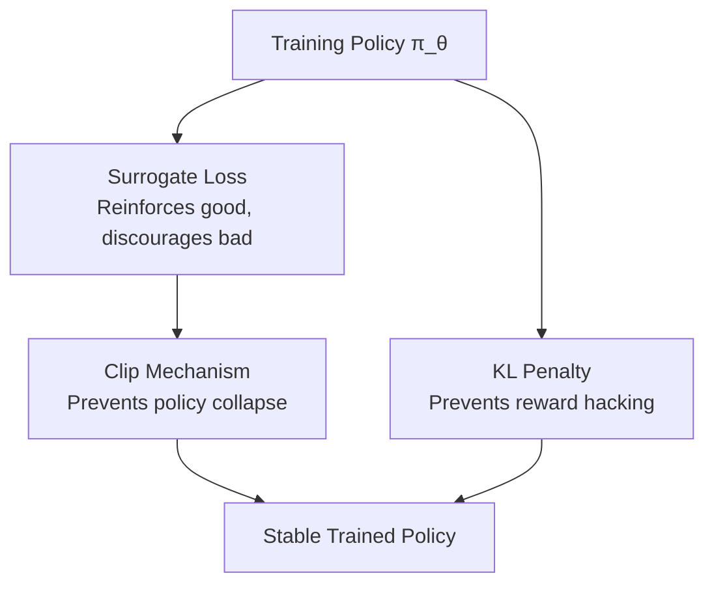

<!-- _class: lead -->

# GRPO Mathematics
## Objective Function, Clipping, and KL Penalty

**Module 01 — Reinforcement Learning for AI Agents**

<!-- Speaker notes: This deck covers the full GRPO objective function. Students should already be comfortable with the intuition from Guide 01 — specifically, they understand that advantages are group-normalized reward scores. Now we formalize exactly how those advantages drive the policy update. Estimated time: 25 minutes. Have the worked numerical example from Guide 01 ready for reference. -->

---

## The Full GRPO Objective

$$L_{\text{GRPO}} = \mathbb{E}_{q \sim P(Q)} \left[ \frac{1}{G} \sum_{i=1}^{G} \min\!\left(\rho_i A_i,\ \text{clip}(\rho_i, 1-\epsilon, 1+\epsilon) A_i\right) - \beta D_{\text{KL}}(\pi_\theta \| \pi_{ref}) \right]$$

where $\rho_i = \dfrac{\pi_\theta(o_i|q)}{\pi_{old}(o_i|q)}$

Three components: **ratio**, **clipped surrogate**, **KL penalty**

<!-- Speaker notes: Write this on the board and point to each piece as you introduce it. Tell students: we're going to spend one slide on each term before putting them back together. The subscript old means the policy that generated the completions during rollout — it was frozen before the update started. The subscript theta means the current training policy whose parameters we're differentiating through. -->

---

## The Probability Ratio $\rho_i$

$$\rho_i = \frac{\pi_\theta(o_i|q)}{\pi_{old}(o_i|q)}$$

Measures how much the new policy differs from the rollout policy.

| $\rho_i$ | Meaning |
|----------|---------|
| 1.0 | No change — same probability as before |
| 1.5 | 50% more likely under new policy |
| 0.6 | 40% less likely under new policy |

**In practice:** $\rho_i = \exp(\log\pi_\theta - \log\pi_{old})$ — log-probs are what LMs output.

<!-- Speaker notes: This is the importance sampling weight. Policy gradient methods collect samples from the old policy and then update. If the policy has moved far from where the samples were collected, the gradient estimate is biased — the samples are no longer representative. The ratio corrects for this. Stress the log-prob implementation detail: LMs produce token log-probabilities, and you sum them over the sequence to get the completion log-probability. -->

---

## Why We Can't Just Use $\rho_i \cdot A_i$

The naive policy gradient: $\rho_i \cdot A_i$

**Problem:** no upper bound on updates.

If a lucky completion gets high advantage:
- $\rho_i$ increases without limit
- Policy collapses to producing only that completion type
- Catastrophic forgetting of other behaviors

This is *policy collapse* — a common failure mode in LLM RL.

<!-- Speaker notes: This is worth spending time on because students will wonder why you need the clip if you already have a reasonable learning rate. The answer is that for language models, even a small gradient step on a very high-advantage completion can make a dramatic change in token probabilities. The softmax amplifies small logit changes. The clip is a hard safeguard, not just a regularizer. -->

---

## The Clip Operation

$$\text{clip}(\rho_i, 1-\epsilon, 1+\epsilon)$$

For $\epsilon = 0.2$, ratios are forced into $[0.8, 1.2]$.

```
ratio = 0.5  →  clipped to 0.8   (too small, cap it)
ratio = 0.9  →  unchanged 0.9    (within range)
ratio = 1.1  →  unchanged 1.1    (within range)
ratio = 1.7  →  clipped to 1.2   (too large, cap it)
```

Prevents any single update from moving the policy more than $\epsilon$ away.

<!-- Speaker notes: Draw the clip function on the board: a straight line with flat ends at 0.8 and 1.2 (for epsilon=0.2). Ask students: what is the gradient of the clipped function at ratio=0.5? It's zero — no gradient flows when the clip is active. This is the key: the clip not only bounds the ratio value but also stops gradients when the update is too large. -->

---

## Taking the Minimum: The Conservative Step

$$\min(\rho_i A_i,\ \text{clip}(\rho_i, 1-\epsilon, 1+\epsilon) \cdot A_i)$$

**Case 1: $A_i > 0$ (good completion, reinforce it)**

- $\rho > 1+\epsilon$: policy already moving toward this completion strongly. Min selects the clipped (smaller) value. **Update is capped.**
- $\rho \leq 1+\epsilon$: min selects the unclipped value. **Normal update.**

**Case 2: $A_i < 0$ (bad completion, discourage it)**

- $\rho < 1-\epsilon$: policy already moving away from this completion strongly. Min selects the clipped (less negative) value. **Discouragement is capped.**
- $\rho \geq 1-\epsilon$: normal update.

<!-- Speaker notes: This is the subtlest part of the objective. The min is taken element-wise, and its effect depends on the sign of the advantage. Walk through both cases on the board with numbers. A good exercise: have students compute min(0.7 * 1.5, clip(0.7, 0.8, 1.2) * 1.5) and min(-0.7 * 0.5, clip(-0.7, 0.8, 1.2) * 0.5). -->

---

## The KL Divergence Penalty

$$-\beta\, D_{\text{KL}}(\pi_\theta \| \pi_{ref})$$

Pulls the training policy toward a frozen reference model.

**What it prevents:**
- Reward hacking (exploiting reward function bugs)
- Repetitive degenerate outputs
- Loss of fluent language generation

**$\beta$ tradeoff:**

$$\underbrace{\beta \to 0}_{\text{pure reward}} \xleftrightarrow{\text{balance}} \underbrace{\beta \to \infty}_{\text{no learning}}$$

Typical: $\beta \in [0.01, 0.1]$

<!-- Speaker notes: The reference model is typically the SFT model — the result of supervised fine-tuning before RL begins. It represents the baseline of "competent, safe language generation." The KL penalty says: stay close to this baseline unless there's a strong reward signal pushing you away. DeepSeek-R1 actually removed the KL penalty in later training stages — they found that with a good enough reward function and sufficient initial SFT training, the model didn't need it. This is an advanced technique they used carefully. -->

---

## Advantage Formula (Review)

$$A_i = \frac{r_i - \text{mean}(r_1, \ldots, r_G)}{\text{std}(r_1, \ldots, r_G)}$$

This is the term that connects reward scores to the objective.

```python
def compute_group_advantages(rewards):
    mean = np.mean(rewards)
    std = np.std(rewards)
    if std < 1e-8:
        return np.zeros_like(rewards)  # no signal when all equal
    return (rewards - mean) / std
```

<!-- Speaker notes: Quick review of the advantage formula students saw in Guide 01. The implementation detail to stress: the zero-check on std. When all completions have identical rewards, the std is zero and you'd get a division by zero. The correct behavior is to return zero advantages — no gradient for this prompt. This is not a numerical hack; it's the correct mathematical behavior. -->

---

## Python: Clipped Surrogate Loss

```python
def clipped_surrogate_loss(log_probs_new, log_probs_old, advantages, epsilon=0.2):
    # Ratio in log space for numerical stability
    ratio = np.exp(log_probs_new - log_probs_old)

    unclipped = ratio * advantages
    clipped   = np.clip(ratio, 1 - epsilon, 1 + epsilon) * advantages

    return float(np.mean(np.minimum(unclipped, clipped)))
```

Three lines of NumPy implement the core of GRPO.

<!-- Speaker notes: Point out that np.minimum is element-wise (correct) whereas np.min would reduce to a scalar (wrong). The mean at the end is the 1/G averaging term from the objective. In PyTorch this would be loss.mean() instead, and you'd call loss.backward() to get gradients through log_probs_new. log_probs_old is detached (no gradient). -->

---

## Python: Full GRPO Loss

```python
def grpo_loss(log_probs_new, log_probs_old, log_probs_ref,
              advantages, epsilon=0.2, beta=0.04):

    surrogate = clipped_surrogate_loss(
        log_probs_new, log_probs_old, advantages, epsilon
    )
    kl = float(np.mean(log_probs_new - log_probs_ref))  # KL approximation

    return surrogate - beta * kl   # maximize this (or minimize the negative)
```

KL approximation: $D_{\text{KL}} \approx \mathbb{E}[\log\pi_\theta - \log\pi_{ref}]$

<!-- Speaker notes: The KL approximation uses samples from the current policy rather than integrating over the full distribution. This is the standard estimator used in practice. It's unbiased in expectation but has higher variance than the true KL. Some implementations add a "reverse KL" term or use a more sophisticated estimator. For our purposes, this is correct and efficient. -->

---

## Numerical Example: Full Step

Rewards: $[0.9, 0.7, 0.5, 0.3]$ → Advantages: $[+1.34, +0.45, -0.45, -1.34]$

<div class="columns">

<div>

**Ratios (policy shifted slightly):**

| $i$ | $\rho_i$ | Clipped? |
|-----|----------|----------|
| 1 | 1.10 | No |
| 2 | 1.03 | No |
| 3 | 0.97 | No |
| 4 | 0.91 | No |

All within $[0.8, 1.2]$ — clip inactive.

</div>

<div>

**Loss contributions $\min(\rho_i A_i, \text{clip}(\rho_i) A_i)$:**

| $i$ | Value |
|-----|-------|
| 1 | $1.10 \times 1.34 = +1.47$ |
| 2 | $1.03 \times 0.45 = +0.46$ |
| 3 | $0.97 \times (-0.45) = -0.44$ |
| 4 | $0.91 \times (-1.34) = -1.22$ |

Mean = $+0.07$ → positive → good update

</div>

</div>

<!-- Speaker notes: Walk through the arithmetic. The mean is positive, which means the surrogate says "this update direction is correct — the policy is moving toward better completions." The loss is positive because we maximize it (or equivalently, the gradient ascent step will increase the probability of good completions). After subtracting the KL penalty, the total loss would be slightly lower. -->

---

## Hyperparameter Summary

| Parameter | Symbol | Range | Rule of thumb |
|-----------|--------|-------|---------------|
| Group size | $G$ | 4–16 | Start at 8; double if training is noisy |
| Clip range | $\epsilon$ | 0.1–0.3 | 0.2 is almost always fine |
| KL coefficient | $\beta$ | 0.01–0.1 | Start at 0.04; increase if reward hacking |
| Ref model | $\pi_{ref}$ | — | Use your SFT checkpoint |

<!-- Speaker notes: These are practical values based on the DeepSeekMath paper and subsequent work. The group size G is the most important to tune — too small and the baseline is noisy, too large and you waste inference compute. 8 is a reasonable starting point for most tasks. epsilon=0.2 is the PPO default and works well for GRPO too. -->

---

## What Each Term Defends Against



<!-- Speaker notes: This diagram shows the three safety mechanisms working together. Without the clip, large updates cause policy collapse. Without the KL penalty, the policy reward-hacks. Without both, training would diverge. Each piece addresses a specific failure mode. This is why GRPO is stable — it has layered defenses. -->

---

## Summary

| Term | Symbol | Purpose |
|------|--------|---------|
| Probability ratio | $\rho_i$ | Importance weighting for off-policy samples |
| Clipped surrogate | $\min(\rho_i A_i, \text{clip}(\rho_i) A_i)$ | Bounded policy update, prevents collapse |
| KL penalty | $-\beta D_{\text{KL}}$ | Stays close to reference, prevents hacking |
| Advantage | $A_i = (r_i - \mu)/\sigma$ | Relative group ranking as training signal |

<!-- Speaker notes: This table is a useful reference during the exercise. Ask students: which term would you remove if you had a perfect reward function? (Arguably the KL penalty — if the reward function has no exploitable bugs, reward hacking isn't a risk. But in practice, no reward function is perfect.) -->

---

<!-- _class: lead -->

## Next: Guide 03

**GRPO vs Alternatives**

How GRPO compares to PPO, DPO, and REINFORCE — and when to use each.

<!-- Speaker notes: Guide 03 is the comparison guide. Students should come with a solid understanding of GRPO's mechanics before comparing. The main questions to hold in mind: (1) What does each algorithm need as input — a reward model, preference pairs, or a reward function? (2) How does each handle the baseline problem? (3) What are the compute costs? -->
