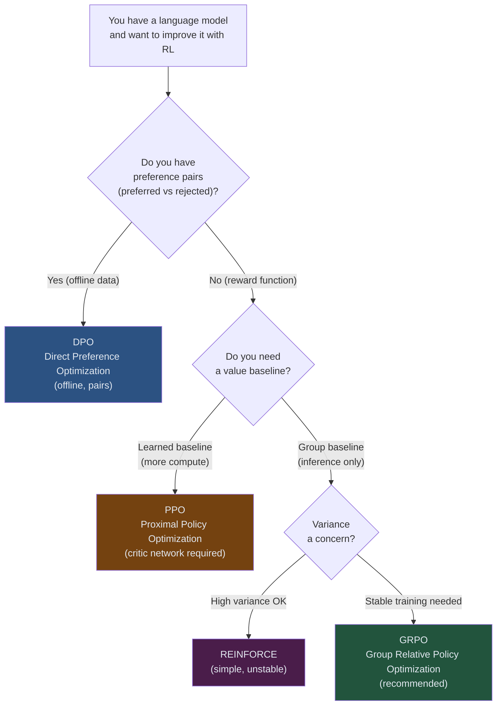
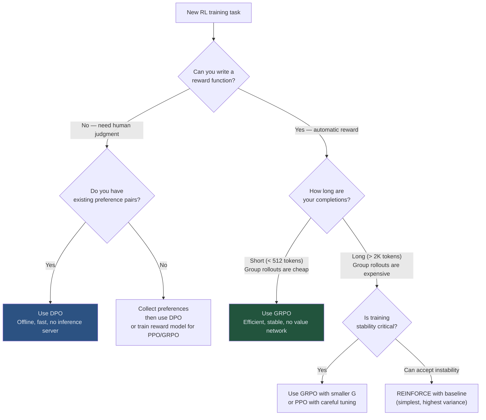

# Guide 03: GRPO vs Alternatives — PPO, DPO, and REINFORCE

## Learning Objectives

By the end of this guide you will be able to:

1. Explain the primary architectural difference between GRPO and PPO (value network)
2. Distinguish GRPO from DPO on three axes: online vs offline, data format, and variance
3. Explain how GRPO reduces variance compared to vanilla REINFORCE
4. Select the appropriate algorithm for a given training scenario based on data availability and compute constraints
5. Read a compute cost comparison table and use it to justify an algorithm choice

---

## The Landscape of LLM RL Algorithms

This guide walks through each comparison in detail.

---

## GRPO vs PPO

### What PPO Requires

PPO (Proximal Policy Optimization) is the dominant RL algorithm in robotics and game-playing, adapted for LLMs in InstructGPT and early RLHF systems. It uses:

1. **A policy network** (the LLM being trained)
2. **A value network** (a second model that estimates expected future reward)
3. **A reward model** (a trained classifier, not a rule-based function)

The value network is typically initialized from the same LLM weights and then fine-tuned to predict reward. For a 7B model, this means 14B parameters in GPU memory at training time, plus the reward model.

### What GRPO Replaces

GRPO eliminates the value network. The group mean reward serves as the baseline:

| | PPO | GRPO |
|-|-----|------|
| **Baseline source** | Learned value network | Group mean reward |
| **Models in memory** | Policy + Value (+ Reward model) | Policy only |
| **Memory at training** | ~2× policy size | ~1× policy size |
| **Baseline quality** | Smooth (learned) | Noisy (sampled) |
| **Baseline errors** | Value network errors corrupt policy gradient | Group sample noise, reduces with larger G |
| **Implementation complexity** | High (two optimizers, critic loss scheduling) | Low (one model, one loss) |

### When PPO Wins

PPO's learned value network is a better baseline when:

- Single-step tasks where the group mean is a poor proxy for expected value
- Environments where collecting $G$ rollouts per step is computationally expensive (simulation-heavy robotics, long multi-step agent tasks)
- Teams with existing PPO infrastructure

### When GRPO Wins

GRPO is preferable when:

- You have a rule-based or LLM-judge reward function (no reward model training required)
- Memory is constrained (one fewer large model)
- Training stability is a priority (eliminates value network instability as a failure mode)
- Tasks involve short-to-medium response length (group rollouts are cheap)

For LLM training specifically, the DeepSeekMath and DeepSeek-R1 results demonstrate that GRPO's simpler setup achieves state-of-the-art performance without the overhead of PPO's critic.

---

## GRPO vs DPO

### What DPO Requires

DPO (Direct Preference Optimization) is an *offline* algorithm. It learns from a dataset of preference pairs: for each prompt, you have one preferred completion and one rejected completion. No environment interaction is required at training time.

DPO reformulates the RLHF objective to directly optimize policy from preference pairs without explicitly training a reward model.

### The Key Differences

| | DPO | GRPO |
|-|-----|------|
| **Training mode** | Offline (static dataset) | Online (generates data during training) |
| **Data format** | Preference pairs $(o^+, o^-)$ | Group rewards $(r_1, \ldots, r_G)$ |
| **Reward signal** | Implicit (from human preferences) | Explicit (reward function) |
| **Group size** | Always 2 (one pair) | $G \geq 2$, typically 4–16 |
| **Data collection** | Before training (human labeling) | During training (automatic) |
| **Distribution shift** | Static — model drifts from data | Corrected each step (on-policy) |
| **Variance** | Low (fixed dataset) | Higher, controlled by $G$ and group normalization |

### The Distribution Shift Problem

DPO's critical weakness: the dataset is collected from one model, but training updates the policy. As training progresses, the policy produces outputs increasingly different from what was in the dataset. The preference pairs become less representative of what the model currently generates.

This is called *distribution shift* and is a fundamental challenge for offline RL. Online methods like GRPO avoid this by generating new rollouts from the current policy at every step.

### When DPO Wins

- You have a large existing dataset of human preferences
- Human annotation is available and affordable
- Tasks where automatic reward functions are hard to design (e.g., "write engaging prose")
- Simpler infrastructure (no inference server needed during training)

### When GRPO Wins

- You can define a reward function automatically (SQL execution, test passing, format checking)
- No preference dataset exists
- You need the model to improve on its own rollouts (self-improvement loop)
- Tasks where the model's capability improves enough to require fresh training data

---

## GRPO vs REINFORCE

### What REINFORCE Does

REINFORCE is the simplest policy gradient algorithm. For each completion, multiply the log-probability of the completion by its reward, and update:

$$\nabla L_{\text{REINFORCE}} = \nabla_\theta \log \pi_\theta(o|q) \cdot r(o, q)$$

This is an unbiased gradient estimator, but it has very high variance. The reward $r(o, q)$ is used directly as the advantage — there is no baseline subtraction.

### GRPO's Variance Reduction

GRPO extends REINFORCE in two ways:

1. **Baseline subtraction:** subtracting the group mean from each reward reduces variance substantially. The group mean is a Monte Carlo estimate of $\mathbb{E}[r | q]$ for that prompt.

2. **Normalization by standard deviation:** dividing by the group std puts advantages on a common scale across prompts, reducing the sensitivity to reward magnitude differences between prompts.

| | REINFORCE | GRPO |
|-|-----------|------|
| **Baseline** | None (or fixed scalar) | Group mean (prompt-specific) |
| **Normalization** | None | Group standard deviation |
| **Clip** | None | Yes ($\epsilon$ clip on ratio) |
| **KL penalty** | Optional | Standard |
| **Variance** | High | Moderate (decreases with $G$) |
| **Training stability** | Often diverges | Stable in practice |
| **Implementation** | ~10 lines | ~30 lines |

### Why REINFORCE Fails for LLMs

High variance in REINFORCE gradients means the model oscillates rather than converges. With language models, a few lucky high-reward completions can cause the policy to shift dramatically in a single update, followed by collapse. The combination of group normalization and clipping in GRPO addresses both the variance and the step-size problems.

---

## Algorithm Selection Guide

Use this flowchart when choosing an algorithm for a new task:

---

## Compute Cost Comparison

The following table uses a 7B parameter model as the baseline. Costs are relative to supervised fine-tuning (SFT = 1.0).

| Algorithm | Memory (relative to SFT) | Training FLOPs | Data Required | Infrastructure |
|-----------|--------------------------|----------------|---------------|----------------|
| SFT | 1.0× | 1.0× | Labeled examples | GPU only |
| DPO | 1.2× (+ reference model) | 1.2× | Preference pairs | GPU only |
| REINFORCE | 1.0× | 1.5× (rollouts) | Reward function | GPU + inference |
| GRPO ($G=8$) | 1.0× | 2.5× (8 rollouts) | Reward function | GPU + inference |
| PPO | 2.0× (policy + critic) | 3.0× (rollouts + critic) | Reward function | GPU + inference + critic |

**Notes:**
- GRPO scales linearly with $G$ on the inference side. $G=4$ costs roughly half of $G=8$ for rollouts.
- PPO's 3.0× is an underestimate for long rollouts because the critic must process all state sequences.
- DPO's 1.2× is for training only; data collection (human annotation) is a separate cost.
- All numbers are approximate and task-dependent.

---

## Summary: When to Use Each

| Algorithm | Best fit |
|-----------|----------|
| **GRPO** | Automatic reward function available; want stable training; memory constrained; DeepSeek-style reasoning tasks |
| **PPO** | Existing PPO infrastructure; long rollout tasks where critic amortizes; simulation environments |
| **DPO** | Existing preference dataset; no inference server available; tasks needing human judgment |
| **REINFORCE** | Prototyping; simplicity over stability; short rollouts; educational use |

For this course — training text-to-SQL agents with automatic SQL execution rewards — GRPO is the correct choice. The reward function is automatic (run the query, check the result), completions are short (SQL queries), and memory efficiency matters when running on a single GPU.

---

## Next Steps

You now have a complete picture of GRPO: intuition (Guide 01), mathematics (Guide 02), and context (this guide). The exercise (`exercises/01_grpo_from_scratch_exercise.py`) asks you to implement the core components from memory.

Module 02 introduces the ART framework, which wraps GRPO training into a production-ready system using Unsloth for efficient GPU training and vLLM for fast rollout generation.
