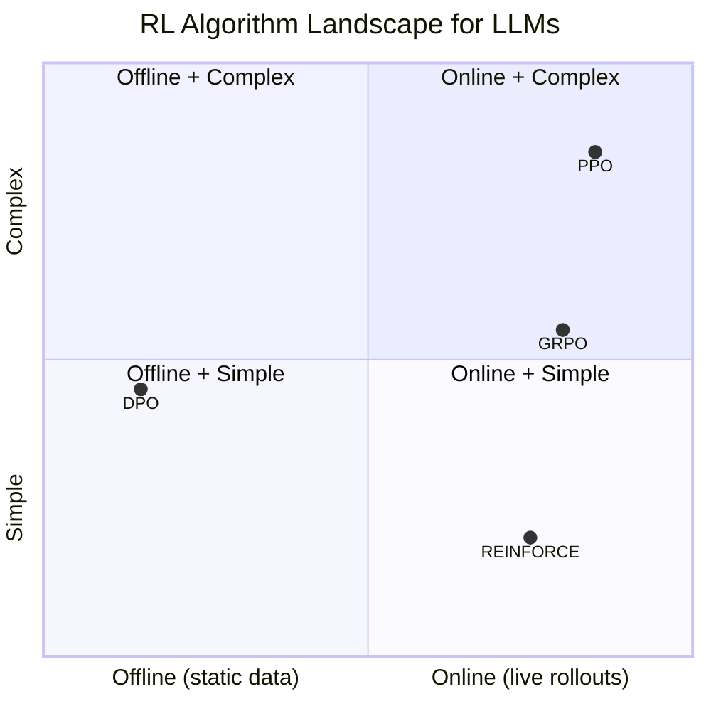
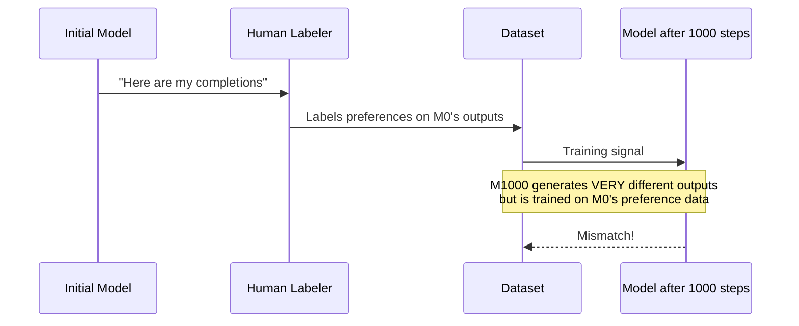
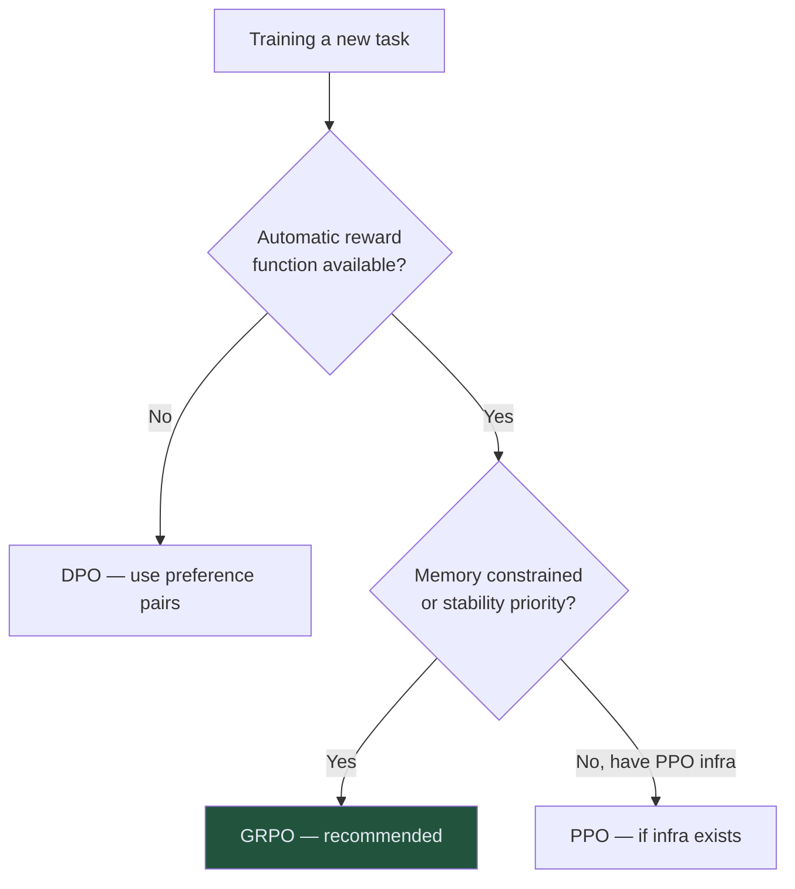

<!-- _class: lead -->

# GRPO vs Alternatives
## PPO, DPO, and REINFORCE

**Module 01 — Reinforcement Learning for AI Agents**

<!-- Speaker notes: This deck covers algorithm selection. Students now understand GRPO deeply — this session gives them the context to know when NOT to use it. The goal is a clear mental model for selecting between PPO, DPO, REINFORCE, and GRPO based on the problem at hand. Estimated time: 20 minutes. -->

---

## Four Algorithms, Four Positions



<!-- Speaker notes: Mermaid quadrant charts are supported in newer Marp versions — if rendering fails, replace with a simple 2x2 table. The axes: online vs offline (does training generate new data?), simple vs complex (implementation and compute complexity). GRPO is online (generates rollouts) but simpler than PPO (no critic). DPO is offline and moderate complexity. REINFORCE is online and simple but unstable. -->

---

## GRPO vs PPO: The Critic Question

<div class="columns">

<div>

**PPO needs:**

1. Policy network (LLM)
2. Value network (critic LLM)
3. Reward model (trained classifier)

Memory: ~2× policy size

The critic's job: estimate $V(s)$ so advantage = $r - V(s)$

</div>

<div>

**GRPO needs:**

1. Policy network (LLM)
2. Rule-based reward function

Memory: ~1× policy size

The group's job: estimate $\mathbb{E}[r|q]$ via sampling

</div>

</div>

> GRPO replaces a learned approximation with a sampled one.

<!-- Speaker notes: The key framing: both PPO and GRPO need a baseline for advantage estimation. PPO learns the baseline (the value function). GRPO samples the baseline (the group mean). The sampled baseline is noisier but doesn't require training a second large model. For 7B+ models, the memory saving is significant — it's the difference between fitting on one GPU vs needing two. -->

---

## PPO Failure Mode: Critic Errors


The critic's errors corrupt the policy gradient.

GRPO avoids this by never relying on a learned baseline.

<!-- Speaker notes: This failure mode is well-documented in the RLHF literature. Early InstructGPT training required careful critic warming, reward normalization, and monitoring to avoid this. When the critic is undertrained relative to the policy, it gives systematically wrong baselines and the policy learns the wrong things. GRPO sidesteps this entire problem by design. -->

---

## GRPO vs DPO: Online vs Offline

<div class="columns">

<div>

**DPO (Direct Preference Optimization)**

- Data: preference pairs $(o^+, o^-)$
- Training: offline — no rollouts during training
- Signal: human preferences (implicit reward)
- Weakness: distribution shift as policy improves

```
Dataset → Train → Done
(static)
```

</div>

<div>

**GRPO**

- Data: reward function (automatic)
- Training: online — generates data each step
- Signal: explicit rewards from environment
- Strength: always training on current policy's output

```
Prompt → Rollout → Score → Update
         ↑_________________________|
```

</div>

</div>

<!-- Speaker notes: The distribution shift problem in DPO is fundamental. The training data was labeled by humans based on one model's outputs. After 1000 gradient steps, the model generates very different outputs — but the training data still comes from the original distribution. This creates a mismatch. Online methods like GRPO don't have this problem because each step generates fresh data from the current policy. -->

---

## DPO's Distribution Shift Problem



<!-- Speaker notes: This diagram is key for students to see why offline methods have an inherent limitation. The labels are for the initial model's behavior, not the current model's behavior. After substantial training, the model is trying to learn from feedback on outputs it would never produce anymore. DPO with periodic relabeling (iterative DPO) addresses this but adds complexity. -->

---

## When to Use DPO

DPO is the right choice when:

- You have an **existing preference dataset** (RLHF data, human annotations)
- **Human judgment is required** (no automatic reward function exists)
- **No inference server** is available during training
- Tasks: creative writing quality, helpfulness, harmlessness

DPO is NOT ideal when:

- You can define an automatic reward (DPO offers no advantage here)
- The model's capability will improve substantially during training (distribution shift)
- You need self-improvement loops

<!-- Speaker notes: DPO is excellent for aligning models to human preferences when you have existing data. For the text-to-SQL task in Module 06, DPO would not work well — the reward is "does the query return the right answer," which is automatic and objective. There are no human preference pairs. GRPO is the right tool. -->

---

## GRPO vs REINFORCE: Variance

**REINFORCE:** use raw reward as the advantage.

$$\nabla L = \nabla_\theta \log \pi_\theta(o|q) \cdot r(o, q)$$

**GRPO:** normalize reward within the group.

$$\nabla L = \nabla_\theta \log \pi_\theta(o|q) \cdot \underbrace{\frac{r_i - \mu}{\sigma}}_{A_i}$$

The subtraction of $\mu$ **removes common-mode noise**. The division by $\sigma$ **equalizes scale across prompts**.

Result: GRPO gradients have much lower variance than REINFORCE.

<!-- Speaker notes: Variance reduction is the core technical contribution of using group normalization over raw rewards. The mean subtraction is the key move — it's the same as a control variate in Monte Carlo methods. If all completions for a prompt score around 0.7, subtracting the mean removes that 0.7 component from all gradients. Only the deviation from the group average matters. -->

---

## Why REINFORCE Fails for LLMs

<div class="columns">

<div>

**High variance → oscillation:**

Step 1: Lucky completion scores high → big update → model shifts
Step 2: Lucky completion stops appearing → different shift
Step 3: Training oscillates, never converges

</div>

<div>

**The numbers:**

- REINFORCE gradient variance: $O(r^2)$
- GRPO gradient variance: $O(\sigma^2_r / G)$

For $G=8$ with moderate reward variance, GRPO variance is roughly **10–50× lower** than REINFORCE.

</div>

</div>

<!-- Speaker notes: The variance formula is approximate but directionally correct. The key insight: group normalization makes the effective learning signal the within-group deviation from average, not the raw reward. Raw rewards can vary dramatically between prompts (easy prompts score high, hard prompts score low). Group normalization removes this between-prompt variance, focusing only on within-prompt variance. -->

---

## Algorithm Comparison Table

| | GRPO | PPO | DPO | REINFORCE |
|---|------|-----|-----|-----------|
| **Models** | 1 | 2–3 | 2 | 1 |
| **Data format** | Reward fn | Reward fn | Preference pairs | Reward fn |
| **Online/offline** | Online | Online | Offline | Online |
| **Baseline** | Group mean | Value network | Implicit | None |
| **Variance** | Low | Low | Low | High |
| **Stability** | High | High (if critic OK) | High | Low |
| **Memory** | 1× | 2× | 1.2× | 1× |
| **Complexity** | Low | High | Medium | Very low |

<!-- Speaker notes: Have students copy or photograph this table — it's a useful reference. Ask: given the text-to-SQL task in Module 06, which algorithm would you choose and why? Answer: GRPO. Automatic reward (SQL execution), online training for self-improvement, lower memory than PPO, more stable than REINFORCE. DPO doesn't apply because there are no preference pairs. -->

---

## Decision Guide



For this course: **GRPO**. Every task has an automatic reward.

<!-- Speaker notes: Keep this decision guide simple. The main fork is: do you have a reward function or preference data? If reward function, GRPO vs PPO is a memory and infrastructure question. If preference data, DPO. REINFORCE is rarely the right answer for production — it's useful for prototyping and education. -->

---

## Compute Cost at 7B Scale

| | Memory | Training FLOPs |
|---|--------|---------------|
| SFT (baseline) | 1.0× | 1.0× |
| DPO | 1.2× | 1.2× |
| REINFORCE | 1.0× | 1.5× |
| **GRPO** ($G=8$) | **1.0×** | **2.5×** |
| PPO | 2.0× | 3.0× |

GRPO: same memory as SFT, 2.5× the compute from rollouts.

<!-- Speaker notes: These numbers are approximate and task-dependent, but the relative ordering is reliable. GRPO's extra compute cost comes entirely from generating G completions per step. The training step itself is similar cost to SFT. This means GRPO's compute cost scales linearly with G and with inference latency. Using vLLM for fast rollouts (Module 02) is how the ART framework keeps G=8 tractable. -->

---

## Summary

| Question | Answer |
|----------|--------|
| "GRPO vs PPO?" | GRPO: no critic, less memory, simpler. PPO: better baseline quality for long rollouts. |
| "GRPO vs DPO?" | GRPO: online, automatic reward. DPO: offline, preference data. |
| "GRPO vs REINFORCE?" | GRPO: lower variance, clip stability. REINFORCE: simpler but unstable. |
| "When NOT to use GRPO?" | When you have no reward function, or rollouts are prohibitively expensive. |

<!-- Speaker notes: Final summary. The course uses GRPO throughout because all tasks have automatic reward functions, memory efficiency matters, and we want stable training. The comparison context helps students generalize beyond this course. -->

---

<!-- _class: lead -->

## Module 01 Complete

**Exercise:** `exercises/01_grpo_from_scratch_exercise.py`

Implement advantage calculation and clipped surrogate loss from scratch. No reference code — build it from the math in Guide 02.

**Next:** Module 02 — ART Framework
The production system that wraps GRPO into a full training pipeline.

<!-- Speaker notes: The exercise is the most important part of Module 01. Students who can implement GRPO from scratch understand it. Those who can't should revisit Guide 02 before moving to Module 02, which builds on GRPO as a black box inside the ART framework. -->
