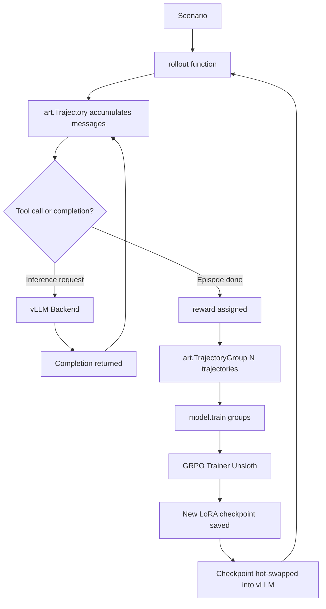

<!-- _class: lead -->

# ART Framework
## Agent Reinforcement Trainer Architecture

Module 02 — Reinforcement Learning for AI Agents

<!-- Speaker notes: Welcome to Module 02. We're moving from the theory of GRPO into the specific open-source framework we'll use throughout this course: ART by OpenPipe. This slide deck covers the architecture before we touch any installation commands. Understanding the client-backend split conceptually will make every subsequent step—configuration, trajectories, training loops—much clearer. -->

---

## Why ART Exists

Every RL framework before ART was designed for this:

```
Prompt → Single LLM output → Score → Done
```

**Agents don't work this way.**

Agents make tool calls. They receive results. They reason across 10–20 turns before succeeding or failing.

> ART was purpose-built for multi-step agentic workflows.

<!-- Speaker notes: Set the context before showing any architecture. The key motivation is the mismatch between what existing RL trainers assume—one prompt, one completion—and how agents actually behave. If students come from a supervised fine-tuning background, they may not immediately see why this matters. Multi-turn reasoning means the training signal needs to propagate back through a whole episode, not just one response. -->

---

## The Core Design: Client-Backend Split

<div class="columns">

**Client**
- Your agent code lives here
- Any Python environment
- No GPU required
- Sends inference requests
- Records trajectories
- Assigns rewards

**Backend**
- vLLM inference server
- Unsloth + TRL GRPO trainer
- GPU required
- Serves completions
- Trains on trajectory groups
- Hot-swaps LoRA checkpoints

</div>

These run on **separate machines** if needed.

<!-- Speaker notes: The client-backend split is the central architectural decision in ART. Emphasize that the client has no GPU requirement. This means a developer can run their agent logic locally, on a cheap CPU VM, or even embedded in an existing LangGraph workflow—while training happens on a cloud GPU they rent by the hour. The separation also means the agent code doesn't need to change when you switch from development to production. -->

---

## The Full Training Loop



<!-- Speaker notes: Walk through this diagram step by step. Start at Scenario: a training example like a database question the agent needs to answer. The rollout function runs the agent, building up a Trajectory with each message. When the agent makes a tool call or requests a completion, that goes to the backend vLLM server. After the episode ends, we score and assign a reward. Multiple trajectories from the same scenario form a TrajectoryGroup. That group goes to the trainer, GRPO updates the weights, a new LoRA is saved, and it gets loaded into vLLM before the next batch. -->

---

## The Client: What It Does

```python
import art

model = art.TrainableModel(
    name="my-agent",
    project="sql-query-agent",
    base_model="Qwen/Qwen2.5-7B-Instruct",
)

async def rollout(model: art.Model, scenario: dict) -> art.Trajectory:
    # Points at ART backend, not openai.com
    client = model.openai_client()

    trajectory = art.Trajectory(
        messages_and_choices=[
            {"role": "system", "content": "You are a SQL expert."},
            {"role": "user",   "content": scenario["question"]},
        ]
    )
    completion = await client.chat.completions.create(
        model=model.get_inference_name(),
        messages=trajectory.messages(),
    )
    trajectory.messages_and_choices.append(completion.choices[0])
    trajectory.reward = score(completion, scenario["expected"])
    return trajectory
```

<!-- Speaker notes: This is real ART code. Point out model.openai_client()—it returns a standard OpenAI Python SDK client, but its base_url points at the ART backend. Any code that already uses the OpenAI SDK can be adapted by just swapping the client. The rollout function signature—taking a model and a scenario—is the consistent pattern across all ART training scripts. -->

---

## The Backend: Two Subsystems

<div class="columns">

**vLLM Inference Engine**

- OpenAI-compatible API endpoint
- High-throughput batched inference
- Returns log probabilities for GRPO
- Serves base model + LoRA adapter
- Pauses during weight updates

**Unsloth + TRL Trainer**

- GRPO algorithm implementation
- Memory-efficient gradient computation
- Trains only LoRA adapter parameters
- Saves checkpoint after each step
- Triggers vLLM adapter reload

</div>

<!-- Speaker notes: The backend is a long-running service. Emphasize that vLLM and the trainer share the same GPU. The key engineering trick is that vLLM pauses new requests while training runs, then unpauses when the new checkpoint is loaded. This blocking is transparent to the client—rollout functions just experience slightly longer latency during the training phase. Students often ask whether you can use two GPUs, one for inference and one for training—yes, ART supports this for larger models. -->

---

## LoRA Hot-Swapping: The Key Trick

$$\text{Output} = W_0 x + B A x$$

- $W_0$: frozen base model weights — **never changes, always in VRAM**
- $BA$: LoRA adapter — **small, gets replaced after each step**

After each training step:
1. Unsloth saves new $B$, $A$ matrices to disk
2. vLLM loads them as an adapter on top of $W_0$
3. Swap takes **seconds**, not minutes
4. Next rollout batch immediately uses the improved model

<!-- Speaker notes: This is the technical innovation that makes ART's loop tight. Students from a traditional fine-tuning background expect model updates to take 10-30 minutes because they're imagining full model reloads. LoRA changes only the adapter parameters, which for a 7B model might be 200-400 MB instead of 15 GB for the full weights. The base weights stay resident in VRAM across all training steps—they're never evicted. This is why the swap is fast enough to do between every batch of rollouts. -->

---

## Memory Optimization: KV Cache Offloading

**Problem:** vLLM's KV cache and the GRPO trainer both need VRAM simultaneously.

**ART's solution:** Offload vLLM's KV cache to CPU RAM during training.

| Phase | GPU VRAM Usage |
|-------|----------------|
| Rollouts (inference active) | Model weights + KV cache |
| Training (rollouts paused) | Model weights + gradients |
| KV cache during training | Moved to CPU RAM — free VRAM |

**Result:** Train 7B models on a single 24 GB GPU.
Free-tier Colab GPU works for 3B models.

<!-- Speaker notes: This slide answers the practical question students always ask: "What GPU do I need?" KV cache offloading is ART's own optimization on top of Unsloth. During training, no new inference requests are being served anyway—rollouts are paused—so the KV cache is idle. Moving it to CPU RAM during that window is essentially free in terms of latency impact. A 7B model's KV cache at 8K context is roughly 4 GB; offloading that frees enough headroom for the GRPO gradient computation. -->

---

## Tool Call Support: Native

A complete multi-turn tool-calling trajectory:

```
[system]    "You have run_sql(query) available."
[user]      "How many orders came in last week?"
[assistant] tool_calls=[{name:"run_sql", args:{"query":"SELECT COUNT(*) FROM orders WHERE date > ..."}]
[tool]      content="42"   tool_call_id="call_abc"
[assistant] "There were 42 orders last week."
```

The **entire sequence** is one training example.
GRPO propagates learning back through every decision.

<!-- Speaker notes: This is what makes ART fundamentally different. In single-turn trainers, only the final assistant message is trained on. ART treats the tool selection, the SQL query written, and the final response as one connected policy output. If the agent wrote a bad SQL query, the whole episode gets a low reward and all those decisions are nudged away from in the next update. If it got it right, all those decisions are reinforced. This is credit assignment for agents. -->

---

## Framework Integrations

ART uses an OpenAI-compatible endpoint, so existing agent frameworks integrate with minimal changes:

| Framework | Integration Method |
|-----------|-------------------|
| **LangGraph** | Change `ChatOpenAI` base_url to ART backend |
| **CrewAI** | Configure LLM provider with custom base URL |
| **Google ADK** | Point model config at OpenAI-compatible endpoint |
| **litellm** | Set `OPENAI_BASE_URL` environment variable |
| **Any SDK** | Use `model.openai_client()` as drop-in replacement |

<!-- Speaker notes: This slide is important for students who already have agent frameworks they're comfortable with. The message is: you don't need to rewrite your agent to use ART. If your agent already calls an OpenAI-compatible endpoint—which most modern frameworks do—you can redirect it to ART's backend with a URL change and a client swap. Students using LangGraph in particular should note that ART now has official LangGraph helper utilities for extracting message history into Trajectory format. -->

---

## ART vs Other RL Frameworks

<div class="columns">

**Existing frameworks designed for chatbots**
- Single-turn interactions only
- Agent code must be inside the trainer
- Framework controls the environment
- Tool calls are special-cased or unsupported
- Requires rewriting agent logic

**ART designed for agents**
- Full multi-turn episode support
- Agent code runs anywhere (any Python)
- Agent controls its own environment
- Tool calls are first-class messages
- Wraps existing agent logic

</div>

<!-- Speaker notes: Draw this contrast clearly. The design philosophy difference is who controls the environment. In traditional RL frameworks, the framework owns the environment and your code plugs into it. In ART, your agent owns its own execution loop and ART observes through the OpenAI-compatible wrapper. This inversion is why ART can support LangGraph, CrewAI, and custom agent loops without requiring framework-specific integrations at the training level. -->

---

## Real-World Results

OpenPipe used ART to train **Qwen 2.5 14B** to beat **o3** at email retrieval:

- Single H100 GPU via Runpod
- Training completed in **under one day**
- Total cost: **~$80**
- Result: 5x faster, 64x cheaper than o3 at the same task

A 7B model trained with ART surpassed GPT-4o at tic-tac-toe.

The key: these are **agentic tasks** requiring multi-step reasoning, tool use, and planning — exactly where SFT fails.

<!-- Speaker notes: These numbers anchor the module in practical reality. Students often assume RL training requires massive resources. The $80 number for beating o3 is striking and worth repeating: it was achieved because LoRA training is parameter-efficient, ART's KV cache offloading makes a single H100 sufficient, and GRPO doesn't need a large value network. The tic-tac-toe result is useful for students who want to test ART themselves without a serious task—it's a classic RL environment that works with smaller models. -->

---

## Module Summary

**ART Architecture:**
- Client handles rollouts, trajectories, rewards — no GPU needed
- Backend handles vLLM inference + Unsloth training — GPU required
- LoRA hot-swap between steps keeps the loop tight

**Why it matters:**
- Multi-step tool-calling episodes treated as complete training examples
- Any OpenAI-compatible agent framework plugs in directly
- Memory optimizations make training accessible on one GPU

**Next:** Installation and configuration — getting the backend running.

<!-- Speaker notes: Summarize the three key architectural ideas: the client-backend split, LoRA hot-swapping, and native multi-turn support. The next guide covers the installation, which is where these abstractions become concrete. Students who understood the architecture here will find the configuration options in Guide 02 much more intuitive—they'll know why each setting exists. -->

---

<!-- _class: lead -->

# Guide 01 Complete

**Next:** `02_art_installation_guide.md`
Setting up the backend, configuring models, GPU requirements

<!-- Speaker notes: Send students to the installation guide. Remind them that the architecture understanding from this session is the mental model they'll use throughout the course. Every time they write a rollout function or check training logs, they'll be working with the client-backend split and trajectory structure introduced here. -->
