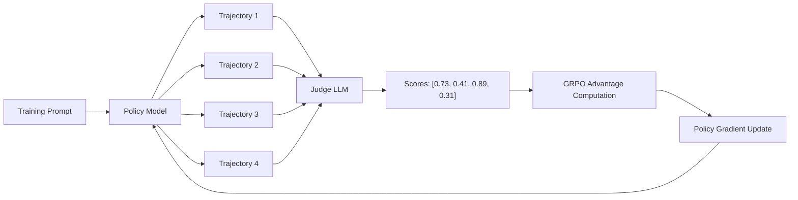

<!-- _class: lead -->

# The RULER Mechanism

## Automatic Rewards via LLM-as-a-Judge

Module 03 — RULER Automatic Rewards

<!-- Speaker notes: This slide deck covers the two core insights behind RULER and then walks through the full mechanism with working code. The goal is for learners to leave knowing exactly how RULER works and how to configure it for their own tasks. -->

---

## Two Insights That Make RULER Work

**Insight 1:** Relative scoring is more reliable than absolute scoring

**Insight 2:** GRPO only needs relative scores to learn

These two facts together mean an LLM judge can replace a hand-crafted reward function — without normalization, calibration, or per-task engineering.

<!-- Speaker notes: Both insights are independently important, but their combination is what makes RULER elegant. Insight 1 makes LLM judging reliable. Insight 2 makes LLM scoring sufficient for GRPO training. You need both. Emphasize that RULER is not a clever hack — it follows logically from the math of GRPO. -->

---

## Insight 1: Relative vs. Absolute Scoring

<div class="columns">

**Absolute scoring (unreliable)**
"Rate this SQL query from 0 to 10."

Problems:
- Same response: 6/10 one run, 8/10 next
- Scale is uncalibrated
- LLMs biased toward middle and leniency
- Prompt wording shifts scores by 2-3 points

**Relative scoring (reliable)**
"Which of these 4 queries is best?"

Why it works:
- Comparison forces distinctions
- Relative quality is easier to perceive
- Consistent across runs
- Same signal humans use for preference learning

</div>

<!-- Speaker notes: Ask learners to think about how they rate things. Rating a movie 7.5/10 is harder than saying "I liked A more than B". Both humans and LLMs are better at relative comparison than absolute scoring. A wine expert struggles with 85 vs 87 points but can reliably rank five wines. RULER uses this natural advantage. -->

---

## Insight 2: GRPO Only Needs Relative Scores

GRPO advantage computation:

$$A_i = r_i - \bar{r}$$

Where $\bar{r}$ = mean reward across the group.

Only relative ordering matters:

| Score | Group Mean | Advantage | Effect |
|-------|-----------|-----------|--------|
| 0.85 | 0.50 | **+0.35** | Reinforce |
| 0.31 | 0.50 | **-0.19** | Discourage |
| 0.89 | 0.50 | **+0.39** | Strongly reinforce |
| 0.41 | 0.50 | **-0.09** | Slightly discourage |

The absolute scale does not matter. Relative ordering is sufficient.

<!-- Speaker notes: This is the mathematical key. Walk through the table carefully. The reward values 0.85, 0.31, 0.89, 0.41 don't need to mean anything on an absolute scale — they just need to correctly rank the trajectories relative to each other. If the best trajectory gets the highest score and the worst gets the lowest, GRPO will learn correctly. -->

---

## The RULER Process

```
1. Sample prompt from training set

2. Generate N=4 trajectories from current policy

3. Send all N trajectories to judge LLM:
   "Score each from 0.0 to 1.0 — which is best?"

4. Parse judge output:
   [0.73, 0.41, 0.89, 0.31]

5. Compute GRPO advantages:
   mean = 0.585
   A = [+0.145, -0.175, +0.305, -0.275]

6. Update policy: reinforce positive, discourage negative
```

<!-- Speaker notes: Walk through this step by step. The key thing to notice is step 3: all N trajectories go to the judge simultaneously. This is what enables reliable relative scoring — the judge can compare them directly. This is different from scoring each trajectory independently. -->

---

## Architecture Diagram



The judge sees all trajectories at once — this is critical for reliable relative scoring.

<!-- Speaker notes: Emphasize the feedback loop: the policy generates trajectories, the judge scores them, GRPO updates the policy, repeat. The judge is a fixed component — it does not get updated during training. This is important: the reference point stays stable while the policy improves relative to it. -->

---

## Code: Scoring a Group with RULER

```python
async def ruler_score_group(
    trajectories: list[list[dict]],
    task_description: str,
    judge_model: str = "o4-mini",
) -> list[float]:
    """Score N trajectories simultaneously using LLM-as-a-judge."""

    user_message = format_trajectories_for_judge(
        trajectories, task_description
    )

    response = await client.chat.completions.create(
        model=judge_model,
        messages=[
            {"role": "system", "content": JUDGE_SYSTEM_PROMPT},
            {"role": "user", "content": user_message},
        ],
        response_format={"type": "json_object"},
        temperature=0.0,  # Deterministic: same input → same scores
    )

    scores_dict = json.loads(response.choices[0].message.content)
    # Returns {"trajectory_0": 0.73, "trajectory_1": 0.41, ...}
    return [scores_dict[f"trajectory_{i}"] for i in range(len(trajectories))]
```

<!-- Speaker notes: Walk through each decision: json_object format ensures parseable output; temperature=0.0 ensures deterministic scoring (same inputs always produce same scores); sending all trajectories at once enables relative comparison. The try/except handling (not shown here for brevity) is important for production reliability. -->

---

## Choosing the Right Judge Model

<div class="columns">

**Speed matters**
Judge runs once per training step.
A slow judge bottlenecks training.

`o4-mini` — fast, reliable, cheap
`claude-3-5-haiku` — alternative

**Avoid same model as trainee**
Training GPT-4o with a GPT-4o judge
teaches the student to satisfy the
teacher, not to do the task.

Use a different model or a newer
version as the fixed reference.

</div>

Judge quality threshold: rank correlation ≥ 0.7 with human judgments.

<!-- Speaker notes: The "avoid same model as trainee" rule is important and often overlooked. If you train Claude 3.5 Sonnet and judge with Claude 3.5 Sonnet, the agent will learn the quirks and biases of that specific model rather than genuine task quality. The judge should be a fixed, external reference — ideally a more capable model or a different family. -->

---

## Writing Effective Judge Prompts

**The 5-part structure:**

1. Role definition — "You are an expert SQL evaluator..."
2. Scoring anchors — What does 0.0, 0.5, 1.0 mean concretely?
3. Priority ordering — Which criteria matter most?
4. Relative scoring instruction — "Assign scores relative to each other"
5. Anti-clustering instruction — "Do not assign all the same score"
6. Exact output format — Show the JSON structure explicitly

**Common mistake:** Omitting the relative scoring instruction causes the judge to evaluate each trajectory in isolation, losing the comparative advantage.

<!-- Speaker notes: The judge prompt is the most important variable in RULER. Unlike training hyperparameters that affect convergence speed, a bad judge prompt actively teaches wrong behavior. Budget time to iterate on the judge prompt with the validate_judge function before committing to a training run. -->

---

## Validating Your Judge

```python
# Before any training run, validate the judge
results = await validate_judge(
    judge_prompt=SQL_JUDGE_PROMPT,
    validation_examples=held_out_examples,
    judge_model="o4-mini",
)

print(f"Rank correlation: {results['rank_correlation']:.2f}")
print(f"Consistency:      {results['consistency']:.4f}")

# Minimum thresholds before using in training
assert results['rank_correlation'] >= 0.7, "Judge doesn't agree with human ranking"
assert results['consistency'] <= 0.05,    "Judge is too noisy across runs"
```

Run this before every training job. A judge that fails thresholds will produce noisy signal that slows or breaks training.

<!-- Speaker notes: This validation step is non-negotiable in practice. The rank_correlation threshold (0.7) is conservative — it means the judge agrees with human ranking at least 70% of the time. The consistency threshold ensures the judge gives stable scores rather than noise. Iterate on the prompt until both pass. -->

---

## What Happens When the Judge Fails

```python
try:
    scores = await ruler_score_group(trajectories, task)
except (json.JSONDecodeError, KeyError) as e:
    # Judge returned unparseable output
    print(f"Warning: Judge failed ({e}), returning neutral scores")
    scores = [0.5] * len(trajectories)  # Neutral — no gradient signal
```

**Neutral scores (0.5 for all):** Advantages = [0, 0, 0, 0]. No update. Training continues.

**Why this is correct:** A single missed step is better than a crash that kills the training run. Monitor failure rate — if it exceeds 5%, fix the judge prompt.

<!-- Speaker notes: Error handling strategy is worth discussing. The goal is training stability. A judge failure that returns neutral scores wastes one training step but doesn't corrupt the model. A judge failure that crashes the run wastes all compute up to that point. Always choose the option that maintains training stability and logs the problem for later investigation. -->

---

## RULER Scores in the Training Loop

```python
async def training_step(prompt, policy, judge_model="o4-mini", n=4):

    # Generate group of trajectories from current policy
    trajectories = await asyncio.gather(*[
        policy.sample(prompt["messages"]) for _ in range(n)
    ])

    # Score with RULER
    rewards = await ruler_score_group(
        list(trajectories), prompt["task_description"], judge_model
    )

    # GRPO advantages: relative to group mean
    mean_reward = sum(rewards) / len(rewards)
    advantages = [r - mean_reward for r in rewards]

    return {"trajectories": trajectories, "rewards": rewards,
            "advantages": advantages}
    # advantages feed directly into GRPO policy gradient update
```

<!-- Speaker notes: This is the complete integration. Notice how clean it is: generate → score → compute advantages → done. The RULER scores require no normalization, no calibration, no post-processing. They plug directly into GRPO. This simplicity is a feature of the relative scoring design — it was built knowing how GRPO would consume the scores. -->

---

<!-- _class: lead -->

## Summary

RULER works because:

1. LLMs score relative quality reliably (better than absolute)
2. GRPO only needs relative scores (advantages $A_i = r_i - \bar{r}$)
3. Judge sees all N trajectories at once — direct comparison
4. Scores [0,1] → plug directly into GRPO without normalization

**The result:** Automatic reward signals for any task, no reward engineering required.

**Next:** Combining RULER with programmatic checks for hybrid rewards.

<!-- Speaker notes: The key takeaway is the elegance of the design: two independent facts (relative scoring is reliable; GRPO needs relative scores) combine perfectly. RULER didn't need a complex new framework — it identified that the existing tools, used correctly, eliminate the need for reward engineering. That insight is worth sitting with. -->

---

## Practice Questions

1. Why is temperature=0.0 important for the judge? What might happen at temperature=1.0?

2. Four trajectories all get score 0.5. What are the GRPO advantages? Why is this a training problem?

3. Your judge has rank_correlation=0.4. What does this mean? Name two ways to fix it.

**Try these before moving to Guide 03.**

<!-- Speaker notes: Question 1: temperature=0 ensures deterministic scoring — the same trajectories get the same scores on every run, making training stable. At temperature=1.0, scores become random and training gets noisy gradient signal. Question 2: advantages are all 0, so no gradient update — the judge is useless. Question 3: the judge disagrees with human judgment more than it agrees; fix by improving the judge prompt (better anchors, clearer criteria) or switching to a more capable judge model. -->
