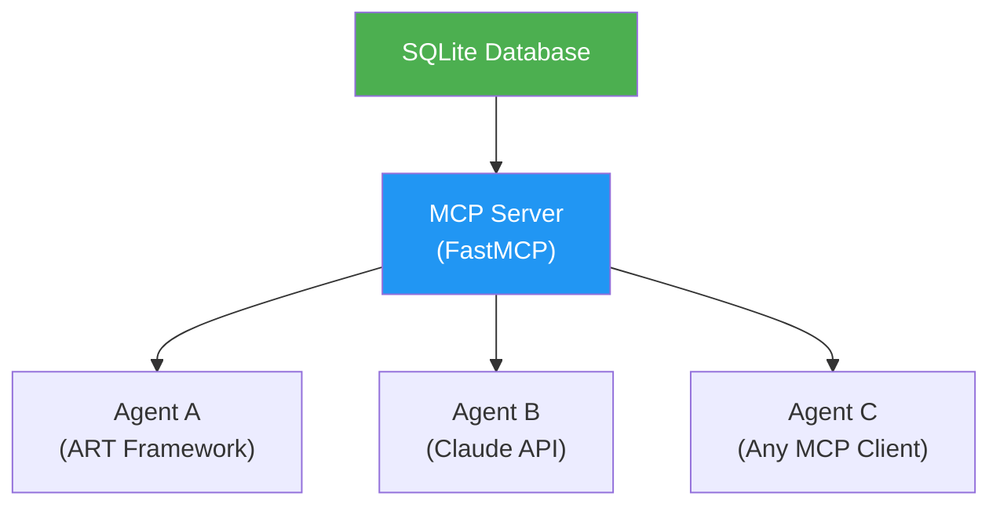
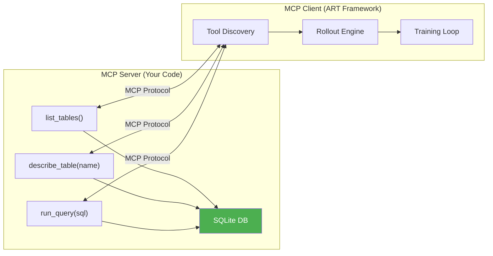
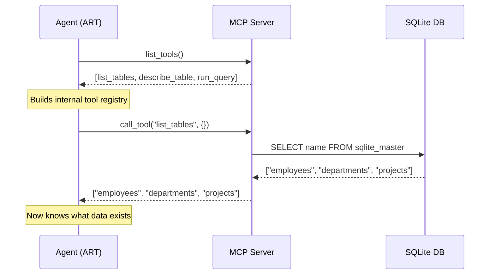
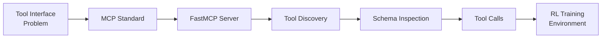

<!-- _class: lead -->

# MCP: Standardized Tool Interfaces for Agents

**Module 04 — MCP Server Integration**

> The Model Context Protocol gives agents a stable, discoverable interface to any tool — so training generalizes across environments, not just memorizes specific APIs.

<!--
Speaker notes: Key talking points for this slide
- MCP is Anthropic's open standard for agent-tool communication, released in late 2024
- The core problem it solves: every agent-tool integration used to require custom connector code
- Today's module covers MCP from the perspective of RL training: why standardized interfaces make better training environments
- By the end of the module, learners will have built a working database MCP server and connected it to an ART agent
-->

---

# The Integration Problem Without MCP

```
Agent A  ─── custom code ──► Database
Agent A  ─── custom code ──► Weather API
Agent A  ─── custom code ──► File System
Agent B  ─── more code   ──► Database   (duplicate work)
Agent C  ─── yet more    ──► Database   (still duplicating)
```

**Every new agent × every new tool = custom integration**

- Tool interfaces are inconsistent
- Agents cannot be reused across environments
- Training environments are tightly coupled to specific tool APIs

<!--
Speaker notes: Key talking points for this slide
- This was the state of agent tooling before MCP: every integration was bespoke
- For RL training specifically, this is a severe problem: changing the tool API breaks learned behaviors
- The custom-code multiplication is also an organizational problem: teams waste time rebuilding the same connectors
- Ask the audience: how many of them have written similar database or API connector code multiple times?
-->

---

# The MCP Solution



**Build the server once. Any MCP-compatible agent connects automatically.**

- Standardized protocol for tool discovery
- Consistent schema format across all tools
- Agent skills transfer across servers

<!--
Speaker notes: Key talking points for this slide
- MCP inverts the dependency: instead of agents knowing about specific tools, the server advertises what it has
- This is the same pattern as REST APIs: you can write a REST client without knowing the server's implementation
- For training: the agent learns to READ schemas and USE tools generically, not memorize specific function signatures
- Key phrase to emphasize: "agent skills transfer across servers" -- this is the payoff for the standardization work
-->

---

<!-- _class: lead -->

# MCP Architecture

<!--
Speaker notes: Key talking points for this slide
- Now we look at the three-layer architecture: client, protocol, server
- Each layer has distinct responsibilities
- Understanding the separation helps when debugging: is the problem in the agent logic, the transport, or the tool implementation?
-->

---

# Three Core Interactions

<div class="columns">
<div>

**1. List Tools**
```
Client → Server: list_tools()
Server → Client: [
  {name, description, schema},
  {name, description, schema},
  ...
]
```

**2. Describe Tool**
```
Client → Server: describe("run_query")
Server → Client: {
  parameters: {...},
  required: ["sql"]
}
```

</div>
<div>

**3. Call Tool**
```
Client → Server: call_tool(
  name="run_query",
  args={"sql": "SELECT ..."}
)
Server → Client: {
  result: [...rows...]
}
```

> The protocol is the contract. Both sides agree on the format — agents can be trained on one server and deployed against any other.

</div>
</div>

<!--
Speaker notes: Key talking points for this slide
- These three interactions are the complete protocol for tool use -- everything else is implementation details
- List tools: agent builds its registry of available capabilities
- Describe tool: agent reads parameter schemas before constructing calls
- Call tool: agent executes with validated arguments, receives structured results
- For training: each of these interactions is a potential reward signal point -- did the agent call the right tool with valid args?
-->

---

# Server vs Client Responsibilities



**Server:** owns tools, stays stable across training episodes

**Client:** discovers, calls, interprets — changes as the agent learns

<!--
Speaker notes: Key talking points for this slide
- The key design principle: the server is the STABLE part, the client/agent is the CHANGING part
- During training, the database stays fixed, the schemas stay fixed, only the agent's policy improves
- If you change the server mid-training, you invalidate what the agent has learned -- treat the server as immutable during a training run
- ART handles the client side automatically: it wraps discovery, tool calls, and result formatting
-->

---

# Why Standardized Interfaces Matter for RL Training

Training requires thousands of rollouts. Each rollout:

1. Agent discovers available tools
2. Agent chooses the right tool
3. Agent formulates valid arguments
4. Agent interprets results

**Unstable interfaces break learned behaviors.**

| Without MCP | With MCP |
|------------|----------|
| API changes break training | Schema changes are explicit |
| Agent memorizes function names | Agent reads schemas dynamically |
| Skills tied to one environment | Skills transfer across servers |
| Custom code per environment | Standard client for all |

<!--
Speaker notes: Key talking points for this slide
- This table is the core argument for why RL training environments should use MCP
- "Agent memorizes function names" is the failure mode you want to avoid: you want the agent to learn schema-reading, not name-memorization
- The transfer learning point is critical for production: a model trained on a SQLite dev database should adapt quickly to a production Postgres server with the same MCP interface
- Research question for the class: what other RL training environments could benefit from MCP standardization?
-->

---

# Tool Discovery: The First Step



**Discovery is part of every episode — the agent must learn to start here.**

<!--
Speaker notes: Key talking points for this slide
- The sequence diagram shows the actual message flow during the first two tool calls of a typical episode
- "Discovery is part of every episode" is an important training design point: don't give the agent the tool list for free in the prompt
- Making the agent call list_tables() first teaches it the right exploration strategy for any new database
- The reward function should give partial credit for correct tool sequencing, not just final query correctness
-->

---

# Schema Inspection in Practice

**Task:** "What is the average salary by department?"

```
Step 1: list_tables()
  → ["employees", "departments", "projects"]

Step 2: describe_table("employees")
  → [("id", INTEGER), ("name", TEXT), ("dept_id", INTEGER), ("salary", REAL)]

Step 3: describe_table("departments")
  → [("id", INTEGER), ("name", TEXT), ("manager_id", INTEGER)]

Step 4: run_query(
    "SELECT d.name, AVG(e.salary)
     FROM employees e
     JOIN departments d ON e.dept_id = d.id
     GROUP BY d.name"
  )
  → [("Engineering", 95000), ("Sales", 72000), ...]
```

**Each step uses the previous result to plan the next call.**

<!--
Speaker notes: Key talking points for this slide
- Walk through this example carefully -- it is the canonical four-step pattern for multi-table queries
- The agent cannot write the JOIN without knowing the column names from both tables
- This is why schema inspection is not optional: a query with wrong column names fails, and the agent must learn to check first
- This four-step pattern is the "multi-tool scenario" type we will generate in Guide 03
- Ask: what happens if the agent skips step 2 and tries to write the JOIN without knowing dept_id? (Query fails, reward is 0)
-->

---

# How ART Connects to MCP Servers

```python
import art
from art.tools import MCPToolset

# Point ART at your MCP server — tools discovered automatically
toolset = MCPToolset(server_url="http://localhost:8000")

agent = art.TrainableAgent(
    model="Qwen/Qwen2.5-7B-Instruct",
    toolset=toolset,
)

# During each rollout, agent can call any discovered tool
# ART handles the MCP protocol, formats results for the LLM
trajectory = await agent.rollout(scenario)
```

> The agent sees tool schemas the same way a developer reads API docs — training teaches it to go from schema to correct call.

<!--
Speaker notes: Key talking points for this slide
- This code is the connection point between Module 02 (ART) and Module 04 (MCP)
- MCPToolset is the adapter: it speaks MCP protocol to the server and formats results for the LLM context window
- The agent never sees raw MCP messages -- it sees a structured text representation of schemas and results
- "Training teaches it to go from schema to correct call" -- this is the exact skill that makes trained agents better than prompted ones
-->

---

<!-- _class: lead -->

# Common Pitfalls

<!--
Speaker notes: Key talking points for this slide
- These pitfalls come from real experience building MCP training environments
- Each one has caused training runs to fail or produce agents that don't generalize
- Cover each briefly -- the goal is pattern recognition, not deep debugging
-->

---

# Pitfalls to Avoid

<div class="columns">
<div>

**Skipping schema inspection**
Agents write SQL with wrong column names. Fix: reward the full inspection sequence, not just final output.

**Wide-open query permissions**
If UPDATE/DELETE are allowed, agents find reward hacks. Fix: restrict to SELECT in run_query.

</div>
<div>

**Unstable server state**
Schema changes mid-training break learned behaviors. Fix: treat the training database as immutable.

**Vague tool descriptions**
Empty `description` fields make tool selection unreliable. Fix: write descriptions as if they are the only documentation.

</div>
</div>

<!--
Speaker notes: Key talking points for this slide
- "Wrong column names" is the most common failure in early training: the agent hallucinates column names instead of checking
- The SELECT-only restriction is a safety measure that also improves training: destructive queries complicate the reward function
- Schema stability is analogous to keeping a gym environment deterministic: if the environment changes, you cannot measure agent improvement
- Tool descriptions are read verbatim by the LLM -- they are part of the agent's input. Treat them like prompts.
-->

---

# Summary



**Key takeaways:**
- MCP standardizes agent-tool communication through a stable protocol
- Agents discover tools dynamically by reading schemas — no hardcoding
- Stable interfaces enable skill transfer across environments
- ART connects to MCP servers natively via MCPToolset

**Next:** Guide 02 — Building the database MCP server with FastMCP

<!--
Speaker notes: Key talking points for this slide
- The flow diagram captures the complete path from problem to training environment
- Emphasize the "stable interface enables skill transfer" point one more time -- this is the business case for MCP
- Guide 02 will show actual FastMCP code: three tools, a SQLite database, and a running server
- Guide 03 will show how to generate hundreds of training scenarios from those three tool schemas
- Encourage learners to think about what MCP servers they would want to build for their own domains
-->
