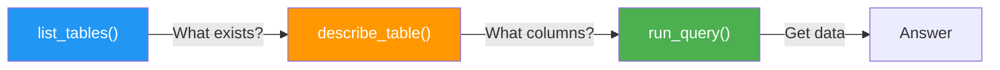
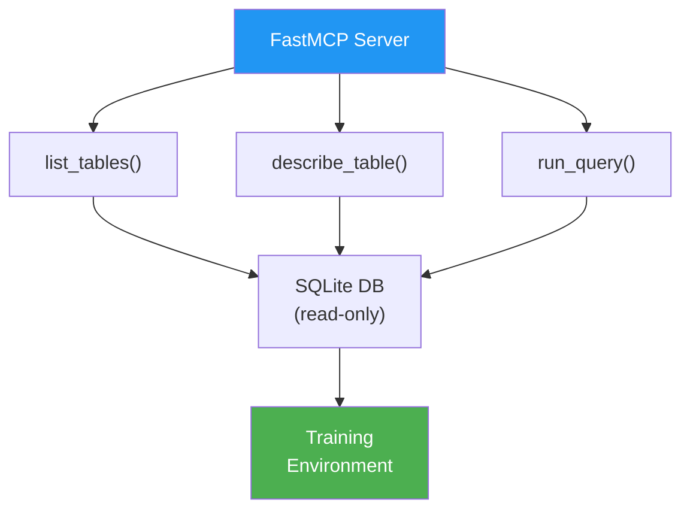

<!-- _class: lead -->

# Building a Database MCP Server with FastMCP

**Module 04 — MCP Server Integration**

> Three tools. Fifty lines. A complete training environment that any MCP-compatible agent can navigate.

<!--
Speaker notes: Key talking points for this slide
- This guide is about implementation: by the end, learners will have a running server they can plug into training
- "Three tools, fifty lines" is not an exaggeration -- FastMCP removes all the boilerplate that MCP server implementation used to require
- The three tools form a deliberate sequence: discover → inspect → query. Training the agent to follow this sequence is the real goal.
- Estimated time for this guide: 20 minutes reading + 15 minutes running the code
-->

---

# Why Three Tools, Not More?

The minimal tool set forces the agent to learn the right sequence:



**Adding more tools shifts training toward breadth-first exploration.**

Adding count_rows, get_sample, list_indexes — the agent learns to explore widely instead of reasoning deeply. Start minimal. Add tools only after the core pattern is mastered.

<!--
Speaker notes: Key talking points for this slide
- Tool set design is curriculum design: the tools you expose determine the behaviors you train
- Three tools is the sweet spot: enough to handle complex queries, few enough to constrain the search space
- The "breadth-first exploration" failure mode is real: agents with too many tools waste rollout steps probing irrelevant tools
- Production MCP servers can have 20+ tools. For training, constrain to what you want the agent to learn first.
-->

---

# Project Setup

```bash
pip install fastmcp
```

That is the complete installation. FastMCP manages its own HTTP transport — no Flask, FastAPI, or other web framework needed.

```python
import fastmcp

# Create the server
mcp = fastmcp.FastMCP("database-server")

# Each @mcp.tool() decorated function becomes a discoverable tool
@mcp.tool()
def list_tables() -> list[str]:
    """Return all table names."""
    ...
```

**FastMCP reads the function signature and docstring to generate the MCP schema automatically.**

<!--
Speaker notes: Key talking points for this slide
- FastMCP uses Python type hints to build the JSON Schema for tool parameters -- no manual schema writing
- The docstring becomes the tool description that the agent reads during discovery
- This is why docstring quality matters: the agent reads it to decide when to use the tool
- Contrast with writing raw MCP schemas in JSON: FastMCP reduces that to zero boilerplate
-->

---

# Tool 1: list_tables

```python
@mcp.tool()
def list_tables() -> list[str]:
    """
    Return the names of all user-created tables in the database.

    Call this first in any database task. It gives you the complete
    inventory of available data before you inspect individual schemas.

    Returns:
        List of table name strings, alphabetically sorted.
    """
    conn = get_connection(DB_PATH)
    try:
        cursor = conn.execute(
            "SELECT name FROM sqlite_master "
            "WHERE type='table' AND name NOT LIKE 'sqlite_%' "
            "ORDER BY name"
        )
        return [row[0] for row in cursor.fetchall()]
    finally:
        conn.close()
```

> Filters out internal SQLite tables (`sqlite_master`, `sqlite_sequence`). Agent only sees user data.

<!--
Speaker notes: Key talking points for this slide
- The WHERE clause filtering is important: sqlite_master and sqlite_sequence are internal tables that confuse the agent
- Note the finally block: connections must always be closed, even on exceptions, to prevent file locks
- The docstring's "Call this first" is an explicit instruction to the agent -- this is prompt engineering at the tool level
- No parameters needed: the database has exactly one database, and we want to list all tables in it
-->

---

# Tool 2: describe_table

```python
@mcp.tool()
def describe_table(table_name: str) -> list[dict[str, str]]:
    """
    Return column definitions for a table: name, type, and whether nullable.

    Call this before writing any query that touches this table.
    Column names and types from this function are guaranteed accurate.
    Guessing column names without calling this tool causes query failures.

    Args:
        table_name: Exact table name as returned by list_tables().
    """
    conn = get_connection(DB_PATH)
    try:
        cursor = conn.execute(f"PRAGMA table_info({table_name})")
        rows = cursor.fetchall()
        if not rows:
            raise ValueError(
                f"Table '{table_name}' not found. "
                f"Call list_tables() to see available tables."
            )
        return [
            {"column": row[1], "type": row[2] or "NUMERIC",
             "nullable": "NO" if row[3] else "YES"}
            for row in rows
        ]
    finally:
        conn.close()
```

<!--
Speaker notes: Key talking points for this slide
- PRAGMA table_info is SQLite's built-in schema introspection: returns cid, name, type, notnull, default, pk
- We transform the raw PRAGMA output into a clean dict format that's easy for the LLM to read
- The error message is critical: when the agent calls with a wrong table name, the message tells it to call list_tables() first
- "Guessing column names causes query failures" -- this docstring text actively teaches the agent to not skip schema inspection
-->

---

# Tool 3: run_query

```python
@mcp.tool()
def run_query(sql: str) -> list[dict[str, Any]]:
    """
    Execute a SQL SELECT query and return results as a list of row dicts.

    Only SELECT statements are permitted. Use list_tables() and
    describe_table() first to confirm table and column names.
    """
    # Enforce SELECT-only -- prevents environment mutation
    if not sql.strip().upper().startswith("SELECT"):
        raise ValueError(
            "Only SELECT queries are permitted. "
            f"Received: {sql.strip()[:20]!r}"
        )

    conn = get_connection(DB_PATH)
    try:
        cursor = conn.execute(sql)
        columns = [desc[0] for desc in cursor.description]
        return [dict(zip(columns, row)) for row in cursor.fetchall()]
    finally:
        conn.close()
```

<!--
Speaker notes: Key talking points for this slide
- The SELECT-only check is the most important safety mechanism: it makes the training environment append-only from the agent's perspective
- cursor.description gives column names from the query result -- we zip these with values to produce named dicts
- Returning dicts instead of tuples makes the results self-documenting for the LLM: {"name": "Alice"} vs ("Alice",)
- The read-only connection (mode=ro in get_connection) provides a second layer of protection against database mutation
-->

---

# Read-Only Connection

```python
def get_connection(db_path: str) -> sqlite3.Connection:
    """
    Open a read-only SQLite connection.

    Read-only mode prevents accidental or intentional modification
    of training data, which would cause environment instability
    across episodes.
    """
    uri = f"file:{db_path}?mode=ro"
    return sqlite3.connect(uri, uri=True)
```

**Two layers of protection:**

| Layer | What It Prevents |
|-------|-----------------|
| `mode=ro` URI | Any write at the OS level |
| SELECT-only check | Non-SELECT queries before they reach the DB |

<!--
Speaker notes: Key talking points for this slide
- Defense in depth: the SELECT check catches the error early with a good message; the mode=ro catches anything that slips through
- SQLite's URI connection format (file:path?mode=ro) is built into the standard library -- no extra dependencies
- "Environment instability across episodes" is the training failure mode: if episode 1 modifies the DB, episode 2 sees different data
- This is analogous to making a gym environment's reset() method truly reset -- critical for reliable RL training
-->

---

# The Training Database Schema

<div class="columns">
<div>

**employees**
| column | type | nullable |
|--------|------|----------|
| id | INTEGER | NO |
| name | TEXT | NO |
| dept_id | INTEGER | YES |
| salary | REAL | YES |
| hire_date | TEXT | YES |
| is_active | INTEGER | NO |

**departments**
| column | type | nullable |
|--------|------|----------|
| id | INTEGER | NO |
| name | TEXT | NO |
| budget | REAL | YES |
| manager_id | INTEGER | YES |

</div>
<div>

**projects**
| column | type | nullable |
|--------|------|----------|
| id | INTEGER | NO |
| title | TEXT | NO |
| dept_id | INTEGER | YES |
| lead_id | INTEGER | YES |
| budget | REAL | YES |
| status | TEXT | YES |

**Why this schema?**
- Three tables → JOIN opportunities
- NULLable columns → edge cases
- Aggregatable fields → GROUP BY scenarios
- Status field → filtering conditions

</div>
</div>

<!--
Speaker notes: Key talking points for this slide
- This schema was designed to generate diverse training scenarios, not just to store data
- Three tables enable 3 JOIN paths: emp-dept, dept-proj, emp-proj -- enough for multi-step scenarios
- NULLable columns (dept_id, salary, manager_id) are deliberate: edge cases where AVG ignores NULLs or where WHERE IS NOT NULL is needed
- status='active'/'completed'/'cancelled' generates filtering scenarios that require WHERE clauses
- is_active on employees adds another filtering dimension without requiring a separate table
-->

---

# Running the Server

```python
# run_server.py
import database_mcp_server as server_module

def start_server(db_path: str = "training.db", port: int = 8000):
    server_module.DB_PATH = db_path
    server_module.mcp.run(transport="sse", port=port, host="127.0.0.1")
```

```bash
# Terminal 1: start the server
python run_server.py training.db 8000

# Terminal 2: run training
python train_agent.py --mcp-url http://127.0.0.1:8000
```

Or from a training script:

```python
server_proc = subprocess.Popen(["python", "run_server.py", "training.db", "8000"])
time.sleep(2)  # Wait for server ready
try:
    run_training()
finally:
    server_proc.terminate()
```

<!--
Speaker notes: Key talking points for this slide
- transport="sse" means Server-Sent Events: the MCP standard for persistent HTTP connections
- SSE is preferred over stdio transport for training because it survives across multiple agent connections
- The subprocess pattern is for training scripts that manage the full pipeline from one process
- time.sleep(2) is a simple readiness check -- in production you would poll a health endpoint
- host="127.0.0.1" keeps the server localhost-only -- never expose training servers on public interfaces
-->

---

# Testing the Server

```python
async def test_all_tools(server_url="http://127.0.0.1:8000"):
    async with mcp.client_session(server_url) as session:

        # Verify discovery
        tables = await session.call_tool("list_tables", {})
        assert "employees" in tables  # ✓

        # Verify schema inspection
        schema = await session.call_tool(
            "describe_table", {"table_name": "employees"}
        )
        assert any(col["column"] == "salary" for col in schema)  # ✓

        # Verify query execution
        rows = await session.call_tool(
            "run_query",
            {"sql": "SELECT COUNT(*) as n FROM employees"}
        )
        assert rows[0]["n"] == 10  # ✓

        # Verify non-SELECT rejection
        try:
            await session.call_tool("run_query", {"sql": "DELETE FROM employees"})
            assert False, "Should have raised"
        except Exception:
            pass  # ✓
```

<!--
Speaker notes: Key talking points for this slide
- Run this test before every training run -- it catches server startup failures and schema drift
- The four assertions test the four behaviors you depend on: discovery, inspection, query, and safety
- "Schema drift" is when someone modifies the database between training runs: the COUNT(*) check would catch this
- This test script is also useful for debugging: if training is producing bad trajectories, run the test first to rule out server issues
-->

---

# Summary

<div class="columns">
<div>

**What we built:**
- FastMCP server with 3 tools
- SQLite training database (10 employees, 4 depts, 6 projects)
- Read-only connections for environment stability
- SELECT-only enforcement for safety
- Test suite for all endpoints

</div>
<div>



</div>
</div>

**Next:** Guide 03 — Auto-generating training scenarios from these tool schemas

<!--
Speaker notes: Key talking points for this slide
- Recap: the server is the training environment, and it is now complete and verified
- The read-only + SELECT-only constraints make the environment deterministic and safe across thousands of rollouts
- Guide 03 shows how to use an LLM to generate 100+ diverse training scenarios from the schemas we just defined
- Without scenario generation, you would have to hand-write every training task -- Guide 03 eliminates that work
- Encourage learners to run the test script before moving on: a working server is the prerequisite for everything in Guide 03
-->
