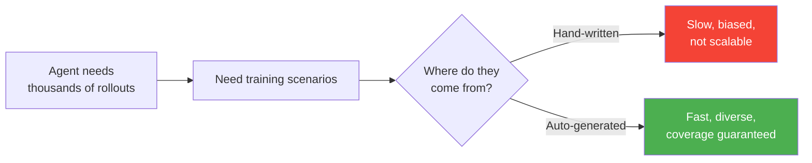
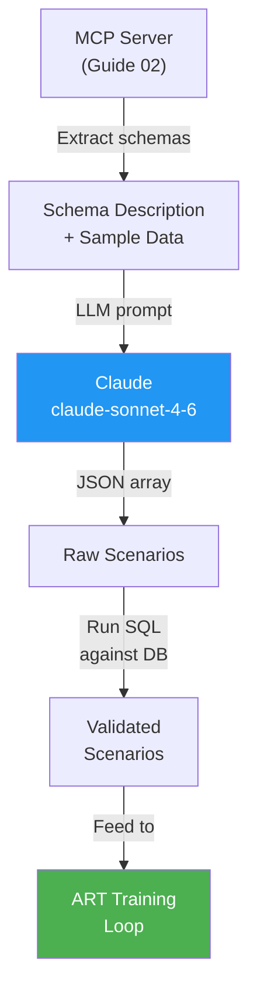
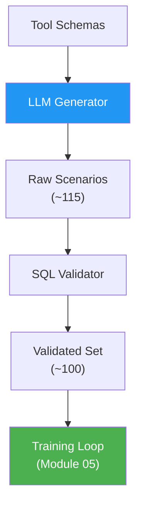

<!-- _class: lead -->

# Auto-Generating Training Scenarios from Tool Schemas

**Module 04 — MCP Server Integration**

> Hand-crafting 100 training tasks is slow and biased. Give the schemas to an LLM and get a diverse, validated scenario set in minutes.

<!--
Speaker notes: Key talking points for this slide
- This guide solves the data problem for RL training: where do training scenarios come from?
- The answer: auto-generation from the tool schemas we built in Guide 02
- "Slow and biased" captures both problems with hand-crafting: it does not scale, and humans unconsciously write scenarios that feel natural to them
- LLMs generate more diverse phrasings, more edge cases, and more varied SQL patterns than any single author
- By the end of this guide, learners have a generator that produces 100 validated scenarios ready for training
-->

---

# The Data Problem in RL Agent Training



**Human authors write scenarios that feel natural — missing edge cases the agent will encounter in production.**

<!--
Speaker notes: Key talking points for this slide
- The scaling argument is straightforward: a training run needs 1,000-10,000 rollouts to converge
- With 100 scenarios and 10 epochs, you get 1,000 rollouts -- enough to learn basic patterns
- Human bias is the subtler problem: we tend to write full-sentence, unambiguous questions. Real users write fragments, use slang, ask ambiguous things.
- LLM generation naturally varies phrasing, difficulty, and structure in ways humans do not
-->

---

# The Auto-Generation Pipeline



**Key insight:** The LLM does not know the data — only the schema. Ground truth is verified by running SQL against the actual database.

<!--
Speaker notes: Key talking points for this slide
- The pipeline has two distinct LLM uses: scenario generation (here) and reward evaluation (RULER from Module 03)
- The schema-only input is important: the LLM generates structurally valid scenarios, not data-memorizing ones
- Validation is the correctness gate: if the LLM hallucinates a column name, the SQL fails, the scenario is rejected
- The "Feed to ART" step is Module 05's topic -- today we focus on the generation and validation steps
-->

---

# Three Scenario Types

<div class="columns">
<div>

**Easy (20%)**
Single-tool lookups — no SQL needed

```
Task: "List all tables in the database"
Tools: [list_tables]
Answer: ["departments", "employees", "projects"]
```

**Medium (50%)**
Two-table JOINs with aggregation

```
Task: "Average salary per department?"
Tools: [list_tables, describe_table×2, run_query]
SQL: SELECT d.name, AVG(e.salary)
     FROM employees e JOIN departments d
     ON e.dept_id = d.id GROUP BY d.name
```

</div>
<div>

**Hard (30%)**
Three-table chains with complex logic

```
Task: "Who leads the most expensive
      active project?"
Tools: [list_tables, describe_table×3,
        run_query]
SQL: SELECT e.name, d.name, p.title, p.budget
     FROM projects p
     JOIN employees e ON p.lead_id = e.id
     JOIN departments d ON e.dept_id = d.id
     WHERE p.status = 'active'
     ORDER BY p.budget DESC LIMIT 1
```

</div>
</div>

<!--
Speaker notes: Key talking points for this slide
- The 20/50/30 split is not arbitrary: it matches the cognitive load curve for learning a new skill
- Easy scenarios build the habit of always calling list_tables first -- even when you think you know the schema
- Medium scenarios are where most learning happens: JOIN planning requires schema inspection
- Hard scenarios are where the agent earns its value: three-table reasoning that takes a human analyst several minutes
- The tool sequence length (1, 3-4, 5-6 calls) corresponds directly to the task complexity
-->

---

# Example: From Schema to Scenario

**Schema input to the LLM:**
```
employees(id INTEGER, name TEXT, dept_id INTEGER(nullable),
          salary REAL(nullable), hire_date TEXT(nullable), is_active INTEGER)
departments(id INTEGER, name TEXT, budget REAL(nullable), manager_id INTEGER(nullable))
projects(id INTEGER, title TEXT, dept_id INTEGER(nullable),
         lead_id INTEGER(nullable), budget REAL(nullable), status TEXT(nullable))
```

**LLM generates:**
```json
{
  "task": "Which department has at least one employee earning over $100,000?",
  "difficulty": "medium",
  "expected_tool_sequence": ["list_tables", "describe_table", "describe_table", "run_query"],
  "ground_truth_sql": "SELECT DISTINCT d.name FROM departments d JOIN employees e ON e.dept_id = d.id WHERE e.salary > 100000",
  "ground_truth_answer": "Engineering"
}
```

<!--
Speaker notes: Key talking points for this slide
- Walk through the transformation: schemas go in, structured scenario comes out
- Note that the LLM correctly identified this as a medium scenario (two-table JOIN, DISTINCT, WHERE)
- The expected_tool_sequence tells the reward function what the correct procedure is, not just the correct answer
- "Engineering" as the answer is not in the prompt -- the LLM knew this from seeing sample data rows showing salaries
- This is why we include sample data: the LLM generates answers that are actually achievable with the data
-->

---

# The Generation Prompt

```python
GENERATION_PROMPT_TEMPLATE = """
You are generating training scenarios for a reinforcement learning agent
that learns to navigate a SQLite database using three tools:
  - list_tables(): returns all table names
  - describe_table(table_name): returns column definitions
  - run_query(sql): executes a SELECT query, returns rows as dicts

Database schema:
{schema}

Sample data:
{sample_data}

Generate {n} {difficulty} training scenarios as a JSON array.
Each scenario must have:
  task, difficulty, expected_tool_sequence,
  ground_truth_sql (null for non-query tasks), ground_truth_answer

Rules for {difficulty} scenarios:
{difficulty_rules}

Return ONLY the JSON array. No markdown, no explanation.
"""
```

<!--
Speaker notes: Key talking points for this slide
- The prompt structure is exactly what makes the generation reliable: explicit format requirements, sample data for grounding, difficulty rules
- "Return ONLY the JSON array" prevents the LLM from wrapping output in markdown code blocks that break JSON parsing
- The difficulty_rules section is where you control what the LLM generates -- it is the curriculum design interface
- Changing the difficulty rules changes the types of scenarios you get: add "must use HAVING clause" to force that pattern
-->

---

# Validation: Reject Bad Scenarios

```python
def validate_scenario(scenario: Scenario, db_path: str) -> bool:
    """
    Run the ground truth SQL against the database.
    Reject scenarios that:
    - Have syntactically invalid SQL
    - Return zero rows (agent cannot learn from empty results)
    - Raise exceptions (bad column names, etc.)
    """
    if scenario.ground_truth_sql is None:
        return True  # Non-query scenarios are always valid

    conn = sqlite3.connect(f"file:{db_path}?mode=ro", uri=True)
    try:
        cursor = conn.execute(scenario.ground_truth_sql)
        rows = cursor.fetchall()
        return len(rows) > 0  # Reject empty-result scenarios
    except Exception:
        return False  # Invalid SQL
    finally:
        conn.close()
```

**Typical rejection rate: 5-15% of generated scenarios.**

<!--
Speaker notes: Key talking points for this slide
- The validation step is not optional: in practice, 5-15% of LLM-generated scenarios have invalid SQL
- Common failure modes: hallucinated column names, invalid JOIN conditions, queries that filter to zero rows
- Zero-row rejection is subtle but important: if the expected answer is "no results", the reward function cannot distinguish correct tool use from random behavior
- Read-only connection in validation matches the training environment: we never want schema-modifying SQL to slip through
-->

---

# Controlling Diversity and Difficulty

<div class="columns">
<div>

**Difficulty Distribution**

| Tier | Fraction | Why |
|------|----------|-----|
| Easy | 20% | Build core habits |
| Medium | 50% | Main learning signal |
| Hard | 30% | Generalization |

**20% easy is enough** to establish the list_tables-first habit.
**Too many easy** scenarios → agent never learns JOINs.

</div>
<div>

**Curriculum Learning**

```python
# Phase 1: Foundation
await train(agent, easy, epochs=5)

# Phase 2: Add medium
# when easy accuracy > 70%
await train(agent, easy + medium, epochs=10)

# Phase 3: Full distribution
await train(
    agent,
    easy + medium + hard,
    epochs=15
)
```

</div>
</div>

<!--
Speaker notes: Key talking points for this slide
- The three-phase curriculum mirrors how humans learn: fundamentals → intermediate → advanced
- The 70% threshold for phase transition is a practical heuristic: the agent should be reliably doing schema inspection before learning JOINs
- Progressive difficulty leads to faster convergence than mixing all difficulties from the start (documented in curriculum learning literature)
- In practice, you may need to tune the epoch counts: slower-converging models benefit from more easy-only epochs
-->

---

# Diversity Metrics

```python
def analyze_scenario_diversity(scenarios):
    tool_sequences = [tuple(s.expected_tool_sequence) for s in scenarios]
    unique_sequences = set(tool_sequences)

    sql_patterns = {
        "join":     sum(1 for s in scenarios if s.ground_truth_sql
                        and "JOIN" in s.ground_truth_sql.upper()),
        "group_by": sum(1 for s in scenarios if s.ground_truth_sql
                        and "GROUP BY" in s.ground_truth_sql.upper()),
        "having":   sum(1 for s in scenarios if s.ground_truth_sql
                        and "HAVING" in s.ground_truth_sql.upper()),
    }
    return {"unique_sequences": len(unique_sequences), **sql_patterns}
```

**Healthy diversity benchmarks for 100 scenarios:**
- Unique tool sequences: 8-15 distinct patterns
- JOIN usage: 40-60 scenarios
- GROUP BY usage: 25-40 scenarios
- HAVING usage: 5-15 scenarios

<!--
Speaker notes: Key talking points for this slide
- Running this analysis before training catches generation quality issues early
- "Unique tool sequences" below 5 means the LLM is generating repetitive scenarios -- add more diversity constraints to the prompt
- HAVING usage below 5 means edge cases are underrepresented -- call generate_edge_cases() explicitly
- These benchmarks are from empirical observation, not theory: adjust them based on your specific training results
-->

---

# Edge Cases: The Scenarios LLMs Forget

```python
async def generate_edge_cases(self) -> list[Scenario]:
    """
    Generate edge case scenarios that standard generation misses.
    """
    prompt = f"""
Generate 10 edge case scenarios:
1. WHERE clause filters to exactly one result
2. IS NOT NULL or IS NULL filtering required
3. HAVING clause (filter after GROUP BY)
4. list_tables() is sufficient (no SQL)
5. Two separate aggregations in one query (COUNT + AVG)

Schema: {self.schema}
Same JSON format. Return only JSON array.
"""
```

**Why explicit edge cases?**
- LLMs favor "interesting" scenarios (JOINs, aggregations)
- NULL handling, HAVING, single-row results are underrepresented
- These are exactly the cases that reveal generalization gaps

<!--
Speaker notes: Key talking points for this slide
- This is the same phenomenon as human authors: we write what feels natural, which is the common case
- NULL handling in particular is often missing from auto-generated scenarios -- but real databases have NULLs everywhere
- The HAVING clause is absent from most medium scenarios because it requires knowing when GROUP BY is not sufficient
- Single-row results matter for the reward function: when the answer is one value, the agent must learn to state it precisely
- Explicit edge case generation compensates for systematic blind spots in the base generator
-->

---

# Complete Usage

```python
async def main():
    generator = ScenarioGenerator(
        db_path="training.db",
        model="claude-sonnet-4-6",
        config=GenerationConfig(n_easy=20, n_medium=50, n_hard=30),
    )

    # Generate main set (runs concurrently by difficulty)
    scenarios = await generator.generate()

    # Add edge cases
    edge_cases = await generator.generate_edge_cases()
    all_scenarios = scenarios + edge_cases

    print(f"Total: {len(all_scenarios)} validated scenarios")

    # Save for reproducibility
    with open("scenarios.json", "w") as f:
        json.dump([asdict(s) for s in all_scenarios], f, indent=2)
```

**Generation time:** ~60-90 seconds for 100 scenarios (3 concurrent LLM calls + validation)

<!--
Speaker notes: Key talking points for this slide
- The concurrent generation (asyncio.gather on three difficulty levels) cuts wall-clock time by ~3x
- Saving to JSON serves two purposes: reproducibility (reuse the same scenario set across experiments) and inspection (verify quality before training)
- 60-90 seconds is fast enough to regenerate for every major training run -- treat scenarios as computed artifacts, not permanent fixtures
- The scenarios.json file is the interface between the generation step (today) and the training loop (Module 05)
-->

---

# Summary

<div class="columns">
<div>

**What we built:**
- Schema-based prompt for LLM generation
- Three difficulty tiers with explicit rules
- SQL validation against actual database
- Edge case generation for coverage gaps
- Diversity analysis to verify quality

</div>
<div>



</div>
</div>

**The complete Module 04 pipeline:**

```
FastMCP Server (Guide 02) → Scenario Generator (Guide 03) → Training Loop (Module 05)
```

<!--
Speaker notes: Key talking points for this slide
- The 115 → 100 funnel is the validation step: ~15% rejection rate is normal and healthy
- Emphasize the pipeline connection: MCP server provides the environment, scenario generator provides the curriculum, Module 05 trains the agent
- The learner now has everything needed to run their first training loop: a database, a server, and 100 validated scenarios
- Exercise 01 gives hands-on practice building a simpler MCP server (calculator or weather) before working with the database server
- Module 05 will show how to wire scenarios into ART's training loop and monitor convergence
-->
