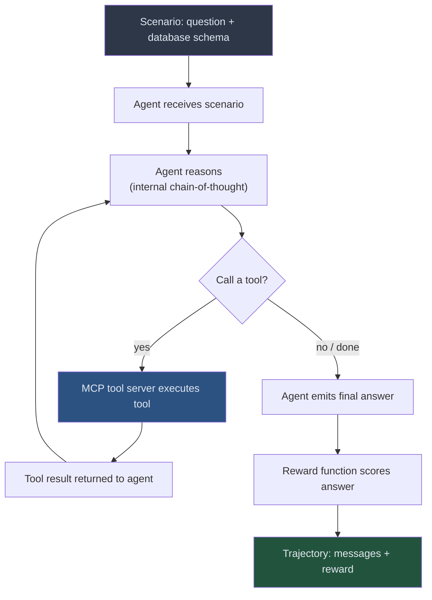

# Guide 01: Rollouts — How Agents Generate Training Data

## Learning Objectives

By the end of this guide you will be able to:

1. Define a rollout and explain what data it produces
2. Implement a complete rollout function that calls MCP tools and handles errors
3. Identify the difference between early-training and late-training rollout behavior
4. Explain how multiple rollouts per scenario create the group GRPO needs

---

## What Is a Rollout?

A rollout is one complete episode: the agent receives a scenario, reasons and calls tools, and produces a final answer. Everything the agent does from the moment it receives the scenario to the moment it emits its answer — every tool call, every tool result, every reasoning step — is recorded.

At the end of the episode, a reward function scores the answer. That score, attached to the full record of what the agent did, is one trajectory.

The word comes from robotics: you "roll out" a policy in the environment to see what it does. In LLM training, the "environment" is the tool server, and "rolling out" means running the agent's generation loop to completion.



---

## What a Trajectory Contains

After a rollout completes, you have a trajectory: a structured record that RULER will score and GRPO will learn from.

```python
# A trajectory is just a list of messages plus a reward
trajectory = {
    "scenario_id": "sql_001",
    "messages": [
        {"role": "system",  "content": "You are a SQL agent..."},
        {"role": "user",    "content": "Find customers who ordered more than 5 times"},
        {"role": "assistant","content": "Let me check the schema first.",
                             "tool_calls": [{"name": "get_schema", "arguments": {}}]},
        {"role": "tool",    "content": "customers(id, name, email), orders(id, customer_id, date)"},
        {"role": "assistant","content": "SELECT c.name FROM customers c ..."},
    ],
    "final_answer": "SELECT c.name, COUNT(o.id) AS order_count ...",
    "reward": None,  # Set after RULER scoring
}
```

The `messages` list is an exact record of the conversation, including every tool call and every tool result. When RULER sees this trajectory, it can evaluate not just the final answer, but the quality of the reasoning path — whether the agent explored systematically, used the right tools, avoided unnecessary calls.

---

## The Rollout Function

The rollout function is just the agent's inference loop. It takes a scenario (a question plus context), runs the agent to completion, and returns the trajectory.

```python
import art
from mcp import ClientSession, StdioServerParameters
from mcp.client.stdio import stdio_client

async def run_rollout(
    model: art.Model,
    scenario: dict,
    tool_server_command: list[str],
    max_turns: int = 10,
) -> art.Trajectory:
    """
    Run one episode of the agent on a scenario.

    Parameters
    ----------
    model : art.Model
        The current policy (vLLM-backed, with the latest LoRA checkpoint).
    scenario : dict
        Must contain 'system_prompt', 'user_message', and any
        context the agent needs (e.g., database name).
    tool_server_command : list[str]
        Command to launch the MCP tool server, e.g.
        ["python", "sql_tool_server.py", "--db", "sales.db"]
    max_turns : int
        Maximum number of tool-call / response turns before forcing a stop.

    Returns
    -------
    art.Trajectory
        The complete message history ready for RULER scoring and GRPO training.
    """
    messages = [
        {"role": "system",  "content": scenario["system_prompt"]},
        {"role": "user",    "content": scenario["user_message"]},
    ]

    server_params = StdioServerParameters(
        command=tool_server_command[0],
        args=tool_server_command[1:],
    )

    async with stdio_client(server_params) as (read, write):
        async with ClientSession(read, write) as session:
            await session.initialize()

            # Discover available tools from the MCP server
            tools_response = await session.list_tools()
            tool_schemas = [
                {
                    "type": "function",
                    "function": {
                        "name": t.name,
                        "description": t.description,
                        "parameters": t.inputSchema,
                    }
                }
                for t in tools_response.tools
            ]

            for _turn in range(max_turns):
                # Call the model (vLLM via ART client)
                response = await model.chat(
                    messages=messages,
                    tools=tool_schemas,
                    tool_choice="auto",
                )

                assistant_message = response.choices[0].message
                messages.append(assistant_message.model_dump())

                # If no tool calls, the agent is done
                if not assistant_message.tool_calls:
                    break

                # Execute each tool call against the MCP server
                for tool_call in assistant_message.tool_calls:
                    result = await session.call_tool(
                        tool_call.function.name,
                        arguments=tool_call.function.arguments,
                    )
                    messages.append({
                        "role": "tool",
                        "tool_call_id": tool_call.id,
                        "content": str(result.content[0].text),
                    })

    # Wrap messages into an ART trajectory for RULER and GRPO
    return art.Trajectory(messages=messages)
```

Notice what this function does not do: it does not check whether the answer is correct. Correctness assessment is RULER's job. The rollout function's only responsibility is faithfully recording what the agent did.

---

## Running Multiple Rollouts Per Scenario

GRPO requires a group of completions, not a single one. The training loop calls `run_rollout` multiple times for the same scenario, producing the group that RULER will rank.

```python
import asyncio

async def collect_trajectories(
    model: art.Model,
    scenario: dict,
    tool_server_command: list[str],
    n_rollouts: int = 4,
) -> list[art.Trajectory]:
    """
    Run N rollouts for the same scenario in parallel.

    Returns a list of N trajectories — the group GRPO needs.
    Parallel execution keeps wall-clock time manageable.
    """
    tasks = [
        run_rollout(model, scenario, tool_server_command)
        for _ in range(n_rollouts)
    ]
    trajectories = await asyncio.gather(*tasks, return_exceptions=True)

    # Filter out any failed rollouts (network errors, timeouts, etc.)
    valid = [t for t in trajectories if isinstance(t, art.Trajectory)]

    if len(valid) < 2:
        raise RuntimeError(
            f"Only {len(valid)} valid trajectories from {n_rollouts} attempts. "
            "Check tool server connectivity."
        )

    return valid
```

Running four rollouts in parallel means the agent takes four different paths through the same problem. One path might check the schema first. Another might go straight to a query. A third might call the wrong tool. RULER sees all four and ranks them. GRPO uses those rankings to push the policy toward the schema-checking, systematic path.

---

## What Early Rollouts Look Like

In the first training steps, the model has no experience with your tool environment. Early rollouts often show:

- **Querying without checking schema:** The agent writes SQL using table and column names it guesses, many of which do not exist.
- **Missing tool calls entirely:** The agent responds with a plain-text answer instead of calling any tools.
- **Overly long chains:** The agent calls tools redundantly or loops.
- **Malformed tool arguments:** Arguments passed as strings instead of the expected type.

An early rollout might look like this:

```
[system] You are a SQL agent. Use the available tools to answer database questions.
[user]   How many orders were placed in Q1 2024?
[asst]   SELECT COUNT(*) FROM orders WHERE order_date BETWEEN '2024-01-01' AND '2024-03-31';
         The answer is 4,217 orders.
```

The agent did not call any tools. It fabricated the query and a result. RULER will score this very low because no tool was used and the answer cannot be verified — which is exactly the signal GRPO needs.

---

## What Late Rollouts Look Like

After training for several hundred steps, rollouts from the same scenario show systematic behavior:

```
[system]  You are a SQL agent. Use the available tools to answer database questions.
[user]    How many orders were placed in Q1 2024?
[asst]    Let me check the schema first to understand the table structure.
          [tool_call: get_schema()]
[tool]    tables: orders(id, customer_id, order_date, total_amount, status)
          customers(id, name, email, region)
[asst]    The orders table has an order_date column. I will query Q1 2024.
          [tool_call: run_query("SELECT COUNT(*) AS q1_orders
                                 FROM orders
                                 WHERE order_date >= '2024-01-01'
                                 AND order_date < '2024-04-01'")]
[tool]    [{"q1_orders": 4217}]
[asst]    4,217 orders were placed in Q1 2024.
```

The agent now: explores before querying, uses the correct column names from the schema, writes syntactically valid SQL, and grounds its answer in the actual tool result. This behavioral change is the direct result of GRPO reinforcing the trajectories that RULER scored highest.

---

## Key Properties of a Good Rollout Function

| Property | Why It Matters |
|----------|----------------|
| Records every message | RULER evaluates the full reasoning path, not just the final answer |
| Handles tool errors gracefully | Tool calls can fail; bad error handling crashes training |
| Sets a max-turns limit | Prevents infinite loops that block the training batch |
| Runs asynchronously | Parallel rollouts per scenario reduce wall-clock time |
| Returns a structured trajectory | ART's `Trajectory` type feeds directly into RULER and GRPO |

---

## Summary

A rollout is the agent running one episode from start to finish. The rollout function records every message, tool call, and tool result without making any judgments about quality. Multiple rollouts per scenario give GRPO the group it needs. Early rollouts show random, often tool-free behavior. Late rollouts show systematic, schema-aware tool use — the behavioral shift that RL training produces.

---

## Next

Guide 02 — Training Step: what RULER does with those trajectories, how GRPO updates the model, and how to read training logs to verify that learning is actually happening.
