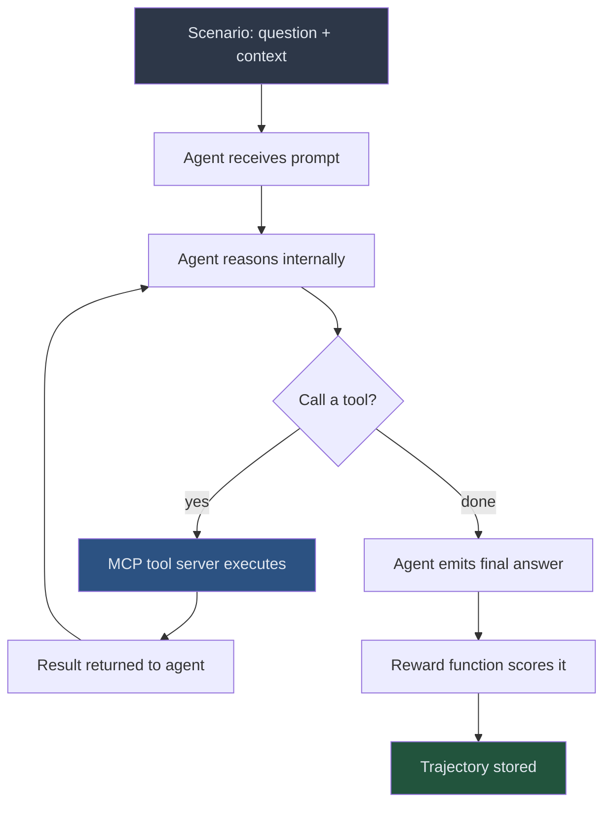
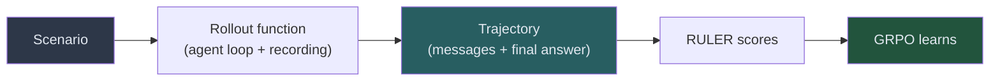

<!-- _class: lead -->

# Rollouts
## How Agents Generate Training Data

**Module 05 — Training Loop Deep-Dive**

> A rollout is a single episode: the agent receives a scenario, calls tools, and produces an answer. Everything it does is recorded. That record is training data.

<!--
Speaker notes: Key talking points for this slide
- Welcome to Guide 01 of the training loop module
- This slide deck covers rollouts: what they are, what they produce, and what changes as training progresses
- The key insight: training data is generated by the agent itself, not curated by humans
- Ask learners: "What does the agent need to do to produce useful training signal?"
-->

---

# What Is a Rollout?



> One rollout = one episode from first prompt to scored answer.

<!--
Speaker notes: Key talking points for this slide
- Walk through the diagram step by step
- The agent loop is the same regardless of whether we are in training or inference — the only addition is recording everything
- The reward function runs AFTER the episode ends — it does not interrupt or guide the agent during the rollout
- Point out the loop: tool call → result → back to reasoning. This can happen many times per rollout
-->

---

# What a Trajectory Contains

```python
trajectory = {
    "scenario_id": "sql_001",
    "messages": [
        {"role": "system",    "content": "You are a SQL agent..."},
        {"role": "user",      "content": "Find customers who ordered > 5 times"},
        {"role": "assistant", "content": "Let me check the schema first.",
                              "tool_calls": [{"name": "get_schema", "arguments": {}}]},
        {"role": "tool",      "content": "customers(id, name), orders(id, customer_id)"},
        {"role": "assistant", "content": "SELECT c.name FROM customers c ..."},
    ],
    "final_answer": "SELECT c.name, COUNT(o.id) ...",
    "reward": None,  # assigned by RULER after the rollout
}
```

<!--
Speaker notes: Key talking points for this slide
- A trajectory is the complete message history — every role, every tool call, every tool result
- The reward field starts as None and is populated by RULER after all N rollouts for this scenario complete
- RULER evaluates the full messages list — not just the final answer — so reasoning quality matters
- This structure is exactly what ART's Trajectory type stores
-->

---

# The Rollout Function

```python
async def run_rollout(model, scenario, tool_server_command, max_turns=10):
    messages = [
        {"role": "system", "content": scenario["system_prompt"]},
        {"role": "user",   "content": scenario["user_message"]},
    ]

    async with stdio_client(server_params) as (read, write):
        async with ClientSession(read, write) as session:
            await session.initialize()
            tool_schemas = await get_tool_schemas(session)

            for _turn in range(max_turns):
                response = await model.chat(messages=messages, tools=tool_schemas)
                assistant_msg = response.choices[0].message
                messages.append(assistant_msg.model_dump())

                if not assistant_msg.tool_calls:
                    break                        # Agent is done

                for call in assistant_msg.tool_calls:
                    result = await session.call_tool(call.function.name,
                                                     call.function.arguments)
                    messages.append({"role": "tool", "content": str(result)})

    return art.Trajectory(messages=messages)
```

<!--
Speaker notes: Key talking points for this slide
- The rollout function is just the agent's inference loop with recording
- max_turns prevents infinite loops — critical for training stability
- Asynchronous: the model.chat call is non-blocking, so N rollouts can run in parallel
- Notice: no reward computation here. The function only records. Scoring is separate.
- stdio_client connects to the MCP tool server via the same pattern from Module 04
-->

---

# Running N Rollouts in Parallel

```python
async def collect_trajectories(model, scenario, tool_cmd, n_rollouts=4):
    """Run N rollouts for the same scenario simultaneously."""
    tasks = [
        run_rollout(model, scenario, tool_cmd)
        for _ in range(n_rollouts)
    ]
    results = await asyncio.gather(*tasks, return_exceptions=True)

    # Keep only successful rollouts
    valid = [r for r in results if isinstance(r, art.Trajectory)]

    return valid
```

<div class="columns">
<div>

**Why parallel?**
- 4 rollouts in sequence = 4× inference time
- 4 rollouts in parallel = ~1× inference time
- Practical training requires hundreds of steps

</div>
<div>

**Why N rollouts?**
- GRPO needs a group to rank
- Group variance = learning signal
- Identical rollouts → no gradient

</div>
</div>

<!--
Speaker notes: Key talking points for this slide
- asyncio.gather launches all N rollout coroutines simultaneously
- return_exceptions=True means a failed rollout does not crash the whole batch — we just filter it out
- We need at least 2 valid rollouts to compute a meaningful group ranking; in practice we want 4
- Emphasize: the whole point of multiple rollouts is diversity. If the agent always does the same thing, no ranking is possible
-->

---

<!-- _class: lead -->

# What Changes During Training

> The same scenario. The same tools. Completely different behavior.

<!--
Speaker notes: Key talking points for this slide
- This section shows the concrete behavioral change that RL training produces
- Ask: "Before seeing these examples, what would you expect early vs late rollouts to look like?"
- The contrast here is the most tangible evidence that training is working
-->

---

# Early Rollout: No Tool Use

```
[system]  You are a SQL agent. Use tools to answer database questions.
[user]    How many orders were placed in Q1 2024?

[asst]    SELECT COUNT(*) FROM orders
          WHERE order_date BETWEEN '2024-01-01' AND '2024-03-31';
          The answer is approximately 4,217 orders.
```

**What went wrong:**
- No tools called — agent hallucinated schema and result
- Column name `order_date` is a lucky guess, not verified
- "Approximately" signals the model knows it is guessing
- RULER score: very low (no tool use, unverified answer)

<!--
Speaker notes: Key talking points for this slide
- This is typical early-training behavior: the model defaults to what it learned during pre-training (produce SQL)
- It has not yet learned that the tools exist and must be used
- The "approximately" hedge is the model signaling uncertainty — RULER picks up on this
- This trajectory will receive a low reward, which tells GRPO to suppress this approach
- Key question to pose: "What would you need to see in a rollout to assign it a high reward?"
-->

---

# Late Rollout: Schema-First Exploration

```
[system]  You are a SQL agent. Use tools to answer database questions.
[user]    How many orders were placed in Q1 2024?

[asst]    Let me check the schema first.
          [tool: get_schema()]
[tool]    orders(id, customer_id, order_date, total_amount, status)

[asst]    The orders table has an order_date column. Querying Q1 2024.
          [tool: run_query("SELECT COUNT(*) AS q1_orders FROM orders
                            WHERE order_date >= '2024-01-01'
                            AND order_date < '2024-04-01'")]
[tool]    [{"q1_orders": 4217}]

[asst]    4,217 orders were placed in Q1 2024.
```

<!--
Speaker notes: Key talking points for this slide
- Walk through each step: schema check → verified column name → correct query → grounded answer
- The agent learned to explore the environment before acting in it
- "order_date" now comes from the schema, not from a guess
- No hedging language: the answer is grounded in a real tool result
- RULER will score this highly: tool use, correct reasoning path, verified answer
- This behavioral shift happened automatically — no one wrote examples of schema-first exploration
-->

---

# The Behavioral Shift

<div class="columns">
<div>

**Early training**
- No tool use
- Guessed column names
- Hallucinated results
- Hedged answers ("approximately")
- RULER score: low

</div>
<div>

**Late training**
- Schema check first
- Verified column names
- Results from actual queries
- Specific, grounded answers
- RULER score: high

</div>
</div>

> GRPO amplified trajectories that used tools correctly. No human labeled which trajectories were good.

<!--
Speaker notes: Key talking points for this slide
- The contrast table makes the shift concrete
- The key point: this emerged from reward signal alone, not from human demonstrations
- The model discovered "check schema first" as a strategy because it consistently produced better outcomes
- This is exactly what RL adds beyond SFT: the ability to discover strategies not present in the training data
-->

---

# Key Properties of a Good Rollout Function

| Property | Why It Matters |
|----------|----------------|
| Records every message | RULER evaluates the full reasoning path |
| Handles tool errors | Bad errors crash the training batch |
| Sets max_turns limit | Prevents infinite loops |
| Runs asynchronously | Parallel rollouts reduce wall-clock time |
| Returns `art.Trajectory` | Feeds directly into RULER and GRPO |

<!--
Speaker notes: Key talking points for this slide
- These five properties are the checklist for any rollout function you write
- "Records every message" is the most important: RULER cannot evaluate what it cannot see
- Error handling is often neglected but critical: a tool server crash should not halt training
- max_turns is a hyperparameter — too low interrupts valid multi-step reasoning, too high allows runaway loops
- The asyncio design is essential for practical training speed
-->

---

# Summary



**Key takeaways:**
- A rollout records a complete agent episode without making judgments
- Multiple rollouts per scenario give GRPO the group it needs for relative ranking
- Early rollouts: no tool use, hallucinated results
- Late rollouts: systematic exploration, verified answers

<!--
Speaker notes: Key talking points for this slide
- Summarize the flow: scenario → rollout → trajectory → reward → learning
- Emphasize that the rollout function is deliberately judgment-free — recording only
- The separation of concerns (rollout vs scoring vs training) is what makes the system modular and debuggable
- Next: Guide 02 takes these trajectories and walks through the full training step
-->

---

<!-- _class: lead -->

# Next: Guide 02

## The Training Step

> Trajectories are collected. RULER scores them. GRPO updates the model. A new checkpoint loads. How each of those steps works — and how to know if they are working.

<!--
Speaker notes: Key talking points for this slide
- Preview what is coming: the full training step pipeline
- We have rollouts now. Next we need to score them (RULER), learn from them (GRPO), and deploy the updated model (checkpoint)
- Tell learners to focus on the reward trend in Guide 02 — that is the key diagnostic metric
-->
