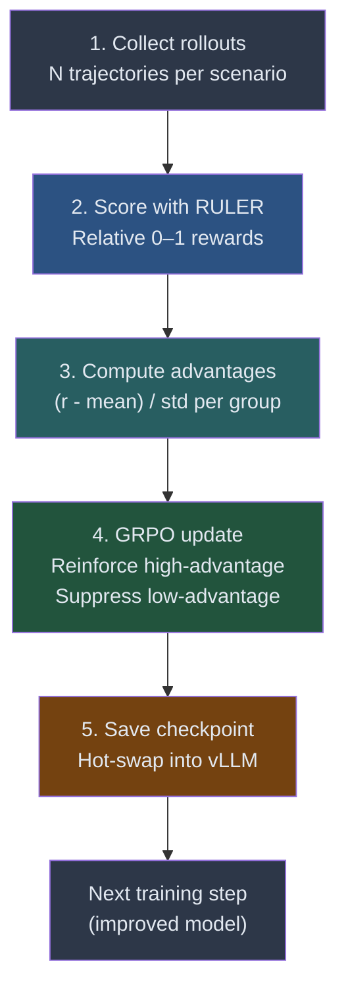

# Guide 02: The Training Step — From Rollouts to Updated Policy

## Learning Objectives

By the end of this guide you will be able to:

1. Describe all five stages of a single GRPO training step in order
2. Read the training loop code from the ART framework and identify what each section does
3. Interpret training logs: what each line means and what it tells you about training health
4. Identify three signs that training is working and three signs it is not

---

## The Five Stages of One Training Step

Every GRPO training step follows the same sequence. Understanding each stage makes the training loop readable instead of opaque.



### Stage 1: Collect Rollouts

For each scenario in the training batch, the agent runs N times (typically 4). This produces N trajectories per scenario. If the batch contains 8 scenarios and N=4, you collect 32 trajectories total before any learning happens.

Running all rollouts before updating is essential: GRPO needs the group to exist before it can compute relative rankings. You cannot score trajectory 1 relative to trajectory 2 until trajectory 2 exists.

### Stage 2: Score with RULER

RULER receives the N trajectories for each scenario as a group and assigns comparative rewards between 0 and 1. It does not score trajectories in isolation — it ranks them against each other.

The trajectory that used tools most effectively, produced the most accurate answer, and showed the clearest reasoning gets the highest score within its group. The trajectory that hallucinated or called tools incorrectly gets the lowest score.

### Stage 3: Compute Advantages

Within each group, normalize the RULER scores:

$$A_i = \frac{r_i - \mu_{\text{group}}}{\sigma_{\text{group}}}$$

Where $\mu_{\text{group}}$ is the mean reward for this scenario's group and $\sigma_{\text{group}}$ is the standard deviation. A trajectory with $A_i > 0$ was better than the group average. A trajectory with $A_i < 0$ was worse.

If all four trajectories score identically, $\sigma = 0$ and no gradient flows. This is correct behavior — if the agent already handles a scenario consistently, that scenario contributes nothing to training.

### Stage 4: GRPO Update

`model.train()` in the ART framework calls Unsloth's GRPO implementation, which:

- Computes the clipped surrogate loss using the advantages
- Applies a KL divergence penalty relative to the reference model
- Runs backpropagation through the LoRA adapter weights
- Updates only the LoRA parameters (the base model weights are frozen)

The LoRA update is small and fast. A full fine-tune would update billions of parameters; LoRA updates thousands to low millions depending on rank.

### Stage 5: Save Checkpoint and Hot-Swap

After the update, a new LoRA checkpoint is saved to disk. The ART framework then signals vLLM to load the new checkpoint without restarting the server. The next training step's rollouts use the improved model. This continuous improvement is the training loop's core mechanism.

---

## The Full Training Loop

This is the complete training loop, structured as the ART framework uses it:

```python
import art
import asyncio
from ruler import score_trajectories_relative

async def training_loop(
    model: art.Model,
    scenarios: list[dict],
    tool_server_command: list[str],
    n_rollouts_per_scenario: int = 4,
    n_steps: int = 500,
    batch_size: int = 8,
    checkpoint_dir: str = "./checkpoints",
):
    """
    Full GRPO training loop.

    Each step:
    1. Sample a batch of scenarios
    2. Collect N rollouts per scenario (parallel)
    3. Score groups with RULER
    4. GRPO update via model.train()
    5. Save checkpoint and hot-swap into vLLM
    """
    step_rewards = []

    for step in range(n_steps):
        # --- Stage 1: Collect rollouts ---
        # Sample a batch of scenarios (with replacement for diversity)
        import random
        batch = random.sample(scenarios, k=min(batch_size, len(scenarios)))

        # Collect N rollouts per scenario in parallel
        all_groups: list[list[art.Trajectory]] = []
        group_tasks = [
            collect_trajectories(model, scenario, tool_server_command, n_rollouts_per_scenario)
            for scenario in batch
        ]
        all_groups = await asyncio.gather(*group_tasks)

        # --- Stage 2: Score with RULER ---
        # score_trajectories_relative takes a list of groups and returns
        # rewards in [0, 1] for each trajectory within its group
        scored_groups = await score_trajectories_relative(
            groups=all_groups,
            judge_model="gpt-4o-mini",      # RULER's judge model
            judge_temperature=0.0,
        )
        # scored_groups: list[list[art.Trajectory]] with .reward populated

        # --- Stage 3 & 4: GRPO update ---
        # model.train() handles advantage normalization and the policy update internally
        # It expects a flat list of trajectories; ART groups them by scenario_id
        flat_trajectories = [t for group in scored_groups for t in group]
        train_result = await model.train(trajectories=flat_trajectories)

        # --- Stage 5: Save checkpoint ---
        checkpoint_path = f"{checkpoint_dir}/step_{step:04d}"
        await model.save_checkpoint(checkpoint_path)
        # Hot-swap: ART signals vLLM to load the new LoRA weights
        await model.reload_vllm()

        # --- Logging ---
        step_reward = train_result.mean_reward
        step_rewards.append(step_reward)

        # Print a sample trajectory every 10 steps for qualitative inspection
        if step % 10 == 0:
            sample = flat_trajectories[0]
            print(f"\nStep {step:4d} | mean_reward={step_reward:.3f} | "
                  f"loss={train_result.loss:.4f} | "
                  f"kl={train_result.kl_divergence:.4f}")
            print("Sample trajectory (last 3 messages):")
            for msg in sample.messages[-3:]:
                role = msg["role"].upper()
                content = str(msg.get("content", ""))[:120]
                print(f"  [{role}] {content}")

    return step_rewards
```

The loop is short because the complexity lives in `collect_trajectories`, `score_trajectories_relative`, and `model.train()`. Each of those is covered in its own module (04, 03, and 02 respectively). The training loop assembles them in the right order.

---

## Understanding Training Logs

When the loop runs, it prints one line per step. Learning to read these lines tells you whether training is healthy without inspecting individual trajectories.

```
Step    0 | mean_reward=0.231 | loss=2.8471 | kl=0.0012
Step   10 | mean_reward=0.287 | loss=2.6103 | kl=0.0089
Step   20 | mean_reward=0.341 | loss=2.3814 | kl=0.0142
Step   50 | mean_reward=0.498 | loss=1.9227 | kl=0.0231
Step  100 | mean_reward=0.612 | loss=1.5843 | kl=0.0318
Step  200 | mean_reward=0.741 | loss=1.2104 | kl=0.0397
Step  300 | mean_reward=0.803 | loss=1.0872 | kl=0.0412
Step  400 | mean_reward=0.821 | loss=1.0341 | kl=0.0408
Step  500 | mean_reward=0.834 | loss=1.0187 | kl=0.0401
```

### What Each Metric Means

**`mean_reward`** is the average RULER score across all trajectories in the step. This is the primary metric. A healthy training run shows mean_reward increasing over time, often with noise, but trending upward across hundreds of steps.

**`loss`** is the GRPO policy gradient loss. It typically decreases as the model learns to produce higher-reward trajectories more reliably. A loss that immediately collapses to near zero is a warning: the model may have mode-collapsed to repetitive outputs.

**`kl`** is the KL divergence between the updated policy and the reference model. Healthy training shows kl growing slowly and stabilizing. A kl that explodes (> 0.5 in early training) means the update is too aggressive — reduce the learning rate or increase the KL penalty coefficient.

---

## Signs That Training Is Working

**Reward trend:** mean_reward increases over hundreds of steps. Early steps may be noisy, but the 50-step moving average should trend upward.

**Trajectory quality improves:** At step 10 the sample trajectory shows no tool use. At step 100 it shows schema checking. At step 300 it shows multi-step verification. This qualitative change — visible in the printed sample — is the most direct evidence that learning is real.

**Reward variance decreases on easy scenarios:** As the model masters simple cases, those scenarios produce groups where all trajectories score similarly and contribute less gradient. Hard scenarios remain high-variance and continue driving learning.

---

## Signs That Training Is Not Working

**Flat reward:** mean_reward does not trend upward after 50+ steps. Common causes: reward function bug (all scores are identical), tool server connection issues (rollouts are failing silently), or learning rate too low.

**Oscillating reward:** mean_reward fluctuates wildly without trend. Common cause: learning rate too high or KL penalty too low. The policy updates aggressively, overshoots, then gets pulled back by the KL term.

**Reward jumps to near 1.0 immediately:** The model discovered a way to get high scores without actually solving the task — reward hacking. Inspect the sample trajectories. If they look like the agent is producing verbose answers that trigger the judge's length bias, revisit the RULER judge prompt to penalize padding.

**KL divergence exploding:** kl > 1.0 in the first 50 steps means the policy is changing faster than the KL penalty can restrain. Reduce the learning rate by 10x and restart.

---

## Visualizing Reward Trends

During or after training, plot the reward trend to assess learning:

```python
import matplotlib.pyplot as plt
import numpy as np

def plot_training_progress(step_rewards: list[float], window: int = 20):
    """
    Plot raw step rewards and their moving average.

    Parameters
    ----------
    step_rewards : list[float]
        Mean RULER reward at each training step.
    window : int
        Smoothing window for the moving average.
    """
    steps = np.arange(len(step_rewards))
    rewards = np.array(step_rewards)

    # Compute moving average
    moving_avg = np.convolve(rewards, np.ones(window) / window, mode="valid")
    avg_steps = steps[window - 1:]

    fig, ax = plt.subplots(figsize=(10, 4))
    ax.plot(steps, rewards, alpha=0.3, color="#4299e1", label="Step reward")
    ax.plot(avg_steps, moving_avg, color="#2b6cb0", linewidth=2,
            label=f"{window}-step moving average")

    ax.axhline(y=0.5, color="#fc8181", linestyle="--", alpha=0.6,
               label="0.5 threshold (random-quality baseline)")

    ax.set_xlabel("Training step")
    ax.set_ylabel("Mean RULER reward")
    ax.set_title("Training Progress: Reward Trend")
    ax.legend()
    ax.set_ylim(0, 1)
    plt.tight_layout()
    plt.savefig("training_progress.png", dpi=150)
    plt.show()
```

A reward curve that crosses the 0.5 threshold and continues upward is the clearest sign that the model is learning to solve the task better than chance.

---

## The Update Rate: When to Expect Progress

GRPO training for agentic tasks typically shows three phases:

**Phase 1 (steps 0–50): Exploration.** The model tries different approaches. mean_reward is low and variable. This is normal. The model is discovering that tool use is rewarded.

**Phase 2 (steps 50–200): Rapid improvement.** Once the model learns that tools matter, it starts using them consistently. mean_reward climbs quickly. Trajectory quality jumps noticeably.

**Phase 3 (steps 200+): Refinement.** The model has mastered the basic approach and is now learning to handle edge cases, malformed queries, and unusual scenarios. mean_reward improves slowly but steadily. Stopping here is often acceptable for practical deployments.

---

## Summary

| Stage | What Happens |
|-------|-------------|
| 1. Collect rollouts | Agent runs N times per scenario in parallel |
| 2. Score with RULER | Comparative rewards assigned within each group |
| 3. Compute advantages | $(r_i - \mu) / \sigma$ normalizes scores to learning signal |
| 4. GRPO update | LoRA weights updated via clipped surrogate loss + KL penalty |
| 5. Save and swap | New checkpoint written; vLLM hot-swaps it for next step |

Reading the training log: reward trend up = healthy. KL explosion = reduce learning rate. Immediate high rewards = check for reward hacking.

---

## Next

Guide 03 — Checkpoint Management: LoRA adapters, hot-swapping, evaluation at multiple checkpoints, and how to resume a training run that was interrupted.
