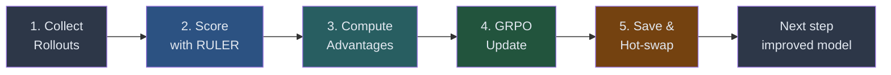
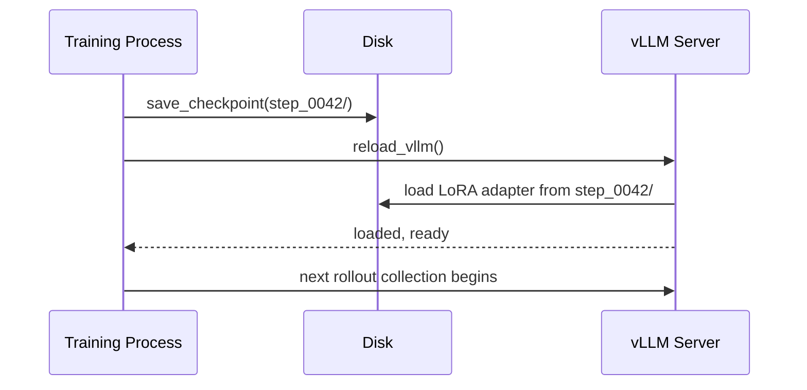
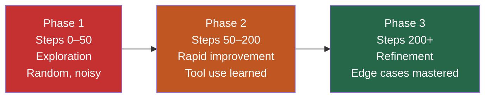
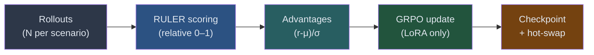

<!-- _class: lead -->

# The Training Step
## From Rollouts to an Updated Policy

**Module 05 — Training Loop Deep-Dive**

> Every GRPO training step follows five stages. Understanding each stage turns an opaque training run into a readable process.

<!--
Speaker notes: Key talking points for this slide
- This deck is about the full training step: what happens between collecting rollouts and deploying the updated model
- By the end, learners should be able to read a training log line and know exactly what it represents
- Core message: the training loop is a pipeline, and each stage has a clear, debuggable responsibility
-->

---

# The Five Stages of One Training Step



> One step = one complete iteration of this pipeline. Hundreds of steps = a trained agent.

<!--
Speaker notes: Key talking points for this slide
- Walk through the pipeline left to right
- The pipeline runs serially per step: stages cannot overlap within a step
- Between steps, the model improves — so each step starts with a slightly better policy
- Ask: "Which stage do you think is the bottleneck?" (Answer: usually Stage 1, inference-heavy rollout collection)
-->

---

# Stage 1: Collect Rollouts

```python
# For each scenario in the batch, run N rollouts in parallel
group_tasks = [
    collect_trajectories(model, scenario, tool_cmd, n=4)
    for scenario in batch
]
all_groups = await asyncio.gather(*group_tasks)
```

<div class="columns">
<div>

**Why N=4 rollouts per scenario?**
- GRPO needs a group to rank
- 4 gives enough variance to compute meaningful advantages
- More rollouts = more stable gradient, but 4× inference cost

</div>
<div>

**Why collect all before scoring?**
- RULER scores groups comparatively
- Trajectory 1 cannot be scored until trajectories 2–4 exist
- The full group must complete before any reward is assigned

</div>
</div>

<!--
Speaker notes: Key talking points for this slide
- This is the most time-consuming stage: running inference 4× per scenario across the whole batch
- asyncio.gather parallelizes across scenarios but not within a single GPU's inference queue
- n=4 is the typical default in ART — research shows diminishing returns beyond 8
- The "collect all first" constraint is fundamental to GRPO — it is not an ART limitation
-->

---

# Stage 2: Score with RULER

```python
scored_groups = await score_trajectories_relative(
    groups=all_groups,
    judge_model="gpt-4o-mini",
    judge_temperature=0.0,
)
```

RULER receives the N trajectories for one scenario and assigns comparative rewards in $[0, 1]$:

| Trajectory | Tool use | Answer accuracy | RULER score |
|------------|----------|-----------------|-------------|
| $\tau_1$   | Schema + query | Correct, verified | 0.90 |
| $\tau_2$   | Query only     | Correct, unverified | 0.65 |
| $\tau_3$   | Schema + wrong query | Incorrect | 0.35 |
| $\tau_4$   | No tools       | Hallucinated | 0.10 |

<!--
Speaker notes: Key talking points for this slide
- RULER is the LLM-as-a-judge from Module 03
- Temperature=0.0 for the judge: we want deterministic, consistent scoring
- The scores here (0.90, 0.65, 0.35, 0.10) are illustrative — real RULER outputs vary but follow this comparative pattern
- The judge sees all four trajectories simultaneously and ranks them — this is what makes RULER more reliable than independent absolute scoring
-->

---

# Stage 3: Compute Advantages

$$A_i = \frac{r_i - \mu_{\text{group}}}{\sigma_{\text{group}}}$$

For the example group above:

$$\mu = \frac{0.90 + 0.65 + 0.35 + 0.10}{4} = 0.50, \quad \sigma \approx 0.297$$

| Trajectory | RULER Score | Advantage |
|------------|-------------|-----------|
| $\tau_1$ | 0.90 | $+1.35$ |
| $\tau_2$ | 0.65 | $+0.51$ |
| $\tau_3$ | 0.35 | $-0.51$ |
| $\tau_4$ | 0.10 | $-1.35$ |

> GRPO reinforces $\tau_1$ (strongly), mildly reinforces $\tau_2$, suppresses $\tau_3$ and $\tau_4$.

<!--
Speaker notes: Key talking points for this slide
- This is the advantage normalization from Module 01 GRPO — connect back to what learners already know
- Positive advantage = reinforce (make this behavior more likely)
- Negative advantage = suppress (make this behavior less likely)
- If all four scores were equal, σ=0 and no gradient flows — correct behavior for scenarios the model handles consistently
- The advantage magnitudes tell you how strongly each trajectory is reinforced or suppressed
-->

---

# Stage 4: GRPO Update

```python
# model.train() handles advantage normalization + policy update internally
train_result = await model.train(trajectories=flat_trajectories)
```

**What happens inside `model.train()`:**

1. Computes the clipped surrogate loss using advantages
2. Applies KL divergence penalty relative to the reference model
3. Runs backpropagation — **only through LoRA parameters**
4. Updates LoRA weights (base model weights are frozen)

$$\mathcal{L}_{\text{GRPO}} = -\mathbb{E}\left[\min\left(\frac{\pi_\theta}{\pi_{\text{old}}} A_i,\; \text{clip}\left(\frac{\pi_\theta}{\pi_{\text{old}}}, 1-\varepsilon, 1+\varepsilon\right) A_i\right)\right] + \beta \cdot D_{\text{KL}}$$

<!--
Speaker notes: Key talking points for this slide
- model.train() is ART's interface to Unsloth's GRPO implementation
- The clipped surrogate loss is from Module 01 — the clip prevents too-large policy updates
- KL penalty keeps the new policy close to the reference (the base model without LoRA)
- Critical point: only LoRA parameters update. Base model weights (7B, 14B, etc.) never change.
- This is why LoRA training is fast and why checkpoints are small
-->

---

# Stage 5: Save Checkpoint and Hot-Swap

```python
checkpoint_path = f"checkpoints/step_{step:04d}"
await model.save_checkpoint(checkpoint_path)  # Writes LoRA adapter to disk
await model.reload_vllm()                     # Signals vLLM to load new weights
```



<!--
Speaker notes: Key talking points for this slide
- The checkpoint save writes only the LoRA adapter — typically 50–200 MB, not 14 GB for the full model
- reload_vllm() is a lightweight signal — vLLM hot-swaps the adapter without restarting the inference server
- The next rollout collection immediately uses the updated model
- This continuous improvement cycle is the training loop's core mechanism
- Hot-swapping is what makes the loop practical — a cold restart of vLLM would add minutes of downtime per step
-->

---

<!-- _class: lead -->

# Reading Training Logs

> A single log line contains everything you need to know about training health.

<!--
Speaker notes: Key talking points for this slide
- Section transition: we have the pipeline. Now we learn to read the output it produces.
- Experienced practitioners can tell from a few log lines whether training is healthy
- This section gives learners that skill
-->

---

# A Healthy Training Log

```
Step    0 | mean_reward=0.231 | loss=2.847 | kl=0.0012
Step   10 | mean_reward=0.287 | loss=2.610 | kl=0.0089
Step   50 | mean_reward=0.498 | loss=1.923 | kl=0.0231
Step  100 | mean_reward=0.612 | loss=1.584 | kl=0.0318
Step  200 | mean_reward=0.741 | loss=1.210 | kl=0.0397
Step  300 | mean_reward=0.803 | loss=1.087 | kl=0.0412
Step  500 | mean_reward=0.834 | loss=1.019 | kl=0.0401
```

<div class="columns">
<div>

**`mean_reward`**
Primary metric. Upward trend = learning.
Goal: exceed 0.5 (random baseline) within 100 steps.

</div>
<div>

**`loss`**
Policy gradient loss. Decreasing = good.
Near-zero immediately = mode collapse risk.

**`kl`**
KL vs reference. Slow growth = healthy.
Explosion (>0.5 early) = reduce LR.

</div>
</div>

<!--
Speaker notes: Key talking points for this slide
- Walk through each metric in the healthy log
- mean_reward goes from 0.23 to 0.83 — the model went from random behavior to expert behavior
- loss decreasing steadily is expected — the model is getting better at producing high-reward outputs
- kl growing slowly then stabilizing is ideal — the policy drifts from the reference but stays anchored
- The log shows three training phases: noisy exploration (0-50), rapid improvement (50-200), refinement (200+)
-->

---

# Three Warning Signs

<div class="columns">
<div>

**Flat reward**
```
Step    0 | reward=0.231
Step   50 | reward=0.238
Step  100 | reward=0.241
```
Reward not moving after 50+ steps.

- Reward function bug (all scores identical)?
- Tool server silently failing?
- Learning rate too low?

</div>
<div>

**KL explosion**
```
Step    0 | kl=0.0012
Step   10 | kl=0.1823
Step   20 | kl=0.8941
Step   30 | kl=2.3107
```
kl growing faster than reward.

- Reduce learning rate 10×
- Increase KL penalty coefficient
- Restart from last good checkpoint

</div>
</div>

<!--
Speaker notes: Key talking points for this slide
- Flat reward: first check the reward function — is RULER actually producing different scores for different trajectories?
- Flat reward: second check tool server logs — silently failing tool calls produce uniform low scores
- KL explosion: the update is too aggressive, overshooting the KL penalty's restraining force
- After KL explosion, restart from the last checkpoint before the explosion, not from scratch
-->

---

# Reward Hacking

```
Step    0 | mean_reward=0.231
Step    5 | mean_reward=0.901
Step   10 | mean_reward=0.948
```

Reward jumps to near 1.0 in the first few steps — without visible improvement in trajectory quality.

**What is happening:** the model found a shortcut to high scores that does not involve solving the task. Common patterns:

- Very long, verbose answers that trigger a length bias in the judge
- Confident-sounding but incorrect answers that bypass correctness checks
- Repeating the question as if it is an answer

**Fix:** inspect sample trajectories immediately. If they look wrong, revisit the RULER judge prompt to add explicit correctness penalties.

<!--
Speaker notes: Key talking points for this slide
- Reward hacking is one of the most important failure modes in RL training
- The giveaway: reward spikes fast but qualitative inspection shows no improvement
- Length bias is a known issue in LLM judges — the judge sees more text and assumes more effort = better
- Adding explicit RULER rubric items ("does not pad the answer", "answer is verified by tool results") helps
- This is why the guide says to print sample trajectories every 10 steps — qualitative checks catch hacking
-->

---

# Three Training Phases



| Phase | Reward Range | Trajectory Character |
|-------|-------------|---------------------|
| Exploration | 0.20 – 0.40 | No tool use, hallucinations |
| Rapid improvement | 0.40 – 0.75 | Tool use starts, schema checking |
| Refinement | 0.75 – 0.90 | Edge cases, malformed inputs handled |

<!--
Speaker notes: Key talking points for this slide
- These phases are empirical patterns, not hard boundaries — actual transitions depend on the task and model size
- Phase 1 is often frustrating — reward is low and noisy. Patience is required.
- Phase 2 is the most exciting: visible behavioral change in sample trajectories
- Phase 3 is often "good enough" for practical deployment — perfection is rarely worth the extra training cost
- Ask: "At which phase would you consider stopping training for a production deployment?"
-->

---

# Summary



**Read the log:**
- `mean_reward` trending up = healthy
- `kl` growing slowly then stabilizing = healthy
- Flat reward = check reward function and tool server
- KL explosion = reduce learning rate
- Instant high reward = check for reward hacking

<!--
Speaker notes: Key talking points for this slide
- Summarize the five stages as a data flow
- The diagnostic table is the practical takeaway — learners should be able to diagnose a training run from its log
- Next: Guide 03 covers checkpoint management — the operational side of keeping training and inference in sync
-->

---

<!-- _class: lead -->

# Next: Guide 03

## Checkpoint Management

> LoRA adapters, hot-swapping into vLLM, evaluating at multiple checkpoints, and resuming interrupted runs.

<!--
Speaker notes: Key talking points for this slide
- Preview: checkpoint management is the operational backbone of a long training run
- Training runs often take hours. Checkpoints are what let you recover from crashes and compare model versions
- Guide 03 focuses on the practical engineering: saving, loading, evaluating, and resuming
-->
