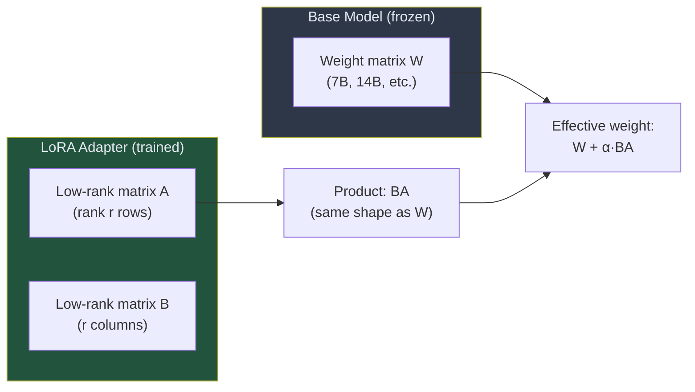

# Guide 03: Checkpoint Management

## Learning Objectives

By the end of this guide you will be able to:

1. Explain what a LoRA checkpoint contains and why it is small relative to the base model
2. Implement hot-swapping a new LoRA adapter into a running vLLM server
3. Evaluate model quality at different checkpoints to find the best training stage
4. Save and restore training state to resume an interrupted run
5. Implement a checkpoint manager class with save, load, evaluate, and cleanup methods

---

## What Is a LoRA Checkpoint?

A LoRA checkpoint is a small set of weight matrices — the adapter — that modifies the frozen base model's behavior when loaded. The base model weights never change during training. Only the LoRA matrices are updated.



At inference time, the effective weight is $W + \alpha \cdot BA$, where $\alpha$ is a scaling factor. The adapter matrices $A$ and $B$ have much lower rank than $W$: a 4096×4096 weight matrix with rank 16 requires only $4096 \times 16 + 16 \times 4096 = 131{,}072$ parameters instead of $4096^2 = 16{,}777{,}216$. That is 128× fewer parameters per layer.

For a 7B model trained with LoRA at rank 16, the checkpoint is approximately 50–100 MB. The full model is approximately 14 GB. This size difference is what makes it practical to save a checkpoint after every training step.

---

## Why Checkpoints Matter in RL Training

In supervised fine-tuning, the model typically improves monotonically: later is better. In RL training, this is not guaranteed. The reward can plateau, oscillate, or even regress if the policy overshoots. The best model is often not the last checkpoint — it is the checkpoint where the reward trend was highest before regression began.

This means checkpoint management in RL requires:

1. **Saving frequently** — every step or every few steps — to preserve any best-so-far model
2. **Evaluating multiple checkpoints** to identify the best training stage
3. **Resuming from a specific checkpoint** if training goes wrong

---

## Checkpoint Directory Structure

```
checkpoints/
├── step_0000/
│   ├── adapter_model.safetensors   # LoRA weight matrices (A and B)
│   ├── adapter_config.json         # LoRA hyperparameters (rank, alpha, target modules)
│   └── training_state.json         # Step number, reward history, optimizer state path
├── step_0010/
│   └── ...
├── step_0050/
│   └── ...
├── best/                           # Symlink or copy of the best checkpoint so far
│   └── ...
└── training_log.jsonl              # One JSON line per step: step, reward, loss, kl
```

The `adapter_config.json` tells the loading code what LoRA configuration was used — rank, alpha, which model layers were targeted. Without it, the adapter cannot be correctly loaded.

The `training_state.json` stores metadata needed to resume training: the last completed step number, the optimizer state file path (for Adam momentum), and the reward history used to compute best-so-far.

---

## The Checkpoint Manager

```python
import json
import os
import shutil
from dataclasses import dataclass, field, asdict
from pathlib import Path
from typing import Optional

import art


@dataclass
class TrainingState:
    """
    Everything needed to resume a training run.
    Serializable to JSON for persistence.
    """
    last_completed_step: int = 0
    step_rewards: list[float] = field(default_factory=list)
    best_reward: float = 0.0
    best_step: int = 0
    total_trajectories_seen: int = 0


class CheckpointManager:
    """
    Manages LoRA checkpoints during RL training.

    Responsibilities:
    - Save checkpoints after each step
    - Track the best checkpoint by reward
    - Provide resume-from-checkpoint functionality
    - Clean up old checkpoints to manage disk space
    """

    def __init__(
        self,
        checkpoint_dir: str,
        save_every_n_steps: int = 1,
        keep_last_n: int = 10,
        keep_best: bool = True,
    ):
        self.checkpoint_dir = Path(checkpoint_dir)
        self.checkpoint_dir.mkdir(parents=True, exist_ok=True)
        self.save_every_n_steps = save_every_n_steps
        self.keep_last_n = keep_last_n
        self.keep_best = keep_best

        self.state = self._load_or_init_state()
        self.log_path = self.checkpoint_dir / "training_log.jsonl"

    def _load_or_init_state(self) -> TrainingState:
        """Load existing training state if resuming, otherwise create fresh state."""
        state_path = self.checkpoint_dir / "training_state.json"
        if state_path.exists():
            with open(state_path) as f:
                data = json.load(f)
            print(f"Resuming from step {data['last_completed_step']} "
                  f"(best reward: {data['best_reward']:.3f} at step {data['best_step']})")
            return TrainingState(**data)
        return TrainingState()

    def _save_state(self):
        """Persist training state to disk."""
        state_path = self.checkpoint_dir / "training_state.json"
        with open(state_path, "w") as f:
            json.dump(asdict(self.state), f, indent=2)

    async def save(
        self,
        model: art.Model,
        step: int,
        mean_reward: float,
        loss: float,
        kl: float,
    ) -> Optional[str]:
        """
        Save a checkpoint if this step meets the save_every_n_steps criterion.

        Returns the checkpoint path if saved, None otherwise.
        """
        if step % self.save_every_n_steps != 0:
            return None

        checkpoint_path = self.checkpoint_dir / f"step_{step:04d}"
        await model.save_checkpoint(str(checkpoint_path))

        # Update training state
        self.state.last_completed_step = step
        self.state.step_rewards.append(mean_reward)
        self.state.total_trajectories_seen += 1  # updated by caller in practice

        # Track best checkpoint
        if mean_reward > self.state.best_reward:
            self.state.best_reward = mean_reward
            self.state.best_step = step
            if self.keep_best:
                best_path = self.checkpoint_dir / "best"
                if best_path.exists():
                    shutil.rmtree(best_path)
                shutil.copytree(checkpoint_path, best_path)
                print(f"  New best: step {step}, reward={mean_reward:.4f} "
                      f"(saved to checkpoints/best/)")

        # Write to training log
        log_entry = {
            "step": step,
            "mean_reward": mean_reward,
            "loss": loss,
            "kl": kl,
        }
        with open(self.log_path, "a") as f:
            f.write(json.dumps(log_entry) + "\n")

        self._save_state()
        self._cleanup_old_checkpoints()

        return str(checkpoint_path)

    def _cleanup_old_checkpoints(self):
        """
        Remove checkpoints older than keep_last_n steps.
        Always preserves the 'best' checkpoint.
        """
        step_dirs = sorted(
            [d for d in self.checkpoint_dir.iterdir()
             if d.is_dir() and d.name.startswith("step_")],
            key=lambda d: int(d.name.split("_")[1])
        )

        # Keep only the last N
        to_remove = step_dirs[:-self.keep_last_n] if len(step_dirs) > self.keep_last_n else []
        for old_dir in to_remove:
            shutil.rmtree(old_dir)

    async def load_checkpoint(self, model: art.Model, step: Optional[int] = None):
        """
        Load a checkpoint into the model.

        Parameters
        ----------
        model : art.Model
        step : int or None
            If None, loads the best checkpoint.
            If an int, loads the checkpoint at that step number.
        """
        if step is None:
            checkpoint_path = self.checkpoint_dir / "best"
            label = "best"
        else:
            checkpoint_path = self.checkpoint_dir / f"step_{step:04d}"
            label = f"step {step}"

        if not checkpoint_path.exists():
            raise FileNotFoundError(
                f"Checkpoint not found: {checkpoint_path}\n"
                f"Available steps: {self._list_saved_steps()}"
            )

        await model.load_checkpoint(str(checkpoint_path))
        print(f"Loaded checkpoint: {label} from {checkpoint_path}")

    def _list_saved_steps(self) -> list[int]:
        return sorted([
            int(d.name.split("_")[1])
            for d in self.checkpoint_dir.iterdir()
            if d.is_dir() and d.name.startswith("step_")
        ])

    @property
    def resume_step(self) -> int:
        """The step to resume training from (one after last completed)."""
        return self.state.last_completed_step + 1

    def load_log(self) -> list[dict]:
        """Load the training log as a list of dicts, one per step."""
        if not self.log_path.exists():
            return []
        with open(self.log_path) as f:
            return [json.loads(line) for line in f if line.strip()]
```

---

## Hot-Swapping Into vLLM

Hot-swapping replaces the active LoRA adapter in a running vLLM server without restarting. vLLM's LoRA serving API supports this natively.

```python
import httpx

async def hot_swap_lora(
    vllm_base_url: str,
    lora_name: str,
    lora_path: str,
    base_model_id: str,
):
    """
    Load a new LoRA adapter into a running vLLM server.

    The server continues serving requests during the swap —
    in-flight requests complete with the old adapter, new requests
    use the new adapter once it is loaded.

    Parameters
    ----------
    vllm_base_url : str
        URL of the vLLM server, e.g. "http://localhost:8000"
    lora_name : str
        Name to register the adapter under, e.g. "training_adapter"
    lora_path : str
        Absolute path to the checkpoint directory on disk
    base_model_id : str
        The base model identifier, e.g. "Qwen/Qwen2.5-7B-Instruct"
    """
    async with httpx.AsyncClient(timeout=60.0) as client:
        response = await client.post(
            f"{vllm_base_url}/v1/load_lora_adapter",
            json={
                "lora_name": lora_name,
                "lora_path": lora_path,
                "base_model_name": base_model_id,
            }
        )
        response.raise_for_status()

    print(f"Hot-swapped LoRA adapter: {lora_name} from {lora_path}")


async def unload_lora(vllm_base_url: str, lora_name: str):
    """Remove a previously loaded LoRA adapter from vLLM."""
    async with httpx.AsyncClient(timeout=30.0) as client:
        response = await client.post(
            f"{vllm_base_url}/v1/unload_lora_adapter",
            json={"lora_name": lora_name}
        )
        response.raise_for_status()
```

In the ART framework, `model.reload_vllm()` calls this sequence automatically. You only need to call `hot_swap_lora` directly if you are building a custom training loop outside ART.

---

## Evaluating Multiple Checkpoints

The best checkpoint is not always the last one. Evaluate a range of checkpoints on a held-out evaluation set to find the peak.

```python
import asyncio
from pathlib import Path

async def evaluate_checkpoint(
    model: art.Model,
    checkpoint_path: str,
    eval_scenarios: list[dict],
    tool_server_command: list[str],
    n_rollouts: int = 4,
) -> float:
    """
    Evaluate a checkpoint on held-out scenarios.

    Returns mean RULER reward across all evaluation rollouts.
    Does not update the model — evaluation only.
    """
    await model.load_checkpoint(checkpoint_path)

    all_rewards = []
    for scenario in eval_scenarios:
        trajectories = await collect_trajectories(
            model, scenario, tool_server_command, n_rollouts
        )
        scored = await score_trajectories_relative(
            groups=[trajectories],
            judge_model="gpt-4o-mini",
            judge_temperature=0.0,
        )
        rewards = [t.reward for group in scored for t in group]
        all_rewards.extend(rewards)

    return float(sum(all_rewards) / len(all_rewards)) if all_rewards else 0.0


async def find_best_checkpoint(
    model: art.Model,
    checkpoint_dir: str,
    eval_scenarios: list[dict],
    tool_server_command: list[str],
    eval_steps: list[int],
) -> tuple[int, float]:
    """
    Evaluate model at multiple training steps on a held-out eval set.

    Parameters
    ----------
    eval_steps : list[int]
        Which training steps to evaluate, e.g. [50, 100, 200, 300, 500]

    Returns
    -------
    (best_step, best_reward) : tuple[int, float]
    """
    results = {}
    for step in eval_steps:
        checkpoint_path = str(Path(checkpoint_dir) / f"step_{step:04d}")
        if not Path(checkpoint_path).exists():
            print(f"  Step {step}: checkpoint not found, skipping")
            continue

        print(f"  Evaluating step {step}...", end=" ", flush=True)
        reward = await evaluate_checkpoint(
            model, checkpoint_path, eval_scenarios, tool_server_command
        )
        results[step] = reward
        print(f"reward={reward:.4f}")

    if not results:
        raise RuntimeError("No checkpoints found to evaluate.")

    best_step = max(results, key=results.__getitem__)
    return best_step, results[best_step]
```

---

## Resuming an Interrupted Training Run

A training run interrupted by a crash, timeout, or deliberate pause can be resumed from the last saved checkpoint.

```python
async def train_with_resume(
    model: art.Model,
    scenarios: list[dict],
    tool_server_command: list[str],
    checkpoint_dir: str = "./checkpoints",
    n_steps: int = 500,
    n_rollouts: int = 4,
    batch_size: int = 8,
):
    """
    Training loop that automatically resumes from the last checkpoint.

    If checkpoint_dir contains a previous run, training continues
    from where it left off. Otherwise, starts from scratch.
    """
    manager = CheckpointManager(
        checkpoint_dir=checkpoint_dir,
        save_every_n_steps=1,
        keep_last_n=10,
        keep_best=True,
    )

    # Resume from last checkpoint if one exists
    if manager.state.last_completed_step > 0:
        last_step = manager.state.last_completed_step
        checkpoint_path = str(Path(checkpoint_dir) / f"step_{last_step:04d}")
        await model.load_checkpoint(checkpoint_path)
        await model.reload_vllm()
        print(f"Resumed from step {last_step}. Continuing to step {n_steps}.")
    else:
        print("Starting training from scratch.")

    start_step = manager.resume_step

    import random
    for step in range(start_step, n_steps + 1):
        batch = random.sample(scenarios, k=min(batch_size, len(scenarios)))

        group_tasks = [
            collect_trajectories(model, scenario, tool_server_command, n_rollouts)
            for scenario in batch
        ]
        all_groups = await asyncio.gather(*group_tasks)

        scored_groups = await score_trajectories_relative(
            groups=all_groups,
            judge_model="gpt-4o-mini",
            judge_temperature=0.0,
        )

        flat_trajectories = [t for group in scored_groups for t in group]
        train_result = await model.train(trajectories=flat_trajectories)

        await manager.save(
            model=model,
            step=step,
            mean_reward=train_result.mean_reward,
            loss=train_result.loss,
            kl=train_result.kl_divergence,
        )
        await model.reload_vllm()

        print(f"Step {step:4d} | reward={train_result.mean_reward:.4f} | "
              f"loss={train_result.loss:.4f} | kl={train_result.kl_divergence:.4f}")
```

---

## Checkpoint Size Reference

| Model | Base Model Size | LoRA Rank 8 | LoRA Rank 16 | LoRA Rank 64 |
|-------|----------------|-------------|--------------|--------------|
| Qwen 2.5 3B | 6 GB | ~12 MB | ~25 MB | ~95 MB |
| Qwen 2.5 7B | 14 GB | ~25 MB | ~50 MB | ~200 MB |
| Qwen 2.5 14B | 28 GB | ~50 MB | ~100 MB | ~400 MB |

At rank 16 with Qwen 2.5 7B, saving one checkpoint per step across 500 steps requires approximately 25 GB of disk space. Keeping only the last 10 steps plus the best reduces this to under 1.5 GB.

---

## Summary

| Concept | Key Point |
|---------|-----------|
| LoRA checkpoint | Small adapter matrices (~50–200 MB) that modify the frozen base model |
| Hot-swap | Replace the adapter in vLLM without restarting — seconds, not minutes |
| Best checkpoint | RL training is non-monotonic; evaluate to find the peak, not just use the last |
| Resume | `CheckpointManager` tracks state so interrupted runs restart from the last step |
| Disk management | Keep last N + best; discard old steps to prevent disk exhaustion |

---

## Module Complete

You now have the full training loop:

1. Rollouts capture what the agent does (Guide 01)
2. The training step turns those rollouts into a policy update (Guide 02)
3. Checkpoint management keeps training and inference in sync and recoverable (Guide 03)

The next module applies this complete loop to a real end-to-end task: training a text-to-SQL agent on an actual SQLite database.
