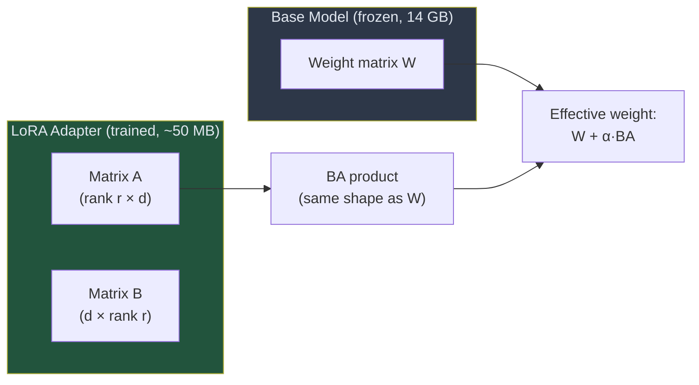
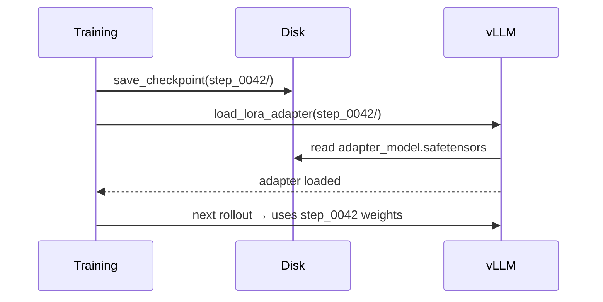
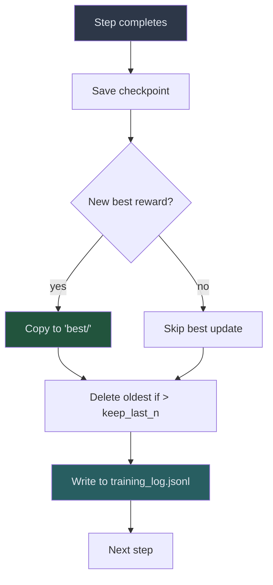

<!-- _class: lead -->

# Checkpoint Management
## LoRA Adapters, Hot-Swapping, and Resumable Training

**Module 05 — Training Loop Deep-Dive**

> A LoRA checkpoint is a few hundred megabytes. The base model is tens of gigabytes. This size difference changes everything about how you manage training state.

<!--
Speaker notes: Key talking points for this slide
- This is the final guide in Module 05: the operational side of long training runs
- Covers three topics: what checkpoints contain, how to hot-swap them into vLLM, and how to resume interrupted runs
- Practical focus: a training run on a single GPU for a 7B model can take 4–8 hours. Checkpoints are your crash insurance.
-->

---

# What Is a LoRA Checkpoint?



<div class="columns">
<div>

**Full model weight matrix (7B model)**
$4096 \times 4096 = 16{,}777{,}216$ parameters per layer

</div>
<div>

**LoRA at rank 16**
$4096 \times 16 + 16 \times 4096 = 131{,}072$ parameters per layer

**128× fewer parameters per layer**

</div>
</div>

<!--
Speaker notes: Key talking points for this slide
- The key insight: LoRA does not modify the base model weights. It adds a small correction via the BA product.
- The base model stays identical throughout training — only the adapter changes
- This is why the checkpoint is small: you only save A and B, not W
- α (alpha) is a scaling hyperparameter that controls how strongly the adapter influences the effective weight
- For a 7B model with LoRA rank 16, the full checkpoint is typically 50–100 MB
-->

---

# Why Checkpoint Size Matters

| Model | Base Model | LoRA Rank 16 | Steps to Save |
|-------|-----------|-------------|---------------|
| Qwen 2.5 3B | 6 GB | ~25 MB | Can save every step |
| Qwen 2.5 7B | 14 GB | ~50 MB | Can save every step |
| Qwen 2.5 14B | 28 GB | ~100 MB | Can save every step |

**500 steps, Qwen 2.5 7B, rank 16:**
- All checkpoints: 500 × 50 MB = 25 GB
- Keep last 10 + best: 11 × 50 MB = 550 MB

> Save every step. Keep last N + best. This is your crash insurance.

<!--
Speaker notes: Key talking points for this slide
- Compare to saving full model checkpoints: 500 × 14 GB = 7 TB — impossible
- LoRA checkpoints make frequent saving practical
- The "keep last 10 + best" strategy is the standard approach: you can recover from recent failures and always have the best-quality checkpoint
- "Can save every step" is in contrast to full fine-tuning where even saving once per epoch is expensive
-->

---

# Checkpoint Directory Structure

```
checkpoints/
├── step_0000/
│   ├── adapter_model.safetensors   # LoRA weight matrices
│   ├── adapter_config.json         # Rank, alpha, target modules
│   └── training_state.json         # Step, reward history
├── step_0010/
│   └── ...
├── step_0050/
│   └── ...
├── best/                           # Copy of highest-reward checkpoint
│   └── ...
└── training_log.jsonl              # One JSON line per step
```

> `adapter_config.json` is required for loading — it tells the loader what LoRA configuration was used.

<!--
Speaker notes: Key talking points for this slide
- Walk through each file's purpose
- adapter_config.json stores: rank, alpha, target modules (which transformer layers have adapters), dropout
- Without adapter_config.json, you cannot load the adapter into the correct model architecture
- training_log.jsonl is your reward history — readable as JSON lines, easy to plot
- The "best/" directory is either a symlink or a copy of the checkpoint with the highest validation reward
-->

---

# The Checkpoint Manager

```python
class CheckpointManager:
    def __init__(self, checkpoint_dir, save_every_n_steps=1,
                 keep_last_n=10, keep_best=True):
        self.checkpoint_dir = Path(checkpoint_dir)
        self.state = self._load_or_init_state()   # Resumes automatically

    async def save(self, model, step, mean_reward, loss, kl):
        """Save checkpoint, update best, write to log, clean up old checkpoints."""
        checkpoint_path = self.checkpoint_dir / f"step_{step:04d}"
        await model.save_checkpoint(str(checkpoint_path))

        if mean_reward > self.state.best_reward:
            self.state.best_reward = mean_reward
            shutil.copytree(checkpoint_path, self.checkpoint_dir / "best")

        self._write_log(step, mean_reward, loss, kl)
        self._save_state()
        self._cleanup_old_checkpoints()
```

<!--
Speaker notes: Key talking points for this slide
- The CheckpointManager encapsulates all checkpoint logic — callers just call .save() after each step
- _load_or_init_state() is what enables auto-resume: if a state file exists, it loads it; otherwise starts fresh
- _cleanup_old_checkpoints() keeps disk usage bounded automatically
- The manager is stateful: it tracks best_reward so it knows whether a new checkpoint beats the current best
-->

---

# Hot-Swapping Into vLLM

```python
async def hot_swap_lora(vllm_base_url, lora_name, lora_path, base_model_id):
    """Replace the active LoRA adapter without restarting vLLM."""
    async with httpx.AsyncClient(timeout=60.0) as client:
        await client.post(
            f"{vllm_base_url}/v1/load_lora_adapter",
            json={
                "lora_name": lora_name,
                "lora_path": lora_path,
                "base_model_name": base_model_id,
            }
        )
```



<!--
Speaker notes: Key talking points for this slide
- Hot-swapping takes seconds, not minutes — vLLM loads the adapter into GPU memory while keeping the base model loaded
- In-flight requests complete with the old adapter; new requests use the new one once loading finishes
- ART's model.reload_vllm() calls this API automatically — you only need the raw function for custom loops
- This is the mechanism that makes continuous training practical: new checkpoint → improved rollouts → better training signal
-->

---

# Evaluating Multiple Checkpoints

```python
async def find_best_checkpoint(model, checkpoint_dir, eval_scenarios,
                                tool_cmd, eval_steps):
    """Evaluate model at multiple training steps on held-out data."""
    results = {}
    for step in eval_steps:
        checkpoint_path = f"{checkpoint_dir}/step_{step:04d}"
        await model.load_checkpoint(checkpoint_path)
        reward = await evaluate_on_scenarios(model, eval_scenarios, tool_cmd)
        results[step] = reward
        print(f"  Step {step:4d}: reward={reward:.4f}")

    best_step = max(results, key=results.__getitem__)
    return best_step, results[best_step]
```

> Evaluate at: [50, 100, 200, 300, 500]. The peak is often not the final step.

<!--
Speaker notes: Key talking points for this slide
- RL training is non-monotonic: reward can plateau or regress after the peak
- Evaluating on a held-out eval set (not the training scenarios) gives an unbiased estimate of generalization
- Typical evaluation checkpoints: end of each training phase (50, 100, 200, 300, 500)
- The checkpoint with highest eval reward is the one you deploy — not necessarily the last
- Evaluation add cost (more rollouts, more RULER calls) so it is typically run after training, not during every step
-->

---

# Typical Reward Curve Shape

```
Reward
 1.0 |                                    ....
 0.9 |                              .....
 0.8 |                        ......
 0.7 |                  .....
 0.6 |            ......          (possible regression)
 0.5 |       ....                       .....
 0.4 |   ....
 0.3 |...
 0.2 +------------------------------------------ Steps
       0   50  100  150  200  250  300  350  400
```

Training phases in the reward curve:

| Region | Steps | What Is Happening |
|--------|-------|-------------------|
| Noisy baseline | 0–50 | Exploring; random tool behavior |
| Rapid rise | 50–200 | Tool use learned; reward climbs |
| Refinement plateau | 200–350 | Edge cases mastered |
| Possible regression | 350+ | Overfitting to training scenarios |

<!--
Speaker notes: Key talking points for this slide
- The ASCII chart shows the non-monotonic nature of RL training reward curves
- The "possible regression" at the end is why "last checkpoint = best checkpoint" is wrong
- In practice the regression may not appear, but you cannot know without evaluating
- The held-out eval set detects regression that the training reward curve (which is in-distribution) might miss
- Ask: "If you had to pick one checkpoint to deploy, which region of the curve would you target?"
-->

---

# Resuming an Interrupted Run

```python
manager = CheckpointManager("./checkpoints", keep_last_n=10)

# Auto-resume: loads state and determines where to restart
if manager.state.last_completed_step > 0:
    last = manager.state.last_completed_step
    await model.load_checkpoint(f"checkpoints/step_{last:04d}")
    await model.reload_vllm()
    print(f"Resumed from step {last}")

# Training loop starts from manager.resume_step
for step in range(manager.resume_step, n_steps + 1):
    ...
    await manager.save(model, step, reward, loss, kl)
    await model.reload_vllm()
```

<div class="columns">
<div>

**What gets saved (recoverable)**
- LoRA adapter weights
- Step number
- Reward history
- Best step and reward

</div>
<div>

**What is NOT saved (restarts fresh)**
- Optimizer momentum (Adam state)
- Random seed state
- In-memory scenario ordering

</div>
</div>

<!--
Speaker notes: Key talking points for this slide
- The CheckpointManager's _load_or_init_state() handles the resume logic automatically
- manager.resume_step returns last_completed_step + 1 — the next step to run
- Optimizer state (Adam momentum) is not typically saved because the LoRA weights encode the training progress
- Restarting without optimizer state means the first few steps after resume may have slightly different updates, but training continues normally
- The "what is NOT saved" list is important: learners should not expect identical continuation, just correct continuation
-->

---

# Checkpoint Management Strategy



> Rule: always save, always track best, always clean up.

<!--
Speaker notes: Key talking points for this slide
- This flowchart is the decision logic inside CheckpointManager.save()
- "Always save" — no conditional skipping unless disk is truly the bottleneck
- "Always track best" — you need this for non-monotonic training
- "Always clean up" — disk exhaustion is a silent training killer
- The training_log.jsonl write at every step enables post-hoc analysis even if the run is interrupted
-->

---

# Summary: The Complete Picture

<div class="columns">
<div>

**LoRA Checkpoints**
- Small (50–200 MB vs 14 GB)
- Saved after every step
- `adapter_model.safetensors` + `adapter_config.json`

**Hot-Swapping**
- Seconds to swap, not minutes to restart
- vLLM's `/v1/load_lora_adapter` API
- ART wraps this as `model.reload_vllm()`

</div>
<div>

**Checkpoint Evaluation**
- Test at step 50, 100, 200, 300, 500
- Use held-out eval scenarios
- Best checkpoint ≠ last checkpoint

**Resuming**
- `CheckpointManager` tracks state automatically
- `resume_step` points to the next unrun step
- Restart in seconds from any saved checkpoint

</div>
</div>

<!--
Speaker notes: Key talking points for this slide
- Summarize all four topics as a reference
- The practical rule: if you set up CheckpointManager correctly at the start, the rest is automatic
- The most common mistake: not saving frequently enough and losing hours of training to a crash
- The second most common mistake: deploying the last checkpoint instead of evaluating for the best
-->

---

<!-- _class: lead -->

# Module 05 Complete

## You Now Have the Full Training Loop

**Guide 01:** Rollouts — agents generate their own training data
**Guide 02:** Training step — RULER + GRPO + checkpoint in five stages
**Guide 03:** Checkpoint management — LoRA adapters, hot-swap, resume

> Next: Module 06 applies everything end-to-end — training a text-to-SQL agent on a real SQLite database.

<!--
Speaker notes: Key talking points for this slide
- Module 05 complete — celebrate the learning journey so far
- Learners now have a complete mental model of the RL training loop from first principles to operational management
- Module 06 is the payoff: all of these concepts applied to a concrete, real end-to-end problem
- The text-to-SQL agent is the reference implementation that learners can use as a template for their own projects
- Encourage learners to run the exercise (01_training_loop_exercise.py) before moving to Module 06
-->
