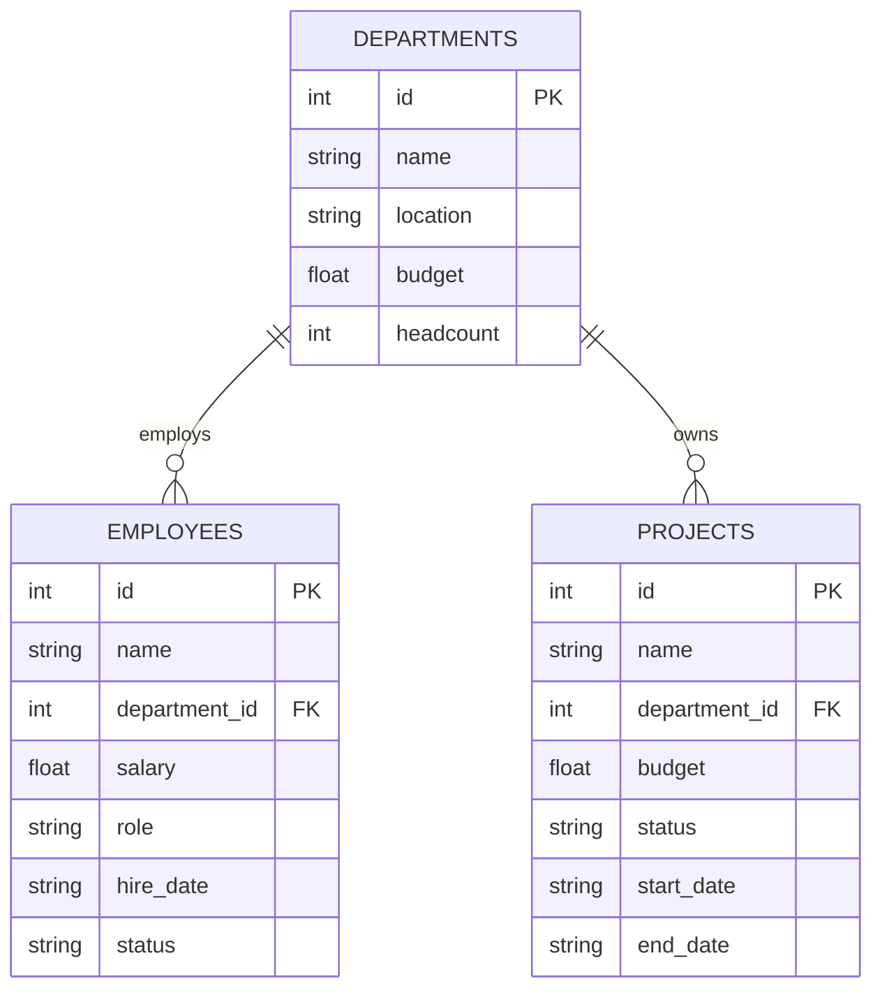

# Guide 01: Database Setup — Creating the Company Database

## Learning Objectives

By the end of this guide you will be able to:

1. Design a three-table relational schema that generates interesting multi-step queries
2. Write complete SQL DDL to create and populate tables with realistic data
3. Explain why a real database (not mock data) is essential for agent training
4. Verify database integrity with diagnostic queries before connecting an agent

---

## The Database First, Always

Before writing a single line of agent code, you need a database worth querying. This is not a detail — the database design determines what your agent can learn.

A poorly designed database with trivial data teaches the agent trivial patterns. A schema with real cardinality, real relationships, and real variation forces the agent to learn general reasoning: how to explore an unknown schema, when to JOIN, how to filter correctly.

The company database used in this module has three tables:



This schema supports queries that require:
- Simple single-table lookups ("What is the Engineering budget?")
- Cross-table JOINs ("Who works on the Falcon project?")
- Aggregations ("Which department has the highest average salary?")
- Filtered aggregations ("How many active projects are over budget?")

---

## Why Real Data, Not Mocks

Three reasons real data beats mock data for agent training:

**1. Agents learn from diversity, not patterns.**
Mock data often has suspiciously regular values (salary: 50000, 60000, 70000). Real-feeling data has irregular values that force the agent to write general queries rather than hardcoded ones.

**2. The reward function needs correct answers.**
Your RULER judge compares the agent's answer to a ground-truth query result. If the data is trivial, many wrong queries still produce the right-looking answer by coincidence. With realistic data, wrong queries produce wrong results.

**3. Production deployment starts here.**
The agent you train on this database learns patterns — schema exploration, JOIN construction, error handling — that transfer directly to your production database. Train on realistic data, deploy to production with confidence.

---

## Schema Design Decisions

**Departments table** is the central anchor. Three attributes beyond the primary key (location, budget, headcount) give the agent multiple dimensions to filter on. Headcount is intentionally not the COUNT of employees — this is a realistic inconsistency that the agent must navigate.

**Employees table** uses a foreign key to Departments. The `status` column (active/on_leave/terminated) forces the agent to consider filtering, not just joining. Roles have a deliberate hierarchy (Engineer, Senior Engineer, Principal Engineer, Manager, Director) that enables "who earns more than their peers" style queries.

**Projects table** also references Departments via foreign key. Having both Employees and Projects reference Departments (rather than Projects referencing Employees) is intentional: not every project maps neatly to a single employee. This forces the agent to handle indirect relationships.

---

## Complete Database Creation Script

```python
import sqlite3
from pathlib import Path


def create_company_database(db_path: str = "company.db") -> sqlite3.Connection:
    """
    Create and populate the company database used for agent training.

    Returns an open connection to the created database.
    The database is created fresh each time — existing file is overwritten.
    """
    # Remove existing database to start clean
    path = Path(db_path)
    if path.exists():
        path.unlink()

    conn = sqlite3.connect(db_path)
    conn.row_factory = sqlite3.Row  # Enables column-name access on results
    cursor = conn.cursor()

    # Enable foreign key enforcement (SQLite disables it by default)
    cursor.execute("PRAGMA foreign_keys = ON")

    # -------------------------------------------------------------------
    # Table 1: Departments
    # Central anchor table. All other tables reference this one.
    # -------------------------------------------------------------------
    cursor.execute("""
        CREATE TABLE departments (
            id          INTEGER PRIMARY KEY AUTOINCREMENT,
            name        TEXT    NOT NULL UNIQUE,
            location    TEXT    NOT NULL,
            budget      REAL    NOT NULL,
            headcount   INTEGER NOT NULL
        )
    """)

    departments = [
        ("Engineering",     "San Francisco", 4_200_000.00, 42),
        ("Product",         "San Francisco", 1_800_000.00, 18),
        ("Sales",           "New York",      2_100_000.00, 31),
        ("Marketing",       "New York",      950_000.00,   12),
        ("Finance",         "Chicago",       1_100_000.00, 9),
        ("Legal",           "Chicago",       620_000.00,   5),
        ("Data Science",    "San Francisco", 2_800_000.00, 22),
        ("Operations",      "Austin",        1_350_000.00, 19),
    ]

    cursor.executemany(
        "INSERT INTO departments (name, location, budget, headcount) VALUES (?, ?, ?, ?)",
        departments
    )

    # -------------------------------------------------------------------
    # Table 2: Employees
    # References departments.id via department_id.
    # -------------------------------------------------------------------
    cursor.execute("""
        CREATE TABLE employees (
            id              INTEGER PRIMARY KEY AUTOINCREMENT,
            name            TEXT    NOT NULL,
            department_id   INTEGER NOT NULL REFERENCES departments(id),
            salary          REAL    NOT NULL,
            role            TEXT    NOT NULL,
            hire_date       TEXT    NOT NULL,
            status          TEXT    NOT NULL DEFAULT 'active'
                            CHECK (status IN ('active', 'on_leave', 'terminated'))
        )
    """)

    employees = [
        # Engineering (dept_id=1)
        ("Alice Chen",        1, 165_000, "Principal Engineer",  "2018-03-12", "active"),
        ("Bob Martinez",      1, 142_000, "Senior Engineer",     "2019-07-22", "active"),
        ("Carol Patel",       1, 138_000, "Senior Engineer",     "2020-01-08", "active"),
        ("David Kim",         1, 118_000, "Engineer",            "2021-05-14", "active"),
        ("Elena Novak",       1, 122_000, "Engineer",            "2021-08-30", "active"),
        ("Frank Liu",         1, 195_000, "Engineering Manager", "2016-09-01", "active"),
        ("Grace Thompson",    1, 115_000, "Engineer",            "2022-02-14", "active"),
        ("Henry Park",        1, 125_000, "Senior Engineer",     "2020-11-03", "on_leave"),

        # Product (dept_id=2)
        ("Iris Johnson",      2, 148_000, "Product Manager",     "2019-04-15", "active"),
        ("James Wilson",      2, 135_000, "Product Manager",     "2020-06-20", "active"),
        ("Kate Brown",        2, 158_000, "Director of Product", "2017-10-10", "active"),
        ("Liam Davis",        2, 120_000, "Associate PM",        "2022-09-01", "active"),

        # Sales (dept_id=3)
        ("Maya Okonkwo",      3, 95_000,  "Account Executive",   "2020-03-01", "active"),
        ("Noah Garcia",       3, 88_000,  "Account Executive",   "2021-01-15", "active"),
        ("Olivia Smith",      3, 112_000, "Sales Manager",       "2018-11-20", "active"),
        ("Peter Zhang",       3, 92_000,  "Account Executive",   "2021-07-08", "active"),
        ("Quinn Taylor",      3, 78_000,  "SDR",                 "2023-01-10", "active"),
        ("Rachel Moore",      3, 82_000,  "SDR",                 "2022-08-22", "terminated"),

        # Marketing (dept_id=4)
        ("Sam Lee",           4, 105_000, "Marketing Manager",   "2019-06-15", "active"),
        ("Tina Hernandez",    4, 88_000,  "Content Strategist",  "2021-03-01", "active"),
        ("Uma Patel",         4, 92_000,  "Growth Marketer",     "2020-09-14", "active"),
        ("Victor Russo",      4, 115_000, "Director of Marketing","2017-02-28","active"),

        # Finance (dept_id=5)
        ("Wendy Chen",        5, 132_000, "Financial Analyst",   "2019-08-19", "active"),
        ("Xavier Rodriguez",  5, 145_000, "Finance Manager",     "2018-04-03", "active"),
        ("Yara Johansson",    5, 128_000, "Financial Analyst",   "2020-12-07", "active"),

        # Legal (dept_id=6)
        ("Zoe Williams",      6, 185_000, "Senior Counsel",      "2018-07-16", "active"),
        ("Aaron Brooks",      6, 165_000, "Counsel",             "2020-05-18", "active"),

        # Data Science (dept_id=7)
        ("Bella Nakamura",    7, 158_000, "Senior Data Scientist","2019-02-11","active"),
        ("Carlos Mendez",     7, 145_000, "Data Scientist",      "2020-10-05", "active"),
        ("Diana Walsh",       7, 172_000, "Principal Data Scientist","2017-08-20","active"),
        ("Ethan Foster",      7, 138_000, "Data Scientist",      "2021-04-19", "active"),
        ("Fiona Chang",       7, 180_000, "Data Science Manager","2016-11-30","active"),
        ("Gus Andersen",      7, 132_000, "Data Scientist",      "2022-01-10", "on_leave"),

        # Operations (dept_id=8)
        ("Hannah Scott",      8, 98_000,  "Operations Analyst",  "2020-07-06", "active"),
        ("Ian Powell",        8, 115_000, "Operations Manager",  "2018-09-12", "active"),
        ("Julia Moreau",      8, 92_000,  "Operations Analyst",  "2021-11-30", "active"),
        ("Kevin Singh",       8, 88_000,  "Coordinator",         "2022-06-15", "active"),
    ]

    cursor.executemany(
        """INSERT INTO employees (name, department_id, salary, role, hire_date, status)
           VALUES (?, ?, ?, ?, ?, ?)""",
        employees
    )

    # -------------------------------------------------------------------
    # Table 3: Projects
    # References departments.id — not employees.id directly.
    # Projects belong to a department, not an individual.
    # -------------------------------------------------------------------
    cursor.execute("""
        CREATE TABLE projects (
            id              INTEGER PRIMARY KEY AUTOINCREMENT,
            name            TEXT    NOT NULL,
            department_id   INTEGER NOT NULL REFERENCES departments(id),
            budget          REAL    NOT NULL,
            status          TEXT    NOT NULL
                            CHECK (status IN ('planning', 'active', 'completed', 'cancelled')),
            start_date      TEXT    NOT NULL,
            end_date        TEXT
        )
    """)

    projects = [
        # Engineering projects
        ("Project Falcon",       1, 850_000,   "active",    "2024-01-15", None),
        ("API Gateway Rebuild",  1, 420_000,   "completed", "2023-06-01", "2024-02-28"),
        ("Mobile SDK v3",        1, 310_000,   "active",    "2024-03-01", None),
        ("Security Hardening",   1, 275_000,   "planning",  "2024-07-01", None),

        # Product projects
        ("UX Redesign 2024",     2, 380_000,   "active",    "2024-02-01", None),
        ("Onboarding Flow",      2, 145_000,   "completed", "2023-09-01", "2024-01-31"),

        # Sales projects
        ("Enterprise Pipeline",  3, 220_000,   "active",    "2024-01-01", None),
        ("APAC Expansion",       3, 540_000,   "planning",  "2024-08-01", None),

        # Marketing projects
        ("Brand Refresh",        4, 280_000,   "active",    "2024-01-20", None),
        ("Q3 Campaign",          4, 165_000,   "completed", "2023-07-01", "2023-09-30"),

        # Finance projects
        ("ERP Migration",        5, 620_000,   "active",    "2023-11-01", None),
        ("Audit Automation",     5, 180_000,   "planning",  "2024-06-01", None),

        # Data Science projects
        ("Churn Prediction v2",  7, 490_000,   "active",    "2024-02-15", None),
        ("Demand Forecasting",   7, 375_000,   "completed", "2023-04-01", "2023-12-31"),
        ("Real-time Anomaly",    7, 280_000,   "active",    "2024-04-01", None),
        ("LLM Integration",      7, 720_000,   "planning",  "2024-09-01", None),

        # Operations projects
        ("Warehouse Automation", 8, 410_000,   "active",    "2024-03-01", None),
        ("Vendor Consolidation", 8, 95_000,    "completed", "2023-08-01", "2024-01-15"),
    ]

    cursor.executemany(
        """INSERT INTO projects (name, department_id, budget, status, start_date, end_date)
           VALUES (?, ?, ?, ?, ?, ?)""",
        projects
    )

    conn.commit()
    return conn


def verify_database(conn: sqlite3.Connection) -> None:
    """
    Run diagnostic queries to confirm the database was created correctly.
    Prints a summary of row counts and sample data.
    """
    cursor = conn.cursor()

    # Row counts — catches truncated inserts immediately
    for table in ("departments", "employees", "projects"):
        cursor.execute(f"SELECT COUNT(*) FROM {table}")
        count = cursor.fetchone()[0]
        print(f"  {table}: {count} rows")

    # Referential integrity check — any orphan employees?
    cursor.execute("""
        SELECT COUNT(*) FROM employees e
        LEFT JOIN departments d ON e.department_id = d.id
        WHERE d.id IS NULL
    """)
    orphans = cursor.fetchone()[0]
    print(f"  Orphan employees (should be 0): {orphans}")

    # Sample cross-table query — confirms JOINs work
    cursor.execute("""
        SELECT d.name AS department, COUNT(e.id) AS employee_count, AVG(e.salary) AS avg_salary
        FROM departments d
        LEFT JOIN employees e ON d.id = e.department_id
        WHERE e.status = 'active'
        GROUP BY d.name
        ORDER BY avg_salary DESC
        LIMIT 3
    """)
    print("\n  Top 3 departments by average active employee salary:")
    for row in cursor.fetchall():
        print(f"    {row['department']}: {row['employee_count']} employees, "
              f"avg ${row['avg_salary']:,.0f}")


if __name__ == "__main__":
    print("Creating company database...")
    conn = create_company_database("company.db")
    print("Verifying...")
    verify_database(conn)
    conn.close()
    print("\nDatabase ready at company.db")
```

---

## Running the Script

```bash
python create_database.py
```

Expected output:

```
Creating company database...
Verifying...
  departments: 8 rows
  employees: 36 rows
  projects: 18 rows
  Orphan employees (should be 0): 0

  Top 3 departments by average active employee salary:
    Legal: 2 employees, avg $175,000
    Data Science: 5 employees, avg $157,600
    Engineering: 7 employees, avg $143,286

Database ready at company.db
```

---

## Common Pitfalls

**Forgetting `PRAGMA foreign_keys = ON`.** SQLite does not enforce foreign keys by default. Without this pragma, invalid `department_id` values silently insert, and your JOIN queries will silently return no results. Always enable it at connection time.

**Using auto-increment IDs as if they start at 0.** SQLite AUTOINCREMENT starts at 1. If you hard-code department IDs in your employee inserts, use 1-based indexing: Engineering is `1`, Product is `2`, and so on.

**Checking row counts without checking referential integrity.** A database can have the correct number of rows and still have orphan foreign keys. Always run the orphan check before connecting an agent.

---

## Connections

- **Builds on:** Module 04 (MCP tool servers) — the database created here becomes the environment the MCP server exposes
- **Leads to:** Guide 02 — Building the MCP Server (the three tools wrap this database)
- **The schema is intentionally fixed** — the agent must discover it through tools, not by reading this guide

## Next

Guide 02 — Building the MCP Server: wrapping `list_tables`, `describe_table`, and `run_query` around this database using FastMCP.
