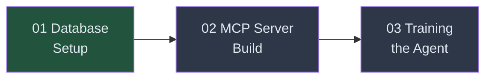
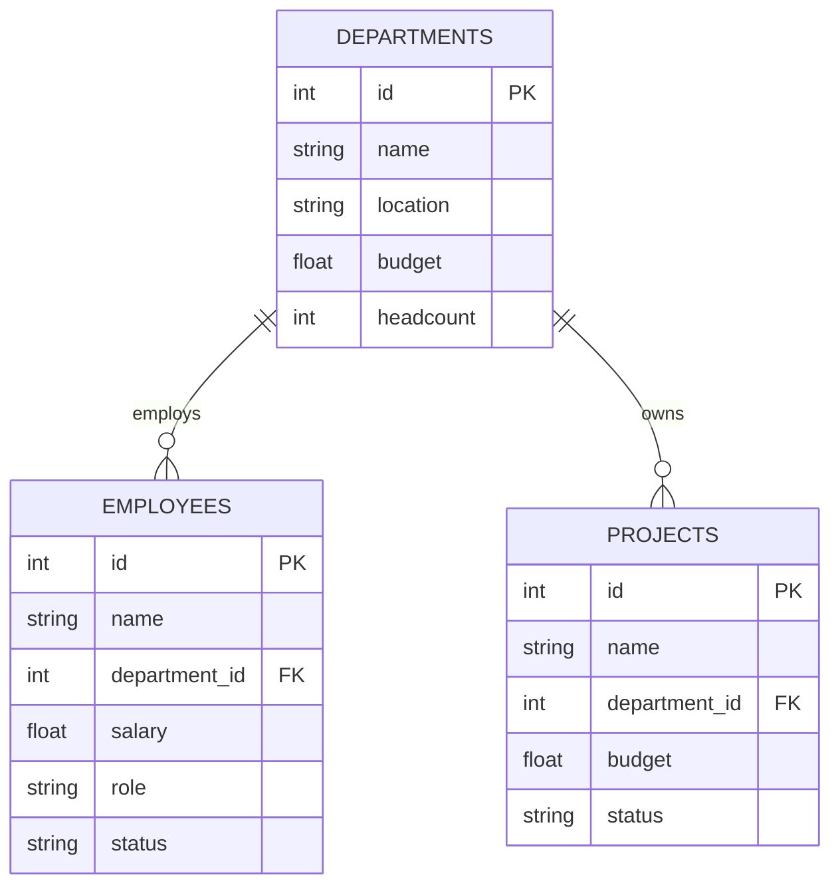

<!-- _class: lead -->

# Module 06: Text-to-SQL Agent
## Guide 01 — Database Setup

Building the environment your agent learns in

<!-- Speaker notes: This is the first of three guides in the capstone module. We start with the database because everything else — the MCP server, the training scenarios, the reward function — depends on what the agent can query. Spend time here making the schema interesting. A trivial database produces a trivial agent. -->

---

## Where We Are



**This guide:** Design the database the agent will learn to query

**Why start here?** The schema determines what the agent must learn. Get this right first.

<!-- Speaker notes: We build bottom-up: database first, then the server that wraps it, then the training loop that drives learning. Each layer depends on the one below it. -->

---

## The Company Database

<div class="columns">

<div>

**Three tables. Real relationships.**

- **Departments** — location, budget, headcount
- **Employees** — name, salary, role, status, hire date
- **Projects** — name, budget, status, dates

**Foreign keys:**
- Employees → Departments
- Projects → Departments

</div>

<div>



</div>

</div>

<!-- Speaker notes: The schema is deliberately simple enough to understand at a glance but complex enough to require JOINs, aggregations, and filters. That's the sweet spot for agent training. -->

---

## Why This Schema Works for Training

**Questions it enables:**

| Difficulty | Example Query |
|-----------|---------------|
| Easy | "What is the Engineering budget?" |
| Medium | "List all active projects in Data Science" |
| Hard | "Which department has the highest average salary for active employees?" |
| Hard | "How many employees work in departments with active projects over $400K?" |

**Each level requires different SQL skills** — the agent must learn all of them

<!-- Speaker notes: The key design principle is that the hardest questions require multi-step reasoning: explore the schema, identify the right tables, construct the JOIN, apply the correct filter. An agent that only learns simple queries will fail on the hard ones. We want it to learn general reasoning, not specific answers. -->

---

## Why Real Data, Not Mocks

<div class="columns">

<div>

**Mock data problems:**
- Regular values → agent learns patterns, not SQL
- Easy to get right by accident
- Doesn't transfer to production

**Example of mock data smell:**
```
salary: 50000, 60000, 70000
```
Any query near the right answer looks right.

</div>

<div>

**Realistic data benefits:**
- Irregular values → wrong queries fail clearly
- RULER judge gets unambiguous ground truth
- Agent learns patterns that transfer

**Realistic data:**
```
salary: 165000, 142000, 118000
         138000, 122000, ...
```
Wrong queries return visibly wrong answers.

</div>

</div>

<!-- Speaker notes: This point matters for your reward function. RULER compares the agent's answer to the correct query result. If your data is trivial — all salaries in even multiples of 10000 — then a query that's slightly wrong might still return a plausible-looking answer, and RULER gives partial credit to a bad query. Realistic data makes the reward signal cleaner. -->

---

## Schema Design Decisions

**Departments headcount ≠ COUNT(employees)**

This is intentional. In production databases, redundant denormalized columns exist. The agent must learn to query the right thing, not assume consistency.

**Employees have `status` (active/on_leave/terminated)**

Forces the agent to filter — "list all employees" and "list all active employees" require different SQL.

**Projects reference Departments, not Employees**

Not every project has a single owner. Forces indirect relationship traversal via JOIN.

<!-- Speaker notes: Each of these decisions was made to create training signal diversity. If the schema had no redundancy, no status filtering, and direct relationships everywhere, the agent would converge quickly to a narrow set of patterns. We want it to learn general SQL reasoning. -->

---

## Creating the Database

```python
import sqlite3
from pathlib import Path

def create_company_database(db_path: str = "company.db") -> sqlite3.Connection:
    path = Path(db_path)
    if path.exists():
        path.unlink()  # Start clean

    conn = sqlite3.connect(db_path)
    conn.row_factory = sqlite3.Row
    cursor = conn.cursor()

    # Critical: SQLite disables foreign keys by default
    cursor.execute("PRAGMA foreign_keys = ON")

    cursor.execute("""
        CREATE TABLE departments (
            id        INTEGER PRIMARY KEY AUTOINCREMENT,
            name      TEXT    NOT NULL UNIQUE,
            location  TEXT    NOT NULL,
            budget    REAL    NOT NULL,
            headcount INTEGER NOT NULL
        )
    """)
    # ... employees and projects tables follow same pattern
```

<!-- Speaker notes: Three things to highlight here: First, we delete the existing database file if it exists — always create clean for repeatable training. Second, we enable foreign key enforcement — SQLite doesn't do this by default and you will get confusing JOIN results without it. Third, Row factory lets us access results by column name instead of index. -->

---

## The Employees Table

```python
cursor.execute("""
    CREATE TABLE employees (
        id            INTEGER PRIMARY KEY AUTOINCREMENT,
        name          TEXT    NOT NULL,
        department_id INTEGER NOT NULL REFERENCES departments(id),
        salary        REAL    NOT NULL,
        role          TEXT    NOT NULL,
        hire_date     TEXT    NOT NULL,
        status        TEXT    NOT NULL DEFAULT 'active'
                      CHECK (status IN ('active', 'on_leave', 'terminated'))
    )
""")
```

**Design notes:**
- `CHECK` constraint enforces the status enum at the database level
- `hire_date` as TEXT in ISO format (`2021-05-14`) sorts correctly as a string
- Role has hierarchy: Engineer → Senior → Principal → Manager → Director

<!-- Speaker notes: The CHECK constraint is important for agent training — if the agent tries to INSERT an invalid status, it gets a constraint error. That error message becomes training signal. The agent learns that 'inactive' is not a valid status; 'terminated' is. -->

---

## Verifying the Database

```python
def verify_database(conn: sqlite3.Connection) -> None:
    cursor = conn.cursor()

    # Row counts
    for table in ("departments", "employees", "projects"):
        cursor.execute(f"SELECT COUNT(*) FROM {table}")
        count = cursor.fetchone()[0]
        print(f"  {table}: {count} rows")

    # Referential integrity check
    cursor.execute("""
        SELECT COUNT(*) FROM employees e
        LEFT JOIN departments d ON e.department_id = d.id
        WHERE d.id IS NULL
    """)
    orphans = cursor.fetchone()[0]
    print(f"  Orphan employees (should be 0): {orphans}")
```

**Always verify before connecting an agent.** A broken database wastes training time.

<!-- Speaker notes: The orphan check uses a LEFT JOIN to find employees whose department_id doesn't match any department. If PRAGMA foreign_keys was off during inserts, you could have orphans and not know it until JOINs silently return empty results during training. The verify step catches this before you start a potentially hours-long training run. -->

---

## Expected Output

```
Creating company database...
Verifying...
  departments: 8 rows
  employees: 36 rows
  projects: 18 rows
  Orphan employees (should be 0): 0

  Top 3 departments by average active employee salary:
    Legal: 2 employees, avg $175,000
    Data Science: 5 employees, avg $157,600
    Engineering: 7 employees, avg $143,286

Database ready at company.db
```

**8 departments. 36 employees. 18 projects.** Enough variety to train on, small enough to inspect manually.

<!-- Speaker notes: These numbers were chosen deliberately. 36 employees across 8 departments means some departments are large (Engineering: 8) and some are small (Legal: 2). That variation creates interesting aggregation queries. 18 projects across 6 departments means some departments have no projects — another edge case the agent must handle. -->

---

## Common Pitfalls

**`PRAGMA foreign_keys = ON` must be set per connection**

SQLite resets it on every new connection. Set it immediately after `sqlite3.connect()` every time.

**AUTOINCREMENT starts at 1, not 0**

When you hard-code department IDs in employee inserts, Engineering = 1, Product = 2, etc.

**Check referential integrity, not just row counts**

Row counts can be correct while foreign keys point to non-existent IDs.

<!-- Speaker notes: I've seen trainees spend an hour debugging why their agent's JOIN queries return nothing, only to discover that department_id 1 in employees points to a department that was deleted and recreated with id 2. Always run the orphan check. -->

---

## Summary

| Decision | Reason |
|----------|--------|
| Three tables with FKs | Forces JOIN reasoning, not single-table lookup |
| Realistic salaries and budgets | Wrong queries produce clearly wrong answers |
| Status column on employees | Forces filter reasoning |
| Projects → Departments (not Employees) | Indirect relationships require multi-step JOIN |
| Verify before training | Catch schema problems before wasting training time |

<!-- Speaker notes: The summary table is worth revisiting after you've trained your agent. You'll see these design decisions directly reflected in what the agent learns — it gets good at exactly the kinds of queries the schema makes interesting. -->

---

## Next: Guide 02

**Building the MCP Server**

The database exists. Now we wrap it in three tools that the agent can call:
- `list_tables()` — discover what exists
- `describe_table(table_name)` — examine a schema
- `run_query(sql)` — execute and get results

The agent never sees the database file directly. It learns exclusively through these tools.

<!-- Speaker notes: This is the key insight for the rest of the module: the agent doesn't have direct database access. It must use tools, just like a human database analyst would. The MCP server creates that constraint, which is what makes the task interesting and the trained behavior genuinely useful. -->
