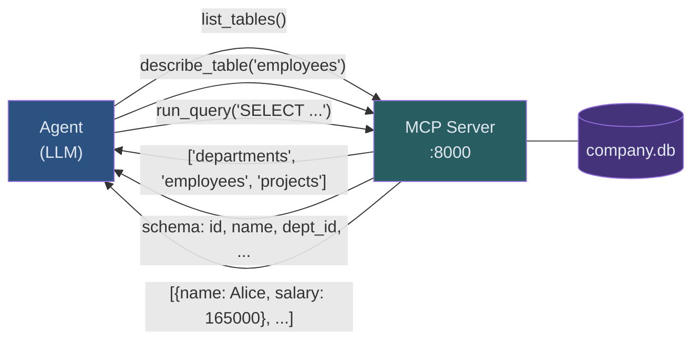

# Guide 02: MCP Server Build — Exposing the Database as Agent Tools

## Learning Objectives

By the end of this guide you will be able to:

1. Implement a FastMCP server with three database tools: `list_tables`, `describe_table`, `run_query`
2. Run the server as a background process accessible on a local port
3. Connect the ART client to the running server and confirm tool discovery
4. Explain why the three-tool interface teaches better agent behavior than direct database access

---

## The Architecture

The agent never touches the database file directly. Everything flows through the MCP server:



This constraint is what makes training valuable. The agent must:

1. Call `list_tables` to discover what tables exist
2. Call `describe_table` for each table it needs to understand
3. Formulate SQL based on the schema it discovered
4. Call `run_query` with that SQL and return the result

An agent trained this way learns the same workflow a human database analyst uses. That behavior transfers to any database it encounters in production.

---

## Why Three Specific Tools

**`list_tables()`** — zero arguments, returns all table names. This is always the first call. It trains the behavior: "before writing SQL, discover what exists." An agent that skips this step fails on unfamiliar databases.

**`describe_table(table_name)`** — one argument, returns the full schema for that table (columns, types, constraints). This trains the behavior: "before writing a JOIN, understand the foreign key structure." An agent that guesses column names fails.

**`run_query(sql)`** — one argument, executes a SELECT query and returns results as JSON. This is the only tool that actually retrieves data. Making query execution a separate tool from schema inspection forces the agent to plan before executing — a habit that reduces wasted retries.

Notice what is absent: no `run_update`, no `insert_row`, no `delete_record`. The agent is read-only. This is intentional. A text-to-SQL agent's job is to answer questions, not to modify data.

---

## Complete MCP Server Implementation

```python
"""
company_db_server.py

FastMCP server exposing the company database via three tools.
Run this as a background process before starting agent training.

Usage:
    python company_db_server.py
    # Server starts on http://localhost:8000
"""

import json
import sqlite3
from typing import Any

from fastmcp import FastMCP


# ------------------------------------------------------------------
# Server initialization
# ------------------------------------------------------------------

mcp = FastMCP(
    name="company-database",
    description=(
        "Tools for querying the company database. "
        "Always call list_tables first to discover available tables, "
        "then describe_table to understand the schema before writing SQL."
    ),
)

# Database path — must match where create_company_database() wrote the file
DB_PATH = "company.db"


def get_connection() -> sqlite3.Connection:
    """
    Open a fresh connection to the database.

    We open a new connection per tool call rather than sharing one connection
    across calls. This avoids SQLite threading issues when the MCP server
    handles concurrent requests from multiple rollout workers.
    """
    conn = sqlite3.connect(DB_PATH)
    conn.row_factory = sqlite3.Row
    conn.execute("PRAGMA foreign_keys = ON")
    return conn


# ------------------------------------------------------------------
# Tool 1: list_tables
# ------------------------------------------------------------------

@mcp.tool()
def list_tables() -> list[str]:
    """
    Return the names of all tables in the company database.

    Always call this first before writing any SQL query.
    Use the returned table names as input to describe_table.
    """
    conn = get_connection()
    try:
        cursor = conn.cursor()
        cursor.execute(
            "SELECT name FROM sqlite_master WHERE type='table' ORDER BY name"
        )
        return [row["name"] for row in cursor.fetchall()]
    finally:
        conn.close()


# ------------------------------------------------------------------
# Tool 2: describe_table
# ------------------------------------------------------------------

@mcp.tool()
def describe_table(table_name: str) -> dict[str, Any]:
    """
    Return the full schema for a table: column names, types, nullability,
    default values, and whether each column is a primary key.

    Also returns foreign key relationships to other tables.

    Args:
        table_name: Exact table name from list_tables(). Case-sensitive.

    Returns:
        Dictionary with 'columns' and 'foreign_keys' keys.
    """
    conn = get_connection()
    try:
        cursor = conn.cursor()

        # Validate the table exists before querying schema
        cursor.execute(
            "SELECT name FROM sqlite_master WHERE type='table' AND name=?",
            (table_name,)
        )
        if cursor.fetchone() is None:
            return {
                "error": f"Table '{table_name}' does not exist. "
                         f"Call list_tables() to see available tables."
            }

        # PRAGMA table_info returns one row per column with:
        # cid, name, type, notnull, dflt_value, pk
        cursor.execute(f"PRAGMA table_info({table_name})")
        column_rows = cursor.fetchall()

        columns = [
            {
                "name": row["name"],
                "type": row["type"],
                "nullable": not bool(row["notnull"]),
                "default": row["dflt_value"],
                "primary_key": bool(row["pk"]),
            }
            for row in column_rows
        ]

        # PRAGMA foreign_key_list returns foreign key constraints:
        # id, seq, table, from, to, on_update, on_delete, match
        cursor.execute(f"PRAGMA foreign_key_list({table_name})")
        fk_rows = cursor.fetchall()

        foreign_keys = [
            {
                "column": row["from"],
                "references_table": row["table"],
                "references_column": row["to"],
            }
            for row in fk_rows
        ]

        return {
            "table": table_name,
            "columns": columns,
            "foreign_keys": foreign_keys,
        }
    finally:
        conn.close()


# ------------------------------------------------------------------
# Tool 3: run_query
# ------------------------------------------------------------------

@mcp.tool()
def run_query(sql: str) -> dict[str, Any]:
    """
    Execute a SELECT query against the company database and return results.

    Only SELECT statements are permitted. INSERT, UPDATE, DELETE, DROP,
    and other write operations are rejected.

    Args:
        sql: A valid SQLite SELECT statement. Use column names exactly
             as returned by describe_table(). Limit results with
             LIMIT clause for large tables.

    Returns:
        Dictionary with 'rows' (list of result dicts) and 'row_count'.
        On error, returns 'error' key with the SQLite error message.
    """
    # Security: reject non-SELECT statements before execution
    normalized = sql.strip().upper()
    if not normalized.startswith("SELECT"):
        return {
            "error": (
                "Only SELECT statements are permitted. "
                f"Your query starts with: {sql.strip()[:50]}"
            )
        }

    conn = get_connection()
    try:
        cursor = conn.cursor()
        cursor.execute(sql)
        rows = cursor.fetchall()

        # Convert Row objects to plain dicts for JSON serialization
        result_rows = [dict(row) for row in rows]

        return {
            "rows": result_rows,
            "row_count": len(result_rows),
        }

    except sqlite3.OperationalError as exc:
        # Return the SQL error as structured data, not as an exception.
        # The agent reads this error message and can correct its SQL.
        return {
            "error": str(exc),
            "sql_attempted": sql,
        }

    finally:
        conn.close()


# ------------------------------------------------------------------
# Server entry point
# ------------------------------------------------------------------

if __name__ == "__main__":
    print(f"Starting company database MCP server...")
    print(f"Database: {DB_PATH}")
    print(f"Tools: list_tables, describe_table, run_query")
    print(f"Listening on http://localhost:8000")
    print()
    mcp.run(transport="streamable-http", host="localhost", port=8000)
```

---

## Running the Server

The MCP server must be running before you start agent training. It runs as a persistent process in a separate terminal:

```bash
# Terminal 1: start the server (keep this running)
python company_db_server.py

# Terminal 2: start training
python train_sql_agent.py
```

The server does not terminate after each request. It waits for tool calls from the agent during rollouts and handles them one at a time per connection.

---

## Connecting ART and Discovering Tools

After the server is running, verify the ART client can discover all three tools before starting training:

```python
import art
import asyncio


async def verify_mcp_connection() -> None:
    """
    Connect to the running MCP server and confirm all three tools
    are discoverable. Run this before starting the training loop.
    """
    # ART uses the MCP client protocol to connect to the server
    client = art.MCPClient("http://localhost:8000")

    async with client:
        tools = await client.list_tools()

    tool_names = [t.name for t in tools]
    print(f"Discovered {len(tools)} tools: {tool_names}")

    required = {"list_tables", "describe_table", "run_query"}
    missing = required - set(tool_names)

    if missing:
        raise RuntimeError(
            f"Missing required tools: {missing}. "
            f"Is company_db_server.py running on port 8000?"
        )

    print("MCP connection verified. All tools available.")

    # Print tool descriptions so you can confirm they look correct
    for tool in tools:
        print(f"\n  Tool: {tool.name}")
        # First line of the docstring becomes the description
        first_line = tool.description.split("\n")[0].strip()
        print(f"  Description: {first_line}")


asyncio.run(verify_mcp_connection())
```

Expected output:

```
Discovered 3 tools: ['describe_table', 'list_tables', 'run_query']
MCP connection verified. All tools available.

  Tool: describe_table
  Description: Return the full schema for a table: column names, types, nullability,

  Tool: list_tables
  Description: Return the names of all tables in the company database.

  Tool: run_query
  Description: Execute a SELECT query against the company database and return results.
```

---

## How Errors Become Training Signal

Notice that `run_query` returns errors as structured data rather than raising exceptions:

```python
# What the agent sees when it writes bad SQL:
{
    "error": "no such column: employes.salary",
    "sql_attempted": "SELECT employes.salary FROM employes"
}
```

This is deliberate. The agent reads the error message and can correct its SQL in the next tool call. Over training, the agent learns:

- "no such column" → it used a wrong column name, call `describe_table` again
- "no such table" → it guessed a table name, call `list_tables` first
- "syntax error near" → the SQL has a typo, rewrite the query

Without structured error returns, the agent would get an exception and the trajectory would terminate with no useful signal. With structured errors, the agent can recover — and learning to recover from SQL errors is one of the most valuable things training teaches.

---

## Common Pitfalls

**Server not running when training starts.** ART's client will time out immediately. Always start the server first, confirm it prints its startup message, then start training.

**Wrong DB_PATH.** The `company.db` path in `company_db_server.py` must be relative to the directory where you run the script, or use an absolute path. If the database file is missing, every `run_query` call returns "no such table" errors and training stalls.

**Port conflict.** If port 8000 is in use, change it in both `mcp.run(port=8000)` and in the ART client URL. Use `lsof -i :8000` to check what is already using the port.

**SQLite threading.** Do not share a single `sqlite3.Connection` object across tool calls. Open and close a fresh connection per call as shown in `get_connection()`. SQLite connections are not thread-safe for concurrent writes; this pattern avoids the issue entirely.

---

## Connections

- **Builds on:** Guide 01 (database setup) — the database must exist before the server can start
- **Builds on:** Module 04 (MCP integration) — same FastMCP patterns, new database tools
- **Leads to:** Guide 03 — Training the Agent (the MCP server is the environment the agent explores)

## Next

Guide 03 — Training the Agent: generating scenarios from tool schemas, configuring the RULER judge, implementing the rollout function, and running the GRPO training loop.
