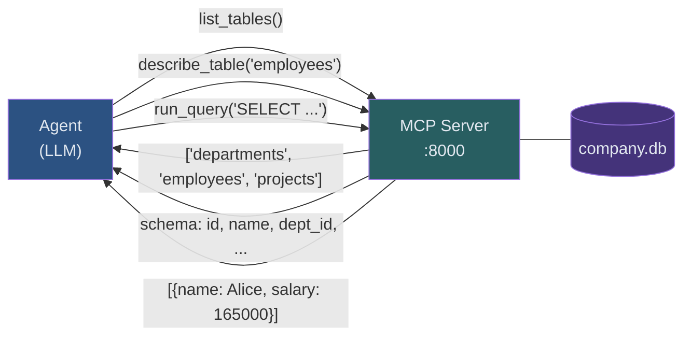

<!-- _class: lead -->

# Module 06: Text-to-SQL Agent
## Guide 02 — Building the MCP Server

Three tools. One database. Complete isolation.

<!-- Speaker notes: The MCP server is the boundary between the agent and the database. This guide builds that boundary. By the end, the agent has no direct database access — everything goes through list_tables, describe_table, and run_query. That constraint is what makes the task interesting and the trained behavior genuinely transferable. -->

---

## The Full Architecture



**The agent never reads the database file. It learns exclusively through tool calls.**

<!-- Speaker notes: This architecture is identical to what a real agentic system uses in production. The database is behind an API. The agent must discover the schema through that API. The behavior learned here — explore first, query second — transfers directly to any database the agent encounters. -->

---

## Why Three Tools, Not One

<div class="columns">

<div>

**One tool: `run_sql(sql)`**

- Agent guesses table names
- Agent guesses column names
- No schema exploration step
- Fails on any new database

</div>

<div>

**Three tools: list + describe + query**

- Forces schema exploration before querying
- Agent learns the correct workflow
- Works on any database structure
- Mirrors how humans use databases

</div>

</div>

**The constraint teaches the behavior.** An agent that must call `list_tables` before writing SQL learns to always check the schema first. That habit transfers to production.

<!-- Speaker notes: This is the core pedagogical design decision of the module. You could make the task easier by giving the agent direct schema access. But then it wouldn't learn to explore. The three-tool structure forces the exploration behavior you actually want in production. -->

---

## Tool 1: `list_tables()`

```python
@mcp.tool()
def list_tables() -> list[str]:
    """
    Return the names of all tables in the company database.

    Always call this first before writing any SQL query.
    Use the returned table names as input to describe_table.
    """
    conn = get_connection()
    try:
        cursor = conn.cursor()
        cursor.execute(
            "SELECT name FROM sqlite_master WHERE type='table' ORDER BY name"
        )
        return [row["name"] for row in cursor.fetchall()]
    finally:
        conn.close()
```

**Returns:** `["departments", "employees", "projects"]`

**Design:** Zero arguments. The docstring tells the agent when and why to call it.

<!-- Speaker notes: The docstring is not just documentation for humans — it's part of the tool schema that ART exposes to the agent. The LLM reads this docstring when deciding which tool to call and with what arguments. Write it as instructions to the agent, not just as documentation for developers. -->

---

## Tool 2: `describe_table(table_name)`

```python
@mcp.tool()
def describe_table(table_name: str) -> dict[str, Any]:
    """
    Return the full schema for a table: column names, types, nullability,
    default values, and whether each column is a primary key.
    Also returns foreign key relationships to other tables.
    """
    conn = get_connection()
    try:
        # Validate first — return structured error if table doesn't exist
        cursor.execute(
            "SELECT name FROM sqlite_master WHERE type='table' AND name=?",
            (table_name,)
        )
        if cursor.fetchone() is None:
            return {"error": f"Table '{table_name}' does not exist."}

        cursor.execute(f"PRAGMA table_info({table_name})")
        # ... parse columns and foreign keys
```

**SQLite PRAGMA commands** return schema metadata without touching data

<!-- Speaker notes: PRAGMA table_info is SQLite's way of getting column metadata. It returns one row per column with the column name, type, whether it's nullable, its default value, and whether it's a primary key. PRAGMA foreign_key_list returns the foreign key relationships. Together they give the agent everything it needs to write correct JOINs. -->

---

## `describe_table` Output

```python
{
    "table": "employees",
    "columns": [
        {"name": "id",            "type": "INTEGER", "nullable": False,
         "default": None,         "primary_key": True},
        {"name": "name",          "type": "TEXT",    "nullable": False,
         "default": None,         "primary_key": False},
        {"name": "department_id", "type": "INTEGER", "nullable": False,
         "default": None,         "primary_key": False},
        {"name": "salary",        "type": "REAL",    "nullable": False,
         "default": None,         "primary_key": False},
        {"name": "status",        "type": "TEXT",    "nullable": False,
         "default": "'active'",   "primary_key": False},
    ],
    "foreign_keys": [
        {"column": "department_id",
         "references_table": "departments",
         "references_column": "id"}
    ]
}
```

<!-- Speaker notes: This output is what the agent reads before writing a JOIN query. It can see that department_id is a foreign key to departments.id — exactly what it needs to write: JOIN departments d ON e.department_id = d.id. The structured format makes this unambiguous. -->

---

## Tool 3: `run_query(sql)`

```python
@mcp.tool()
def run_query(sql: str) -> dict[str, Any]:
    """
    Execute a SELECT query against the company database and return results.
    Only SELECT statements are permitted.
    """
    # Security: reject non-SELECT statements
    if not sql.strip().upper().startswith("SELECT"):
        return {"error": "Only SELECT statements are permitted."}

    try:
        cursor.execute(sql)
        rows = cursor.fetchall()
        return {
            "rows": [dict(row) for row in rows],
            "row_count": len(rows),
        }
    except sqlite3.OperationalError as exc:
        return {
            "error": str(exc),
            "sql_attempted": sql,
        }
```

<!-- Speaker notes: Two design decisions here. First: we check for SELECT before executing — the agent should not be able to modify the database. Second: we catch OperationalError and return it as structured data rather than letting it propagate as an exception. The agent can read the error message and correct its SQL. Without this, bad SQL would terminate the trajectory with no recovery. -->

---

## Errors as Training Signal

<div class="columns">

<div>

**Without structured errors:**
```
Agent writes bad SQL
→ Exception raised
→ Trajectory terminates
→ Agent gets 0 reward
→ No information about what went wrong
```

Training stalls. Agent never learns to recover.

</div>

<div>

**With structured errors:**
```python
{
    "error": "no such column: employes.salary",
    "sql_attempted": "SELECT employes.salary ..."
}
```
Agent reads the message, corrects the typo, retries. RULER rewards the corrected answer.

</div>

</div>

**The ability to recover from SQL errors is a skill the agent learns. Structured errors make learning possible.**

<!-- Speaker notes: This is one of the subtler design decisions in the module. The agent starts with no knowledge of the schema. It will write bad SQL. The question is: what happens next? If bad SQL crashes the trajectory, the agent never gets feedback on how to fix it. If bad SQL returns a helpful error message, the agent can recover — and over thousands of training episodes, it learns to write better SQL in the first place. -->

---

## Connection Per Tool Call

```python
def get_connection() -> sqlite3.Connection:
    """
    Open a fresh connection per tool call.

    Why not share one connection?
    - SQLite connections are not thread-safe for concurrent access
    - Training uses multiple parallel rollout workers
    - Sharing one connection across workers causes database lock errors
    """
    conn = sqlite3.connect(DB_PATH)
    conn.row_factory = sqlite3.Row
    conn.execute("PRAGMA foreign_keys = ON")
    return conn
```

**One connection per call. Open, use, close.** Not the most efficient pattern, but correct under concurrent load.

<!-- Speaker notes: SQLite's threading model is complex. In the default mode, a connection can only be used in the thread that created it. When ART runs multiple rollout workers in parallel, each worker is in a different thread. Opening a fresh connection per call sidesteps the entire threading problem. For a training database that handles a few dozen concurrent tool calls, the overhead is negligible. -->

---

## Running the Server

```bash
# Terminal 1: start the MCP server (keep this running)
python company_db_server.py
```

```
Starting company database MCP server...
Database: company.db
Tools: list_tables, describe_table, run_query
Listening on http://localhost:8000
```

**The server stays running for the entire training session.** It handles hundreds of tool calls per training step.

<!-- Speaker notes: The server process must stay running for the entire training session. If it crashes or is killed, every tool call from the agent will fail and training will stop. In production you'd run this with a process manager like systemd or supervisord. For training, a dedicated terminal works fine. -->

---

## Verifying the Connection

```python
async def verify_mcp_connection() -> None:
    client = art.MCPClient("http://localhost:8000")

    async with client:
        tools = await client.list_tools()

    tool_names = [t.name for t in tools]
    required = {"list_tables", "describe_table", "run_query"}
    missing = required - set(tool_names)

    if missing:
        raise RuntimeError(f"Missing tools: {missing}")

    print(f"All {len(tools)} tools available: {tool_names}")
```

**Run this verification before starting training.** Catch connection problems before wasting training time.

<!-- Speaker notes: This is the equivalent of the database verify step from Guide 01 — we check that everything is working before starting a long-running process. The five seconds this takes can save hours of debugging a failed training run. -->

---

## Common Pitfalls

**Server not running when training starts**
ART client times out immediately. Start server first, confirm startup message, then start training.

**Wrong DB_PATH**
Use an absolute path or make sure the relative path resolves from the script's working directory.

**Port already in use**
Check with `lsof -i :8000`. Change port in both `mcp.run(port=8000)` and the client URL.

**Shared connection across tool calls**
SQLite threading errors appear as intermittent "database is locked" messages. Fix: open a new connection per call.

<!-- Speaker notes: The port conflict is easy to miss. Many development tools use port 8000 by default — Jupyter, Django dev server, Python's http.server module. If you're getting connection refused errors immediately, check what else is on 8000 before debugging your server code. -->

---

## Summary

| Tool | Args | Returns | Purpose |
|------|------|---------|---------|
| `list_tables()` | none | `["dept", "emp", "proj"]` | Discover what exists |
| `describe_table(name)` | table name | columns + foreign keys | Understand the schema |
| `run_query(sql)` | SELECT statement | rows + count (or error) | Execute and retrieve |

**Three tools enforce the correct workflow:** explore schema before querying.

Errors return as structured data so the agent can recover, not crash.

<!-- Speaker notes: The three-tool structure, the structured error returns, and the connection-per-call pattern are the three architectural decisions that make this server trainable. Each one was made to improve training signal quality, not just correctness. -->

---

## Next: Guide 03

**Training the Agent**

The database exists. The server is running. Now we:
1. Auto-generate training scenarios from the tool schemas
2. Configure the RULER judge (o4-mini) to score answers
3. Implement the rollout function: question → tool calls → answer
4. Run the GRPO training loop
5. Compare before-training vs after-training behavior

<!-- Speaker notes: Guide 03 is the longest and most complex of the three. Everything from Guides 01 and 02 was setup for this payoff. The training loop is where GRPO, RULER, ART, and MCP all come together into a working system. -->
