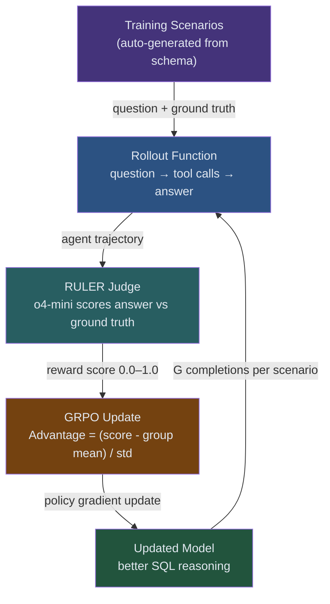

# Guide 03: Training the Agent — GRPO on a Real Database

## Learning Objectives

By the end of this guide you will be able to:

1. Auto-generate training scenarios of varying difficulty directly from tool schemas
2. Configure a RULER judge (o4-mini) to score agent answers against ground truth
3. Implement a rollout function that runs one complete question → tool calls → answer episode
4. Run a GRPO training loop using ART and read its logs to diagnose convergence
5. Describe the behavioral changes that emerge after training: schema exploration, correct JOINs, error recovery

---

## The Training Pipeline

All previous components come together here:



The loop runs for as many steps as you configure. Each step: sample G completions per scenario, score each with RULER, compute relative advantages, update the policy.

---

## Step 1: Auto-Generating Training Scenarios

Training scenarios are question-answer pairs. The question is what you ask the agent. The ground truth answer is what a correct SQL query returns.

The key insight: you can generate these automatically from the database itself. You do not need human annotators.

```python
"""
generate_scenarios.py

Auto-generate training scenarios by querying the database with
known-correct SQL and storing the results as ground truth.

This approach scales: add more SQL queries, get more scenarios.
The agent never sees the ground truth queries — only the questions.
"""

import json
import sqlite3
from dataclasses import dataclass, field
from typing import Any


@dataclass
class Scenario:
    """One training scenario: a question paired with a ground-truth answer."""
    question: str                    # Natural language question for the agent
    ground_truth_sql: str            # SQL query that produces the correct answer
    ground_truth_answer: str         # Human-readable result (what RULER compares to)
    difficulty: str                  # "easy", "medium", "hard"
    skills_required: list[str]       # Tags for analysis (not used in training)


def generate_all_scenarios(db_path: str = "company.db") -> list[Scenario]:
    """
    Generate the complete set of training scenarios from the database.

    Each scenario is a (question, ground_truth_sql, ground_truth_answer) triple.
    The agent sees only the question. RULER uses the ground truth to score.
    """
    conn = sqlite3.connect(db_path)
    conn.row_factory = sqlite3.Row

    scenarios: list[Scenario] = []

    # ------------------------------------------------------------------
    # EASY: Single-table lookups, no JOIN required
    # ------------------------------------------------------------------

    easy_queries = [
        (
            "What is the budget for the Engineering department?",
            "SELECT budget FROM departments WHERE name = 'Engineering'",
        ),
        (
            "Which city is the Finance department located in?",
            "SELECT location FROM departments WHERE name = 'Finance'",
        ),
        (
            "How many departments are there in total?",
            "SELECT COUNT(*) AS department_count FROM departments",
        ),
        (
            "List all department names and their locations.",
            "SELECT name, location FROM departments ORDER BY name",
        ),
        (
            "What is Alice Chen's salary?",
            "SELECT salary FROM employees WHERE name = 'Alice Chen'",
        ),
        (
            "How many employees are currently on leave?",
            "SELECT COUNT(*) AS on_leave_count FROM employees WHERE status = 'on_leave'",
        ),
        (
            "List all active projects and their budgets.",
            "SELECT name, budget FROM projects WHERE status = 'active' ORDER BY budget DESC",
        ),
        (
            "How many projects have a 'planning' status?",
            "SELECT COUNT(*) AS planning_count FROM projects WHERE status = 'planning'",
        ),
    ]

    for question, sql in easy_queries:
        answer = _execute_to_string(conn, sql)
        scenarios.append(Scenario(
            question=question,
            ground_truth_sql=sql,
            ground_truth_answer=answer,
            difficulty="easy",
            skills_required=["single_table", "filter"],
        ))

    # ------------------------------------------------------------------
    # MEDIUM: Two-table JOINs, basic aggregations
    # ------------------------------------------------------------------

    medium_queries = [
        (
            "List the names and salaries of all employees in the Data Science department.",
            """
            SELECT e.name, e.salary
            FROM employees e
            JOIN departments d ON e.department_id = d.id
            WHERE d.name = 'Data Science' AND e.status = 'active'
            ORDER BY e.salary DESC
            """,
            ["join", "filter"],
        ),
        (
            "Which department has the most active employees?",
            """
            SELECT d.name, COUNT(e.id) AS employee_count
            FROM departments d
            JOIN employees e ON d.id = e.department_id
            WHERE e.status = 'active'
            GROUP BY d.name
            ORDER BY employee_count DESC
            LIMIT 1
            """,
            ["join", "group_by", "aggregate"],
        ),
        (
            "What is the average salary of active employees in each department?",
            """
            SELECT d.name, ROUND(AVG(e.salary), 2) AS avg_salary
            FROM departments d
            JOIN employees e ON d.id = e.department_id
            WHERE e.status = 'active'
            GROUP BY d.name
            ORDER BY avg_salary DESC
            """,
            ["join", "group_by", "aggregate"],
        ),
        (
            "List all projects owned by the Engineering department.",
            """
            SELECT p.name, p.budget, p.status
            FROM projects p
            JOIN departments d ON p.department_id = d.id
            WHERE d.name = 'Engineering'
            ORDER BY p.budget DESC
            """,
            ["join", "filter"],
        ),
        (
            "What is the total project budget allocated to the Data Science department?",
            """
            SELECT SUM(p.budget) AS total_project_budget
            FROM projects p
            JOIN departments d ON p.department_id = d.id
            WHERE d.name = 'Data Science'
            """,
            ["join", "aggregate"],
        ),
        (
            "Who are the highest-paid employees in San Francisco departments?",
            """
            SELECT e.name, e.salary, d.name AS department
            FROM employees e
            JOIN departments d ON e.department_id = d.id
            WHERE d.location = 'San Francisco' AND e.status = 'active'
            ORDER BY e.salary DESC
            LIMIT 5
            """,
            ["join", "filter", "order"],
        ),
    ]

    for question, sql, skills in medium_queries:
        answer = _execute_to_string(conn, sql.strip())
        scenarios.append(Scenario(
            question=question,
            ground_truth_sql=sql.strip(),
            ground_truth_answer=answer,
            difficulty="medium",
            skills_required=skills,
        ))

    # ------------------------------------------------------------------
    # HARD: Multi-table reasoning, subqueries, complex aggregations
    # ------------------------------------------------------------------

    hard_queries = [
        (
            "Which department has the highest total compensation (sum of all active "
            "employee salaries)?",
            """
            SELECT d.name, SUM(e.salary) AS total_compensation
            FROM departments d
            JOIN employees e ON d.id = e.department_id
            WHERE e.status = 'active'
            GROUP BY d.name
            ORDER BY total_compensation DESC
            LIMIT 1
            """,
            ["join", "group_by", "aggregate", "subquery_reasoning"],
        ),
        (
            "List departments where the total active project budget exceeds the "
            "department's own budget.",
            """
            SELECT d.name,
                   d.budget AS dept_budget,
                   SUM(p.budget) AS total_project_budget
            FROM departments d
            JOIN projects p ON d.id = p.department_id
            WHERE p.status IN ('active', 'planning')
            GROUP BY d.name, d.budget
            HAVING SUM(p.budget) > d.budget
            ORDER BY total_project_budget DESC
            """,
            ["join", "group_by", "having", "multi_condition"],
        ),
        (
            "How many employees work in departments that currently have at least "
            "one active project?",
            """
            SELECT COUNT(DISTINCT e.id) AS employee_count
            FROM employees e
            JOIN departments d ON e.department_id = d.id
            WHERE e.status = 'active'
              AND d.id IN (
                  SELECT DISTINCT department_id
                  FROM projects
                  WHERE status = 'active'
              )
            """,
            ["join", "subquery", "distinct", "multi_condition"],
        ),
        (
            "For each department in San Francisco, show the number of active employees "
            "and the number of active projects.",
            """
            SELECT d.name,
                   COUNT(DISTINCT CASE WHEN e.status = 'active' THEN e.id END) AS active_employees,
                   COUNT(DISTINCT CASE WHEN p.status = 'active' THEN p.id END) AS active_projects
            FROM departments d
            LEFT JOIN employees e ON d.id = e.department_id
            LEFT JOIN projects p ON d.id = p.department_id
            WHERE d.location = 'San Francisco'
            GROUP BY d.name
            ORDER BY d.name
            """,
            ["join", "left_join", "conditional_aggregate", "group_by"],
        ),
        (
            "Which employees earn more than the average salary of their own department?",
            """
            SELECT e.name, e.salary, e.role, d.name AS department
            FROM employees e
            JOIN departments d ON e.department_id = d.id
            WHERE e.status = 'active'
              AND e.salary > (
                  SELECT AVG(e2.salary)
                  FROM employees e2
                  WHERE e2.department_id = e.department_id
                    AND e2.status = 'active'
              )
            ORDER BY d.name, e.salary DESC
            """,
            ["correlated_subquery", "join", "filter"],
        ),
    ]

    for question, sql, skills in hard_queries:
        answer = _execute_to_string(conn, sql.strip())
        scenarios.append(Scenario(
            question=question,
            ground_truth_sql=sql.strip(),
            ground_truth_answer=answer,
            difficulty="hard",
            skills_required=skills,
        ))

    conn.close()
    return scenarios


def _execute_to_string(conn: sqlite3.Connection, sql: str) -> str:
    """
    Execute a SQL query and return results as a human-readable string.
    This is what RULER compares the agent's answer against.
    """
    cursor = conn.cursor()
    cursor.execute(sql)
    rows = cursor.fetchall()

    if not rows:
        return "No results found."

    # Build a readable table format
    col_names = [description[0] for description in cursor.description]
    lines = [", ".join(col_names)]  # Header

    for row in rows:
        values = [str(v) if v is not None else "NULL" for v in row]
        lines.append(", ".join(values))

    return "\n".join(lines)


if __name__ == "__main__":
    scenarios = generate_all_scenarios()

    counts = {}
    for s in scenarios:
        counts[s.difficulty] = counts.get(s.difficulty, 0) + 1

    print(f"Generated {len(scenarios)} training scenarios:")
    for difficulty, count in sorted(counts.items()):
        print(f"  {difficulty}: {count}")
```

---

## Step 2: Setting Up the RULER Judge

RULER (from Module 03) uses an LLM (o4-mini) to compare the agent's answer to the ground truth. It returns a score between 0.0 and 1.0.

```python
"""
Configure the RULER judge for the text-to-SQL task.

RULER's prompt tells the judge:
- What a correct answer looks like
- How to handle partial credit (right table, wrong filter)
- That the exact SQL does not matter — only the answer content
"""

import art

RULER_SYSTEM_PROMPT = """You are evaluating a text-to-SQL agent's answer.

The agent was given a question about a company database and used SQL tools to find the answer.
Compare the agent's answer to the ground truth answer.

Scoring guidelines:
- 1.0: Agent's answer is factually correct and contains all required information
- 0.7: Agent's answer is mostly correct with minor omissions (e.g., right values, wrong ordering)
- 0.4: Agent's answer is partially correct (e.g., correct table but wrong filter applied)
- 0.1: Agent attempted to answer but the result is clearly wrong
- 0.0: Agent refused to answer, returned only an error, or made no tool calls

The agent's exact SQL query does not matter — only whether the final answer is correct.
Award full credit if the agent produces the right answer through any valid SQL approach."""


def create_ruler_judge() -> art.RulerJudge:
    """
    Create a RULER judge configured for text-to-SQL scoring.

    Uses o4-mini for cost efficiency — scoring millions of trajectories
    with o3 would be prohibitively expensive.
    """
    return art.RulerJudge(
        model="o4-mini",
        system_prompt=RULER_SYSTEM_PROMPT,
        score_range=(0.0, 1.0),
    )
```

---

## Step 3: The Rollout Function

The rollout function runs one complete episode: the agent receives a question, calls tools in a loop until it has an answer, and returns that answer. RULER then scores it.

```python
"""
rollout.py

The rollout function connects everything:
- MCP client: provides tool access
- ART agent: the LLM being trained
- RULER judge: scores the answer

One call to rollout() = one training episode.
"""

import asyncio
import json
from typing import Any

import art

from generate_scenarios import Scenario


AGENT_SYSTEM_PROMPT = """You are a text-to-SQL agent with access to a company database.

To answer questions about the database, use the provided tools in this order:
1. Call list_tables() to discover what tables are available
2. Call describe_table(table_name) for each table you need to understand
3. Write a SQL SELECT query based on the schema you discovered
4. Call run_query(sql) to execute your query and get the answer

Return a clear, direct answer based on the query results.
If a query fails with an error, read the error message and correct your SQL.

Important:
- Always explore the schema before writing SQL — never guess column names
- Use the exact column names returned by describe_table()
- Write SELECT queries only — no INSERT, UPDATE, or DELETE"""


async def rollout(
    scenario: Scenario,
    agent: art.Agent,
    mcp_client: art.MCPClient,
    judge: art.RulerJudge,
    max_tool_calls: int = 10,
) -> art.Trajectory:
    """
    Run one complete training episode for a scenario.

    The agent:
    1. Receives the question
    2. Calls MCP tools in a loop (up to max_tool_calls)
    3. Returns a final answer when it has enough information

    RULER scores the answer against ground truth.
    ART packages everything into a Trajectory for GRPO.

    Args:
        scenario: The question and ground truth for this episode
        agent: The ART agent wrapping the LLM
        mcp_client: Connected MCP client for tool execution
        judge: RULER judge for scoring
        max_tool_calls: Safety limit to prevent infinite tool loops

    Returns:
        A Trajectory containing the full interaction and its reward score
    """
    # Build the initial conversation with the question
    messages = [
        {
            "role": "system",
            "content": AGENT_SYSTEM_PROMPT,
        },
        {
            "role": "user",
            "content": scenario.question,
        },
    ]

    tool_call_count = 0
    final_answer = None

    # Agentic loop: the agent calls tools until it returns a final answer
    # or exhausts the tool call limit
    while tool_call_count < max_tool_calls:
        # Ask the agent what to do next given the current conversation
        response = await agent.generate(messages=messages)

        # Check if the agent is calling a tool or returning a final answer
        if response.tool_calls:
            # Execute each tool call and add results to the conversation
            for tool_call in response.tool_calls:
                tool_result = await mcp_client.call_tool(
                    name=tool_call.function.name,
                    arguments=json.loads(tool_call.function.arguments),
                )

                # Add the tool result to the conversation so the agent
                # can reason about it in the next step
                messages.append({
                    "role": "assistant",
                    "content": None,
                    "tool_calls": [tool_call],
                })
                messages.append({
                    "role": "tool",
                    "tool_call_id": tool_call.id,
                    "content": json.dumps(tool_result),
                })

                tool_call_count += 1

        else:
            # No tool calls — agent is returning its final answer
            final_answer = response.content
            break

    # Handle the case where the agent ran out of tool calls without answering
    if final_answer is None:
        final_answer = (
            "Unable to answer: exceeded maximum tool calls without producing a result."
        )

    # Score the answer using RULER
    score = await judge.score(
        question=scenario.question,
        agent_answer=final_answer,
        ground_truth=scenario.ground_truth_answer,
    )

    # Package everything into an ART Trajectory
    # ART uses this to compute advantages and apply the GRPO update
    return art.Trajectory(
        messages=messages,
        final_answer=final_answer,
        reward=score,
        metadata={
            "scenario_difficulty": scenario.difficulty,
            "tool_calls_used": tool_call_count,
            "question": scenario.question,
        },
    )
```

---

## Step 4: The Training Loop

The training loop repeats for as many steps as you configure. Each step: sample G completions per scenario, score each, compute advantages, update the policy.

```python
"""
train_sql_agent.py

Complete GRPO training loop for the text-to-SQL agent.
Requires:
  - company.db (from create_database.py)
  - company_db_server.py running on port 8000
  - ART backend running (see Module 02)
"""

import asyncio
import random

import art

from generate_scenarios import generate_all_scenarios, Scenario
from rollout import rollout, create_ruler_judge


# ------------------------------------------------------------------
# Training configuration
# ------------------------------------------------------------------

TRAINING_STEPS = 200          # Total GRPO update steps
SCENARIOS_PER_STEP = 4        # How many distinct scenarios per step
COMPLETIONS_PER_SCENARIO = 8  # G: completions per scenario for GRPO
BASE_MODEL = "Qwen/Qwen2.5-7B-Instruct"
MCP_SERVER_URL = "http://localhost:8000"


async def train() -> None:
    """Run the full GRPO training loop for the text-to-SQL agent."""

    # Load training scenarios
    all_scenarios = generate_all_scenarios()
    easy = [s for s in all_scenarios if s.difficulty == "easy"]
    medium = [s for s in all_scenarios if s.difficulty == "medium"]
    hard = [s for s in all_scenarios if s.difficulty == "hard"]

    print(f"Training scenarios: {len(easy)} easy, {len(medium)} medium, {len(hard)} hard")

    # Initialize ART components
    # ART manages the vLLM backend and Unsloth LoRA training
    trainer = art.Trainer(
        model=BASE_MODEL,
        training_steps=TRAINING_STEPS,
        completions_per_scenario=COMPLETIONS_PER_SCENARIO,
        checkpoint_every=25,
    )

    judge = create_ruler_judge()

    # Connect to the MCP server
    mcp_client = art.MCPClient(MCP_SERVER_URL)

    async with mcp_client:
        # Verify connection before starting
        tools = await mcp_client.list_tools()
        assert len(tools) == 3, f"Expected 3 tools, found {len(tools)}"
        print(f"MCP connection verified: {[t.name for t in tools]}")

        # ------------------------------------------------------------------
        # GRPO training loop
        # ------------------------------------------------------------------
        for step in range(TRAINING_STEPS):
            # Sample a mix of difficulties each step.
            # Curriculum: start heavy on easy, shift to hard over training.
            progress = step / TRAINING_STEPS
            step_scenarios = _sample_scenarios(easy, medium, hard, progress)

            # Collect trajectories: G completions × N scenarios
            # All completions within a scenario are scored and used to
            # compute the group-relative advantage for GRPO.
            all_trajectories: list[list[art.Trajectory]] = []

            for scenario in step_scenarios:
                scenario_trajectories = []

                for _ in range(COMPLETIONS_PER_SCENARIO):
                    trajectory = await rollout(
                        scenario=scenario,
                        agent=trainer.agent,
                        mcp_client=mcp_client,
                        judge=judge,
                    )
                    scenario_trajectories.append(trajectory)

                all_trajectories.append(scenario_trajectories)

            # Compute advantages and apply the GRPO policy update
            # ART handles the advantage normalization:
            #   A_i = (r_i - mean(group)) / std(group)
            metrics = await trainer.step(all_trajectories)

            # Log progress every 10 steps
            if step % 10 == 0:
                _log_step(step, metrics, all_trajectories)


def _sample_scenarios(
    easy: list[Scenario],
    medium: list[Scenario],
    hard: list[Scenario],
    progress: float,
) -> list[Scenario]:
    """
    Sample SCENARIOS_PER_STEP scenarios with difficulty curriculum.

    Early training (progress near 0): mostly easy scenarios.
    Late training (progress near 1): mostly medium/hard scenarios.

    This curriculum helps the model build foundational SQL skills
    before attempting complex multi-table queries.
    """
    # Interpolate difficulty weights over training
    easy_weight   = max(0.1, 0.5 - 0.4 * progress)
    medium_weight = 0.4
    hard_weight   = min(0.5, 0.1 + 0.4 * progress)

    # Normalize weights
    total = easy_weight + medium_weight + hard_weight
    weights = [easy_weight / total, medium_weight / total, hard_weight / total]

    selected = []
    for _ in range(SCENARIOS_PER_STEP):
        pool_idx = random.choices([0, 1, 2], weights=weights)[0]
        pool = [easy, medium, hard][pool_idx]
        selected.append(random.choice(pool))

    return selected


def _log_step(
    step: int,
    metrics: art.TrainingMetrics,
    trajectories: list[list[art.Trajectory]],
) -> None:
    """Print readable training progress to stdout."""
    all_rewards = [
        t.reward
        for group in trajectories
        for t in group
    ]
    avg_reward = sum(all_rewards) / len(all_rewards)
    tool_calls = [
        t.metadata["tool_calls_used"]
        for group in trajectories
        for t in group
    ]
    avg_tools = sum(tool_calls) / len(tool_calls)

    print(
        f"Step {step:4d} | "
        f"avg_reward={avg_reward:.3f} | "
        f"policy_loss={metrics.policy_loss:.4f} | "
        f"kl_div={metrics.kl_divergence:.4f} | "
        f"avg_tool_calls={avg_tools:.1f}"
    )


if __name__ == "__main__":
    asyncio.run(train())
```

---

## Reading Training Logs

```
Step    0 | avg_reward=0.124 | policy_loss=0.0821 | kl_div=0.0003 | avg_tool_calls=1.2
Step   10 | avg_reward=0.287 | policy_loss=0.0634 | kl_div=0.0021 | avg_tool_calls=3.1
Step   20 | avg_reward=0.391 | policy_loss=0.0512 | kl_div=0.0048 | avg_tool_calls=3.8
Step   50 | avg_reward=0.558 | policy_loss=0.0389 | kl_div=0.0071 | avg_tool_calls=4.2
Step  100 | avg_reward=0.694 | policy_loss=0.0271 | kl_div=0.0084 | avg_tool_calls=4.7
Step  150 | avg_reward=0.743 | policy_loss=0.0198 | kl_div=0.0091 | avg_tool_calls=4.9
Step  200 | avg_reward=0.781 | policy_loss=0.0142 | kl_div=0.0089 | avg_tool_calls=5.1
```

**What each metric tells you:**

`avg_reward` — quality of agent answers according to RULER. Should increase over training. If it plateaus below 0.5, check your scenarios for ambiguous questions.

`policy_loss` — the GRPO gradient magnitude. Decreasing is expected as the policy stabilizes. If it increases sharply, the KL divergence coefficient may need adjusting.

`kl_div` — how far the trained policy has drifted from the base model. Too low: model is barely changing. Too high (>0.05): model may be over-fitting to training scenarios. The ART default coefficient keeps this in the 0.005–0.01 range.

`avg_tool_calls` — average number of tool calls per episode. **This is the most interesting behavioral metric.** Watch it increase from ~1.2 (almost no schema exploration) to ~5 (deliberate explore-then-query workflow).

---

## What the Trained Model Learns

The behavioral shift from before training to after is consistent across runs. The model learns three specific behaviors:

**Behavior 1: Schema exploration before querying.**

Before training, the model often attempts to write SQL immediately, guessing column names. After training, almost every episode starts with `list_tables()` followed by one or two `describe_table()` calls — regardless of whether the question seems simple enough to answer without checking.

**Behavior 2: Correct JOIN construction.**

Before training, JOIN queries contain frequent errors: wrong join column, missing alias, non-existent table name. After training, the model reliably uses the foreign key relationships discovered via `describe_table()` to construct correct joins.

**Behavior 3: Error recovery.**

Before training, a SQL error typically terminates the episode — the model returns an apology. After training, the model reads the error message, identifies the problem (wrong column name, typo in table name, missing GROUP BY), corrects the query, and retries.

---

## Before/After Comparison

**Question:** "Which employees earn more than the average salary of their own department?"

**Before training (Step 0):**
```
I'll try to answer that.

SELECT name, salary FROM employees WHERE salary > AVG(salary)
```
*Result: SQL error — aggregate functions cannot be used in WHERE.*

*Agent returns: "I'm sorry, I encountered an error with that query."*

*RULER score: 0.1*

---

**After training (Step 200):**
```
Let me explore the database schema first.

[list_tables() → ['departments', 'employees', 'projects']]

[describe_table('employees') → columns: id, name, department_id, salary, role, status, hire_date
                                foreign_keys: department_id → departments.id]

Now I can write the query using a correlated subquery:

SELECT e.name, e.salary, e.role, d.name AS department
FROM employees e
JOIN departments d ON e.department_id = d.id
WHERE e.status = 'active'
  AND e.salary > (
      SELECT AVG(e2.salary)
      FROM employees e2
      WHERE e2.department_id = e.department_id
        AND e2.status = 'active'
  )
ORDER BY d.name, e.salary DESC

[run_query(sql) → 12 rows returned]

The following active employees earn above their department average: Alice Chen ($165,000,
Engineering dept avg $131,286), Diana Walsh ($172,000, Data Science dept avg $149,000)...
```

*RULER score: 0.95*

---

## Common Pitfalls

**avg_reward stays flat near 0.1 for the first 20+ steps.** This is normal. The model needs to accumulate enough diverse trajectories to compute meaningful group-relative advantages. Patience.

**avg_reward jumps to 0.9 immediately then crashes.** The model found a shortcut — often returning the ground truth format verbatim rather than running queries. Check that your RULER prompt penalizes non-tool-call answers. Also check `avg_tool_calls` — it should be > 3 once the model is learning correctly.

**kl_div diverges above 0.05.** The policy is drifting too far from the base model. Increase the KL penalty coefficient in ART's trainer configuration (`kl_coefficient=0.02` instead of the default `0.01`).

**avg_tool_calls stays near 1.** The model is not exploring the schema. This often happens when scenarios are too easy — the model can answer single-table questions by guessing. Add more medium/hard scenarios that require schema discovery to answer correctly.

---

## Connections

- **Builds on:** Guide 01 (database) + Guide 02 (MCP server) + Module 01 (GRPO) + Module 03 (RULER) + Module 05 (training loop)
- **Leads to:** Module 07 — Production: benchmarking your trained agent, cost analysis, deployment patterns
- **The trained model** is a LoRA adapter — it can be merged into the base model or served separately

## Summary

You have built a complete reinforcement learning system for a text-to-SQL agent:

| Component | What it does |
|-----------|-------------|
| Company database | 8 departments, 36 employees, 18 projects — realistic JOIN-requiring data |
| MCP server | Three tools that enforce the explore-then-query workflow |
| Training scenarios | 19 auto-generated question-answer pairs across three difficulty levels |
| RULER judge (o4-mini) | Scores agent answers against ground truth on a 0.0–1.0 scale |
| Rollout function | Runs one complete episode: question → tools → answer → score |
| GRPO training loop | 200 steps with difficulty curriculum, checkpoints every 25 steps |
