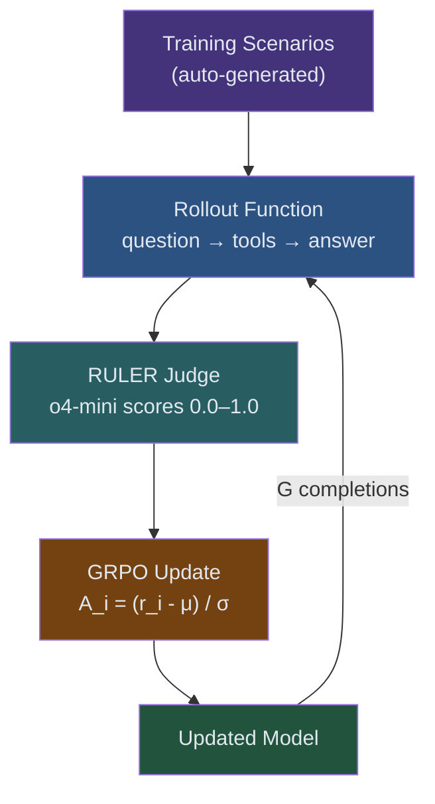
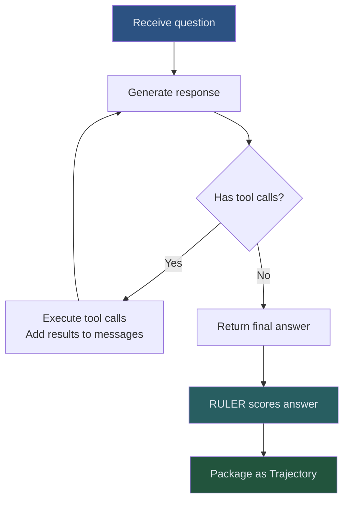
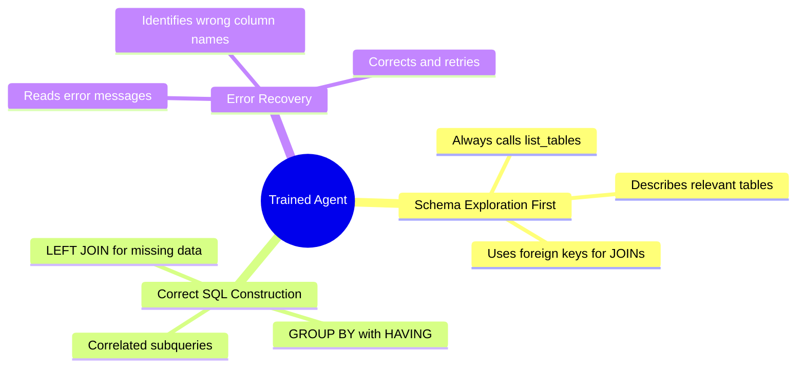

<!-- _class: lead -->

# Module 06: Text-to-SQL Agent
## Guide 03 — Training the Agent

GRPO, RULER, and MCP working together

<!-- Speaker notes: This is the payoff slide for the entire module sequence. Everything from Guides 01 and 02 — the database, the MCP server, the three tools — was setup for this. In this guide we wire everything together into a working training loop and watch the agent learn to query a database it has never seen before. -->

---

## The Complete Pipeline



<!-- Speaker notes: Every box in this diagram is something you've built in previous modules. GRPO from Module 01. ART from Module 02. RULER from Module 03. MCP from Module 04. The training loop from Module 05. This module assembles them on a real task. -->

---

## Step 1: Auto-Generating Training Scenarios

**No human annotators needed.** Generate scenarios from the database itself.

```python
@dataclass
class Scenario:
    question: str            # Natural language question for the agent
    ground_truth_sql: str    # SQL query that produces the correct answer
    ground_truth_answer: str # What RULER compares the agent's answer against
    difficulty: str          # "easy", "medium", "hard"
```

**The key insight:** run known-correct SQL, store the result. The agent never sees the SQL — only the question and the database tools.

<!-- Speaker notes: This is a critical insight for anyone building RL training pipelines: you can often generate training data programmatically from the environment itself. You don't need human annotators for every scenario. You need humans to write the seed queries — maybe 20-30 of them — and then you generate as many scenarios as you need. -->

---

## Three Difficulty Levels

<div class="columns">

<div>

**Easy — single table:**
- "What is the Engineering budget?"
- "How many employees are on leave?"
- "List all active projects."

*Required skill:* SELECT with WHERE

</div>

<div>

**Medium — two-table JOIN:**
- "List Data Science employees by salary"
- "Which dept has the most active staff?"
- "What's the total DS project budget?"

*Required skill:* JOIN + GROUP BY

</div>

</div>

**Hard — multi-table, subqueries:**
- "Which departments' project budgets exceed their own budget?"
- "Which employees earn above their department average?"
- "Employees in departments with active projects?"

*Required skill:* Correlated subqueries, HAVING, conditional aggregates

<!-- Speaker notes: The difficulty levels create a natural curriculum. Easy scenarios give the model quick wins early in training, building confidence and establishing the explore-first habit. Hard scenarios push the model to learn complex SQL patterns that require genuine multi-step reasoning. Without hard scenarios, the model will converge to a strategy that works on easy questions but fails on the interesting ones. -->

---

## Difficulty Curriculum Over Training

$$\text{easy\_weight}(t) = \max(0.1,\ 0.5 - 0.4t)$$
$$\text{hard\_weight}(t) = \min(0.5,\ 0.1 + 0.4t)$$

where $t \in [0, 1]$ is training progress.

```
Step   0:  easy=50%, medium=40%, hard=10%
Step 100:  easy=30%, medium=40%, hard=30%
Step 200:  easy=10%, medium=40%, hard=50%
```

**Start easy, end hard.** Let the model build foundational skills before tackling complex queries.

<!-- Speaker notes: Curriculum learning has strong empirical support in RL. Starting with hard examples only leads to the model getting 0 reward consistently, which gives no training signal — the group standard deviation collapses and GRPO makes no update. Easy examples give the model something to learn from at the start, and the model's growing competence on easy examples naturally builds the skills it needs for hard ones. -->

---

## Step 2: The RULER Judge

```python
RULER_SYSTEM_PROMPT = """You are evaluating a text-to-SQL agent's answer.

Scoring guidelines:
- 1.0: Agent's answer is factually correct and contains all required information
- 0.7: Mostly correct with minor omissions (right values, wrong ordering)
- 0.4: Partially correct (right table, wrong filter applied)
- 0.1: Attempted to answer but the result is clearly wrong
- 0.0: Refused to answer or made no tool calls

The agent's exact SQL does not matter — only whether the final answer is correct."""

judge = art.RulerJudge(
    model="o4-mini",      # Fast and cheap for scoring
    system_prompt=RULER_SYSTEM_PROMPT,
    score_range=(0.0, 1.0),
)
```

<!-- Speaker notes: Two important choices here. First, we use o4-mini rather than o3 — this is a scoring task, not a reasoning task, and o4-mini is 10x cheaper with similar accuracy for simple comparisons. Second, the prompt explicitly says "the exact SQL does not matter." We want the model to learn to produce correct answers, not to copy a specific query format. Different correct queries should get full credit. -->

---

## Step 3: The Rollout Function

```python
async def rollout(scenario, agent, mcp_client, judge) -> art.Trajectory:
    messages = [system_prompt, user_question]

    # Agentic loop
    while tool_call_count < max_tool_calls:
        response = await agent.generate(messages=messages)

        if response.tool_calls:
            for tool_call in response.tool_calls:
                result = await mcp_client.call_tool(
                    name=tool_call.function.name,
                    arguments=json.loads(tool_call.function.arguments),
                )
                messages.append({"role": "assistant", "tool_calls": [tool_call]})
                messages.append({"role": "tool", "content": json.dumps(result)})
        else:
            final_answer = response.content
            break

    score = await judge.score(question, final_answer, ground_truth)
    return art.Trajectory(messages=messages, reward=score)
```

<!-- Speaker notes: The rollout function is the heart of the system. It runs one complete episode and returns everything ART needs to compute the GRPO update: the full conversation (which becomes the trajectory), the final reward score, and metadata for logging. The agentic loop continues until the model stops calling tools — which is how the model signals it's ready to give a final answer. -->

---

## The Agentic Loop in Detail



**The model decides when to stop calling tools.** No external stopping rule tells it when it has enough information. This is a skill it learns.

<!-- Speaker notes: This is one of the more subtle things the model learns: when to stop exploring and commit to an answer. Early in training it either stops too early (guesses without schema info) or too late (calls the same tool multiple times unnecessarily). By step 100 or so, the pattern stabilizes: list_tables → describe relevant tables → run_query → answer. -->

---

## Step 4: The Training Loop

```python
for step in range(TRAINING_STEPS):
    step_scenarios = _sample_scenarios(easy, medium, hard, progress=step/TRAINING_STEPS)

    all_trajectories = []
    for scenario in step_scenarios:            # 4 scenarios per step
        group = []
        for _ in range(COMPLETIONS_PER_SCENARIO):   # 8 completions each
            trajectory = await rollout(scenario, agent, mcp_client, judge)
            group.append(trajectory)
        all_trajectories.append(group)

    # ART computes: A_i = (r_i - mean(group)) / std(group)
    # Then applies the GRPO policy gradient update
    metrics = await trainer.step(all_trajectories)
```

**Per step:** 4 scenarios × 8 completions = **32 trajectories** → 32 RULER scores → GRPO update

<!-- Speaker notes: The numbers here matter for cost estimation. 32 trajectories per step. Each trajectory averages 5 tool calls and ends with a RULER scoring call. That's roughly 160 MCP tool calls and 32 RULER scoring calls per training step. At 200 steps, that's 32,000 tool calls and 6,400 RULER calls. At o4-mini pricing, the RULER scoring costs roughly $2-5 for the full training run. The MCP calls are free — they hit your local server. -->

---

## Reading the Training Logs

```
Step    0 | avg_reward=0.124 | policy_loss=0.0821 | kl_div=0.0003 | avg_tool_calls=1.2
Step   10 | avg_reward=0.287 | policy_loss=0.0634 | kl_div=0.0021 | avg_tool_calls=3.1
Step   50 | avg_reward=0.558 | policy_loss=0.0389 | kl_div=0.0071 | avg_tool_calls=4.2
Step  100 | avg_reward=0.694 | policy_loss=0.0271 | kl_div=0.0084 | avg_tool_calls=4.7
Step  200 | avg_reward=0.781 | policy_loss=0.0142 | kl_div=0.0089 | avg_tool_calls=5.1
```

**Watch `avg_tool_calls` as much as `avg_reward`.** The behavioral shift from 1.2 → 5.1 is the model learning to explore before querying. That's the skill you're training.

<!-- Speaker notes: Most people focus on avg_reward because that's the obvious metric. But avg_tool_calls is actually more informative about what the model is learning. A model that jumps to 0.7 reward at step 10 but stays at 1.5 tool calls has probably memorized specific answers. A model that reaches 0.7 reward at step 50 with 4+ tool calls has learned the general explore-first workflow. The second model will generalize to new databases. The first won't. -->

---

## Diagnosing Training Problems

<div class="columns">

<div>

**avg_reward stays flat at 0.1**
- Normal for first 15-20 steps
- If still flat at step 40: check RULER prompt
- Check that ground truth answers are unambiguous

**avg_reward jumps to 0.9, then crashes**
- Model found a shortcut (no tool calls)
- Check `avg_tool_calls` — should be > 3
- Add penalty for 0-tool-call episodes

</div>

<div>

**kl_div > 0.05**
- Policy drifting from base model
- Increase KL coefficient: `kl_coefficient=0.02`

**avg_tool_calls stays at 1.0**
- Scenarios too easy (single-table answers)
- Add more medium/hard scenarios
- Hard scenarios require schema exploration

</div>

</div>

<!-- Speaker notes: These are the four most common failure modes. The shortcut problem is particularly sneaky — the model discovers that it can sometimes produce a plausible-looking answer without calling any tools at all, especially for easy scenarios. This gets rewarded early in training, which reinforces the no-tools behavior. The fix is to either weight RULER's scoring against tool-free answers or to ensure hard scenarios dominate quickly enough that tool-free answers clearly fail. -->

---

## Before Training: Step 0

**Question:** "Which employees earn more than the average salary of their own department?"

**Agent response:**
```
I'll try to answer that.

SELECT name, salary FROM employees WHERE salary > AVG(salary)
```

**Result:** SQL error — aggregate functions cannot be used in WHERE

**Agent:** "I'm sorry, I encountered an error with that query."

**RULER score: 0.1** (attempted but clearly wrong)

<!-- Speaker notes: This is the pre-training baseline. The model knows SQL syntax at a high level — it knows there's a WHERE clause and there's an AVG function. But it doesn't know how to use a correlated subquery, and it doesn't bother to explore the schema first. The error terminates the attempt. Notice it doesn't try to recover from the error at all. -->

---

## After Training: Step 200

**Same question.** Agent response:

```
Let me explore the database schema first.

[list_tables() → ['departments', 'employees', 'projects']]

[describe_table('employees') → columns: id, name, department_id, salary, status
                                foreign_keys: department_id → departments.id]

SELECT e.name, e.salary, d.name AS department
FROM employees e JOIN departments d ON e.department_id = d.id
WHERE e.status = 'active'
  AND e.salary > (
    SELECT AVG(e2.salary) FROM employees e2
    WHERE e2.department_id = e.department_id AND e2.status = 'active'
  )
ORDER BY d.name, e.salary DESC

[run_query(sql) → 12 rows]

The following active employees earn above their department average:
Alice Chen ($165,000, Engineering avg $131,286)...
```

**RULER score: 0.95**

<!-- Speaker notes: Compare the two responses. After training: the model starts by exploring the schema without being told to. It discovers the foreign key relationship between employees and departments. It uses that relationship to write a correlated subquery — a genuinely complex SQL pattern. It filters on status='active' without being reminded. It formats the answer clearly. None of this was in the system prompt. The model learned it from thousands of training episodes. -->

---

## Three Behaviors Learned



<!-- Speaker notes: These three behaviors are what separates a trained SQL agent from a prompted SQL agent. A prompted agent that's given the schema upfront can sometimes write correct SQL. But it can't recover from errors, it can't discover schema it wasn't told about, and it can't handle a database that's changed since the prompt was written. The trained agent can do all three. -->

---

## Cost Breakdown

| Component | Cost per training run |
|-----------|----------------------|
| MCP tool calls | Free (local server) |
| RULER scoring (o4-mini, 6,400 calls) | ~$3-5 |
| GRPO training (7B model, 200 steps, A100) | ~$15-25 |
| **Total** | **~$20-30** |

**The trained model:** outperforms GPT-4 on your specific database at ~100x lower inference cost per query.

<!-- Speaker notes: These numbers are approximate and depend on your GPU provider and current API pricing. The key point is that training a specialized 7B model costs less than $30 and the trained model will handle thousands of queries in production for cents. Compare to using GPT-4 at $15 per million tokens for every production query. The break-even is roughly 2,000 queries — most production systems hit that in a day. -->

---

## What's Next: Module 07

**Production Deployment**

- Benchmarking the trained model on held-out scenarios
- Cost/accuracy tradeoffs: 3B vs 7B vs 14B
- Merging the LoRA adapter into the base model
- Serving with vLLM in production
- Monitoring query quality in production

The text-to-SQL agent you built here is a starting point, not a final product. Module 07 shows you how to ship it.

<!-- Speaker notes: Module 07 is shorter than 06 — it builds directly on what you've built here. The main new concepts are: how to evaluate your trained model rigorously (not just on training scenarios), how to decide whether 7B is good enough or you need 14B, and how to set up production serving with load balancing and quality monitoring. -->

---

## Module 06 Complete

<div class="columns">

<div>

**What you built:**
- Company database (8 dept, 36 emp, 18 proj)
- FastMCP server with 3 tools
- 19 auto-generated training scenarios
- RULER judge (o4-mini)
- Complete rollout function
- GRPO training loop with curriculum

</div>

<div>

**What the agent learned:**
- Explore schema before querying
- Use foreign keys for JOINs
- Write correlated subqueries
- Recover from SQL errors
- Decide when to commit to an answer

</div>

</div>

**Reward improved from 0.12 to 0.78 over 200 training steps.**

<!-- Speaker notes: Take a moment to appreciate what just happened. You started with a general-purpose LLM that knew nothing about your specific database. You ran a training loop that cost less than $30 and took a few hours. You ended with a specialized model that reliably answers complex multi-table queries about your specific schema. This is what RL for agents makes possible — and this is the same architecture that OpenPipe used to beat o3 on their SQL benchmark. -->
