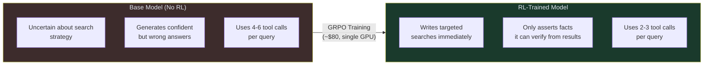
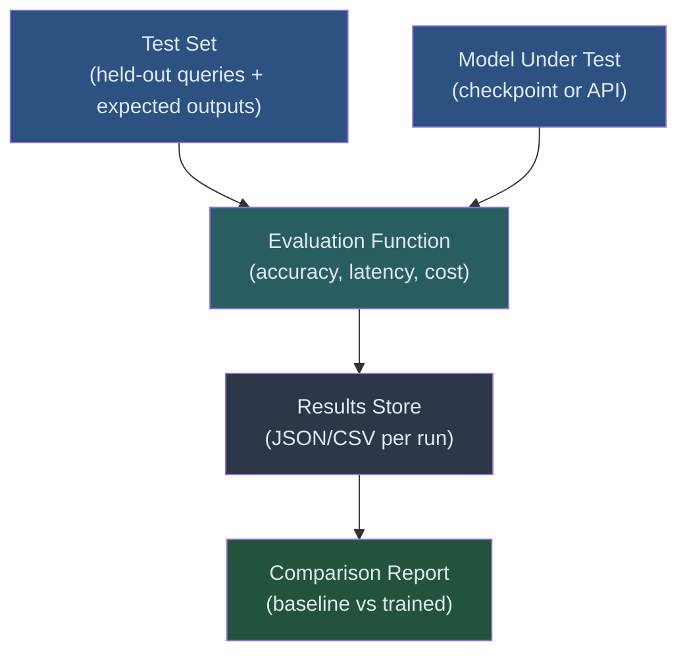

# Guide 01: Benchmarking — Measuring What Your RL Training Actually Achieved

## Learning Objectives

By the end of this guide you will be able to:

1. Interpret the ART-E benchmark results and what they demonstrate about RL fine-tuning
2. Identify the key metrics that matter for agent evaluation (accuracy, latency, cost, hallucination rate)
3. Build a benchmark evaluation harness that runs against a held-out test set
4. Compare your trained model checkpoints against a baseline to measure improvement
5. Explain why RL training specifically reduces hallucination and turn count

---

## The ART-E Result: What Actually Happened

Before building evaluation tooling, understand the benchmark that motivates it.

The ART-E (Agent Reinforcement Training Evaluation) benchmark tests agentic tasks requiring multi-step reasoning, tool use, and information retrieval. The key finding:

```
Qwen2.5-14B trained with GRPO (RL fine-tuning):
- Accuracy:  96%    (vs ~87% for o3, ~85% for GPT-4.1)
- Latency:   1.1s   (vs 5.6s for o3)
- Cost:      $0.85  per 1,000 runs (vs $55.19 for o3)
- Training:  ~$80   one-time cost on a single GPU
```

The +56% improvement over the base Qwen2.5-14B model came from RL training alone — no architectural changes, no new training data in the traditional sense, just rewards for correct behavior.

### Why These Numbers Are Real

This result surprises people familiar with RLHF for general-purpose chat models, where improvements are often marginal and hard to measure. The difference here is task specificity:

- **General chat:** Reward signals are subjective and noisy (was that a helpful response?)
- **ART-E tasks:** Reward signals are binary and precise (did the SQL query return the right rows?)

Binary rewards make GRPO highly effective. The model gets clear signal on every rollout.

---

## What RL Training Changes About Agent Behavior



**Less hallucination:** The reward function penalizes wrong answers. When a model learns that asserting unverifiable claims leads to reward = 0, it stops doing it. This is not a coincidence — it is exactly what RL optimizes for.

**Fewer turns:** Early in training, the model takes exploratory, redundant actions. As training progresses and reward for correctness accumulates, the model learns to reach answers in fewer steps. Fewer steps = lower latency = lower cost.

**More effective searches:** The model learns which search queries actually return relevant information. This is not learned from supervised examples of good searches — it emerges from the reward signal for finding correct answers.

---

## How to Set Up Your Own Benchmark

A production-grade benchmark requires three components:

1. A held-out test set (never used in training)
2. A deterministic evaluation function (same inputs → same scores every run)
3. A harness that runs evaluation across multiple models/checkpoints



### Test Set Design

Split your data before any training begins:

- **Train set:** 80% of examples — used for RL rollouts
- **Validation set:** 10% — used for checkpoint selection during training
- **Test set:** 10% — never touched until final evaluation

If you evaluate on the training set, you are measuring memorization, not learning.

For the ART-E benchmark, the test set contains queries that require the same *type* of reasoning as the training set but with different specific content. The model cannot memorize answers — it must generalize the strategy.

---

## Benchmark Evaluation Framework (Working Code)

This harness evaluates any model against a test set and produces structured results you can compare across checkpoints.

```python
"""
benchmark_harness.py

Evaluation framework for RL-trained agents.
Runs a test set against a model endpoint and produces structured results.
"""

import json
import time
import statistics
from dataclasses import dataclass, asdict
from typing import Callable, Any
from pathlib import Path
from datetime import datetime, timezone


@dataclass
class QueryResult:
    """Result for a single test query."""
    query_id: str
    query: str
    expected: str
    actual: str
    correct: bool
    latency_seconds: float
    tokens_used: int
    cost_usd: float
    error: str | None = None


@dataclass
class BenchmarkReport:
    """Aggregated results across the full test set."""
    model_name: str
    checkpoint: str
    timestamp: str
    total_queries: int
    correct: int
    failed: int
    accuracy: float
    mean_latency_seconds: float
    p95_latency_seconds: float
    total_cost_usd: float
    cost_per_1000_usd: float
    results: list[dict]

    def summary(self) -> str:
        lines = [
            f"Model:          {self.model_name} @ {self.checkpoint}",
            f"Accuracy:       {self.accuracy:.1%} ({self.correct}/{self.total_queries})",
            f"Mean Latency:   {self.mean_latency_seconds:.2f}s",
            f"P95 Latency:    {self.p95_latency_seconds:.2f}s",
            f"Cost/1K runs:   ${self.cost_per_1000_usd:.2f}",
            f"Failed queries: {self.failed}",
        ]
        return "\n".join(lines)


class BenchmarkHarness:
    """
    Runs a test set against a model and collects structured results.

    Usage:
        harness = BenchmarkHarness(
            model_fn=my_model_call,
            eval_fn=check_sql_correct,
            cost_fn=estimate_cost,
        )
        report = harness.run(test_cases, model_name="qwen2.5-14b", checkpoint="step_500")
        print(report.summary())
        harness.save(report, "results/")
    """

    def __init__(
        self,
        model_fn: Callable[[str], tuple[str, int]],
        eval_fn: Callable[[str, str], bool],
        cost_fn: Callable[[int], float],
        retry_on_error: bool = True,
        max_retries: int = 2,
    ):
        """
        Args:
            model_fn: Takes a query string, returns (response, tokens_used).
            eval_fn: Takes (expected, actual), returns True if correct.
            cost_fn: Takes tokens_used, returns cost in USD.
            retry_on_error: Whether to retry failed queries once.
            max_retries: Maximum retry attempts per query.
        """
        self.model_fn = model_fn
        self.eval_fn = eval_fn
        self.cost_fn = cost_fn
        self.retry_on_error = retry_on_error
        self.max_retries = max_retries

    def _run_single(self, query_id: str, query: str, expected: str) -> QueryResult:
        """Run a single query with timing and error handling."""
        last_error = None

        for attempt in range(self.max_retries + 1):
            try:
                start = time.perf_counter()
                actual, tokens_used = self.model_fn(query)
                latency = time.perf_counter() - start

                correct = self.eval_fn(expected, actual)
                cost = self.cost_fn(tokens_used)

                return QueryResult(
                    query_id=query_id,
                    query=query,
                    expected=expected,
                    actual=actual,
                    correct=correct,
                    latency_seconds=round(latency, 3),
                    tokens_used=tokens_used,
                    cost_usd=round(cost, 6),
                )
            except Exception as exc:
                last_error = str(exc)
                if attempt < self.max_retries and self.retry_on_error:
                    time.sleep(1.0 * (attempt + 1))  # linear backoff
                    continue
                break

        # All attempts failed
        return QueryResult(
            query_id=query_id,
            query=query,
            expected=expected,
            actual="",
            correct=False,
            latency_seconds=0.0,
            tokens_used=0,
            cost_usd=0.0,
            error=last_error,
        )

    def run(
        self,
        test_cases: list[dict],
        model_name: str,
        checkpoint: str = "latest",
        verbose: bool = True,
    ) -> BenchmarkReport:
        """
        Run the full benchmark.

        Args:
            test_cases: List of dicts with keys: id, query, expected
            model_name: Name for the report (e.g. "qwen2.5-14b-rl")
            checkpoint: Checkpoint label (e.g. "step_500")
            verbose: Print progress during evaluation

        Returns:
            BenchmarkReport with all results and aggregate metrics
        """
        results = []
        total = len(test_cases)

        for i, case in enumerate(test_cases, 1):
            result = self._run_single(
                query_id=case["id"],
                query=case["query"],
                expected=case["expected"],
            )
            results.append(result)

            if verbose and i % 10 == 0:
                so_far = sum(r.correct for r in results)
                print(f"  [{i}/{total}] Accuracy so far: {so_far/i:.1%}")

        # Aggregate metrics
        correct_count = sum(r.correct for r in results)
        failed_count = sum(1 for r in results if r.error is not None)
        latencies = [r.latency_seconds for r in results if r.error is None]
        total_cost = sum(r.cost_usd for r in results)

        latencies.sort()
        p95_idx = int(len(latencies) * 0.95)
        p95 = latencies[p95_idx] if latencies else 0.0

        return BenchmarkReport(
            model_name=model_name,
            checkpoint=checkpoint,
            timestamp=datetime.now(timezone.utc).isoformat(),
            total_queries=total,
            correct=correct_count,
            failed=failed_count,
            accuracy=correct_count / total if total > 0 else 0.0,
            mean_latency_seconds=round(statistics.mean(latencies), 3) if latencies else 0.0,
            p95_latency_seconds=round(p95, 3),
            total_cost_usd=round(total_cost, 4),
            cost_per_1000_usd=round((total_cost / total) * 1000, 2) if total > 0 else 0.0,
            results=[asdict(r) for r in results],
        )

    def save(self, report: BenchmarkReport, output_dir: str) -> Path:
        """Save report to a JSON file with a timestamped name."""
        output_path = Path(output_dir)
        output_path.mkdir(parents=True, exist_ok=True)

        filename = f"{report.model_name}_{report.checkpoint}_{report.timestamp[:10]}.json"
        filepath = output_path / filename

        with open(filepath, "w") as f:
            json.dump(asdict(report), f, indent=2)

        print(f"Results saved to: {filepath}")
        return filepath


def compare_reports(reports: list[BenchmarkReport]) -> None:
    """
    Print a side-by-side comparison table of multiple benchmark reports.

    Args:
        reports: List of BenchmarkReport instances to compare
    """
    header = f"{'Model':<30} {'Checkpoint':<12} {'Accuracy':>10} {'Mean Lat':>10} {'Cost/1K':>10}"
    print(header)
    print("-" * len(header))

    for r in sorted(reports, key=lambda x: x.accuracy, reverse=True):
        print(
            f"{r.model_name:<30} {r.checkpoint:<12} "
            f"{r.accuracy:>10.1%} {r.mean_latency_seconds:>9.2f}s "
            f"${r.cost_per_1000_usd:>9.2f}"
        )
```

### Using the Harness

```python
# Example: evaluating a text-to-SQL agent across checkpoints
from openai import OpenAI
import sqlite3

# Your vLLM endpoint (from Module 02 setup)
client = OpenAI(base_url="http://localhost:8000/v1", api_key="token")

def call_model(query: str) -> tuple[str, int]:
    """Call the vLLM-served model. Returns (response_text, tokens_used)."""
    response = client.chat.completions.create(
        model="qwen2.5-14b-rl",
        messages=[{"role": "user", "content": query}],
        max_tokens=512,
        temperature=0.0,  # Deterministic for evaluation
    )
    text = response.choices[0].message.content
    tokens = response.usage.total_tokens
    return text, tokens


def check_sql_correct(expected: str, actual: str) -> bool:
    """
    Evaluate SQL correctness by executing both queries and comparing results.
    This is a functional check, not a string match — equivalent SQL passes.
    """
    conn = sqlite3.connect(":memory:")
    # (In practice, connect to your test database)
    try:
        cursor = conn.cursor()
        cursor.execute(actual.strip())
        actual_rows = set(map(tuple, cursor.fetchall()))
        cursor.execute(expected.strip())
        expected_rows = set(map(tuple, cursor.fetchall()))
        return actual_rows == expected_rows
    except Exception:
        return False
    finally:
        conn.close()


def vllm_cost(tokens: int) -> float:
    """Estimate cost for vLLM self-hosted inference at $0.85/1M tokens."""
    return (tokens / 1_000_000) * 0.85


# Load test cases
test_cases = [
    {"id": "q001", "query": "How many orders were placed in January 2024?",
     "expected": "SELECT COUNT(*) FROM orders WHERE strftime('%Y-%m', order_date) = '2024-01'"},
    # ... more test cases
]

harness = BenchmarkHarness(
    model_fn=call_model,
    eval_fn=check_sql_correct,
    cost_fn=vllm_cost,
)

# Evaluate multiple checkpoints
checkpoints = ["step_100", "step_250", "step_500"]
reports = []

for ckpt in checkpoints:
    # In practice: load the checkpoint via vLLM model swap or separate endpoint
    report = harness.run(
        test_cases,
        model_name="qwen2.5-14b-rl",
        checkpoint=ckpt,
    )
    reports.append(report)
    harness.save(report, "benchmark_results/")

# Compare all checkpoints
compare_reports(reports)
```

---

## Interpreting Results

### When to Trust the Benchmark

A benchmark is only valid when:

1. **Test set is truly held out.** If any test queries appeared in training, accuracy is inflated.
2. **Evaluation is deterministic.** Run with `temperature=0.0`. Stochastic evaluation introduces noise.
3. **Sample size is sufficient.** With 100 test queries, a 1% accuracy difference is within statistical noise. Use 500+ queries for reliable conclusions.
4. **Comparison models use the same inputs.** If your model gets a system prompt and the baseline does not, the comparison is invalid.

### What a 56% Improvement Actually Means

The ART-E base model (Qwen2.5-14B without RL) achieves ~40% accuracy. After RL training, it achieves 96%. That is a 56 percentage point improvement — not 56% relative improvement.

When reporting your own results, always report both the baseline and the trained model accuracy, not just the gain.

### Hallucination Rate

To measure hallucination specifically, track queries where the model asserted a factual claim that was not present in the tool call results:

```python
def check_hallucination(trajectory: list[dict]) -> bool:
    """
    Returns True if the model's final answer contains claims
    not supported by its tool call results.

    trajectory: list of {role, content} dicts from the agent run,
                including tool call results.
    """
    tool_results = [
        msg["content"] for msg in trajectory
        if msg["role"] == "tool"
    ]
    final_answer = next(
        (msg["content"] for msg in reversed(trajectory)
         if msg["role"] == "assistant"),
        ""
    )

    # Extract factual claims from answer (simplified: numbers and proper nouns)
    import re
    claims = re.findall(r'\b\d+(?:\.\d+)?\b|\b[A-Z][a-z]+(?:\s[A-Z][a-z]+)*\b', final_answer)

    all_tool_text = " ".join(tool_results)
    unsupported = [c for c in claims if c not in all_tool_text]

    return len(unsupported) > 0
```

---

## Comparing Against Frontier Models

The benchmark harness works identically against any OpenAI-compatible API. To compare your trained model against GPT-4.1:

```python
from openai import OpenAI

frontier_client = OpenAI(api_key="your-key")

def call_gpt41(query: str) -> tuple[str, int]:
    response = frontier_client.chat.completions.create(
        model="gpt-4.1",
        messages=[{"role": "user", "content": query}],
        temperature=0.0,
    )
    return response.choices[0].message.content, response.usage.total_tokens

def gpt41_cost(tokens: int) -> float:
    # GPT-4.1: $2.00/1M input + $8.00/1M output (approximate)
    # Using output-heavy estimate for agentic tasks
    return (tokens / 1_000_000) * 8.00

frontier_harness = BenchmarkHarness(
    model_fn=call_gpt41,
    eval_fn=check_sql_correct,
    cost_fn=gpt41_cost,
)

frontier_report = frontier_harness.run(test_cases, model_name="gpt-4.1", checkpoint="api")
compare_reports([*reports, frontier_report])
```

---

## Summary

| Concept | Key Point |
|---------|-----------|
| ART-E result | 96% accuracy, 1.1s latency, $0.85/1K — from a 14B model trained for ~$80 |
| +56% improvement | Percentage point gain over base model; comes entirely from RL training |
| Reduced hallucination | RL penalizes wrong answers → model learns to only assert verifiable facts |
| Fewer turns | Model learns efficient search strategies; emerges from reward optimization |
| Benchmark validity | Hold out test set before training; use temperature=0 for determinism |
| Comparison baseline | Always report baseline accuracy alongside trained model accuracy |

---

## Next

Guide 02 — Cost Optimization: estimating training budgets, LoRA vs full fine-tuning, and the break-even calculation for training vs using a frontier API.
