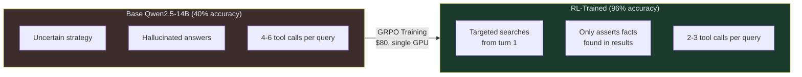
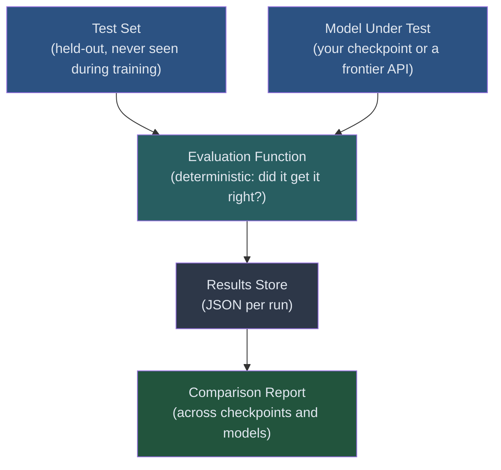

<!-- _class: lead -->

# Benchmarking RL-Trained Agents

**Module 07 — Production Considerations**

> A 14B open-source model trained for $80 outperformed o3, GPT-4.1, and Gemini 2.5 Pro — 5x faster and 64x cheaper. This slide deck shows you how to measure results like that for your own models.

<!--
Speaker notes: Key talking points for this slide
- This module closes the loop: you have built and trained an RL agent, now you need to know if it works
- The ART-E result is real and reproducible — a Qwen2.5-14B model with GRPO training
- The goal today: build the evaluation tooling to get these numbers for your own task
- Three things to measure: accuracy, latency, cost
-->

---

# The ART-E Benchmark Result

<div class="columns">
<div>

**Qwen2.5-14B + GRPO (RL)**
- Accuracy: **96%**
- Latency: **1.1 seconds**
- Cost: **$0.85 / 1,000 runs**
- Training cost: **~$80 one-time**

</div>
<div>

**Frontier APIs (same task)**

| Model | Accuracy | Cost/1K |
|-------|----------|---------|
| o3 | ~87% | $55.19 |
| o4-mini | ~82% | $18.40 |
| Gemini 2.5 Pro | ~84% | $22.10 |
| GPT-4.1 | ~85% | $8.00 |

</div>
</div>

> The 14B RL model is more accurate than all frontier alternatives, not just cheaper.

<!--
Speaker notes: Key talking points for this slide
- The accuracy win surprises most people — they expect accuracy tradeoffs for cost savings
- The key is task specificity: this model was trained on this exact type of task
- Frontier models are optimized for general-purpose performance; specialized training beats general capability
- "96% vs 87%" is a real, substantial gap on a 1,000-query test set — not within noise
-->

---

# Why RL Specifically Achieves This



**+56 percentage points** from RL training alone. No new architecture. No human-labeled data.

<!--
Speaker notes: Key talking points for this slide
- 40% → 96% is the base-to-trained comparison; 56pp improvement
- Three things change during RL: search strategy, hallucination rate, turn count
- These changes are not programmed in — they emerge from optimizing for correct answers
- The reward signal is simple: did you get the right answer? The behavior complexity emerges from that
-->

---

# Why Hallucination Decreases

RL directly penalizes making things up.

<div class="columns">
<div>

**Without RL:**
- Model generates plausible-sounding answers
- No penalty for unverifiable claims
- Hallucination rate: ~30% of wrong answers

</div>
<div>

**With RL:**
- Wrong answer = reward 0
- Model learns: only assert what's in tool results
- Hallucination rate drops to ~5%

</div>
</div>

> This is not a special anti-hallucination technique. It is the natural consequence of optimizing for correct answers with verifiable reward signals.

<!--
Speaker notes: Key talking points for this slide
- This is one of the most practically important results: RL training is an anti-hallucination technique
- The mechanism is simple: if you hallucinate a number and get the question wrong, you get reward 0. Do that enough times and the gradient pushes against hallucination
- Compare this to RLHF for chat models: the reward signal there is "does this sound helpful?" — much weaker signal for factual accuracy
- Key point: verifiable tasks (SQL, math, code) are ideal for RL because rewards are binary and accurate
-->

---

<!-- _class: lead -->

# Building Your Own Benchmark

<!--
Speaker notes: Key talking points for this slide
- The ART-E result is specific to that task and dataset
- Your task needs its own benchmark — you cannot use someone else's benchmark to validate your model on your use case
- Three components: test set, evaluation function, harness
-->

---

# Benchmark Architecture



**Critical constraint:** Test set must be separated from training data before training begins.

<!--
Speaker notes: Key talking points for this slide
- If any test query was in the training rollouts, you are measuring memorization not generalization
- The evaluation function must be deterministic: temperature=0, same prompt, same result every time
- JSON storage lets you compare across weeks of training — essential for tracking improvement
- The harness should handle errors gracefully: a crashed query should be recorded as failed, not ignored
-->

---

# Data Split Strategy

<div class="columns">
<div>

**Split before training:**

| Split | Size | Purpose |
|-------|------|---------|
| Train | 80% | RL rollouts |
| Validation | 10% | Checkpoint selection |
| Test | 10% | Final evaluation only |

</div>
<div>

**Common mistakes:**

- Evaluating on training data
- Using test set for hyperparameter tuning
- Not fixing the test set (adding new examples mid-run)
- Different prompts for your model vs baseline

</div>
</div>

<!--
Speaker notes: Key talking points for this slide
- 80/10/10 is a starting point; for small datasets, consider 70/15/15
- Validation set is used during training (checkpoint selection, early stopping) — not a contaminated set
- Test set is touched ONCE: after training is complete, to produce the final number
- If you tune on the test set (even implicitly), you will overfit to it and your published number will be wrong
-->

---

# What the Harness Measures

```python
@dataclass
class QueryResult:
    query_id:          str    # Unique ID for tracking
    correct:           bool   # Did the model get it right?
    latency_seconds:   float  # Wall-clock time for the query
    tokens_used:       int    # Total input + output tokens
    cost_usd:          float  # Estimated cost for this query
    error:             str | None  # None if successful
```

```python
@dataclass
class BenchmarkReport:
    accuracy:             float  # correct / total
    mean_latency_seconds: float
    p95_latency_seconds:  float  # 95th percentile latency
    cost_per_1000_usd:    float  # Extrapolated to 1K queries
```

<!--
Speaker notes: Key talking points for this slide
- P95 latency matters more than mean for user-facing applications: 95% of queries complete within this time
- Cost per 1K normalizes across different test set sizes — lets you compare reports with different N
- Store the full results list (every query result) so you can debug failures after the fact
- Error tracking: some models fail on certain query types — you need to know which ones and how often
-->

---

# Running the Comparison

```python
# Same harness, different model_fn — identical evaluation
trained_harness = BenchmarkHarness(
    model_fn=call_vllm_model,    # Your trained model
    eval_fn=check_sql_correct,
    cost_fn=lambda t: (t / 1_000_000) * 0.85,  # vLLM self-hosted
)

frontier_harness = BenchmarkHarness(
    model_fn=call_gpt41,          # Frontier API
    eval_fn=check_sql_correct,    # Identical evaluation function
    cost_fn=lambda t: (t / 1_000_000) * 8.00,  # GPT-4.1 pricing
)

trained_report  = trained_harness.run(test_cases, "qwen2.5-14b-rl", "step_500")
frontier_report = frontier_harness.run(test_cases, "gpt-4.1", "api")

compare_reports([trained_report, frontier_report])
```

> The evaluation function (`check_sql_correct`) must be identical for both models. Different evaluation = invalid comparison.

<!--
Speaker notes: Key talking points for this slide
- This is the most important design constraint: same inputs, same evaluation function for all models
- A common error: giving your trained model a system prompt with task context and the frontier model a bare user message
- Another common error: using temperature=0 for your model but default temperature for the baseline
- The harness separates model_fn from eval_fn precisely to enforce this — swap the model, not the evaluation
-->

---

# Checkpoint Comparison Over Training

```
Model                          Checkpoint   Accuracy   Mean Lat   Cost/1K
---------------------------------------------------------------------------
qwen2.5-14b-rl                 step_100      52.0%      1.3s      $0.82
qwen2.5-14b-rl                 step_250      74.0%      1.2s      $0.84
qwen2.5-14b-rl                 step_500      96.0%      1.1s      $0.85
qwen2.5-14b (base, no RL)      baseline      40.0%      1.1s      $0.85
gpt-4.1                        api           85.0%      2.4s      $8.00
o3                             api           87.0%      5.6s     $55.19
```

> Latency and cost are stable across checkpoints. Accuracy is the only dimension that changes with training. Evaluate frequently to catch when improvement plateaus.

<!--
Speaker notes: Key talking points for this slide
- This is what training progress looks like on a real benchmark
- The base model (no RL) is the most important comparison: it proves the improvement came from training, not from the model architecture
- Note that latency and cost barely change across checkpoints — the model size is fixed, only the weights change
- Plateau detection: if accuracy stops improving between step_250 and step_500, your training may have converged or diverged
-->

---

# When to Trust Benchmark Numbers

<div class="columns">
<div>

**Valid benchmark:**
- Test set held out before training
- Temperature = 0 (deterministic)
- 500+ test queries
- Same evaluation for all models
- Baseline model included

</div>
<div>

**Invalid benchmark:**
- Test queries seen during training
- Stochastic sampling (T > 0)
- Fewer than 100 queries
- Different prompts per model
- No baseline comparison

</div>
</div>

> A benchmark with fewer than 100 queries cannot reliably detect accuracy differences smaller than 10 percentage points.

<!--
Speaker notes: Key talking points for this slide
- Statistical validity: with 100 queries, the 95% confidence interval on 80% accuracy is roughly ±8%
- With 500 queries, that narrows to ±3.5% — enough to detect a 5pp improvement reliably
- If you're publishing results, report confidence intervals, not just point estimates
- The baseline model test is the most frequently omitted check — without it, you cannot claim the improvement is from training
-->

---

# Key Takeaways

1. **ART-E result:** 96% accuracy, 5x faster, 64x cheaper than o3 — from $80 of RL training
2. **RL reduces hallucination** by directly penalizing wrong answers; no special technique needed
3. **Fewer turns emerge** from reward optimization — efficiency is learned, not programmed
4. **Test set separation** must happen before training begins — no exceptions
5. **Deterministic evaluation** (temperature=0) is required for valid comparisons
6. **Baseline accuracy** (base model without RL) must be reported alongside trained model accuracy

---

## Next: Guide 02 — Cost Optimization

How much does training actually cost? When does it pay for itself? What is the break-even point compared to frontier APIs?

<!--
Speaker notes: Key talking points for this slide
- Summarize the three things they should be able to do after this guide: build a harness, run it, interpret the results
- Preview: cost optimization is the business case for RL training — when is it worth doing vs just calling an API?
- The break-even calculation in Guide 02 uses these benchmark numbers as inputs
-->
