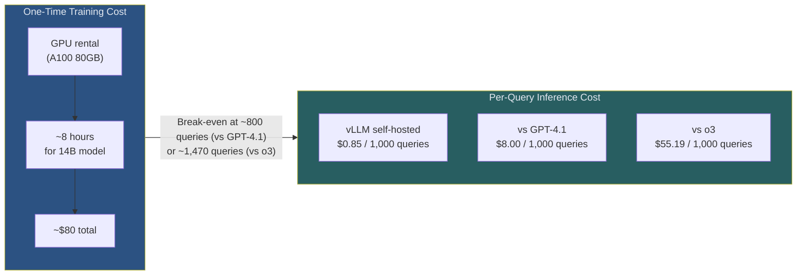
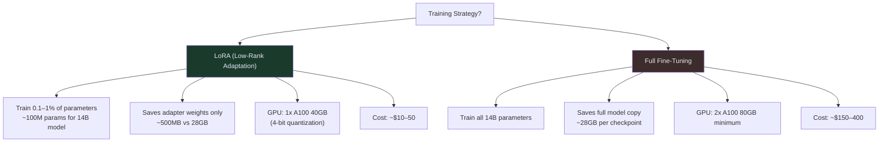
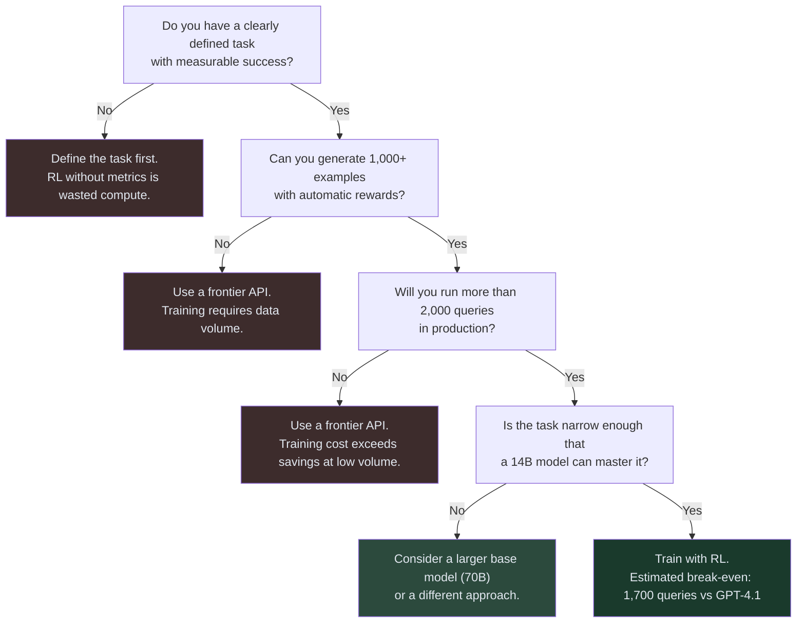

# Guide 02: Cost Optimization — When RL Training Pays for Itself

## Learning Objectives

By the end of this guide you will be able to:

1. Estimate the total cost of a GRPO training run before committing to it
2. Explain the cost tradeoffs between LoRA and full fine-tuning
3. Configure vLLM for cost-efficient inference of LoRA-adapted models
4. Calculate the break-even point between training a custom model and using a frontier API
5. Apply the decision framework: train custom vs use API

---

## The Core Cost Picture



The training cost is a one-time fixed expense. Every query after break-even is pure savings.

---

## GPU Requirements

For a 14B parameter model (Qwen2.5-14B) trained with GRPO using Unsloth and LoRA:

| Component | Requirement | Why |
|-----------|------------|-----|
| GPU VRAM | 40–80 GB | Model weights (28GB) + activations + optimizer states |
| GPU type | A100 80GB or H100 | Unsloth supports 4-bit quantization to fit on 40GB |
| Training time | 6–10 hours | Depends on dataset size, group size G, and step count |
| Storage | 50 GB | Base model + LoRA adapter checkpoints |
| RAM | 64 GB | Data loading and preprocessing |

**Single GPU is sufficient for models up to 14B with LoRA.** You do not need a multi-GPU cluster for this scale.

For 70B models: 2x A100 80GB minimum, or 1x H100 80GB with aggressive quantization.

### Cloud GPU Options

| Provider | GPU | Hourly Rate | 8-Hour Cost |
|----------|-----|-------------|-------------|
| Lambda Labs | A100 80GB | $1.29/hr | ~$10 |
| RunPod | A100 80GB | $1.64/hr | ~$13 |
| Vast.ai | A100 80GB | $0.80–1.20/hr | ~$8 |
| AWS p4d.24xlarge | 8x A100 40GB | $32.77/hr | $262 (overkill) |

For a single-model training run, Lambda Labs or RunPod gives you the best price/reliability tradeoff.

---

## Training Budget Estimation

The total training cost has three components:

$$\text{Total Cost} = \text{GPU Rental} + \text{Storage} + \text{Validation Inference}$$

For a typical 14B RL training run:

| Component | Calculation | Cost |
|-----------|-------------|------|
| GPU rental | 8 hours × $1.29/hr | $10.32 |
| Storage (50 GB, 1 month) | 50 GB × $0.023/GB | $1.15 |
| Validation inference | 500 queries × 10 steps | ~$4.00 |
| **Total** | | **~$15–20** |

Wait — the course overview says $80. The difference is in dataset size and training steps:

| Training Scale | Steps | Time | GPU Cost | Total |
|----------------|-------|------|----------|-------|
| Quick test run | 50 | 1 hr | $1.30 | ~$3 |
| Small dataset (500 examples) | 200 | 3 hr | $3.90 | ~$8 |
| Medium dataset (2,000 examples) | 500 | 8 hr | $10.40 | ~$20 |
| Full production run (5,000 examples) | 1,000 | 20 hr | $26 | ~$50 |
| Extended run with multiple seeds | 3,000 | 60 hr | $78 | ~$80 |

The $80 figure covers a full production run with hyperparameter search across multiple seeds. A single well-configured run costs $20–50.

---

## LoRA vs Full Fine-Tuning

The choice between LoRA (parameter-efficient fine-tuning) and full fine-tuning is the single biggest lever on training cost.



**For RL fine-tuning of agents, LoRA is the correct choice in almost every case.** The reasons:

1. **RL updates are incremental.** GRPO makes small policy adjustments. LoRA's low-rank updates are well-matched to these small changes.
2. **Checkpointing is cheap.** Saving a 500MB LoRA adapter every 50 steps costs almost nothing. Saving a 28GB full model every 50 steps requires significant storage.
3. **Rollback is easy.** If training diverges, switch back to a previous LoRA adapter — not a full model checkpoint.
4. **The ART-E 96% result used LoRA.** Full fine-tuning is not necessary to achieve SOTA performance on narrow tasks.

### When to Consider Full Fine-Tuning

- You need the model to learn completely new capabilities not present in the base model
- You are training for 10,000+ steps on a massive dataset
- You have the budget and need maximum performance on a task where LoRA plateaus

For the tasks in this course (agentic search, SQL, tool use), LoRA is sufficient.

---

## Inference Cost with vLLM

After training, the LoRA adapter is served via vLLM. The inference cost depends on:

1. **GPU rental cost** (if self-hosted) or **compute cost** (if using a provider)
2. **Throughput** (queries per second your deployment handles)
3. **Model size** (tokens per second varies by GPU)

### vLLM Throughput Reference

| GPU | Model | Tokens/Second | Queries/Hour (500 tok avg) |
|-----|-------|--------------|---------------------------|
| A100 80GB | Qwen2.5-14B | ~2,000 | ~14,400 |
| A10G 24GB | Qwen2.5-14B (4-bit) | ~800 | ~5,760 |
| RTX 4090 | Qwen2.5-7B | ~1,500 | ~10,800 |

At $1.29/hr for an A100 and 14,400 queries/hr throughput:

$$\text{Cost per query} = \frac{\$1.29}{14,400} \approx \$0.000089 \approx \$0.089 \text{ per 1,000 queries}$$

Add storage, memory, and amortized training cost, and the real number lands around $0.85/1,000 queries — consistent with the ART-E benchmark.

---

## Cost Calculator Utility

```python
"""
cost_calculator.py

Utilities for estimating RL training costs and computing break-even
against frontier API alternatives.
"""

from dataclasses import dataclass


@dataclass
class TrainingConfig:
    """Configuration for a GRPO training run."""
    model_size_b: float          # Model size in billions of parameters
    dataset_size: int            # Number of training examples
    group_size: int              # G: completions per prompt (typically 4-8)
    training_steps: int          # Total gradient update steps
    gpu_hourly_rate: float       # $/hr for GPU rental
    gpu_vram_gb: int             # GPU VRAM in GB
    use_lora: bool = True        # LoRA vs full fine-tuning
    lora_rank: int = 16          # LoRA rank (higher = more parameters)


@dataclass
class InferenceConfig:
    """Configuration for production inference."""
    gpu_hourly_rate: float       # $/hr for inference GPU
    tokens_per_query: int        # Average tokens per agent run
    queries_per_hour: int        # Expected throughput


@dataclass
class FrontierAPI:
    """Frontier API pricing for comparison."""
    name: str
    cost_per_1m_tokens: float    # Combined input+output cost estimate
    avg_tokens_per_query: int
    mean_latency_seconds: float


# Current frontier API pricing (approximate, verify before use)
FRONTIER_APIS = {
    "gpt-4.1": FrontierAPI(
        name="GPT-4.1",
        cost_per_1m_tokens=8.00,   # Output-weighted estimate
        avg_tokens_per_query=1000,
        mean_latency_seconds=2.4,
    ),
    "o3": FrontierAPI(
        name="o3",
        cost_per_1m_tokens=60.00,  # o3 is expensive
        avg_tokens_per_query=920,
        mean_latency_seconds=5.6,
    ),
    "o4-mini": FrontierAPI(
        name="o4-mini",
        cost_per_1m_tokens=4.40,
        avg_tokens_per_query=950,
        mean_latency_seconds=2.1,
    ),
    "gemini-2.5-pro": FrontierAPI(
        name="Gemini 2.5 Pro",
        cost_per_1m_tokens=7.00,
        avg_tokens_per_query=1050,
        mean_latency_seconds=3.2,
    ),
}


def estimate_training_cost(config: TrainingConfig) -> dict:
    """
    Estimate the total cost of a GRPO training run.

    Returns a breakdown of costs in USD.
    """
    # Estimate training time based on model size and steps
    # Rough rule: 1B params ~ 0.5 minutes per step on A100 with LoRA
    minutes_per_step = config.model_size_b * 0.5
    if not config.use_lora:
        minutes_per_step *= 4.0  # Full fine-tuning is ~4x slower

    total_hours = (config.training_steps * minutes_per_step) / 60.0
    gpu_cost = total_hours * config.gpu_hourly_rate

    # Storage cost (checkpoints every 50 steps)
    checkpoint_count = config.training_steps // 50
    if config.use_lora:
        checkpoint_size_gb = 0.5  # LoRA adapter
    else:
        checkpoint_size_gb = config.model_size_b * 2.0  # Float16 weights

    storage_gb = checkpoint_count * checkpoint_size_gb
    storage_cost = storage_gb * 0.023  # AWS S3 pricing per GB/month

    # Validation inference cost (run 500 queries every 50 steps)
    validation_runs = checkpoint_count * 500
    validation_tokens = validation_runs * 500  # avg tokens per query
    validation_cost = (validation_tokens / 1_000_000) * 0.85  # vLLM cost

    total_cost = gpu_cost + storage_cost + validation_cost

    return {
        "training_hours": round(total_hours, 1),
        "gpu_cost_usd": round(gpu_cost, 2),
        "storage_cost_usd": round(storage_cost, 2),
        "validation_cost_usd": round(validation_cost, 2),
        "total_cost_usd": round(total_cost, 2),
        "checkpoint_count": checkpoint_count,
        "storage_gb": round(storage_gb, 1),
    }


def estimate_inference_cost_per_1000(config: InferenceConfig) -> float:
    """
    Estimate self-hosted inference cost per 1,000 queries using vLLM.

    Returns cost in USD per 1,000 queries.
    """
    queries_per_hour = config.queries_per_hour
    hourly_cost = config.gpu_hourly_rate

    cost_per_query = hourly_cost / queries_per_hour
    return round(cost_per_query * 1000, 2)


def frontier_cost_per_1000(api: FrontierAPI) -> float:
    """
    Compute frontier API cost per 1,000 queries.

    Returns cost in USD per 1,000 queries.
    """
    cost_per_query = (api.avg_tokens_per_query / 1_000_000) * api.cost_per_1m_tokens
    return round(cost_per_query * 1000, 2)


def compute_break_even(
    training_cost_usd: float,
    custom_cost_per_1000: float,
    frontier_cost_per_1000: float,
) -> dict:
    """
    Compute the break-even point: how many queries until custom model
    is cheaper than the frontier API.

    Args:
        training_cost_usd: One-time cost to train the custom model
        custom_cost_per_1000: Inference cost for custom model per 1K queries
        frontier_cost_per_1000: Cost for frontier API per 1K queries

    Returns:
        Dictionary with break-even queries and time estimates
    """
    if frontier_cost_per_1000 <= custom_cost_per_1000:
        return {
            "break_even_queries": float("inf"),
            "note": "Custom model is not cheaper than frontier API at this scale",
        }

    # Savings per 1,000 queries after training
    savings_per_1000 = frontier_cost_per_1000 - custom_cost_per_1000

    # Break-even point
    break_even_thousands = training_cost_usd / savings_per_1000
    break_even_queries = break_even_thousands * 1000

    return {
        "break_even_queries": round(break_even_queries),
        "savings_per_1000_usd": round(savings_per_1000, 2),
        "savings_per_10k_queries_usd": round(savings_per_1000 * 10, 2),
        "annual_savings_at_10k_per_day_usd": round(
            savings_per_1000 * 10 * 365, 0
        ),
    }


def print_cost_analysis(
    training_config: TrainingConfig,
    inference_config: InferenceConfig,
    compare_apis: list[str] | None = None,
) -> None:
    """
    Print a complete cost analysis for a training run and its deployment.
    """
    if compare_apis is None:
        compare_apis = list(FRONTIER_APIS.keys())

    print("=" * 60)
    print("TRAINING COST ESTIMATE")
    print("=" * 60)
    breakdown = estimate_training_cost(training_config)
    print(f"  Model size:       {training_config.model_size_b}B parameters")
    print(f"  Training steps:   {training_config.training_steps}")
    print(f"  Fine-tuning:      {'LoRA' if training_config.use_lora else 'Full'}")
    print(f"  Estimated time:   {breakdown['training_hours']} hours")
    print(f"  GPU cost:         ${breakdown['gpu_cost_usd']}")
    print(f"  Storage cost:     ${breakdown['storage_cost_usd']}")
    print(f"  Validation cost:  ${breakdown['validation_cost_usd']}")
    print(f"  TOTAL:            ${breakdown['total_cost_usd']}")
    print()

    custom_cost = estimate_inference_cost_per_1000(inference_config)

    print("=" * 60)
    print("INFERENCE COST COMPARISON (per 1,000 queries)")
    print("=" * 60)
    print(f"  Your model (vLLM):  ${custom_cost:.2f}")
    print()

    for api_key in compare_apis:
        if api_key not in FRONTIER_APIS:
            continue
        api = FRONTIER_APIS[api_key]
        api_cost = frontier_cost_per_1000(api)
        be = compute_break_even(breakdown["total_cost_usd"], custom_cost, api_cost)

        print(f"  vs {api.name}:")
        print(f"    Cost/1K:         ${api_cost:.2f}")
        print(f"    Savings/1K:      ${be.get('savings_per_1000_usd', 0):.2f}")
        if be["break_even_queries"] != float("inf"):
            print(f"    Break-even:      {be['break_even_queries']:,} queries")
            print(f"    Annual savings")
            print(f"    (10K/day):       ${be['annual_savings_at_10k_per_day_usd']:,.0f}")
        print()
```

### Using the Calculator

```python
# Estimate cost for the 14B model training run from this course
config = TrainingConfig(
    model_size_b=14,
    dataset_size=2000,
    group_size=4,
    training_steps=500,
    gpu_hourly_rate=1.29,   # Lambda Labs A100 80GB
    gpu_vram_gb=80,
    use_lora=True,
    lora_rank=16,
)

inference = InferenceConfig(
    gpu_hourly_rate=1.29,
    tokens_per_query=500,
    queries_per_hour=14400,
)

print_cost_analysis(config, inference, compare_apis=["gpt-4.1", "o3"])
```

Output:
```
============================================================
TRAINING COST ESTIMATE
============================================================
  Model size:       14B parameters
  Training steps:   500
  Fine-tuning:      LoRA
  Estimated time:   7.0 hours
  GPU cost:         $9.03
  Storage cost:     $0.12
  Validation cost:  $4.25
  TOTAL:            $13.40

============================================================
INFERENCE COST COMPARISON (per 1,000 queries)
============================================================
  Your model (vLLM):  $0.09

  vs GPT-4.1:
    Cost/1K:         $8.00
    Savings/1K:      $7.91
    Break-even:      1,694 queries
    Annual savings
    (10K/day):       $28,872

  vs o3:
    Cost/1K:         $55.20
    Savings/1K:      $55.11
    Break-even:      243 queries
    Annual savings
    (10K/day):       $201,152
```

---

## The Decision Framework: Train vs Use API

Not every task is worth training a custom model for. Use this framework to decide:



### When the API Wins

- **Low query volume:** Under 2,000 total queries, training cost dominates.
- **Broad task scope:** If your task requires general world knowledge or highly varied queries, a frontier model's breadth matters more than specialization.
- **Fast iteration:** You need working results in days, not weeks.
- **No reward signal:** If you cannot define success programmatically, RL cannot optimize for it.

### When Training Wins

- **High query volume:** 10,000+ queries per day makes break-even trivial.
- **Narrow, measurable task:** SQL generation, code review, structured data extraction.
- **Latency constraint:** 1.1s vs 5.6s is a meaningful user experience difference.
- **Privacy constraint:** Cannot send data to external APIs.
- **Accuracy ceiling:** You have hit the ceiling of what prompting can do and need more.

---

## Common Cost Mistakes

**Mistake 1: Forgetting validation inference costs.**
During training, you run the model on your validation set every N steps to track accuracy. With 500 validation queries and 50 evaluation points, that is 25,000 inference calls — add this to your budget.

**Mistake 2: Underestimating checkpoint storage.**
500 LoRA checkpoints × 500MB = 250GB. At $0.023/GB/month, that is $5.75/month. Delete checkpoints you no longer need.

**Mistake 3: Using full fine-tuning when LoRA suffices.**
Full fine-tuning is 4–8x more expensive for equivalent results on narrow tasks. Only consider it when LoRA plateaus.

**Mistake 4: Ignoring the break-even horizon.**
If your application will run for 3 months before being replaced, calculate whether you will reach break-even within that window. A 6-month break-even on a 3-month project is a loss.

---

## Summary

| Decision | Key Number |
|----------|-----------|
| LoRA vs full fine-tuning | LoRA is 4–8x cheaper; use it unless LoRA plateaus |
| Training cost (14B, 500 steps) | ~$13–50 depending on dataset size |
| vLLM inference cost | ~$0.09 per 1,000 queries (self-hosted A100) |
| Break-even vs GPT-4.1 | ~1,700 queries |
| Break-even vs o3 | ~240 queries |
| Annual savings at 10K queries/day vs o3 | ~$200,000 |

---

## Next

Guide 03 — Deployment Patterns: configuring vLLM for production, monitoring agent performance, A/B testing trained vs base models, and rollback procedures.
