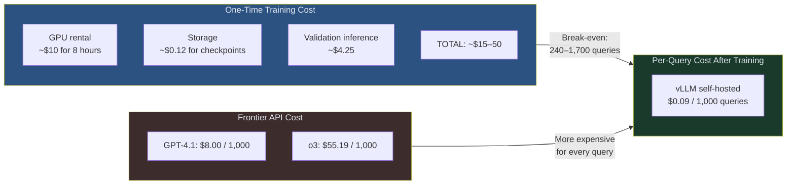
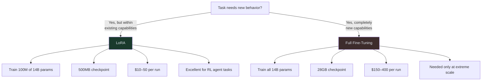
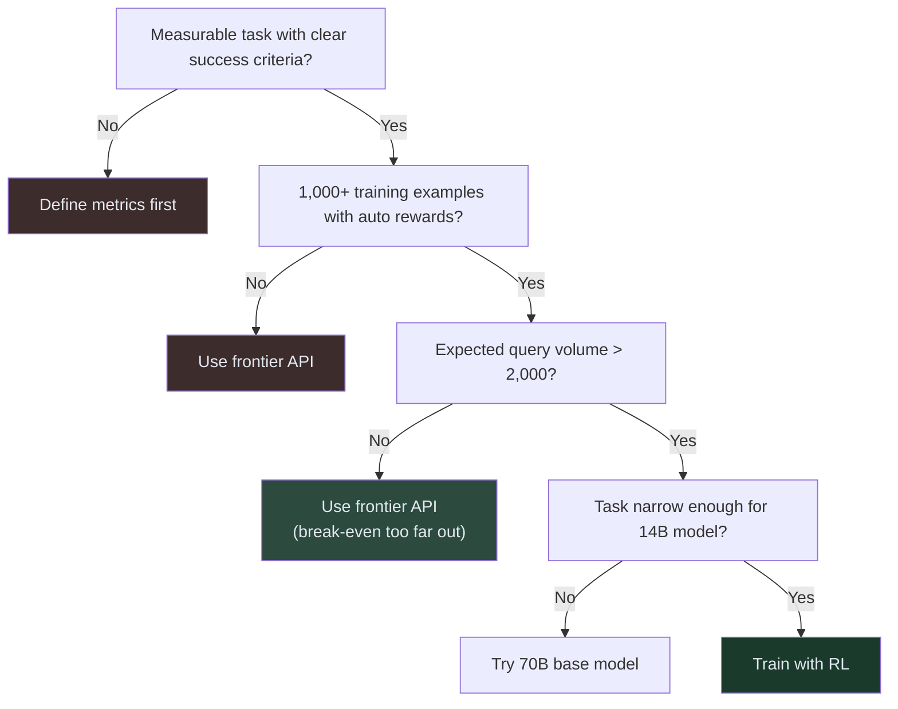

<!-- _class: lead -->

# Cost Optimization

**Module 07 — Production Considerations**

> Training a 14B RL model costs ~$80 and breaks even against o3 in 240 queries. This slide deck shows you how to calculate those numbers for your own setup.

<!--
Speaker notes: Key talking points for this slide
- Cost is the business case for RL training — without it, you cannot justify the engineering investment
- We will cover three things: training cost, inference cost, and the break-even calculation
- Key insight: the break-even is much closer than people expect because frontier API costs are high
- The $80 figure in the course overview covers extended runs with hyperparameter search; a single well-configured run costs $13–50
-->

---

# The Full Cost Picture

<!--
Speaker notes: Key talking points for this slide
- Three cost buckets: training (one-time), your inference (ongoing), frontier API (ongoing alternative)
- The break-even is the number of queries at which your total spend equals the frontier API spend
- After break-even, every query saves money
- Training cost varies by run length; inference cost is nearly constant per query
-->

---

# GPU Requirements for 14B Model Training

**With LoRA (recommended):**
- GPU: A100 40GB or 80GB
- VRAM: 40GB minimum
- Time: 6–10 hours
- Single GPU sufficient
- Cost: ~$10–13

**Full fine-tuning:**
- GPU: 2x A100 80GB minimum
- VRAM: 160GB minimum
- Time: 24–40 hours
- Multi-GPU required
- Cost: ~$80–150

> LoRA trains 0.1% of parameters. For RL fine-tuning, this is sufficient — you do not need to update all 14 billion weights to change agent behavior.

<!--
Speaker notes: Key talking points for this slide
- The A100 80GB is the sweet spot: 4-bit quantization fits the 14B model with room for activations
- RTX 4090 (24GB) works for 7B models with LoRA, not 14B
- Single GPU is the key differentiator: no distributed training setup, no NCCL, no cluster management
- The ART-E 96% result was achieved on a single A100 — multi-GPU is not required for this performance level
-->

---

# Training Budget Breakdown

| Scale | Steps | Time | GPU Cost | Total |
|-------|-------|------|----------|-------|
| Quick test | 50 | 1 hr | $1.30 | ~$3 |
| Small (500 examples) | 200 | 3 hr | $3.90 | ~$8 |
| Medium (2,000 examples) | 500 | 8 hr | $10.40 | ~$20 |
| Production (5,000 examples) | 1,000 | 20 hr | $26 | ~$50 |
| Extended (multi-seed) | 3,000 | 60 hr | $78 | ~$80 |

**The $80 figure** = extended run with hyperparameter search across multiple seeds.

**A single well-configured run** = $15–50.

<!--
Speaker notes: Key talking points for this slide
- Start with a quick test run (50 steps, $3) to verify your setup before committing to a full run
- "Multiple seeds" means running the same config 3x with different random seeds to get stable accuracy estimates — only needed for research/publication
- For production use: one well-tuned run is sufficient
- Storage cost is often forgotten: 500 checkpoints × 500MB = 250GB; delete old checkpoints
-->

---

# LoRA vs Full Fine-Tuning

<!--
Speaker notes: Key talking points for this slide
- LoRA: train low-rank decomposition matrices that adapt the existing weights — you do not change the original weights at all
- Think of LoRA adapters as a "correction layer" applied on top of the frozen base model
- For RL fine-tuning: the base model already knows language; you are teaching it a strategy. Strategy changes are low-rank by nature
- Full fine-tuning is 4–8x more expensive for equivalent results on narrow agentic tasks
-->

---

# Inference Cost: vLLM Self-Hosted

**A100 80GB serving Qwen2.5-14B:**

$$\text{Cost per query} = \frac{\text{GPU hourly rate}}{\text{queries per hour}} = \frac{\$1.29}{14,400} \approx \$0.000089$$

$$\text{Cost per 1,000 queries} \approx \$0.09$$

**Throughput reference:**

| GPU | Tokens/sec | Queries/hr |
|-----|-----------|-----------|
| A100 80GB | 2,000 | 14,400 |
| A10G 24GB | 800 | 5,760 |
| RTX 4090 | 1,500 | 10,800 |

**Add overhead:**
- Storage: +$0.01/1K
- Memory: +$0.02/1K
- Amortized training: +$0.05/1K

**Total: ~$0.09–0.17 per 1K**

<!--
Speaker notes: Key talking points for this slide
- $0.09/1K is the floor; real production cost includes storage, monitoring, redundancy
- $0.85/1K (the ART-E paper figure) includes more overhead and a less efficient serving configuration
- Throughput scales with batch size: vLLM's continuous batching fills GPU compute efficiently at high request rates
- At low request rates (< 10 req/hr), you are paying for idle GPU time — consider serverless hosting instead
-->

---

# Break-Even Analysis

$$\text{Break-even queries} = \frac{\text{Training cost}}{\text{Frontier cost/query} - \text{Custom cost/query}}$$

**vs GPT-4.1:**

$$= \frac{\$15.00}{\$0.0080 - \$0.000089}$$

$$\approx 1,900 \text{ queries}$$

**vs o3:**

$$= \frac{\$15.00}{\$0.0552 - \$0.000089}$$

$$\approx 272 \text{ queries}$$

> At 10,000 queries per day, you recover training cost in **hours** compared to o3.

<!--
Speaker notes: Key talking points for this slide
- The break-even calculation is simple arithmetic — the hard part is knowing your actual costs
- These numbers assume you are already running vLLM (no setup cost amortized here)
- 1,900 queries vs GPT-4.1 = less than one day at modest scale (10K/day)
- 272 queries vs o3 = trivially small — if you run more than 272 queries ever, train the model
- Key assumption: your accuracy is comparable to the frontier model. If you train a model that is worse, the break-even is infinite.
-->

---

# Annual Savings Projection

At **10,000 queries per day:**

| Comparison | Savings per 1K | Annual Savings |
|------------|---------------|----------------|
| vs GPT-4.1 | $7.91 | **$28,900** |
| vs o3 | $55.11 | **$201,000** |
| vs o4-mini | $4.31 | **$15,700** |
| vs Gemini 2.5 Pro | $6.91 | **$25,200** |

Training cost ($15–50) is noise compared to these savings. The decision is: **can your trained model match frontier accuracy on your specific task?**

<!--
Speaker notes: Key talking points for this slide
- These numbers assume identical accuracy between trained model and frontier API
- If your trained model is 96% accurate and GPT-4.1 is 85% accurate (per ART-E), your trained model is actually better — the savings calculation understates the case for training
- At larger scales (100K queries/day), multiply these numbers by 10
- These projections are before considering latency benefits: 1.1s vs 5.6s also has value in user-facing applications
-->

---

# The Decision Framework

<!--
Speaker notes: Key talking points for this slide
- Each decision gate is a real blocker — skipping one leads to wasted training compute
- The most commonly skipped gate: "do you have automatic rewards?" Many people try to train with human-labeled rewards or approximate reward proxies. This rarely works at the quality level RL needs.
- Volume threshold is a business question, not a technical one: what is your expected query volume over the model's lifetime?
- "14B model narrow enough?" — if the task requires broad world knowledge or highly varied queries, a 14B model will plateau below 80%. Try a 70B model or accept the frontier API.
-->

---

# Common Cost Mistakes

**Often forgotten:**
- Validation inference during training (25K+ calls)
- Checkpoint storage (250GB = $5.75/month)
- Model serving idle time at low traffic
- Multiple experimental runs before final config

**Often overestimated:**
- Multi-GPU setup (single GPU suffices for 14B LoRA)
- Full fine-tuning cost (LoRA is 4–8x cheaper)
- Break-even timeline (it is shorter than expected)

> Use the cost calculator utility (`cost_calculator.py`) to get exact numbers for your configuration before starting a training run.

<!--
Speaker notes: Key talking points for this slide
- Validation inference is the most commonly forgotten cost: if you run 500 validation queries every 50 steps and do 500 total steps, that is 5,000 validation runs before your training is complete
- Checkpoint management: many people keep every checkpoint "just in case." Delete checkpoints below your accuracy threshold.
- Idle GPU time: a vLLM server running 24/7 at low traffic spends most of its time idle — consider spot instances or serverless for dev/staging
-->

---

# Key Takeaways

1. **Single GPU is sufficient** for 14B LoRA training — no cluster needed
2. **LoRA is 4–8x cheaper** than full fine-tuning for equivalent results on narrow tasks
3. **Training cost: $15–50** for a single well-configured run (not $80 unless multi-seed)
4. **Inference cost: ~$0.09/1K** with self-hosted vLLM on A100
5. **Break-even vs o3: ~270 queries** — trivially small for any production workload
6. **Annual savings at 10K/day vs o3: ~$200K** — the business case is clear

---

## Next: Guide 03 — Deployment Patterns

How to serve your trained LoRA adapter in production, monitor performance degradation, and run A/B tests between trained and base models.

<!--
Speaker notes: Key talking points for this slide
- Cost analysis is the "should we do this?" question
- Deployment patterns is the "how do we do this reliably?" question
- Monitoring is what keeps production working after launch
- Key preview: LoRA adapters can be hot-swapped in vLLM without restarting the server — this enables A/B testing and rollback
-->
